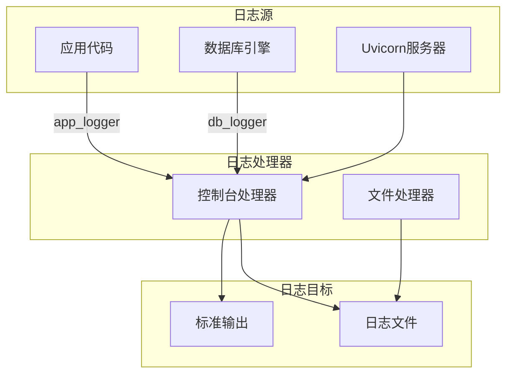
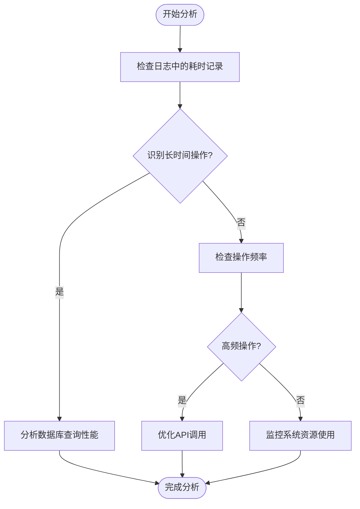
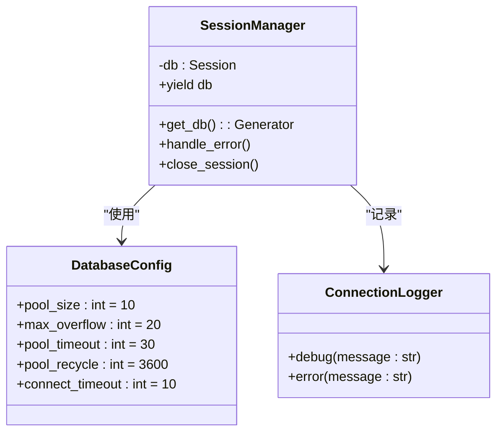
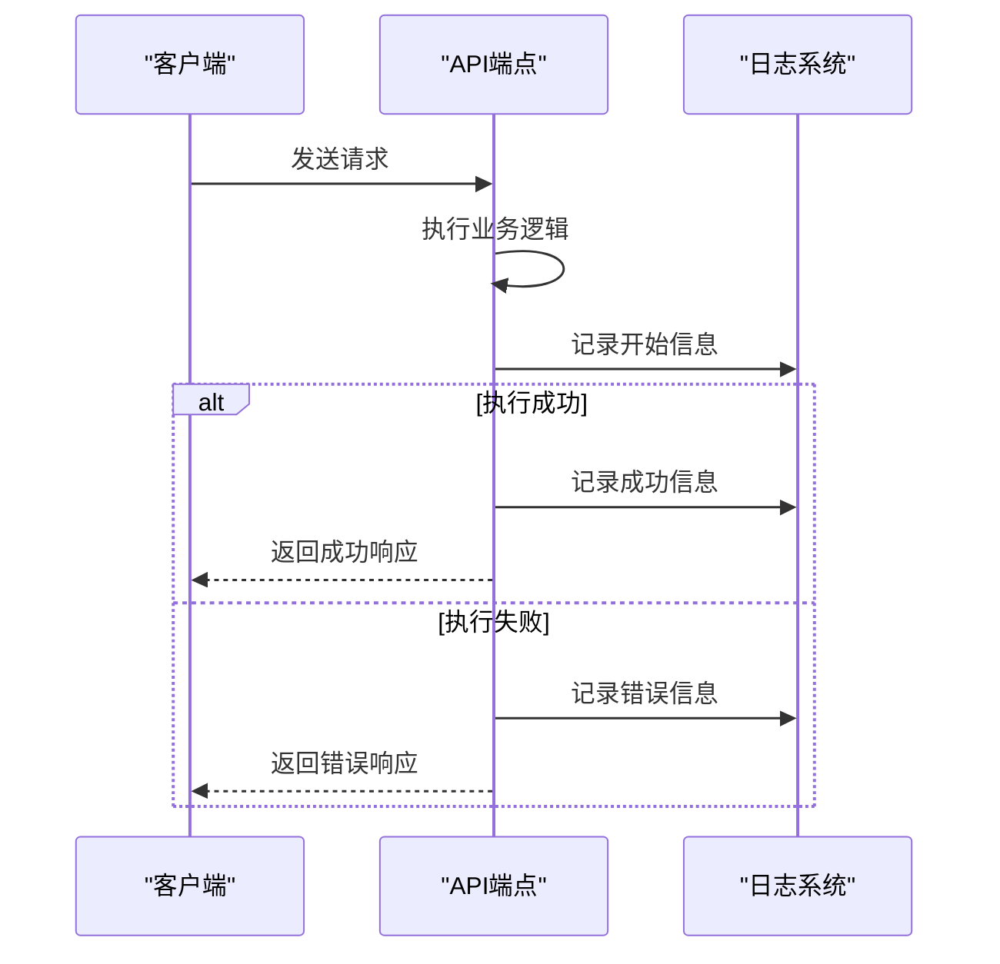
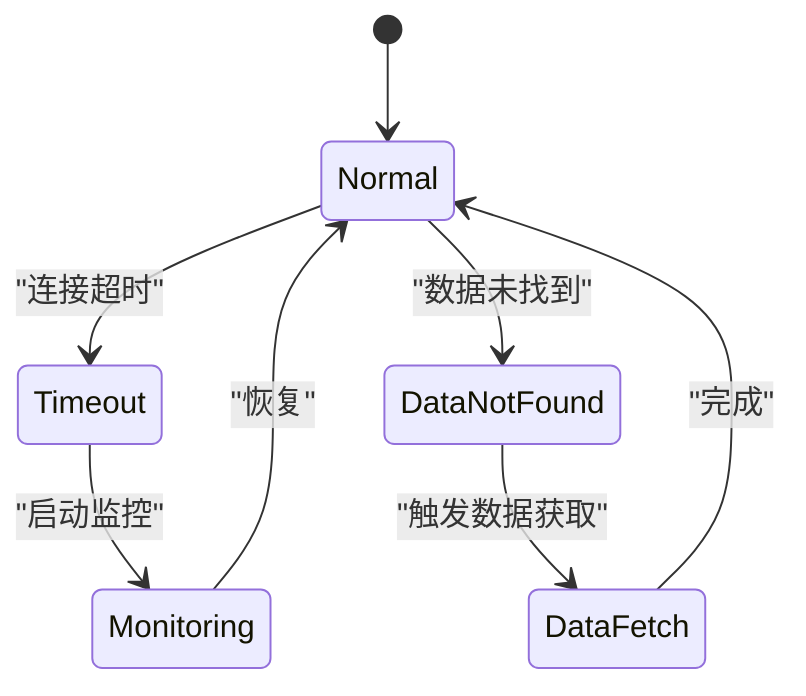
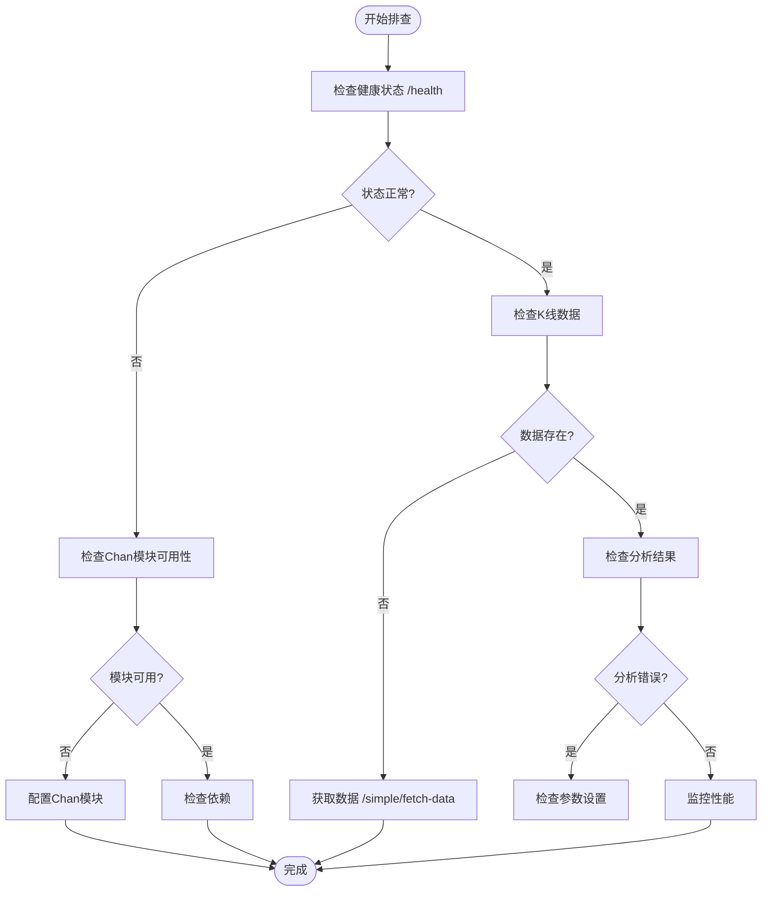

# 日志分析与故障排查

<cite>
**本文档引用的文件**
- [performance_recommendations.md](file://performance_recommendations.md)
- [chan_analysis.py](file://app/api/v1/endpoints/chan_analysis.py)
- [logger.py](file://app/core/logger.py)
- [config.py](file://app/core/config.py)
- [session.py](file://app/db/session.py)
</cite>

## 目录
1. [引言](#引言)
2. [日志系统架构](#日志系统架构)
3. [性能瓶颈识别](#性能瓶颈识别)
4. [数据库连接问题排查](#数据库连接问题排查)
5. [API异常分析](#api异常分析)
6. [结构化日志查询技巧](#结构化日志查询技巧)
7. [典型错误模式识别](#典型错误模式识别)
8. [日志分析工具与命令](#日志分析工具与命令)
9. [基于chan_analysis.py的排查流程](#基于chan_analysispy的排查流程)
10. [总结](#总结)

## 引言
本文档提供系统化的日志分析方法论和故障排查指南，基于`performance_recommendations.md`中的监控建议，详细介绍如何通过日志识别性能瓶颈、数据库连接问题和API异常。文档说明了如何利用结构化日志格式快速过滤和检索关键信息，并展示典型错误模式的识别方法。结合`chan_analysis.py`中的潜在错误场景，制定了针对性的排查流程。

## 日志系统架构



**Diagram sources**
- [logger.py](file://app/core/logger.py#L1-L44)
- [config.py](file://app/core/config.py#L35-L65)

**Section sources**
- [logger.py](file://app/core/logger.py#L1-L44)
- [config.py](file://app/core/config.py#L35-L65)

## 性能瓶颈识别

通过分析日志中的时间戳和执行耗时信息，可以识别系统性能瓶颈。重点关注以下日志模式：

- 长时间运行的数据库查询
- 高频次的API调用
- 资源密集型操作的执行时间



**Diagram sources**
- [performance_recommendations.md](file://performance_recommendations.md#L50-L60)
- [logger.py](file://app/core/logger.py#L1-L44)

**Section sources**
- [performance_recommendations.md](file://performance_recommendations.md#L50-L60)

## 数据库连接问题排查

数据库连接问题是系统稳定性的重要影响因素。根据`session.py`中的配置，系统已优化连接池参数，但仍需监控连接状态。



**Diagram sources**
- [session.py](file://app/db/session.py#L1-L43)
- [logger.py](file://app/core/logger.py#L1-L44)

**Section sources**
- [session.py](file://app/db/session.py#L1-L43)

## API异常分析

API异常通常表现为HTTP 500错误或超时。通过分析`chan_analysis.py`中的错误处理逻辑，可以建立有效的异常排查流程。



**Diagram sources**
- [chan_analysis.py](file://app/api/v1/endpoints/chan_analysis.py#L1-L420)

**Section sources**
- [chan_analysis.py](file://app/api/v1/endpoints/chan_analysis.py#L1-L420)

## 结构化日志查询技巧

利用结构化日志格式，可以通过多种方式快速过滤和检索关键信息。

### 按时间范围查询
```bash
# 查询最近1小时的日志
grep "$(date -d '1 hour ago' '+%Y-%m-%d %H')" logs/app.log
```

### 按日志级别查询
```bash
# 查询所有错误日志
grep "ERROR" logs/app.log
```

### 按特定交易对查询
```bash
# 查询特定交易对的日志
grep "btc_usdt" logs/app.log
```

**Section sources**
- [logger.py](file://app/core/logger.py#L1-L44)
- [config.py](file://app/core/config.py#L35-L65)

## 典型错误模式识别

### 连接超时模式
频繁出现的连接超时错误通常表现为：
```
❌ 获取Chan模块信息失败: timeout
```

### 数据获取失败模式
数据获取失败通常表现为：
```
HTTPException(status_code=404, detail="没有找到K线数据")
```



**Diagram sources**
- [chan_analysis.py](file://app/api/v1/endpoints/chan_analysis.py#L1-L420)

**Section sources**
- [chan_analysis.py](file://app/api/v1/endpoints/chan_analysis.py#L1-L420)

## 日志分析工具与命令

### 命令行工具使用技巧
```bash
# 使用grep过滤特定错误
grep "ERROR" logs/app.log | grep "Database"

# 使用awk提取特定字段
awk '/ERROR/{print $1, $2, $6}' logs/app.log

# 统计错误类型
grep "ERROR" logs/app.log | cut -d'-' -f4 | sort | uniq -c
```

### 日志聚合建议
建议使用ELK（Elasticsearch, Logstash, Kibana）或类似平台进行日志聚合和可视化，便于跨服务分析和趋势预测。

**Section sources**
- [performance_recommendations.md](file://performance_recommendations.md#L70-L80)

## 基于chan_analysis.py的排查流程

针对`chan_analysis.py`中可能出现的错误场景，制定以下排查流程：



**Diagram sources**
- [chan_analysis.py](file://app/api/v1/endpoints/chan_analysis.py#L1-L420)

**Section sources**
- [chan_analysis.py](file://app/api/v1/endpoints/chan_analysis.py#L1-L420)

## 总结
本文档提供了完整的日志分析与故障排查方法论，涵盖了性能瓶颈识别、数据库连接问题和API异常分析。通过利用结构化日志格式和适当的分析工具，可以快速定位和解决系统问题。建议定期审查日志模式，建立预警机制，以提高系统的稳定性和可靠性。