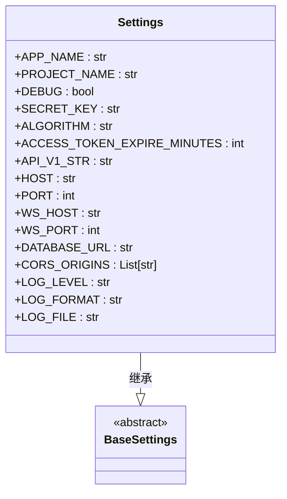
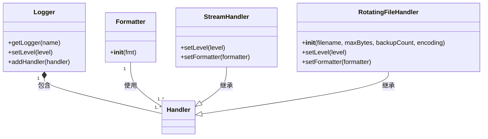
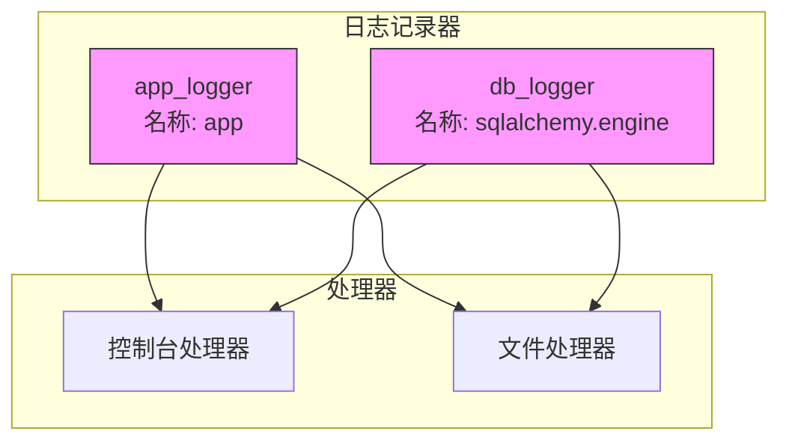
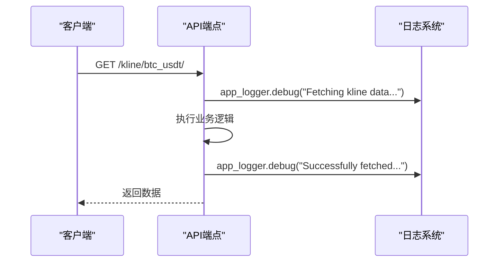
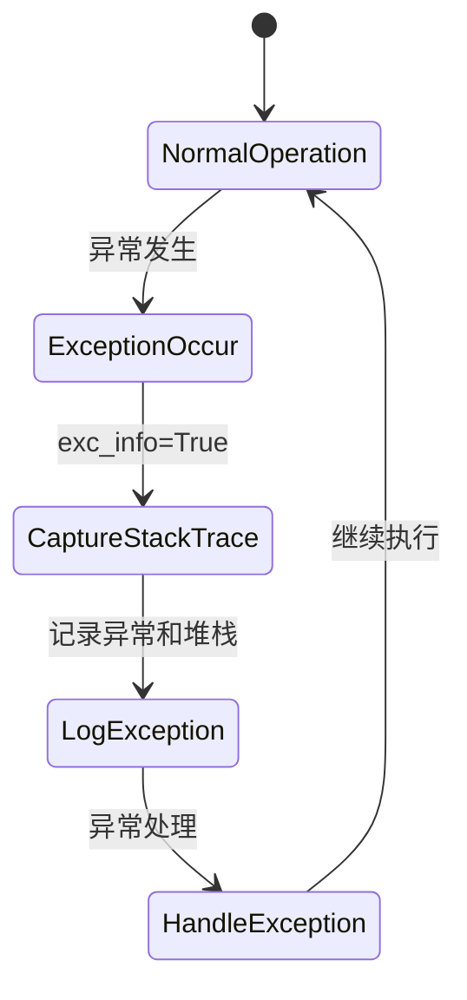
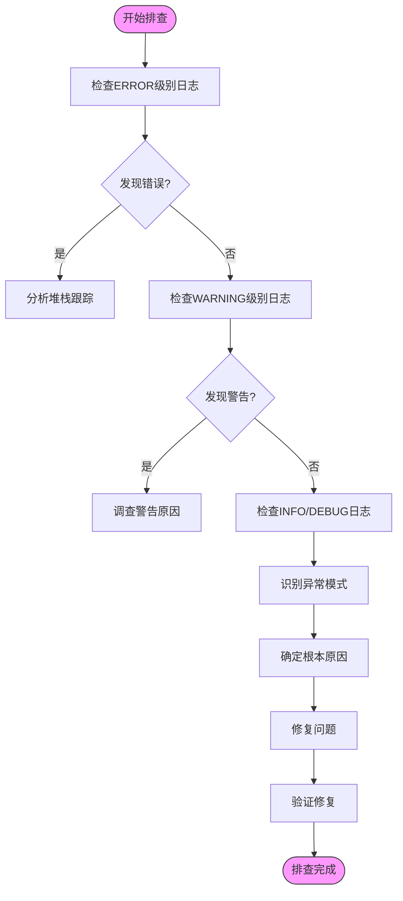

# 日志管理

<cite>
**Referenced Files in This Document**   
- [logger.py](file://app/core/logger.py)
- [config.py](file://app/core/config.py)
- [kline.py](file://app/api/v1/endpoints/kline.py)
- [exceptions.py](file://app/core/exceptions.py)
</cite>

## 目录
1. [日志系统概述](#日志系统概述)
2. [日志配置详解](#日志配置详解)
3. [日志记录器实现](#日志记录器实现)
4. [日志级别与格式](#日志级别与格式)
5. [文件滚动策略](#文件滚动策略)
6. [应用与数据库日志分离](#应用与数据库日志分离)
7. [日志使用示例](#日志使用示例)
8. [异常追踪机制](#异常追踪机制)
9. [日志分析与故障排查](#日志分析与故障排查)

## 日志系统概述

本系统实现了结构化的日志管理机制，为交易系统提供全面的运行时监控和故障诊断能力。日志系统通过`app/core/logger.py`模块进行集中配置和管理，支持应用日志和数据库日志的分离记录，确保系统运行状态的可追溯性和可分析性。

日志系统的主要功能包括：
- 结构化日志格式输出
- 多级别日志分类（DEBUG、INFO、WARNING、ERROR）
- 控制台和文件双重输出
- 文件滚动备份策略
- 应用与数据库日志分离
- 完整的异常堆栈追踪

**Section sources**
- [logger.py](file://app/core/logger.py#L1-L44)

## 日志配置详解

日志系统的配置参数定义在`app/core/config.py`文件中，通过配置类`Settings`进行管理。这些配置参数实现了环境变量与默认值的结合，确保了配置的灵活性和安全性。



**Diagram sources**
- [config.py](file://app/core/config.py#L1-L65)

**Section sources**
- [config.py](file://app/core/config.py#L35-L65)

### 配置参数说明

| 参数名称 | 默认值 | 说明 |
|--------|-------|------|
| LOG_LEVEL | "DEBUG" | 日志记录级别，控制日志输出的详细程度 |
| LOG_FORMAT | "%(asctime)s - %(name)s - %(levelname)s - %(message)s" | 日志输出格式模板 |
| LOG_FILE | "logs/app.log" | 主日志文件路径 |

这些配置参数通过`settings`实例在日志模块中被引用，实现了配置与实现的解耦，便于在不同环境（开发、测试、生产）中灵活调整日志行为。

## 日志记录器实现

日志记录器的实现位于`app/core/logger.py`文件中，通过Python标准库`logging`模块构建了一个完整的日志记录系统。系统创建了日志目录、配置了日志格式化器，并设置了控制台和文件两种处理器。



**Diagram sources**
- [logger.py](file://app/core/logger.py#L1-L44)

**Section sources**
- [logger.py](file://app/core/logger.py#L1-L44)

## 日志级别与格式

系统支持标准的Python日志级别，从详细到简略依次为：DEBUG、INFO、WARNING、ERROR。不同级别的日志用于记录不同重要程度的系统事件。

### 日志级别说明

| 级别 | 用途 | 示例 |
|-----|-----|-----|
| DEBUG | 详细调试信息，用于开发和问题排查 | 记录函数调用参数和返回值 |
| INFO | 一般运行信息，表示系统正常运行 | 记录成功完成的操作 |
| WARNING | 警告信息，表示潜在问题 | 记录未找到数据但可恢复的情况 |
| ERROR | 错误信息，表示发生了错误 | 记录异常和失败的操作 |

### 日志格式

系统采用统一的日志格式：`%(asctime)s - %(name)s - %(levelname)s - %(message)s`，包含以下四个部分：
1. **时间戳**：日志记录的时间
2. **记录器名称**：生成日志的模块或组件名称
3. **日志级别**：日志的严重程度
4. **消息内容**：具体的日志信息

这种结构化的格式便于日志的解析、搜索和分析。

**Section sources**
- [logger.py](file://app/core/logger.py#L18-L19)
- [config.py](file://app/core/config.py#L60-L61)

## 文件滚动策略

为了防止日志文件无限增长导致磁盘空间耗尽，系统实现了文件滚动备份策略。该策略通过`RotatingFileHandler`处理器实现，当文件达到指定大小时自动创建新的日志文件。

### 滚动策略配置

```python
file_handler = RotatingFileHandler(
    filename=str(Path(settings.LOG_FILE)),
    maxBytes=50*1024*1024,  # 50MB
    backupCount=10,
    encoding='utf-8'
)
```

**Section sources**
- [logger.py](file://app/core/logger.py#L27-L32)

### 策略参数说明

| 参数 | 值 | 说明 |
|------|----|------|
| maxBytes | 50*1024*1024 (50MB) | 单个日志文件的最大大小，达到此大小后创建新文件 |
| backupCount | 10 | 保留的备份文件数量，超过此数量后最旧的文件将被删除 |
| encoding | 'utf-8' | 文件编码格式，确保中文字符正确显示 |

这种策略确保了：
- 单个日志文件不会过大，便于查看和传输
- 保留最近的10个日志文件，提供足够的历史记录
- 自动清理过期日志，避免磁盘空间耗尽
- 支持中文字符，确保日志内容完整

## 应用与数据库日志分离

系统通过创建不同的日志记录器实现了应用日志和数据库日志的分离管理，这有助于针对性地监控和分析不同组件的运行状态。

### 日志记录器配置



**Diagram sources**
- [logger.py](file://app/core/logger.py#L11-L12)
- [logger.py](file://app/core/logger.py#L41-L42)

**Section sources**
- [logger.py](file://app/core/logger.py#L11-L12)
- [logger.py](file://app/core/logger.py#L41-L42)

### 应用日志记录器 (app_logger)

- **名称**: "app"
- **用途**: 记录应用程序的业务逻辑、API调用、用户操作等
- **创建方式**: `logging.getLogger("app")`
- **使用场景**: API端点、业务服务、异常处理等

### 数据库日志记录器 (db_logger)

- **名称**: "sqlalchemy.engine"
- **用途**: 记录数据库操作，包括SQL查询、连接状态等
- **创建方式**: `logging.getLogger("sqlalchemy.engine")`
- **使用场景**: 数据库查询性能分析、SQL语句调试

通过这种分离设计，运维人员可以独立地调整应用和数据库的日志级别，例如在生产环境中将数据库日志设置为INFO级别以监控SQL性能，而将应用日志保持在WARNING级别以减少日志量。

## 日志使用示例

`app/api/v1/endpoints/kline.py`文件中的API端点展示了日志在实际业务场景中的应用。通过不同级别的日志记录，系统能够提供详细的运行时信息。



**Diagram sources**
- [kline.py](file://app/api/v1/endpoints/kline.py#L31-L36)

**Section sources**
- [kline.py](file://app/api/v1/endpoints/kline.py#L31-L36)

### 调试级别日志 (DEBUG)

```python
app_logger.debug(f"Fetching kline data for symbol: {symbol}, skip: {skip}, limit: {limit}")
```

- **用途**: 记录函数调用的详细参数
- **场景**: API请求开始时，记录请求参数
- **价值**: 用于问题排查，了解请求的具体内容

### 信息级别日志 (INFO)

```python
app_logger.debug(f"Successfully fetched {len(kline)} kline records")
```

- **用途**: 记录操作成功完成的信息
- **场景**: 数据查询成功后，记录返回的记录数量
- **价值**: 监控系统正常运行状态

### 警告级别日志 (WARNING)

```python
app_logger.warning(f"Kline data not found for symbol: {symbol}, id: {id}")
```

- **用途**: 记录非致命的异常情况
- **场景**: 查询数据未找到时
- **价值**: 提示潜在问题，但不影响系统继续运行

### 错误级别日志 (ERROR)

```python
app_logger.error(f"Unsupported symbol: {symbol}")
```

- **用途**: 记录错误和异常情况
- **场景**: 不支持的交易品种、参数错误等
- **价值**: 标记系统错误，便于快速定位问题

## 异常追踪机制

系统实现了完整的异常追踪机制，通过`exc_info=True`参数捕获异常的完整堆栈跟踪信息，这对于复杂系统的故障诊断至关重要。

### 异常日志记录

```python
app_logger.error(f"Error getting BTC/USDT klines: {str(e)}", exc_info=True)
```

**Section sources**
- [kline.py](file://app/api/v1/endpoints/kline.py#L138-L140)

### exc_info参数的作用

当`exc_info=True`时，日志系统会自动捕获当前异常的完整堆栈跟踪信息，包括：
- 异常类型和消息
- 发生异常的文件和行号
- 完整的调用栈信息
- 局部变量状态（在某些配置下）

### 异常追踪示例



**Diagram sources**
- [exceptions.py](file://app/core/exceptions.py#L94-L94)

**Section sources**
- [kline.py](file://app/api/v1/endpoints/kline.py#L138-L140)
- [exceptions.py](file://app/core/exceptions.py#L94-L94)

这种机制确保了即使在复杂的异步或并发环境中，也能准确地定位异常发生的位置和原因，大大提高了故障排查的效率。

## 日志分析与故障排查

基于系统的日志架构，以下是日志分析和故障排查的最佳实践指南。

### 日志分析策略

1. **按级别过滤**
   - 生产环境：重点关注ERROR和WARNING级别日志
   - 开发环境：使用DEBUG级别日志进行详细调试
   - 性能分析：结合INFO级别日志分析系统吞吐量

2. **按时间范围分析**
   - 问题发生前后30分钟的日志
   - 高峰时段的日志模式
   - 定期任务执行期间的日志

3. **按组件分析**
   - 应用日志 (`app`)：业务逻辑问题
   - 数据库日志 (`sqlalchemy.engine`)：性能瓶颈
   - API日志：接口调用模式

### 故障排查流程



**Diagram sources**
- [kline.py](file://app/api/v1/endpoints/kline.py)
- [logger.py](file://app/core/logger.py)

### 常见问题排查

| 问题类型 | 日志特征 | 排查方法 |
|---------|---------|---------|
| 接口调用失败 | ERROR日志，包含异常堆栈 | 检查`exc_info=True`的堆栈跟踪 |
| 性能下降 | INFO日志中操作耗时增加 | 分析相同操作在不同时间的耗时对比 |
| 数据不一致 | WARNING日志，记录"not found" | 检查数据源和查询条件 |
| 内存泄漏 | DEBUG日志中对象创建频繁 | 分析长时间运行的日志模式 |

通过遵循这些最佳实践，运维和开发团队能够快速、准确地诊断和解决系统问题，确保交易系统的稳定运行。