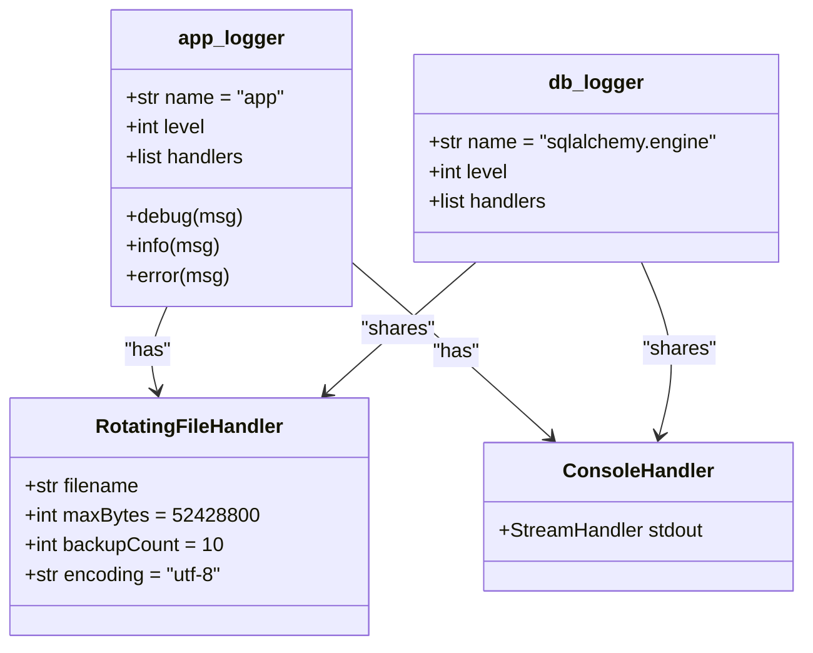
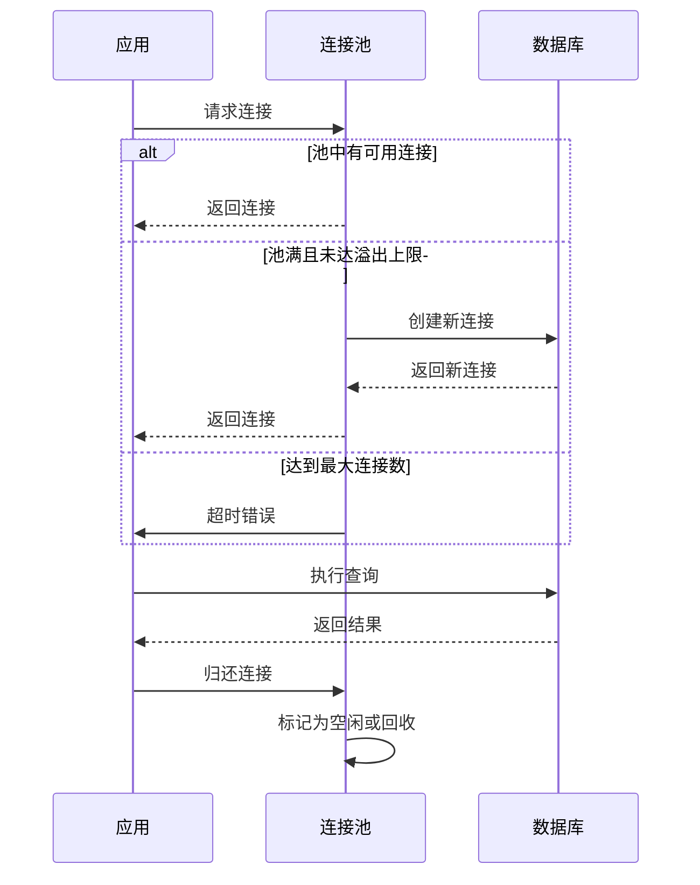

# 监控与告警

<cite>
**本文档引用的文件**  
- [main.py](file://app/main.py)
- [logger.py](file://app/core/logger.py)
- [session.py](file://app/db/session.py)
- [kline_simple.py](file://app/api/v1/endpoints/kline_simple.py)
- [performance_recommendations.md](file://performance_recommendations.md)
</cite>

## 目录
1. [引言](#引言)
2. [健康检查端点设计](#健康检查端点设计)
3. [日志系统配置](#日志系统配置)
4. [Prometheus指标收集与监控体系](#prometheus指标收集与监控体系)
5. [数据库连接池监控与泄漏检测](#数据库连接池监控与泄漏检测)
6. [告警规则建议](#告警规则建议)
7. [总结](#总结)

## 引言

为保障缠论自动化交易系统的稳定性与可观测性，需建立一套完整的监控与告警体系。本文档基于`performance_recommendations.md`中的优化建议，详细说明系统健康检查、结构化日志、数据库连接池监控、关键性能指标采集及告警策略的设计与实现。

**本文档引用的文件**  
- [main.py](file://app/main.py)
- [performance_recommendations.md](file://performance_recommendations.md)

## 健康检查端点设计

系统已实现`/health`健康检查端点，用于实时评估服务运行状态。该端点返回系统核心组件的健康状况，包括API服务、数据库连接和Chan模块集成状态。

响应内容包含：
- **status**: 当前系统状态（如 "healthy"）
- **message**: 状态描述信息
- **version**: 系统版本号
- **components**: 各核心组件状态（API、数据库、Chan模块）

此外，在`kline_simple.py`中还实现了更细粒度的健康检查逻辑，可评估K线聚合器状态、数据可用性及数据新鲜度，并提供相应操作建议（如是否需要调用`/fetch-data`更新数据）。

```mermaid
flowchart TD
A[/health] --> B{检查API状态}
B --> C[检查数据库连接]
C --> D[检查Chan模块]
D --> E[汇总状态]
E --> F[返回JSON响应]
```

**Diagram sources**  
- [main.py](file://app/main.py#L100-L110)
- [kline_simple.py](file://app/api/v1/endpoints/kline_simple.py#L237-L259)

**Section sources**  
- [main.py](file://app/main.py#L100-L110)
- [kline_simple.py](file://app/api/v1/endpoints/kline_simple.py#L237-L259)

## 日志系统配置

系统使用Python标准库`logging`模块，结合`RotatingFileHandler`实现结构化日志记录，确保日志可追踪、易分析。

### 日志配置要点

- **日志记录器**: 使用名为`app`的全局记录器（`app_logger`）和`sqlalchemy.engine`专用记录器（`db_logger`）
- **日志级别**: 通过`settings.LOG_LEVEL`统一配置
- **日志格式**: 由`settings.LOG_FORMAT`定义，包含时间、级别、模块、消息等字段
- **日志输出**:
  - 控制台输出（`StreamHandler`）
  - 文件输出（`RotatingFileHandler`），支持自动轮转
- **文件策略**:
  - 单个日志文件最大50MB
  - 最多保留10个历史备份文件
  - 编码为UTF-8，确保中文正常输出

日志系统已集成到数据库会话管理中，可记录会话创建、关闭及异常回滚等关键事件，便于追踪数据库操作生命周期。



**Diagram sources**  
- [logger.py](file://app/core/logger.py#L1-L44)

**Section sources**  
- [logger.py](file://app/core/logger.py#L1-L44)

## Prometheus指标收集与监控体系

根据`performance_recommendations.md`建议，系统应集成Prometheus进行指标收集。虽然当前代码中尚未直接实现Prometheus客户端，但已具备实现基础。

### 建议的监控指标

| 指标名称 | 类型 | 描述 | 采集位置 |
|--------|------|------|--------|
| `api_request_duration_seconds` | Histogram | API请求响应时间 | FastAPI中间件 |
| `database_query_duration_seconds` | Histogram | 数据库查询耗时 | SQLAlchemy事件监听 |
| `app_memory_usage_bytes` | Gauge | 应用内存使用量 | psutil集成 |
| `db_connection_pool_usage` | Gauge | 数据库连接池使用数 | `SessionLocal`状态 |
| `kline_data_freshness_minutes` | Gauge | K线数据最新时间差 | `/health`端点扩展 |

### 实现建议

1. **安装依赖**:
   ```bash
   pip install prometheus-client
   ```

2. **创建指标中间件**:
   ```python
   from prometheus_client import Counter, Histogram
   REQUEST_COUNT = Counter('api_requests_total', 'Total API Requests', ['method', 'endpoint', 'status'])
   REQUEST_LATENCY = Histogram('api_request_duration_seconds', 'API Request Latency')
   ```

3. **集成到FastAPI**:
   ```python
   @app.middleware("http")
   async def metrics_middleware(request: Request, call_next):
       start_time = time.time()
       response = await call_next(request)
       latency = time.time() - start_time
       REQUEST_LATENCY.observe(latency)
       REQUEST_COUNT.labels(request.method, request.url.path, response.status_code).inc()
       return response
   ```

4. **暴露指标端点**:
   ```python
   from prometheus_client import generate_latest
   @app.get("/metrics")
   async def metrics():
       return Response(content=generate_latest(), media_type="text/plain")
   ```

**Section sources**  
- [performance_recommendations.md](file://performance_recommendations.md#L70-L73)

## 数据库连接池监控与泄漏检测

系统已对数据库连接池进行了优化配置，并可通过日志和状态检查实现监控。

### 连接池配置

在`session.py`中，通过`create_engine`配置了以下连接池参数：

- `pool_size=10`: 连接池基础大小
- `max_overflow=20`: 最大溢出连接数（峰值可达30）
- `pool_timeout=30`: 获取连接超时时间（秒）
- `pool_recycle=3600`: 连接回收周期（1小时）
- `pool_pre_ping=True`: 每次使用前检测连接有效性

### 泄漏检测机制

1. **日志追踪**:
   - 每次创建会话时记录`Creating new database session`
   - 每次关闭会话时记录`Closing database session`
   - 会话异常时记录错误并自动回滚

2. **异常处理**:
   - 使用`try...finally`确保会话最终被关闭
   - 异常时自动`rollback()`防止事务挂起

3. **监控建议**:
   - 统计单位时间内会话创建/关闭次数
   - 监控`max_overflow`是否频繁触发
   - 定期检查数据库侧的空闲连接数



**Diagram sources**  
- [session.py](file://app/db/session.py#L1-L43)

**Section sources**  
- [session.py](file://app/db/session.py#L1-L43)
- [performance_recommendations.md](file://performance_recommendations.md#L18-L22)

## 告警规则建议

基于系统关键指标，建议设置以下告警规则：

### 1. 高延迟告警

| 指标 | 阈值 | 告警级别 | 说明 |
|------|------|----------|------|
| `api_request_duration_seconds{quantile="0.95"}` | > 2s | 警告 | 大部分请求响应过慢 |
| `api_request_duration_seconds{quantile="0.99"}` | > 5s | 严重 | 极端慢请求影响用户体验 |
| `database_query_duration_seconds{quantile="0.95"}` | > 1s | 警告 | 数据库查询性能下降 |

### 2. 高错误率告警

| 指标 | 阈值 | 告警级别 | 说明 |
|------|------|----------|------|
| `api_requests_total{status=~"5.."} / rate(api_requests_total[5m])` | > 1% | 警告 | 服务端错误率升高 |
| `api_requests_total{status=~"4.."}` | > 10次/分钟 | 警告 | 客户端错误频繁 |

### 3. 资源耗尽告警

| 指标 | 阈值 | 告警级别 | 说明 |
|------|------|----------|------|
| `db_connection_pool_usage / 30` | > 80% | 警告 | 连接池使用率过高 |
| `db_connection_pool_usage / 30` | > 95% | 严重 | 连接池即将耗尽 |
| `app_memory_usage_bytes` | > 80% of limit | 警告 | 内存使用接近上限 |

### 4. 健康状态告警

| 检查项 | 阈值 | 告警级别 | 说明 |
|--------|------|----------|------|
| `/health` 端点可达性 | HTTP 200 | 严重 | 服务完全不可用 |
| `data_freshness` | "stale" | 警告 | 数据未及时更新 |
| `data_freshness` | "unknown" | 严重 | 无数据，系统异常 |

## 总结

本系统已具备健康检查、结构化日志和数据库连接池优化等基础监控能力。为进一步提升可观测性，建议立即实施Prometheus指标采集，暴露`/metrics`端点，并配置Grafana仪表盘与告警规则。通过持续监控API性能、数据库状态和资源使用情况，可确保缠论交易系统的稳定运行与快速故障响应。

**Section sources**  
- [main.py](file://app/main.py)
- [logger.py](file://app/core/logger.py)
- [session.py](file://app/db/session.py)
- [performance_recommendations.md](file://performance_recommendations.md)