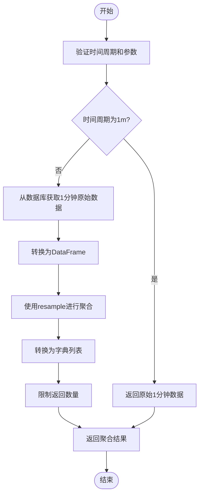

# K线数据API

<cite>
**本文档引用的文件**   
- [kline.py](file://app/api/v1/endpoints/kline.py)
- [kline_simple.py](file://app/api/v1/endpoints/kline_simple.py)
- [kline_aggregator.py](file://app/services/kline_aggregator.py)
- [kline.py](file://app/crud/kline.py)
- [kline.py](file://app/models/kline.py)
- [kline.py](file://app/schemas/kline.py)
- [api.js](file://frontend/src/lib/api.js)
</cite>

## 目录
1. [简介](#简介)
2. [API端点参考](#api端点参考)
3. [聚合K线实现原理](#聚合k线实现原理)
4. [使用场景说明](#使用场景说明)
5. [客户端调用示例](#客户端调用示例)
6. [健康检查与统计](#健康检查与统计)

## 简介
本API提供对K线数据的全面访问，支持多种查询方式和时间周期。系统基于1分钟原始K线数据，通过聚合算法生成不同时间周期的K线数据。所有时间戳均使用毫秒精度，symbol参数支持`btc_usdt`、`eth_usdt`等交易对。

**Section sources**
- [kline.py](file://app/api/v1/endpoints/kline.py#L0-L194)
- [kline_simple.py](file://app/api/v1/endpoints/kline_simple.py#L0-L259)

## API端点参考

### 获取K线数据列表
**HTTP方法**: `GET`  
**URL路径**: `/api/v1/kline/{symbol}/`  
**路径参数**:
- `symbol` (string): 交易品种，如`btc_usdt`，取值范围见`SYMBOL_TO_MODEL`映射

**查询参数**:
- `skip` (integer, 可选): 跳过的记录数，默认0，最小值0
- `limit` (integer, 可选): 返回记录数限制，默认100，范围1-1000

**响应示例**:
```json
{
  "success": true,
  "data": [
    {
      "id": 1,
      "timestamp": 1700000000000,
      "open_time": "2023-11-15T00:00:00",
      "close_time": "2023-11-15T00:01:00",
      "open_price": "35000.00",
      "high_price": "35100.00",
      "low_price": "34950.00",
      "close_price": "35050.00",
      "volume": "100.5",
      "quote_volume": "3520000.00"
    }
  ]
}
```

**状态码**:
- `200`: 成功
- `400`: 无效参数
- `404`: 交易品种不支持
- `500`: 服务器内部错误

**Section sources**
- [kline.py](file://app/api/v1/endpoints/kline.py#L38-L50)

### 根据ID获取K线数据
**HTTP方法**: `GET`  
**URL路径**: `/api/v1/kline/{symbol}/{id}`  
**路径参数**:
- `symbol` (string): 交易品种
- `id` (integer): K线记录ID

**响应示例**:
```json
{
  "success": true,
  "data": {
    "id": 12345,
    "timestamp": 1700000000000,
    "open_time": "2023-11-15T00:00:00",
    "close_time": "2023-11-15T00:01:00",
    "open_price": "35000.00",
    "high_price": "35100.00",
    "low_price": "34950.00",
    "close_price": "35050.00"
  }
}
```

**状态码**:
- `200`: 成功
- `400`: 无效参数
- `404`: K线数据不存在
- `500`: 服务器内部错误

**Section sources**
- [kline.py](file://app/api/v1/endpoints/kline.py#L52-L69)

### 根据时间戳获取K线数据
**HTTP方法**: `GET`  
**URL路径**: `/api/v1/kline/{symbol}/timestamp/{timestamp}`  
**路径参数**:
- `symbol` (string): 交易品种
- `timestamp` (integer): 时间戳（毫秒级）

**响应示例**:
```json
{
  "success": true,
  "data": {
    "id": 12345,
    "timestamp": 1700000000000,
    "open_time": "2023-11-15T00:00:00",
    "close_time": "2023-11-15T00:01:00",
    "open_price": "35000.00",
    "high_price": "35100.00",
    "low_price": "34950.00",
    "close_price": "35050.00"
  }
}
```

**状态码**:
- `200`: 成功
- `400`: 无效参数
- `404`: K线数据不存在
- `500`: 服务器内部错误

**Section sources**
- [kline.py](file://app/api/v1/endpoints/kline.py#L71-L84)

### 获取指定时间范围内的K线数据
**HTTP方法**: `GET`  
**URL路径**: `/api/v1/kline/{symbol}/time-range/`  
**路径参数**:
- `symbol` (string): 交易品种

**查询参数**:
- `start_time` (datetime): 开始时间（ISO格式）
- `end_time` (datetime): 结束时间（ISO格式）

**响应示例**:
```json
{
  "success": true,
  "data": [
    {
      "id": 12345,
      "timestamp": 1700000000000,
      "open_time": "2023-11-15T00:00:00",
      "close_time": "2023-11-15T00:01:00",
      "open_price": "35000.00",
      "high_price": "35100.00",
      "low_price": "34950.00",
      "close_price": "35050.00"
    }
  ]
}
```

**状态码**:
- `200`: 成功
- `400`: 无效参数
- `500`: 服务器内部错误

**Section sources**
- [kline.py](file://app/api/v1/endpoints/kline.py#L86-L97)

### 获取聚合K线数据
**HTTP方法**: `GET`  
**URL路径**: `/api/v1/simple/klines`  
**查询参数**:
- `timeframe` (string, 可选): 时间周期，默认`1h`，支持`1m,5m,15m,30m,1h,4h,1d`
- `limit` (integer, 可选): 数据条数，默认200，范围1-1000
- `start_time` (string, 可选): 开始时间（ISO格式）
- `end_time` (string, 可选): 结束时间（ISO格式）

**响应示例**:
```json
{
  "success": true,
  "data": {
    "klines": [
      {
        "timestamp": 1700000000000,
        "open_time": "2023-11-15T00:00:00",
        "close_time": "2023-11-15T01:00:00",
        "open_price": "35000.00",
        "high_price": "35200.00",
        "low_price": "34900.00",
        "close_price": "35100.00",
        "volume": "1000.5"
      }
    ],
    "metadata": {
      "count": 1,
      "timeframe": "1h",
      "request_params": {
        "limit": 200,
        "start_time": null,
        "end_time": null
      },
      "data_range": {
        "start": "2023-11-15T00:00:00",
        "end": "2023-11-15T01:00:00"
      }
    }
  }
}
```

**状态码**:
- `200`: 成功
- `400`: 无效参数
- `500`: 服务器内部错误

**Section sources**
- [kline_simple.py](file://app/api/v1/endpoints/kline_simple.py#L38-L108)

## 聚合K线实现原理
系统基于1分钟原始K线数据，通过`KlineAggregator`服务类实现多时间周期聚合。聚合过程如下：

1. **数据源**: 从`btc_usdt`表获取1分钟原始K线数据
2. **聚合方法**: 使用pandas的resample功能进行时间序列聚合
3. **聚合规则**:
   - 开盘价: 第一个K线的开盘价
   - 最高价: 所有K线最高价的最大值
   - 最低价: 所有K线最低价的最小值
   - 收盘价: 最后一个K线的收盘价
   - 成交量: 所有K线成交量的总和

**性能影响**:
- 实时聚合: 每次请求时进行聚合计算，保证数据实时性
- 内存使用: 使用pandas DataFrame进行计算，对内存有一定要求
- 查询性能: 对于大量数据，聚合计算可能需要较长时间



**Diagram sources**
- [kline_aggregator.py](file://app/services/kline_aggregator.py#L0-L150)
- [kline_simple.py](file://app/api/v1/endpoints/kline_simple.py#L38-L108)

**Section sources**
- [kline_aggregator.py](file://app/services/kline_aggregator.py#L0-L250)

## 使用场景说明
不同端点适用于不同的使用场景：

### 按ID查询
**适用场景**: 精确定位特定K线记录
- **优点**: 查询速度快，精确匹配
- **用例**: 查看特定时间点的K线详情
- **建议**: 用于调试和精确数据验证

### 按时间范围查询
**适用场景**: 批量分析历史数据
- **优点**: 可获取连续时间段的数据
- **用例**: 技术指标计算、趋势分析
- **建议**: 配合时间范围参数进行批量数据处理

### 聚合K线查询
**适用场景**: 多时间周期分析
- **优点**: 支持多种时间周期，自动聚合
- **用例**: 不同时间框架的交易策略分析
- **建议**: 用于跨周期分析和策略回测

**Section sources**
- [kline.py](file://app/api/v1/endpoints/kline.py#L38-L97)
- [kline_simple.py](file://app/api/v1/endpoints/kline_simple.py#L38-L108)

## 客户端调用示例

### curl命令行示例
```bash
# 获取BTC/USDT 1小时K线数据
curl -X GET "http://localhost:8000/api/v1/simple/klines?timeframe=1h&limit=100"

# 获取指定时间范围的K线数据
curl -X GET "http://localhost:8000/api/v1/kline/btc_usdt/time-range/?start_time=2023-11-15T00:00:00&end_time=2023-11-15T01:00:00"

# 根据ID获取K线数据
curl -X GET "http://localhost:8000/api/v1/kline/btc_usdt/12345"
```

### Python客户端代码片段
```python
import requests
import datetime

# 获取聚合K线数据
def get_aggregated_klines(timeframe='1h', limit=200, start_time=None, end_time=None):
    url = "http://localhost:8000/api/v1/simple/klines"
    params = {
        'timeframe': timeframe,
        'limit': limit
    }
    if start_time:
        params['start_time'] = start_time.isoformat()
    if end_time:
        params['end_time'] = end_time.isoformat()
    
    response = requests.get(url, params=params)
    return response.json()

# 获取指定时间范围的K线数据
def get_klines_by_time_range(symbol, start_time, end_time):
    url = f"http://localhost:8000/api/v1/kline/{symbol}/time-range/"
    params = {
        'start_time': start_time.isoformat(),
        'end_time': end_time.isoformat()
    }
    response = requests.get(url, params=params)
    return response.json()

# 使用示例
if __name__ == "__main__":
    # 获取最近100条1小时K线
    klines = get_aggregated_klines(timeframe='1h', limit=100)
    print(f"获取到 {len(klines['data']['klines'])} 条K线数据")
    
    # 获取特定时间段数据
    start = datetime.datetime(2023, 11, 15)
    end = datetime.datetime(2023, 11, 16)
    range_klines = get_klines_by_time_range('btc_usdt', start, end)
    print(f"获取到 {len(range_klines['data'])} 条指定时间段K线数据")
```

**Section sources**
- [api.js](file://frontend/src/lib/api.js#L85-L176)
- [kline_simple.py](file://app/api/v1/endpoints/kline_simple.py#L38-L108)

## 健康检查与统计

### 获取支持的时间周期
**HTTP方法**: `GET`  
**URL路径**: `/api/v1/simple/timeframes`  
返回系统支持的所有时间周期及其描述。

### 健康检查
**HTTP方法**: `GET`  
**URL路径**: `/api/v1/simple/health`  
检查API和数据库状态，返回组件健康状况和数据新鲜度。

### 数据统计
**HTTP方法**: `GET`  
**URL路径**: `/api/v1/simple/stats`  
获取数据库统计信息，包括总K线数量、数据范围和最新价格。

```mermaid
graph TB
subgraph "API端点"
A[/simple/timeframes]
B[/simple/health]
C[/simple/stats]
end
subgraph "后端服务"
D[KlineAggregator]
E[数据库]
end
A --> D
B --> D
B --> E
C --> D
C --> E
D --> E
```

**Diagram sources**
- [kline_simple.py](file://app/api/v1/endpoints/kline_simple.py#L0-L259)
- [kline_aggregator.py](file://app/services/kline_aggregator.py#L0-L250)

**Section sources**
- [kline_simple.py](file://app/api/v1/endpoints/kline_simple.py#L0-L259)