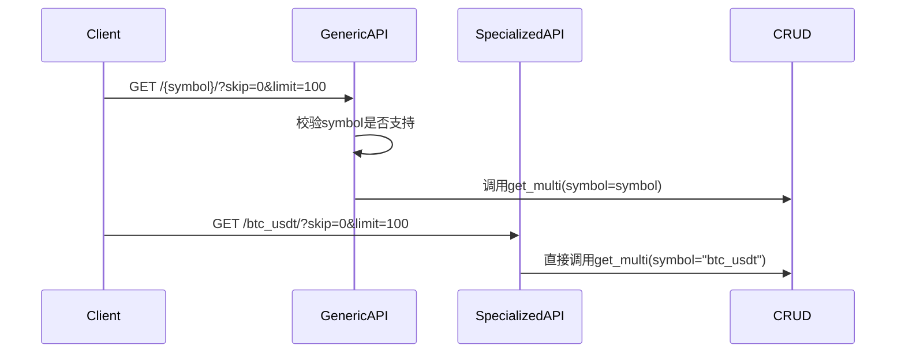
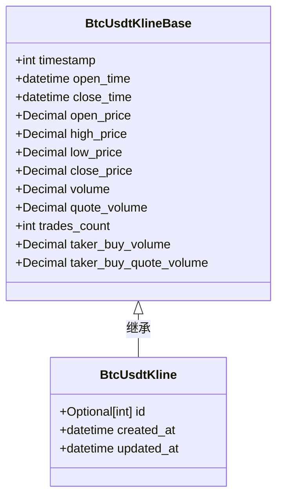

# 特定交易对端点

<cite>
**本文档中引用的文件**  
- [kline.py](file://app/api/v1/endpoints/kline.py)
- [kline.py](file://app/crud/kline.py)
- [kline.py](file://app/models/kline.py)
- [kline.py](file://app/schemas/kline.py)
</cite>

## 目录
1. [简介](#简介)
2. [专用端点概览](#专用端点概览)
3. [与通用端点的对比](#与通用端点的对比)
4. [请求与响应模型](#请求与响应模型)
5. [错误处理机制](#错误处理机制)
6. [性能优势与使用场景](#性能优势与使用场景)
7. [代码结构分析](#代码结构分析)
8. [最佳实践建议](#最佳实践建议)

## 简介
本系统为高频交易场景设计了针对BTC/USDT交易对的专用API端点，旨在优化数据访问效率并简化客户端调用逻辑。这些端点通过预设交易对符号（symbol），避免了在每次请求中重复传递参数，特别适用于前端默认加载或高频轮询BTC/USDT数据的场景。

**Section sources**
- [kline.py](file://app/api/v1/endpoints/kline.py#L94-L161)

## 专用端点概览
系统提供以下四个专用于BTC/USDT交易对的API端点：

- `/get_btc_usdt_klines`：获取BTC/USDT K线数据列表
- `/get_btc_usdt_kline/{kline_id}`：根据ID获取单条K线数据
- `/get_btc_usdt_kline_by_timestamp/{timestamp}`：根据时间戳获取K线数据
- `/get_btc_usdt_klines_by_range`：获取指定时间范围内的K线数据

这些端点均位于`app/api/v1/endpoints/kline.py`中，通过硬编码`symbol="btc_usdt"`实现参数简化，直接调用底层CRUD操作。

```mermaid
flowchart TD
A["/get_btc_usdt_klines"] --> B[调用 crud.kline.get_multi]
C["/get_btc_usdt_kline/{id}"] --> D[调用 crud.kline.get]
E["/get_btc_usdt_kline_by_timestamp/{ts}"] --> F[调用 crud.kline.get_by_timestamp]
G["/get_btc_usdt_klines_by_range"] --> H[调用 crud.kline.get_by_time_range]
B --> I[返回 List[BtcUsdtKline]]
D --> J[返回 BtcUsdtKline]
F --> J
H --> I
```

**Diagram sources**
- [kline.py](file://app/api/v1/endpoints/kline.py#L94-L161)
- [kline.py](file://app/crud/kline.py#L70-L145)

**Section sources**
- [kline.py](file://app/api/v1/endpoints/kline.py#L94-L161)

## 与通用端点的对比
专用端点与通用symbol端点的核心区别在于参数处理方式和校验逻辑。

| 特性 | 通用端点 | BTC/USDT专用端点 |
|------|----------|------------------|
| symbol参数 | 必须传递 | 预设为"btc_usdt" |
| 参数校验 | 检查symbol是否在SYMBOL_TO_MODEL中 | 无需校验 |
| 调用复杂度 | 客户端需显式传递symbol | 调用更简洁 |
| 扩展性 | 支持多交易对 | 仅支持BTC/USDT |
| 性能开销 | 存在校验开销 | 减少校验步骤 |

通用端点通过`symbol`参数动态查找模型类，而专用端点直接使用`BtcUsdtKline`模型，跳过了symbol合法性检查。



**Diagram sources**
- [kline.py](file://app/api/v1/endpoints/kline.py#L68-L97)
- [kline.py](file://app/api/v1/endpoints/kline.py#L94-L129)

**Section sources**
- [kline.py](file://app/api/v1/endpoints/kline.py#L68-L161)

## 请求与响应模型
所有BTC/USDT专用端点均使用`BtcUsdtKline`作为响应模型，该模型继承自`BtcUsdtKlineBase`，并包含以下字段约束：



**Diagram sources**
- [kline.py](file://app/schemas/kline.py#L0-L29)

**Section sources**
- [kline.py](file://app/schemas/kline.py#L0-L29)

## 错误处理机制
专用端点实现了统一的异常处理机制，主要错误类型包括：

- **404 Not Found**：当查询的K线记录不存在时触发，例如请求的`kline_id`或时间戳无对应数据
- **500 Internal Server Error**：当数据库查询或其他内部操作失败时触发

错误处理通过try-except块实现，所有异常均被记录到日志，并向上抛出HTTPException。例如，在`get_btc_usdt_kline`中，若未找到记录，则显式抛出404异常。

**Section sources**
- [kline.py](file://app/api/v1/endpoints/kline.py#L105-L115)
- [kline.py](file://app/api/v1/endpoints/kline.py#L135-L145)

## 性能优势与使用场景
专用端点的主要性能优势体现在：

1. **减少参数校验开销**：省略了symbol合法性检查
2. **降低网络传输量**：客户端无需发送symbol参数
3. **提高调用效率**：服务端直接绑定模型，减少动态查找

典型使用场景包括：
- 前端页面默认加载BTC/USDT K线数据
- 高频轮询BTC/USDT最新行情
- 移动端简化API调用逻辑

**Section sources**
- [kline.py](file://app/api/v1/endpoints/kline.py#L94-L161)

## 代码结构分析
从代码结构看，专用端点通过硬编码`symbol="btc_usdt"`直接调用CRUD方法，避免了通用端点中的symbol校验逻辑。这种设计虽然牺牲了一定的扩展性（无法动态支持新交易对），但在特定场景下提升了执行效率。

数据流向为：API端点 → CRUD层 → 数据库（btc_usdt表），其中`SYMBOL_TO_MODEL`映射定义在`app/models/kline.py`中。

```mermaid
graph TB
A[/get_btc_usdt_klines] --> B[crud.kline.get_multi]
B --> C[(btc_usdt 表)]
D[/get_btc_usdt_kline] --> E[crud.kline.get]
E --> C
F[/get_btc_usdt_kline_by_timestamp] --> G[crud.kline.get_by_timestamp]
G --> C
H[/get_btc_usdt_klines_by_range] --> I[crud.kline.get_by_time_range]
I --> C
```

**Diagram sources**
- [kline.py](file://app/api/v1/endpoints/kline.py#L94-L161)
- [kline.py](file://app/crud/kline.py#L70-L145)
- [kline.py](file://app/models/kline.py#L23-L25)

**Section sources**
- [kline.py](file://app/api/v1/endpoints/kline.py#L94-L161)
- [kline.py](file://app/crud/kline.py#L70-L145)
- [kline.py](file://app/models/kline.py#L23-L25)

## 最佳实践建议
建议在以下场景优先使用BTC/USDT专用端点：
- 高频率访问BTC/USDT数据（如每秒轮询）
- 客户端希望简化调用参数
- 对响应延迟敏感的应用

对于需要支持多交易对的通用功能，仍应使用带symbol参数的通用端点。未来若需扩展其他专用端点（如ETH/USDT），可参照相同模式实现。