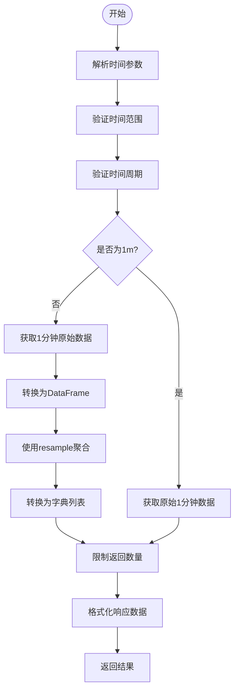

# K线数据查询

<cite>
**本文档引用的文件**
- [kline_simple.py](file://app/api/v1/endpoints/kline_simple.py)
- [kline_aggregator.py](file://app/services/kline_aggregator.py)
- [kline.py](file://app/models/kline.py)
- [kline.py](file://app/schemas/kline.py)
- [api.js](file://frontend/src/lib/api.js)
</cite>

## 目录
1. [简介](#简介)
2. [查询参数说明](#查询参数说明)
3. [请求与响应格式](#请求与响应格式)
4. [数据聚合机制](#数据聚合机制)
5. [使用示例](#使用示例)
6. [健康检查与统计信息](#健康检查与统计信息)

## 简介

`/simple/klines` 接口用于获取聚合后的K线数据，支持多种时间周期和时间范围查询。该接口基于1分钟原始K线数据，通过聚合算法生成不同时间粒度的K线，适用于技术分析、图表展示等场景。

**Section sources**
- [kline_simple.py](file://app/api/v1/endpoints/kline_simple.py#L0-L39)

## 查询参数说明

### timeframe（时间周期）
指定返回K线的时间粒度。

- **类型**: 字符串
- **默认值**: `1h`
- **有效值**: `1m`, `5m`, `15m`, `30m`, `1h`, `4h`, `1d`
- **描述**:
  - `1m`: 1分钟
  - `5m`: 5分钟
  - `15m`: 15分钟
  - `30m`: 30分钟
  - `1h`: 1小时
  - `4h`: 4小时
  - `1d`: 1天

**Section sources**
- [kline_simple.py](file://app/api/v1/endpoints/kline_simple.py#L175-L207)
- [kline_aggregator.py](file://app/services/kline_aggregator.py#L0-L50)

### limit（数据条数）
指定返回K线数据的最大条数。

- **类型**: 整数
- **默认值**: `200`
- **取值范围**: `1` 到 `1000`
- **约束**: 必须大于等于1且小于等于1000

**Section sources**
- [kline_simple.py](file://app/api/v1/endpoints/kline_simple.py#L38-L73)

### start_time（开始时间）
指定查询的起始时间，使用ISO 8601标准时间格式。

- **类型**: 字符串（ISO格式）
- **默认值**: 无
- **格式要求**: `YYYY-MM-DDTHH:MM:SS` 或 `YYYY-MM-DDTHH:MM:SSZ`
- **示例**: `2024-01-01T00:00:00` 或 `2024-01-01T00:00:00Z`
- **说明**: 如果包含`Z`，表示UTC时间；否则按本地时间处理

**Section sources**
- [kline_simple.py](file://app/api/v1/endpoints/kline_simple.py#L38-L73)

### end_time（结束时间）
指定查询的结束时间，使用ISO 8601标准时间格式。

- **类型**: 字符串（ISO格式）
- **默认值**: 无
- **格式要求**: `YYYY-MM-DDTHH:MM:SS` 或 `YYYY-MM-DDTHH:MM:SSZ`
- **示例**: `2024-01-01T23:59:59` 或 `2024-01-01T23:59:59Z`
- **说明**: 如果包含`Z`，表示UTC时间；否则按本地时间处理

**Section sources**
- [kline_simple.py](file://app/api/v1/endpoints/kline_simple.py#L71-L108)

### 时间范围约束
- `start_time` 必须早于 `end_time`
- 若两者同时提供，且 `start_time >= end_time`，将返回400错误
- 若未提供时间范围，则根据 `limit` 和 `timeframe` 自动计算时间窗口

**Section sources**
- [kline_simple.py](file://app/api/v1/endpoints/kline_simple.py#L71-L108)

## 请求与响应格式

### JSON Schema 示例

```json
{
  "success": true,
  "message": "成功查询到K线数据",
  "data": {
    "klines": [
      {
        "timestamp": 1704067200000,
        "open_time": "2024-01-01T00:00:00",
        "close_time": "2024-01-01T01:00:00",
        "open_price": "43000.00000000",
        "high_price": "43500.00000000",
        "low_price": "42800.00000000",
        "close_price": "43200.00000000",
        "volume": "100.50000000",
        "quote_volume": "4330000.00000000",
        "trades_count": 150,
        "taker_buy_volume": "55.20000000",
        "taker_buy_quote_volume": "2380000.00000000"
      }
    ],
    "metadata": {
      "count": 1,
      "timeframe": "1h",
      "request_params": {
        "limit": 200,
        "start_time": "2024-01-01T00:00:00",
        "end_time": "2024-01-01T01:00:00"
      },
      "data_range": {
        "start": "2024-01-01T00:00:00",
        "end": "2024-01-01T01:00:00"
      }
    },
    "database_stats": {
      "total_klines": 10000,
      "date_range": {
        "start": "2023-01-01T00:00:00",
        "end": "2024-01-01T23:59:59"
      },
      "latest_price": 43200.0,
      "data_coverage": "6.9 天"
    }
  }
}
```

### metadata 字段说明
- `count`: 返回的K线条数
- `timeframe`: 请求的时间周期
- `request_params`: 原始请求参数
- `data_range`: 实际返回数据的时间范围

### database_stats 字段说明
- `total_klines`: 数据库中总K线条数
- `date_range`: 数据覆盖的时间范围
- `latest_price`: 最新收盘价
- `data_coverage`: 数据覆盖天数或记录条数

**Section sources**
- [kline_simple.py](file://app/api/v1/endpoints/kline_simple.py#L105-L145)
- [kline_aggregator.py](file://app/services/kline_aggregator.py#L232-L250)

## 数据聚合机制

系统基于1分钟原始K线数据，通过时间聚合算法生成更长时间周期的K线。

### 聚合规则
| 字段 | 聚合方法 |
|------|----------|
| 开盘价 | 第一个K线的开盘价 |
| 最高价 | 所有K线中的最高价最大值 |
| 最低价 | 所有K线中的最低价最小值 |
| 收盘价 | 最后一个K线的收盘价 |
| 成交量 | 所有K线成交量之和 |
| 成交额 | 所有K线成交额之和 |
| 交易笔数 | 所有K线交易笔数之和 |
| 主动买入量 | 所有K线主动买入量之和 |

### 技术实现
- 使用 `pandas.resample` 进行时间序列聚合
- 原始数据存储在 `btc_usdt` 表中
- 聚合间隔由 `TIMEFRAMES` 常量定义
- 对于 `1m` 周期，直接返回原始数据



**Diagram sources**
- [kline_aggregator.py](file://app/services/kline_aggregator.py#L77-L116)
- [kline_aggregator.py](file://app/services/kline_aggregator.py#L0-L50)

**Section sources**
- [kline_aggregator.py](file://app/services/kline_aggregator.py#L0-L250)

## 使用示例

### cURL 示例

#### 获取最近200条1小时K线
```bash
curl -X GET "http://localhost:8000/api/v1/simple/klines?timeframe=1h&limit=200"
```

#### 按时间范围查询30分钟K线
```bash
curl -X GET "http://localhost:8000/api/v1/simple/klines?timeframe=30m&limit=50&start_time=2024-01-01T00:00:00&end_time=2024-01-02T00:00:00"
```

#### 获取最新100条4小时K线
```bash
curl -X GET "http://localhost:8000/api/v1/simple/latest?timeframe=4h&count=100"
```

### Python 客户端示例

```python
import requests
from datetime import datetime, timezone

# 基础配置
BASE_URL = "http://localhost:8000/api/v1/simple"

def get_klines(timeframe="1h", limit=200, start_time=None, end_time=None):
    """获取K线数据"""
    params = {
        "timeframe": timeframe,
        "limit": limit
    }
    
    if start_time:
        params["start_time"] = start_time.isoformat()
    if end_time:
        params["end_time"] = end_time.isoformat()
    
    response = requests.get(f"{BASE_URL}/klines", params=params)
    return response.json()

# 示例1: 获取最近200条1小时K线
klines = get_klines(timeframe="1h", limit=200)
print(f"获取到 {len(klines['data']['klines'])} 条数据")

# 示例2: 查询特定时间范围的30分钟K线
start = datetime(2024, 1, 1, 0, 0, 0, tzinfo=timezone.utc)
end = datetime(2024, 1, 2, 0, 0, 0, tzinfo=timezone.utc)
klines = get_klines(timeframe="30m", limit=100, start_time=start, end_time=end)
print(f"时间范围: {klines['data']['metadata']['data_range']}")
```

**Section sources**
- [api.js](file://frontend/src/lib/api.js#L85-L133)
- [kline_simple.py](file://app/api/v1/endpoints/kline_simple.py#L105-L145)

## 健康检查与统计信息

### 获取支持的时间周期
```bash
curl -X GET "http://localhost:8000/api/v1/simple/timeframes"
```

### 获取数据库统计信息
```bash
curl -X GET "http://localhost:8000/api/v1/simple/stats"
```

### 健康检查
```bash
curl -X GET "http://localhost:8000/api/v1/simple/health"
```

健康检查返回以下状态：
- `fresh`: 数据在1小时内更新
- `recent`: 数据在24小时内更新
- `stale`: 数据超过24小时未更新
- `unknown`: 无数据

**Section sources**
- [kline_simple.py](file://app/api/v1/endpoints/kline_simple.py#L175-L207)
- [kline_simple.py](file://app/api/v1/endpoints/kline_simple.py#L205-L240)