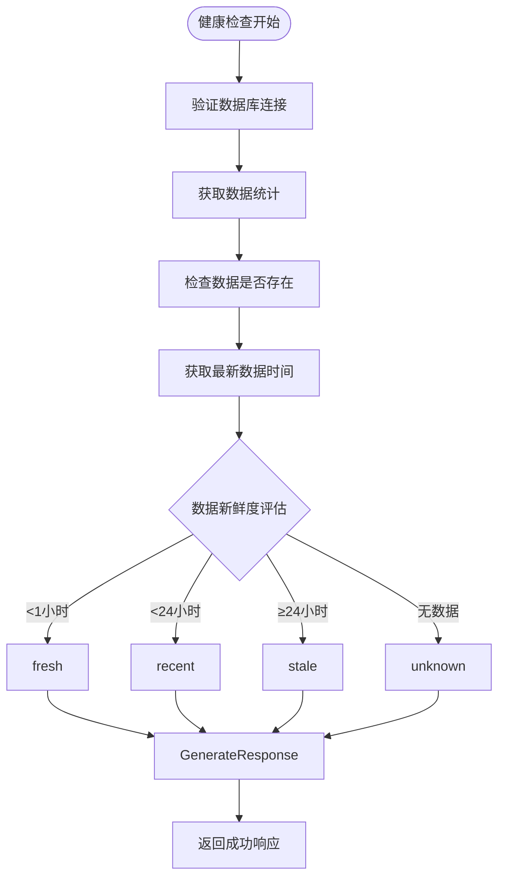
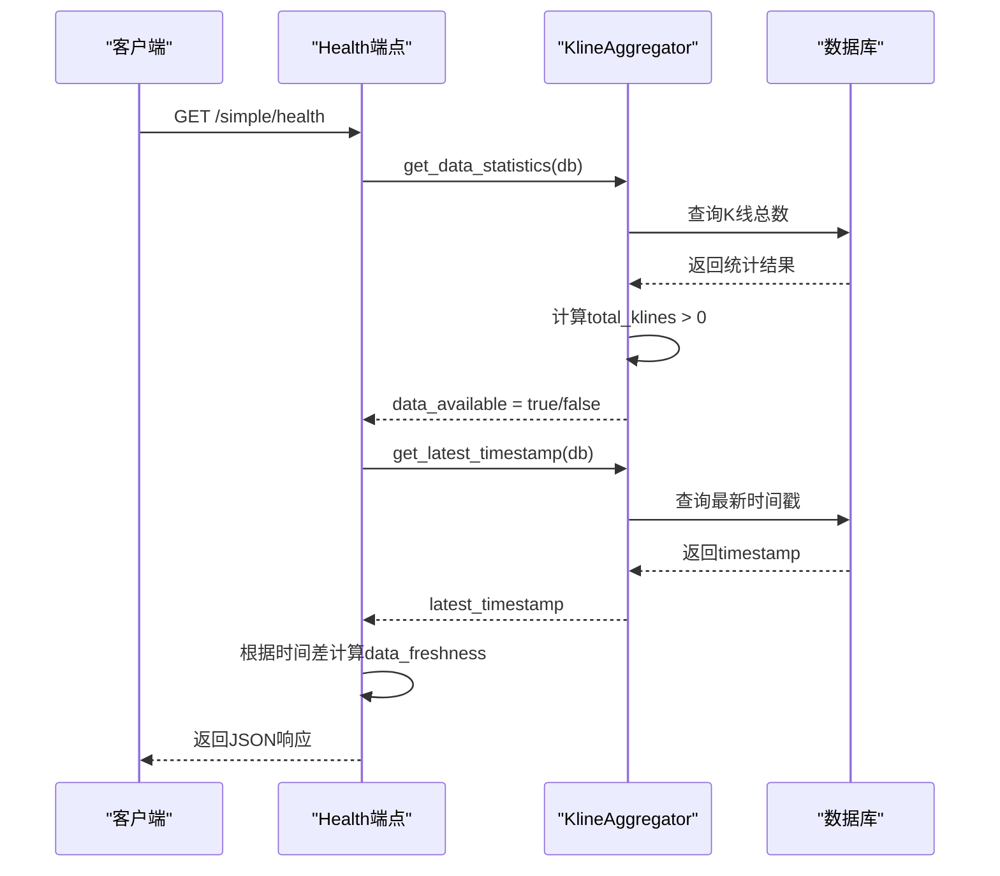
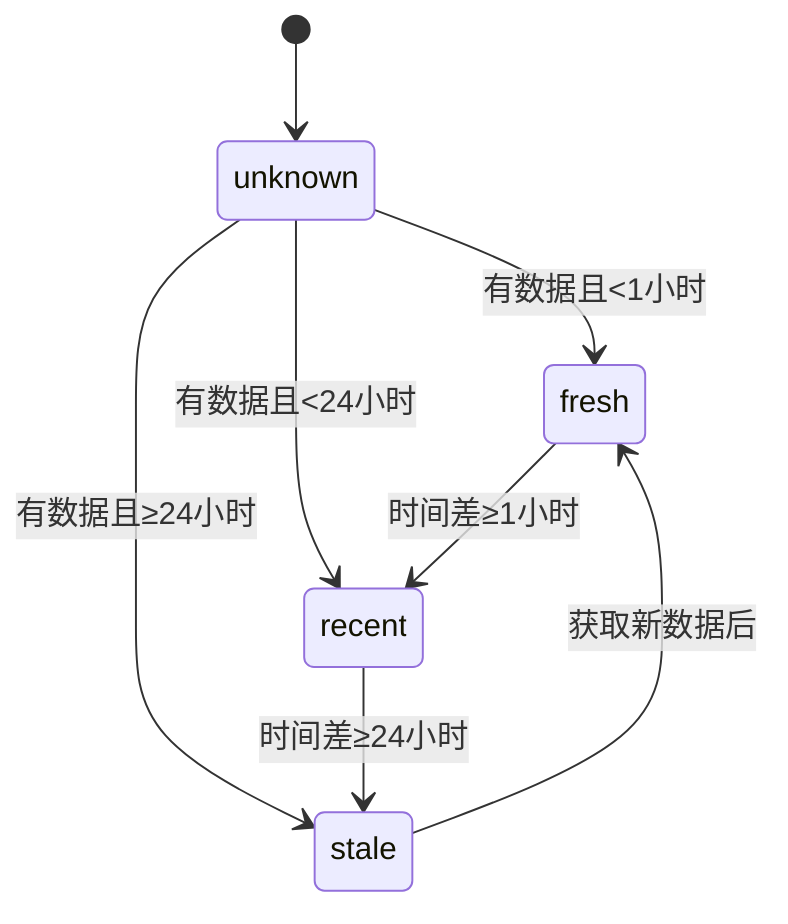
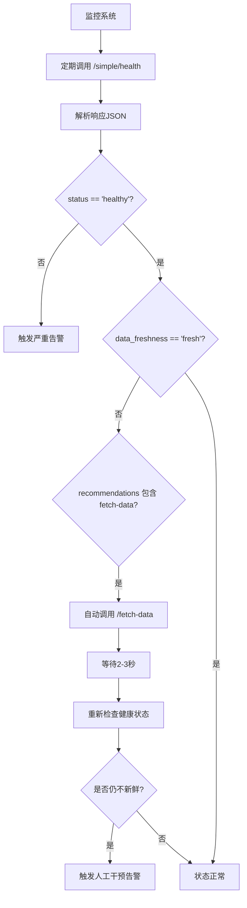

# 系统健康检查

<cite>
**本文档引用文件**  
- [kline_simple.py](file://app/api/v1/endpoints/kline_simple.py)
- [kline_aggregator.py](file://app/services/kline_aggregator.py)
- [session.py](file://app/db/session.py)
- [main.py](file://app/main.py)
</cite>

## 目录
1. [简介](#简介)
2. [端点功能概述](#端点功能概述)
3. [健康检查逻辑详解](#健康检查逻辑详解)
4. [响应结构与状态码](#响应结构与状态码)
5. [数据新鲜度评估机制](#数据新鲜度评估机制)
6. [推荐建议映射关系](#推荐建议映射关系)
7. [成功与失败响应示例](#成功与失败响应示例)
8. [监控系统集成方案](#监控系统集成方案)
9. [结论](#结论)

## 简介
`/simple/health` 健康检查端点是交易系统的核心诊断接口，用于验证数据库连接状态、检查K线数据可用性，并评估数据的新鲜度。该端点为自动化监控和告警系统提供关键输入，确保系统在进行技术分析前具备可靠的数据基础。

**Section sources**
- [kline_simple.py](file://app/api/v1/endpoints/kline_simple.py#L237-L259)
- [main.py](file://app/main.py#L100-L105)

## 端点功能概述
该健康检查端点位于 `/api/v1/simple/health`，主要执行以下三项核心检查：

1. **数据库连接验证**：通过依赖注入获取数据库会话，确认与PostgreSQL数据库的连接正常。
2. **数据可用性检查**：查询数据库中是否存在任何K线记录。
3. **数据新鲜度评估**：根据最新K线的时间戳判断数据是否为新鲜（fresh）、较新（recent）、陈旧（stale）或未知（unknown）。



**Diagram sources**
- [kline_simple.py](file://app/api/v1/endpoints/kline_simple.py#L237-L259)
- [kline_aggregator.py](file://app/services/kline_aggregator.py#L230-L250)

## 健康检查逻辑详解
健康检查的实现逻辑分布在多个组件中，其调用流程如下：



**Diagram sources**
- [kline_simple.py](file://app/api/v1/endpoints/kline_simple.py#L237-L259)
- [kline_aggregator.py](file://app/services/kline_aggregator.py#L230-L250)
- [session.py](file://app/db/session.py#L35-L43)

## 响应结构与状态码
该端点遵循统一的响应格式，由 `create_success_response` 函数生成。

### 响应字段说明

| 字段 | 类型 | 说明 |
|------|------|------|
| success | boolean | 是否成功 |
| code | int | 状态码（0表示成功） |
| message | string | 消息描述 |
| data | object | 健康检查结果数据 |

### data 对象结构

| 字段 | 类型 | 说明 |
|------|------|------|
| status | string | 系统状态（"healthy"） |
| components | object | 各组件状态 |
| statistics | object | 数据库统计信息 |
| recommendations | string | 基于数据状态的建议文本 |

### HTTP状态码

| 状态码 | 含义 | 触发条件 |
|--------|------|----------|
| 200 | OK | 健康检查成功，无论数据状态如何 |
| 500 | Internal Server Error | 数据库连接失败或内部异常 |

**Section sources**
- [kline_simple.py](file://app/api/v1/endpoints/kline_simple.py#L237-L259)
- [exceptions.py](file://app/core/exceptions.py#L67-L103)

## 数据新鲜度评估机制
数据新鲜度（data_freshness）根据最新K线的时间戳与当前时间的差值进行判断：



### 判断逻辑

- **fresh（新鲜）**：最新数据在过去1小时内
- **recent（较新）**：最新数据在1至24小时内
- **stale（陈旧）**：最新数据超过24小时
- **unknown（未知）**：数据库中无任何K线数据

该逻辑通过 `kline_aggregator.get_latest_timestamp()` 获取最新时间戳，并在健康检查端点中进行时间差计算。

**Section sources**
- [kline_simple.py](file://app/api/v1/endpoints/kline_simple.py#L237-L259)
- [kline_aggregator.py](file://app/services/kline_aggregator.py#L230-L250)

## 推荐建议映射关系
`recommendations` 字段的文本内容根据 `data_freshness` 的值动态生成，形成明确的操作指引：

| data_freshness | recommendations 建议文本 |
|----------------|--------------------------|
| fresh | "数据是最新的，可以进行分析" |
| recent | "数据较新，建议获取最新数据" |
| stale | "数据较旧，建议调用 /fetch-data 获取新数据" |
| unknown | "无数据，请先调用 /fetch-data 获取数据" |

此映射关系直接内置于健康检查端点的返回逻辑中，确保用户能根据系统状态采取相应行动。

**Section sources**
- [kline_simple.py](file://app/api/v1/endpoints/kline_simple.py#L237-L259)

## 成功与失败响应示例

### 成功响应示例（数据新鲜）

```json
{
  "success": true,
  "code": 0,
  "message": "success",
  "data": {
    "status": "healthy",
    "components": {
      "database": "connected",
      "kline_aggregator": "ready",
      "data_available": true,
      "data_freshness": "fresh"
    },
    "statistics": {
      "total_klines": 15000,
      "date_range": {
        "start": "2024-01-01T00:00:00",
        "end": "2024-01-15T14:30:00"
      },
      "latest_price": 43250.5
    },
    "recommendations": "数据是最新的，可以进行分析"
  }
}
```

### 成功响应示例（数据陈旧）

```json
{
  "success": true,
  "code": 0,
  "message": "success",
  "data": {
    "status": "healthy",
    "components": {
      "database": "connected",
      "kline_aggregator": "ready",
      "data_available": true,
      "data_freshness": "stale"
    },
    "statistics": {
      "total_klines": 12000,
      "date_range": {
        "start": "2024-01-01T00:00:00",
        "end": "2024-01-10T10:00:00"
      },
      "latest_price": 41200.0
    },
    "recommendations": "数据较旧，建议调用 /fetch-data 获取新数据"
  }
}
```

### 失败响应示例（服务器内部错误）

```json
{
  "success": false,
  "code": 1001,
  "message": "健康检查失败",
  "data": null
}
```

**Section sources**
- [kline_simple.py](file://app/api/v1/endpoints/kline_simple.py#L237-L259)
- [exceptions.py](file://app/core/exceptions.py#L67-L103)

## 监控系统集成方案
该健康检查端点可轻松集成到自动化监控系统中，实现告警和自动修复。

### 监控集成流程



### 集成建议
- **检查频率**：建议每5分钟执行一次健康检查
- **告警阈值**：
  - 当 `status` 不为 "healthy" 时，立即触发P1级告警
  - 当 `data_freshness` 为 "stale" 或 "unknown" 超过1小时，触发P2级告警
- **自动修复**：可配置监控系统在检测到陈旧数据时自动调用 `/fetch-data` 端点

**Section sources**
- [kline_simple.py](file://app/api/v1/endpoints/kline_simple.py#L237-L259)
- [kline_simple.py](file://app/api/v1/endpoints/kline_simple.py#L200-L230)
- [test_chan_integration.py](file://test_chan_integration.py#L250-L275)

## 结论
`/simple/health` 健康检查端点为系统稳定性提供了全面的诊断能力。通过验证数据库连接、评估数据可用性与新鲜度，并结合清晰的推荐建议，该端点不仅可用于人工排查问题，更可作为自动化监控和自愈系统的核心组件。其设计体现了高内聚、低耦合的架构原则，各功能模块职责分明，便于维护和扩展。