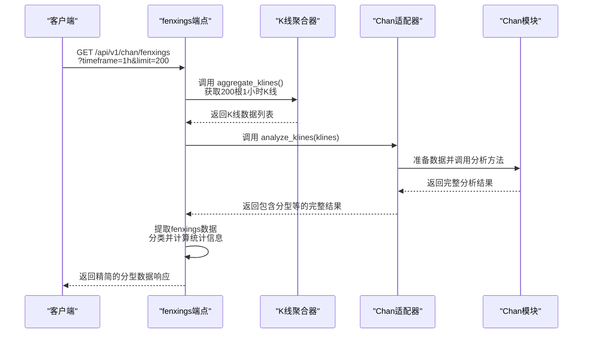

# 分型数据端点 (/fenxings)

<cite>
**Referenced Files in This Document**   
- [chan_analysis.py](file://app/api/v1/endpoints/chan_analysis.py)
- [chan_adapter.py](file://app/services/chan_adapter.py)
- [exceptions.py](file://app/core/exceptions.py)
</cite>

## 目录
1. [简介](#简介)
2. [核心功能](#核心功能)
3. [API 详细说明](#api-详细说明)
4. [响应数据结构](#响应数据结构)
5. [使用场景与优势](#使用场景与优势)
6. [内部实现机制](#内部实现机制)
7. [请求示例](#请求示例)
8. [前端数据处理示例](#前端数据处理示例)
9. [错误处理](#错误处理)

## 简介

`/fenxings` 端点是交易系统中一个专门用于获取缠论分型信号的轻量级API。它通过 `GET` 方法暴露在 `/api/v1/chan/fenxings` 路径下，旨在为需要快速获取分型识别结果的应用场景提供高效、简洁的数据服务。该端点不返回完整的缠论分析（如笔、线段等），而是专注于提取和返回分型信息，从而显著降低数据传输量和处理开销。

**Section sources**
- [chan_analysis.py](file://app/api/v1/endpoints/chan_analysis.py#L300-L350)

## 核心功能

该端点的核心功能是执行以下操作：
1.  **数据获取**：根据指定的时间周期（`timeframe`）和数量（`limit`）从数据库中聚合K线数据。
2.  **分型分析**：调用核心的缠论分析模块（`chan_adapter`）对K线数据进行完整分析。
3.  **结果提取**：从完整的分析结果中，仅提取出“分型”（Fenxing）相关的数据。
4.  **数据分类与统计**：将分型分为“顶分型”和“底分型”，并计算相关的统计信息。
5.  **响应构建**：将提取和处理后的分型数据，按照预定义的轻量级结构，通过统一的成功响应格式返回给客户端。

此设计使得该端点成为构建实时交易信号监控、分型策略回测等应用的理想选择。

**Section sources**
- [chan_analysis.py](file://app/api/v1/endpoints/chan_analysis.py#L300-L350)
- [chan_adapter.py](file://app/services/chan_adapter.py#L100-L150)

## API 详细说明

### HTTP 方法
`GET`

### 完整URL路径
`/api/v1/chan/fenxings`

### 请求参数

| 参数名 | 类型 | 必填 | 描述 | 示例值 |
| :--- | :--- | :--- | :--- | :--- |
| `timeframe` | 字符串 | 是 | 指定K线的时间周期。 | `"1h"` |
| `limit` | 整数 | 是 | 指定用于分析的K线数量，范围在50到500之间。 | `200` |

**参数说明**：
- **`timeframe`**：支持多种时间周期，如 `"1m"`, `"5m"`, `"15m"`, `"30m"`, `"1h"`, `"4h"`, `"1d"` 等。该参数决定了分析的时间粒度。
- **`limit`**：该参数控制了分析所基于的历史K线数据量。较大的数值（如200以上）通常能提供更稳定和可靠的分型信号，但会增加处理时间。

**Section sources**
- [chan_analysis.py](file://app/api/v1/endpoints/chan_analysis.py#L300-L350)

## 响应数据结构

该端点返回一个标准化的成功响应，其 `data` 字段包含一个结构化的JSON对象，具体如下：

```json
{
  "success": true,
  "code": 0,
  "message": "success",
  "data": {
    "fenxings": {
      "all": [
        {
          "index": 15,
          "timestamp": 1700000000000,
          "price": 35000.5,
          "type": "top",
          "strength": 0.85
        },
        {
          "index": 22,
          "timestamp": 1700000000000,
          "price": 34500.2,
          "type": "bottom",
          "strength": 0.92
        }
      ],
      "tops": [
        {
          "index": 15,
          "timestamp": 1700000000000,
          "price": 35000.5,
          "type": "top",
          "strength": 0.85
        }
      ],
      "bottoms": [
        {
          "index": 22,
          "timestamp": 1700000000000,
          "price": 34500.2,
          "type": "bottom",
          "strength": 0.92
        }
      ]
    },
    "statistics": {
      "total": 2,
      "tops_count": 1,
      "bottoms_count": 1,
      "average_strength": 0.885
    },
    "metadata": {
      "timeframe": "1h",
      "klines_analyzed": 200,
      "analysis_type": "fenxings_only"
    }
  }
}
```

### 数据结构详解

#### `fenxings` 对象
包含所有分型的详细信息，按类型分类。
- **`all`**: 所有分型的列表，每个分型对象包含：
  - `index`: 分型在K线序列中的索引位置。
  - `timestamp`: 分型发生的时间戳（毫秒）。
  - `price`: 分型的确认价格。
  - `type`: 分型类型，`"top"` 表示顶分型，`"bottom"` 表示底分型。
  - `strength`: 分型的强度，一个0.0到1.0之间的浮点数，数值越高表示信号越强。
- **`tops`**: 仅包含顶分型的列表。
- **`bottoms`**: 仅包含底分型的列表。

#### `statistics` 对象
提供分型的统计摘要。
- **`total`**: 识别出的分型总数。
- **`tops_count`**: 顶分型的数量。
- **`bottoms_count`**: 底分型的数量。
- **`average_strength`**: 所有分型的平均强度。

#### `metadata` 对象
包含本次请求的元数据。
- **`timeframe`**: 请求的时间周期。
- **`klines_analyzed`**: 实际用于分析的K线数量。
- **`analysis_type`**: 分析类型，固定为 `"fenxings_only"`，表明这是轻量级分型分析。

**Section sources**
- [chan_analysis.py](file://app/api/v1/endpoints/chan_analysis.py#L330-L350)

## 使用场景与优势

### 适用场景
该端点特别适用于以下场景：
- **实时信号监控**：前端应用需要频繁轮询最新的分型信号，以在图表上实时标记顶分型和底分型。
- **轻量级策略**：交易策略仅依赖于分型信号进行决策，无需完整的笔或线段信息。
- **移动应用**：在带宽或计算资源受限的设备上，减少数据传输和处理负担。
- **高频数据处理**：需要快速处理大量分型数据的后端服务。

### 主要优势
- **高效性**：相比 `/analyze` 等返回完整分析结果的端点，此端点的数据量更小，响应速度更快。
- **简洁性**：返回的数据结构清晰、目的明确，客户端无需解析和过滤无关信息。
- **低开销**：减少了网络传输和客户端数据处理的开销，提升了整体系统性能。

**Section sources**
- [chan_analysis.py](file://app/api/v1/endpoints/chan_analysis.py#L300-L350)

## 内部实现机制

该端点的实现依赖于系统内部的组件协作。其核心流程如下：



**Diagram sources**
- [chan_analysis.py](file://app/api/v1/endpoints/chan_analysis.py#L300-L350)
- [chan_adapter.py](file://app/services/chan_adapter.py#L100-L150)

**关键点说明**：
1.  **数据聚合**：端点首先通过 `kline_aggregator` 服务获取指定数量和周期的K线数据。
2.  **完整分析**：端点调用 `chan_adapter.analyze_klines` 方法。**重要的是，这会触发对K线数据的完整缠论分析**，包括分型、笔、线段等所有结构的识别。
3.  **结果过滤**：尽管进行了完整分析，但端点代码会从返回的 `analysis` 结果中，使用 `analysis.get("fenxings", [])` 仅提取分型部分。
4.  **数据加工**：对提取出的分型列表进行二次处理，将其分为 `tops` 和 `bottoms` 两个子列表，并计算 `statistics` 中的各项统计值。
5.  **响应返回**：最终，只将加工后的分型数据、统计信息和元数据打包，通过 `create_success_response` 函数返回。

这种“完整分析，部分返回”的设计模式，保证了分型识别的准确性（因为它依赖于完整的缠论逻辑），同时又满足了轻量级接口的需求。

**Section sources**
- [chan_analysis.py](file://app/api/v1/endpoints/chan_analysis.py#L300-L350)
- [chan_adapter.py](file://app/services/chan_adapter.py#L100-L150)

## 请求示例

### 使用 curl
```bash
curl -X GET "http://localhost:8000/api/v1/chan/fenxings?timeframe=1h&limit=200" \
     -H "accept: application/json"
```

### 使用 Python (requests)
```python
import requests

url = "http://localhost:8000/api/v1/chan/fenxings"
params = {
    "timeframe": "1h",
    "limit": 200
}

response = requests.get(url, params=params)
data = response.json()

# 处理返回的分型数据
fenxings = data["data"]["fenxings"]
tops = fenxings["tops"]
bottoms = fenxings["bottoms"]

print(f"发现 {len(tops)} 个顶分型和 {len(bottoms)} 个底分型")
```

**Section sources**
- [chan_analysis.py](file://app/api/v1/endpoints/chan_analysis.py#L300-L350)

## 前端数据处理示例

以下是一个JavaScript代码片段，展示如何处理从 `/fenxings` 端点获取的数据，并用于构建一个简单的交易策略：

```javascript
// 假设 fetchFenxingsData 是一个获取分型数据的函数
async function processFenxingSignals() {
    try {
        const response = await fetch('/api/v1/chan/fenxings?timeframe=1h&limit=200');
        const result = await response.json();
        
        if (!result.success) {
            throw new Error(result.message);
        }

        const { fenxings, statistics } = result.data;
        
        // 获取最新的顶分型和底分型
        const latestTop = fenxings.tops.length > 0 ? fenxings.tops[fenxings.tops.length - 1] : null;
        const latestBottom = fenxings.bottoms.length > 0 ? fenxings.bottoms[fenxings.bottoms.length - 1] : null;

        // 构建简单的交易策略
        let signal = 'HOLD'; // 持有
        let confidence = 0;

        if (latestBottom && latestTop && latestBottom.timestamp > latestTop.timestamp) {
            // 最新信号是底分型，发出买入信号
            signal = 'BUY';
            confidence = latestBottom.strength;
        } else if (latestTop && latestBottom && latestTop.timestamp > latestBottom.timestamp) {
            // 最新信号是顶分型，发出卖出信号
            signal = 'SELL';
            confidence = latestTop.strength;
        }

        console.log(`交易信号: ${signal}, 置信度: ${confidence.toFixed(2)}`);
        
        // 这里可以触发实际的交易逻辑或更新UI
        updateTradingUI(signal, confidence);

    } catch (error) {
        console.error('处理分型信号失败:', error);
    }
}

// 更新UI的函数（示例）
function updateTradingUI(signal, confidence) {
    document.getElementById('signal').textContent = signal;
    document.getElementById('confidence').textContent = confidence.toFixed(2);
}
```

**Section sources**
- [chan_analysis.py](file://app/api/v1/endpoints/chan_analysis.py#L300-L350)

## 错误处理

该端点遵循系统的统一错误处理规范。可能的错误响应包括：

- **`404 Not Found`**: 当指定的 `timeframe` 和 `limit` 组合无法找到任何K线数据时返回。
- **`500 Internal Server Error`**: 当内部处理发生未预期的错误时返回，例如数据库连接失败或缠论分析模块异常。

所有错误响应都通过系统的 `HTTPException` 抛出，并由全局异常处理器捕获，最终以统一的错误格式返回，确保了API的稳定性和可预测性。

**Section sources**
- [chan_analysis.py](file://app/api/v1/endpoints/chan_analysis.py#L340-L350)
- [exceptions.py](file://app/core/exceptions.py#L80-L90)