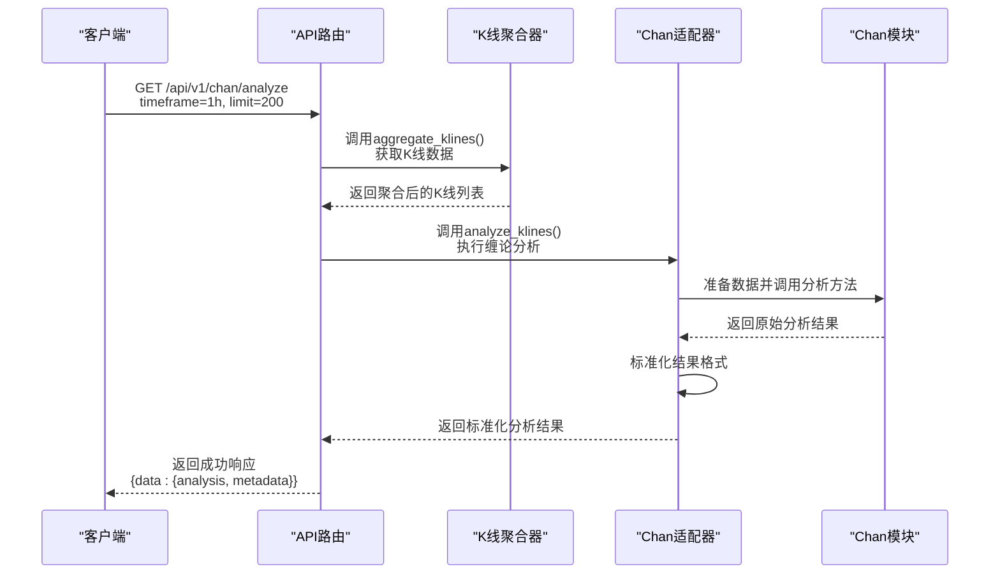
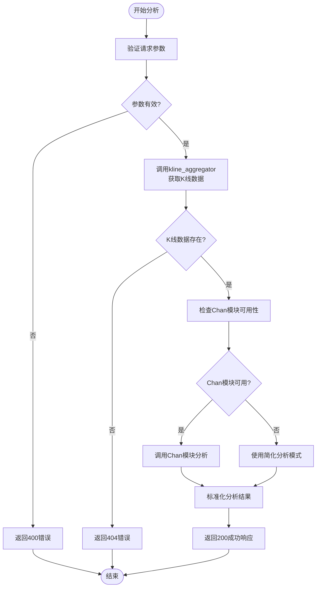

# 分析执行端点 (/analyze)

<cite>
**本文档引用的文件**   
- [chan_analysis.py](file://app/api/v1/endpoints/chan_analysis.py)
- [chan_adapter.py](file://app/services/chan_adapter.py)
- [kline_aggregator.py](file://app/services/kline_aggregator.py)
- [api.js](file://frontend/src/lib/api.js)
</cite>

## 目录
1. [端点概述](#端点概述)
2. [请求参数](#请求参数)
3. [响应结构](#响应结构)
4. [数据处理流程](#数据处理流程)
5. [HTTP状态码](#http状态码)
6. [使用示例](#使用示例)
7. [/analyze 与 /chart-data 的区别](#analyze-与-chart-data-的区别)

## 端点概述

`/api/v1/chan/analyze` 端点提供完整的缠论技术分析功能，基于K线数据自动识别分型、笔、线段和买卖点。该端点是系统缠论分析的核心接口，返回结构化的分析结果和元数据。



**图表来源**  
- [chan_analysis.py](file://app/api/v1/endpoints/chan_analysis.py#L34-L76)
- [chan_adapter.py](file://app/services/chan_adapter.py#L145-L181)

**本节来源**  
- [chan_analysis.py](file://app/api/v1/endpoints/chan_analysis.py#L34-L76)

## 请求参数

该端点接受以下查询参数：

| 参数 | 类型 | 必需 | 描述 | 示例值 | 约束 |
|------|------|------|------|--------|------|
| `timeframe` | 字符串 | 否 | 时间周期 | "1h" | 支持: 1m, 5m, 15m, 30m, 1h, 4h, 1d |
| `limit` | 整数 | 否 | 分析的K线数量 | 200 | 范围: 50-500 |

默认值：`timeframe="1h"`，`limit=200`。建议使用200以上的数据量以获得更好的分析效果。



**图表来源**  
- [chan_analysis.py](file://app/api/v1/endpoints/chan_analysis.py#L34-L76)
- [kline_aggregator.py](file://app/services/kline_aggregator.py#L30-L50)

**本节来源**  
- [chan_analysis.py](file://app/api/v1/endpoints/chan_analysis.py#L34-L76)

## 响应结构

成功的响应包含分析结果和元数据：

```json
{
  "success": true,
  "data": {
    "analysis": {
      "fenxings": [
        {
          "index": 0,
          "timestamp": 1700000000000,
          "price": 35000.0,
          "type": "top",
          "strength": 1.0
        }
      ],
      "bis": [
        {
          "start": {
            "timestamp": 1700000000000,
            "price": 35000.0,
            "type": "unknown"
          },
          "end": {
            "timestamp": 1700003600000,
            "price": 36000.0,
            "type": "unknown"
          },
          "direction": "up",
          "length": 1000.0,
          "bars_count": 5
        }
      ],
      "xianduan": [],
      "buy_sell_points": [],
      "trend": {
        "direction": "up",
        "strength": 0.8
      },
      "support_resistance": {
        "support_levels": [],
        "resistance_levels": []
      },
      "analysis_summary": {
        "trend_direction": "up",
        "trend_strength": 0.8,
        "total_fenxings": 1,
        "total_bis": 1,
        "suggestion": "趋势向上，可考虑逢低建仓，注意风险控制",
        "analysis_quality": "good",
        "data_source": "chan_module"
      }
    },
    "metadata": {
      "klines_analyzed": 200,
      "timeframe": "1h",
      "analysis_time": 1700003600000,
      "latest_price": "36000.0",
      "chan_module_available": true,
      "data_source": "chan_module",
      "statistics": {
        "fenxings": 1,
        "bis": 1,
        "xianduan": 0,
        "buy_sell_points": 0
      }
    },
    "usage_tips": {
      "fenxings": "🔺红色标记为顶分型，🔻绿色标记为底分型",
      "bis": "连接相邻分型形成的笔，显示价格运动方向",
      "trend": "基于最近几笔的方向和强度判断趋势",
      "suggestion": "根据缠论理论生成的操作建议，仅供参考"
    }
  }
}
```

**本节来源**  
- [chan_analysis.py](file://app/api/v1/endpoints/chan_analysis.py#L50-L76)

## 数据处理流程

该端点的数据处理流程分为三个主要阶段：

1. **数据获取**：通过 `kline_aggregator` 从数据库获取指定时间周期和数量的K线数据
2. **数据分析**：通过 `chan_adapter` 调用Chan模块进行缠论分析
3. **结果标准化**：将分析结果转换为统一的JSON格式

```mermaid
graph TB
subgraph "数据源"
DB[(数据库)]
KlineAggregator["K线聚合器<br/>kline_aggregator"]
end
subgraph "分析引擎"
ChanAdapter["Chan适配器<br/>chan_adapter"]
ChanModule["Chan模块<br/>chan.py"]
end
subgraph "API层"
AnalyzeEndpoint["/analyze端点"]
end
AnalyzeEndpoint --> KlineAggregator: aggregate_klines()<br/>获取K线数据
KlineAggregator --> DB: 查询BtcUsdtKline
DB --> KlineAggregator: 返回原始K线
KlineAggregator --> AnalyzeEndpoint: 返回聚合K线
AnalyzeEndpoint --> ChanAdapter: analyze_klines()<br/>执行分析
ChanAdapter --> ChanModule: _call_chan_analysis()<br/>调用具体分析方法
ChanModule --> ChanAdapter: 返回原始分析结果
ChanAdapter --> ChanAdapter: _standardize_chan_result()<br/>标准化结果
ChanAdapter --> AnalyzeEndpoint: 返回标准化结果
AnalyzeEndpoint --> Client: 返回最终响应
```

**图表来源**  
- [chan_analysis.py](file://app/api/v1/endpoints/chan_analysis.py#L34-L76)
- [chan_adapter.py](file://app/services/chan_adapter.py#L145-L239)
- [kline_aggregator.py](file://app/services/kline_aggregator.py#L30-L50)

**本节来源**  
- [chan_analysis.py](file://app/api/v1/endpoints/chan_analysis.py#L34-L76)
- [chan_adapter.py](file://app/services/chan_adapter.py#L145-L239)

## HTTP状态码

该端点可能返回以下HTTP状态码：

| 状态码 | 状态 | 响应体 | 说明 |
|--------|------|--------|------|
| 200 | OK | `{success: true, data: {...}}` | 分析成功，返回完整结果 |
| 400 | Bad Request | `{detail: "参数验证失败"}` | 请求参数不符合约束条件 |
| 404 | Not Found | `{detail: "没有找到K线数据..."}` | 指定时间周期的K线数据不存在 |
| 500 | Internal Server Error | `{detail: "分析服务暂时不可用"}` | 服务器内部错误，分析失败 |

当Chan模块不可用时，系统会自动降级到简化分析模式，但仍返回200状态码，分析结果中会包含错误信息。

**本节来源**  
- [chan_analysis.py](file://app/api/v1/endpoints/chan_analysis.py#L34-L76)

## 使用示例

### cURL命令示例

```bash
# 基本分析请求
curl -X GET "http://localhost:8000/api/v1/chan/analyze?timeframe=1h&limit=200"

# 使用默认参数
curl -X GET "http://localhost:8000/api/v1/chan/analyze"

# 分析5分钟K线
curl -X GET "http://localhost:8000/api/v1/chan/analyze?timeframe=5m&limit=100"
```

### Python requests代码片段

```python
import requests

# 基本分析请求
response = requests.get(
    "http://localhost:8000/api/v1/chan/analyze",
    params={
        "timeframe": "1h",
        "limit": 200
    }
)

if response.status_code == 200:
    result = response.json()
    analysis = result["data"]["analysis"]
    metadata = result["data"]["metadata"]
    
    print(f"分析完成: {metadata['klines_analyzed']}根K线")
    print(f"趋势方向: {analysis['trend']['direction']}")
    print(f"分型数量: {len(analysis['fenxings'])}")
else:
    print(f"分析失败: {response.status_code}")
```

**本节来源**  
- [api.js](file://frontend/src/lib/api.js#L174-L180)

## /analyze 与 /chart-data 的区别

虽然两个端点都提供缠论分析功能，但它们的设计目的和数据格式有所不同：

| 特性 | `/analyze` | `/chart-data` |
|------|------------|-------------|
| **主要用途** | 完整分析数据 | 前端可视化 |
| **响应格式** | 详细的分析结构 | 优化的图表数据 |
| **K线格式** | 原始对象格式 | 数组格式 [时间, 开, 高, 低, 收] |
| **分型数据** | 完整的分型对象列表 | 用于标记的简化格式 |
| **笔数据** | 完整的笔对象列表 | 用于连线的简化格式 |
| **适用场景** | 算法交易、深度分析 | 前端图表展示 |

`/analyze` 端点侧重于提供完整的、机器可读的分析数据，而 `/chart-data` 端点则侧重于提供前端图表库可以直接使用的优化数据格式。

**本节来源**  
- [chan_analysis.py](file://app/api/v1/endpoints/chan_analysis.py#L34-L76)
- [chan_analysis.py](file://app/api/v1/endpoints/chan_analysis.py#L78-L150)
- [api.js](file://frontend/src/lib/api.js#L174-L186)