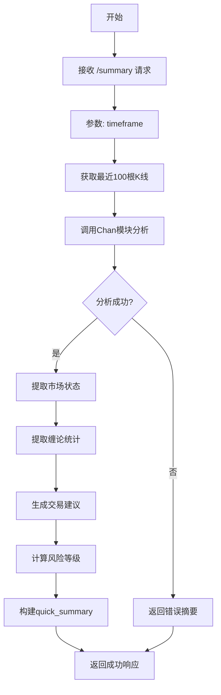

# 分析摘要端点 (/summary)

<cite>
**本文档引用的文件**   
- [chan_analysis.py](file://app/api/v1/endpoints/chan_analysis.py)
- [chan_adapter.py](file://app/services/chan_adapter.py)
- [kline_simple.py](file://app/api/v1/endpoints/kline_simple.py)
- [exceptions.py](file://app/core/exceptions.py)
</cite>

## 目录
1. [简介](#简介)
2. [端点详情](#端点详情)
3. [请求参数](#请求参数)
4. [响应数据结构](#响应数据结构)
5. [设计与实现原理](#设计与实现原理)
6. [使用示例](#使用示例)
7. [集成应用](#集成应用)

## 简介

`/summary` 端点是缠论分析系统中的一个轻量级API接口，专为需要快速获取市场概览的用户设计。该端点通过HTTP GET方法暴露在 `/api/v1/chan/summary` 路径下，旨在提供一个比完整分析端点 `/analyze` 更快速、更简洁的市场状态摘要。它特别适用于监控面板、交易机器人或任何需要低延迟市场洞察的场景。

**Section sources**
- [chan_analysis.py](file://app/api/v1/endpoints/chan_analysis.py#L260-L359)

## 端点详情

`/summary` 端点的核心功能是提供一个简化的市场分析摘要。与需要处理200根K线并返回详尽数据的 `/analyze` 端点不同，`/summary` 仅使用最近的100根K线进行快速分析。这种设计显著降低了计算复杂度，从而实现了更快的响应速度，使其成为实时监控和快速决策的理想选择。

该端点返回一个结构化的JSON对象，包含三个主要部分：市场状态、缠论分析统计和交易建议。这种聚合视图让用户无需解析大量原始数据即可立即掌握市场动态。

**Section sources**
- [chan_analysis.py](file://app/api/v1/endpoints/chan_analysis.py#L260-L299)

## 请求参数

| 参数名 | 类型 | 必需 | 默认值 | 描述 |
| :--- | :--- | :--- | :--- | :--- |
| `timeframe` | 字符串 | 否 | `"1h"` | 指定要分析的时间周期。支持的值包括 `"1m"`, `"5m"`, `"15m"`, `"30m"`, `"1h"`, `"4h"`, `"1d"`。 |

**Section sources**
- [chan_analysis.py](file://app/api/v1/endpoints/chan_analysis.py#L260-L299)

## 响应数据结构

`/summary` 端点返回一个包含 `quick_summary` 对象的标准化成功响应。该对象的JSON Schema如下所示：

```json
{
  "success": true,
  "code": 0,
  "message": "success",
  "data": {
    "market_status": {
      "current_price": 65000.0,
      "trend_direction": "up",
      "trend_strength": 0.85,
      "trend_description": "📈 上涨趋势"
    },
    "chan_analysis": {
      "fenxings_count": 7,
      "bis_count": 5,
      "analysis_quality": "good",
      "data_source": "chan_module"
    },
    "trading_suggestion": {
      "suggestion": "趋势向上，可考虑逢低建仓，注意风险控制",
      "confidence": "high",
      "risk_level": "low"
    },
    "metadata": {
      "timeframe": "1h",
      "last_update": 1700000000000,
      "data_points": 100,
      "chan_module_available": true
    }
  }
}
```

### 字段说明

- **`market_status`**: 市场当前状态。
  - `current_price`: 最新收盘价。
  - `trend_direction`: 趋势方向 (`up`, `down`, `neutral`)。
  - `trend_strength`: 趋势强度，范围为0到1。
  - `trend_description`: 趋势的直观描述，包含表情符号。

- **`chan_analysis`**: 缠论分析的统计摘要。
  - `fenxings_count`: 识别出的分型总数。
  - `bis_count`: 构建出的笔的总数。
  - `analysis_quality`: 分析质量评估 (`good`, `limited`, `unknown`)。
  - `data_source`: 数据来源。

- **`trading_suggestion`**: 交易建议。
  - `suggestion`: 基于趋势和质量的操作建议。
  - `confidence`: 建议的置信度 (`high`, `low`)。
  - `risk_level`: 计算得出的风险等级 (`low`, `medium`, `high`)。

- **`metadata`**: 元数据。
  - `timeframe`: 分析所用的时间周期。
  - `last_update`: 最后一根K线的结束时间戳。
  - `data_points`: 分析的K线数量。
  - `chan_module_available`: 缠论模块是否可用。

**Section sources**
- [chan_analysis.py](file://app/api/v1/endpoints/chan_analysis.py#L296-L324)

## 设计与实现原理

`/summary` 端点的设计哲学是“速度优先”。其内部工作流程如下：

1.  **数据获取**: 通过 `kline_aggregator` 服务从数据库中获取指定 `timeframe` 的最近100根K线。
2.  **快速分析**: 将获取的K线数据传递给 `chan_adapter`，由其调用底层的 `chan.py` 模块进行缠论分析。
3.  **摘要构建**: 从完整的分析结果中提取关键信息，构建 `quick_summary` 对象。
4.  **风险等级计算**: 这是该端点的一个关键特性。风险等级并非直接返回，而是根据两个核心指标动态计算：
    - **趋势强度 (trend strength)**: 来自分析结果的 `trend.strength` 字段。
    - **分析质量 (analysis quality)**: 来自分析结果的 `analysis_summary.analysis_quality` 字段。



**Diagram sources**
- [chan_analysis.py](file://app/api/v1/endpoints/chan_analysis.py#L260-L359)
- [chan_adapter.py](file://app/services/chan_adapter.py#L113-L147)

**Section sources**
- [chan_analysis.py](file://app/api/v1/endpoints/chan_analysis.py#L323-L359)
- [chan_adapter.py](file://app/services/chan_adapter.py#L205-L239)

## 使用示例

### 使用curl命令行

```bash
# 获取1小时周期的市场摘要
curl "http://localhost:8000/api/v1/chan/summary?timeframe=1h"

# 获取5分钟周期的市场摘要
curl "http://localhost:8000/api/v1/chan/summary?timeframe=5m"
```

### Python代码解析响应

```python
import requests

def get_market_summary(timeframe="1h"):
    url = f"http://localhost:8000/api/v1/chan/summary"
    params = {"timeframe": timeframe}
    
    try:
        response = requests.get(url, params=params)
        response.raise_for_status()  # 抛出HTTP错误
        
        data = response.json()
        
        if data["success"]:
            summary = data["data"]
            
            print(f"📊 市场摘要 ({summary['metadata']['timeframe']})")
            print(f"💰 当前价格: {summary['market_status']['current_price']}")
            print(f"📈 趋势: {summary['market_status']['trend_description']}")
            print(f"💡 建议: {summary['trading_suggestion']['suggestion']}")
            print(f"⚠️ 风险等级: {summary['trading_suggestion']['risk_level']}")
            
            return summary
        else:
            print(f"❌ 请求失败: {data['message']}")
            
    except requests.exceptions.RequestException as e:
        print(f"网络错误: {e}")
    except Exception as e:
        print(f"解析错误: {e}")

# 调用函数
get_market_summary("1h")
```

**Section sources**
- [chan_analysis.py](file://app/api/v1/endpoints/chan_analysis.py#L260-L359)

## 集成应用

`/summary` 端点非常适合集成到各种自动化系统中：

- **监控面板**: 在仪表板上实时显示市场趋势和风险等级，帮助交易员快速决策。
- **交易机器人**: 作为机器人的第一道过滤器。机器人可以定期调用此端点，只有当 `risk_level` 为 `"low"` 且 `suggestion` 为买入时，才触发更复杂的分析或执行交易。
- **警报系统**: 当 `trend_direction` 从 `"neutral"` 变为 `"up"` 或 `"down"` 时，发送通知。

其轻量级的特性确保了即使在高频率调用下，也不会对系统造成过大的负担。

**Section sources**
- [chan_analysis.py](file://app/api/v1/endpoints/chan_analysis.py#L260-L359)
- [kline_simple.py](file://app/api/v1/endpoints/kline_simple.py#L237-L259)