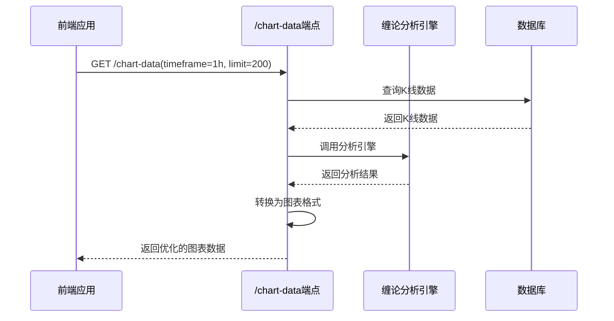

# 图表数据端点 (/chart-data)

<cite>
**本文档中引用的文件**  
- [chan_analysis.py](file://app/api/v1/endpoints/chan_analysis.py)
- [chan_adapter.py](file://app/services/chan_adapter.py)
- [api.js](file://frontend/src/lib/api.js)
</cite>

## 目录
1. [简介](#简介)
2. [端点详情](#端点详情)
3. [请求参数](#请求参数)
4. [响应结构](#响应结构)
5. [数据结构详解](#数据结构详解)
6. [前端集成示例](#前端集成示例)
7. [与分析端点的关系](#与分析端点的关系)
8. [错误处理](#错误处理)

## 简介
`/chart-data` 端点是系统中用于为前端图表提供优化数据的核心API。它将原始K线数据与缠论分析结果相结合，输出专为Lightweight Charts等前端图表库设计的结构化数据格式。该端点不仅提供标准的K线和成交量数据，还包含分型、笔、买卖点等缠论分析标记，使前端能够直接渲染复杂的交易分析图表。

## 端点详情
- **HTTP方法**: `GET`
- **完整URL路径**: `/api/v1/chan/chart-data`
- **功能描述**: 获取专为前端图表优化的K线数据和缠论分析结果
- **主要用途**: 为前端交易图表提供一站式数据源，避免多次API调用

**Section sources**
- [chan_analysis.py](file://app/api/v1/endpoints/chan_analysis.py#L130-L264)

## 请求参数
该端点接受以下查询参数：

| 参数名 | 类型 | 必需 | 默认值 | 描述 |
|--------|------|------|--------|------|
| `timeframe` | 字符串 | 否 | `"1h"` | 时间周期，支持 `1m`, `5m`, `15m`, `30m`, `1h`, `4h`, `1d` |
| `limit` | 整数 | 否 | `100` | 返回的数据量，范围为20-300 |
| `include_analysis` | 布尔值 | 否 | `true` | 是否包含缠论分析结果 |

**Section sources**
- [chan_analysis.py](file://app/api/v1/endpoints/chan_analysis.py#L130-L135)

## 响应结构
成功响应返回标准JSON格式，包含以下顶级字段：

```json
{
  "success": true,
  "data": {
    "chart_data": { /* K线和成交量数据 */ },
    "chart_markers": { /* 分析标记数据 */ },
    "analysis": { /* 完整分析结果 */ },
    "metadata": { /* 元数据信息 */ }
  }
}
```

## 数据结构详解
### chart_data 结构
包含为前端图表库优化的标准数据格式：

```json
{
  "klines": [[timestamp, open, high, low, close], ...],
  "volume": [[timestamp, volume], ...],
  "timestamps": [timestamp, ...]
}
```

- **klines**: 标准OHLC格式的K线数据数组
- **volume**: 成交量数据数组
- **timestamps**: 时间戳数组，用于图表X轴

### chart_markers 结构
包含所有可视化标记，专为前端渲染设计：

```json
{
  "fenxings": [
    {
      "timestamp": 1700000000000,
      "price": 50000.0,
      "type": "top",
      "strength": 0.8,
      "symbol": "🔺",
      "color": "#ef4444"
    }
  ],
  "bis_lines": [
    {
      "start": { "timestamp": 1700000000000, "price": 50000.0 },
      "end": { "timestamp": 1700003600000, "price": 52000.0 },
      "direction": "up",
      "color": "#22c55e",
      "width": 2
    }
  ],
  "buy_sell_points": [
    {
      "timestamp": 1700000000000,
      "price": 50000.0,
      "type": "买点1",
      "confidence": 0.9,
      "symbol": "B",
      "color": "#16a34a"
    }
  ]
}
```

- **fenxings**: 分型标记，使用不同符号和颜色区分顶分型(🔺)和底分型(🔻)
- **bis_lines**: 笔的连线数据，包含起点、终点、方向和样式
- **buy_sell_points**: 买卖点标记，包含置信度和交易信号

### analysis 结构
当 `include_analysis=true` 时包含完整的缠论分析结果：

```json
{
  "fenxings": [...],
  "bis": [...],
  "xianduan": [...],
  "buy_sell_points": [...],
  "trend": { "direction": "up", "strength": 0.7 },
  "analysis_summary": { ... }
}
```

**Section sources**
- [chan_analysis.py](file://app/api/v1/endpoints/chan_analysis.py#L170-L264)

## 前端集成示例
### curl 请求示例
```bash
# 获取包含分析结果的图表数据
curl "http://localhost:8000/api/v1/chan/chart-data?timeframe=1h&limit=200&include_analysis=true"

# 仅获取K线数据（不包含分析）
curl "http://localhost:8000/api/v1/chan/chart-data?timeframe=4h&limit=100&include_analysis=false"
```

### JavaScript fetch 代码片段
```javascript
// 使用前端API库
import { loadChartData } from './lib/api.js';

async function loadChart() {
  try {
    const response = await loadChartData('1h', 200, true);
    
    if (response.success) {
      // 渲染K线数据
      chart.setData(response.data.chart_data.klines);
      
      // 添加成交量
      volumeSeries.setData(response.data.chart_data.volume);
      
      // 添加分型标记
      response.data.chart_markers.fenxings.forEach(marker => {
        addShape({
          type: 'symbol',
          time: marker.timestamp,
          price: marker.price,
          symbol: marker.symbol,
          color: marker.color
        });
      });
      
      // 添加笔的连线
      response.data.chart_markers.bis_lines.forEach(line => {
        addLine({
          start: line.start,
          end: line.end,
          color: line.color,
          width: line.width
        });
      });
    }
  } catch (error) {
    console.error('加载图表数据失败:', error);
  }
}
```

**Section sources**
- [api.js](file://frontend/src/lib/api.js#L174-L181)

## 与分析端点的关系
`/chart-data` 端点与 `/chan/analyze` 端点有密切关系：

- **内部调用**: `/chart-data` 在内部调用 `chan_adapter.analyze_klines()` 方法，与 `/chan/analyze` 使用相同的分析引擎
- **格式差异**: `/chan/analyze` 返回原始分析结果，而 `/chart-data` 将结果转换为前端图表库可直接消费的格式
- **性能优化**: `/chart-data` 对数据进行了预处理和格式化，减少了前端的计算负担
- **功能子集**: `/chart-data` 包含 `/chan/analyze` 的核心分析功能，但输出格式专为可视化设计



**Diagram sources**
- [chan_analysis.py](file://app/api/v1/endpoints/chan_analysis.py#L130-L264)
- [chan_adapter.py](file://app/services/chan_adapter.py#L50-L100)

## 错误处理
该端点可能返回以下错误：

| HTTP状态码 | 错误详情 | 建议操作 |
|------------|----------|----------|
| 404 | "没有找到K线数据" | 调用 `/api/v1/simple/fetch-data` 获取数据 |
| 500 | "获取图表数据失败" | 检查服务器日志和Chan模块状态 |
| 500 | "分析服务暂时不可用" | 检查Chan模块集成和依赖 |

当Chan模块不可用时，端点会自动降级，返回K线数据但不包含分析结果。

**Section sources**
- [chan_analysis.py](file://app/api/v1/endpoints/chan_analysis.py#L260-L264)