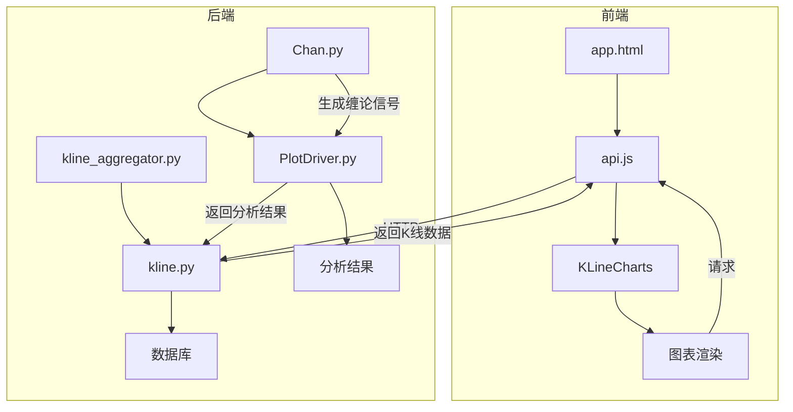
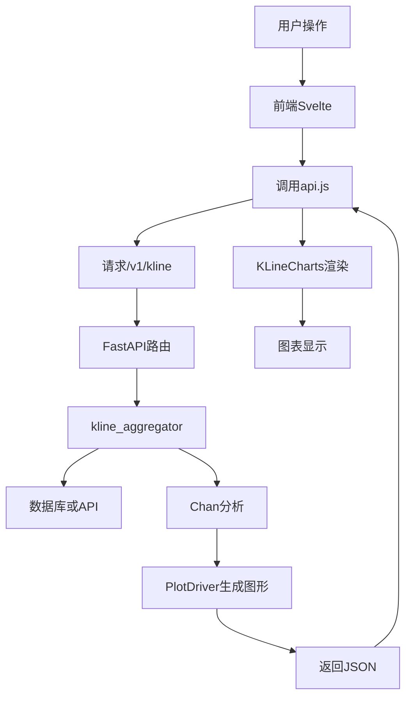
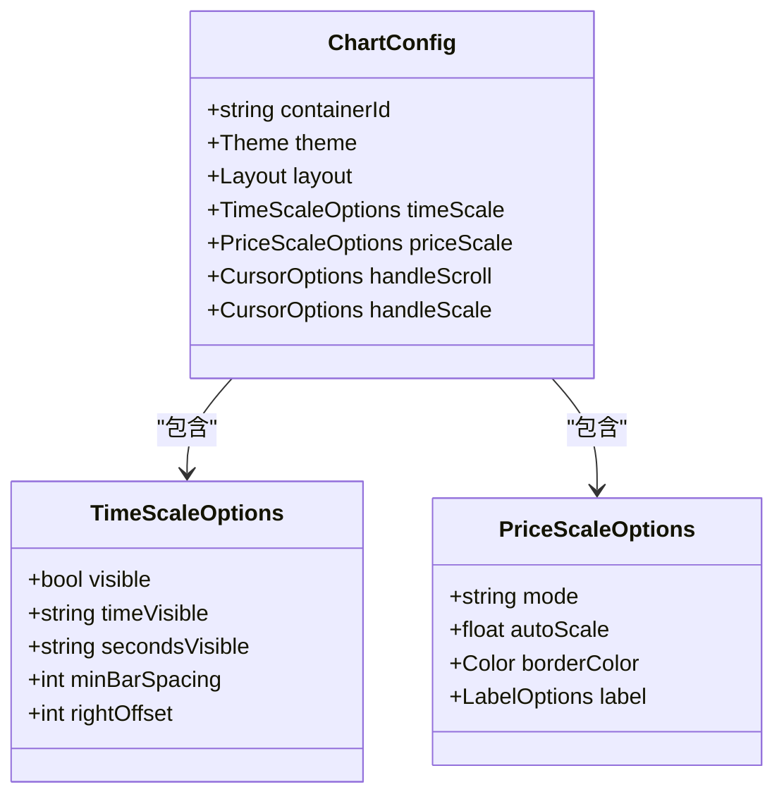
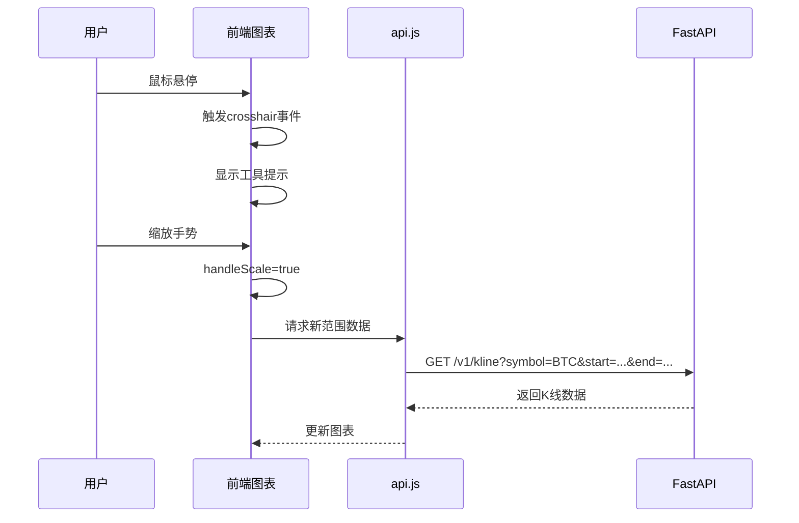
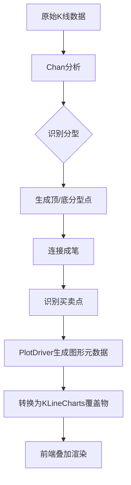
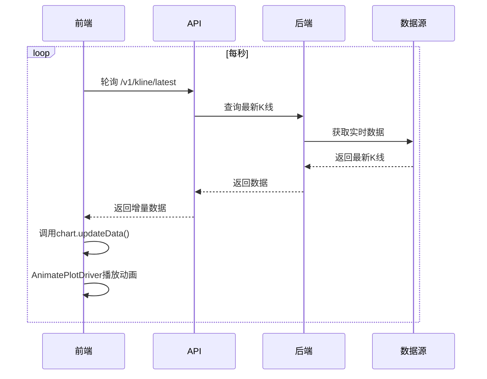
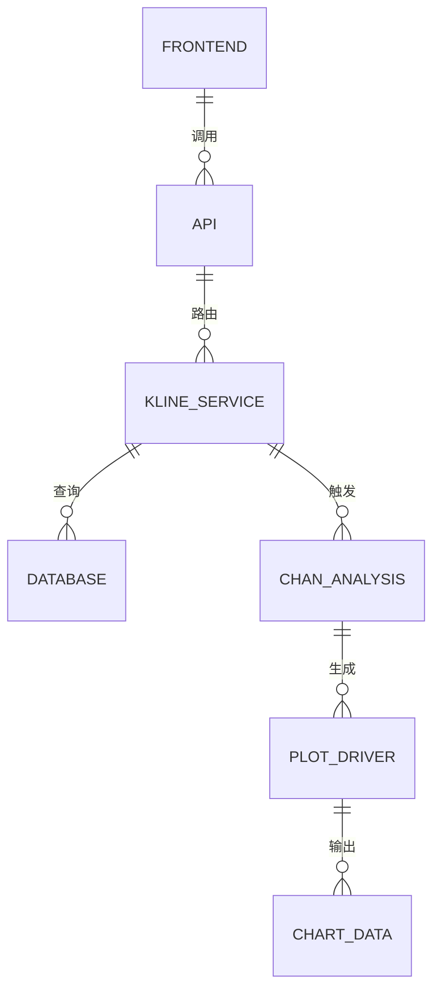

# 交易图表集成

<cite>
**本文档引用文件**  
- [frontend/src/lib/api.js](file://frontend/src/lib/api.js)
- [frontend/src/app.html](file://frontend/src/app.html)
- [frontend/src/app.css](file://frontend/src/app.css)
- [app/api/v1/endpoints/kline.py](file://app/api/v1/endpoints/kline.py)
- [app/api/v1/endpoints/chan_analysis.py](file://app/api/v1/endpoints/chan_analysis.py)
- [app/services/kline_aggregator.py](file://app/services/kline_aggregator.py)
- [chan.py/Plot/PlotDriver.py](file://chan.py/Plot/PlotDriver.py)
- [chan.py/Plot/AnimatePlotDriver.py](file://chan.py/Plot/AnimatePlotDriver.py)
- [chan.py/Chan.py](file://chan.py/Chan.py)
- [frontend/src/lib/stores.js](file://frontend/src/lib/stores.js)
- [frontend/vite.config.js](file://frontend/vite.config.js)
</cite>

## 目录
1. [简介](#简介)
2. [项目结构](#项目结构)
3. [核心组件](#核心组件)
4. [架构概览](#架构概览)
5. [详细组件分析](#详细组件分析)
6. [依赖关系分析](#依赖关系分析)
7. [性能优化策略](#性能优化策略)
8. [错误处理与降级方案](#错误处理与降级方案)
9. [结论](#结论)

## 简介
本文档深入解析基于 KLineCharts Pro 的专业级 K 线图表系统实现，涵盖图表初始化、时间轴配置、价格标尺定制、交互行为控制、缠论分析结果叠加、实时数据更新机制及性能优化策略。系统结合后端 Python 数据服务与前端 Svelte 可视化框架，实现高性能、可扩展的交易图表集成方案。

## 项目结构
项目采用前后端分离架构，后端使用 FastAPI 提供 K 线数据与缠论分析接口，前端使用 Svelte 框架集成 KLineCharts 实现可视化。数据流从后端聚合服务经 API 暴露，由前端通过 WebSocket 或 HTTP 轮询获取并渲染。

**图示来源**  
- [frontend/src/app.html](file://frontend/src/app.html#L1-L50)
- [app/services/kline_aggregator.py](file://app/services/kline_aggregator.py#L10-L40)
- [chan.py/Plot/PlotDriver.py](file://chan.py/Plot/PlotDriver.py#L5-L30)

**本节来源**  
- [frontend/src/app.html](file://frontend/src/app.html#L1-L100)
- [app/services/kline_aggregator.py](file://app/services/kline_aggregator.py#L1-L100)

## 核心组件
系统核心包括：K 线数据聚合服务、缠论分析引擎、图表驱动器、前端可视化模块。K 线服务从数据库或交易所 API 获取原始数据并聚合为指定周期；缠论引擎执行分型、笔、段识别；图表驱动器生成可视化元数据；前端完成最终渲染与交互。

**本节来源**  
- [app/services/kline_aggregator.py](file://app/services/kline_aggregator.py#L15-L80)
- [chan.py/Chan.py](file://chan.py/Chan.py#L20-L100)
- [chan.py/Plot/PlotDriver.py](file://chan.py/Plot/PlotDriver.py#L10-L50)

## 架构概览
系统采用分层架构，从前端交互到后端计算形成闭环。前端通过 API 获取 K 线与缠论数据，使用 Lightweight Charts 初始化图表，配置时间轴与价格标尺，并注册交互事件。后端通过 `kline_aggregator` 统一调度数据源，`Chan` 模块执行技术分析，`PlotDriver` 生成图形元数据。

**图示来源**  
- [app/api/v1/endpoints/kline.py](file://app/api/v1/endpoints/kline.py#L5-L30)
- [frontend/src/lib/api.js](file://frontend/src/lib/api.js#L10-L40)
- [chan.py/Plot/PlotDriver.py](file://chan.py/Plot/PlotDriver.py#L1-L20)

## 详细组件分析

### 图表初始化与配置
前端在 `app.html` 中初始化 KLineCharts 实例，设置容器尺寸、主题、布局颜色等基础属性。通过 `api.js` 获取初始 K 线数据后，调用 `applyNewData` 方法填充序列。时间轴配置支持自定义时间格式与缩放粒度。

**本节来源**  
- [frontend/src/app.html](file://frontend/src/app.html#L30-L80)
- [frontend/src/lib/api.js](file://frontend/src/lib/api.js#L15-L50)

### 时间轴与价格标尺定制
时间轴通过 `timeScale` 配置项控制，支持自动适应数据范围、锁定滚动、限制缩放级别。价格标尺通过 `priceScale` 设置模式（普通、对数）、边界、颜色与标签格式。系统支持多价格标尺用于叠加指标。

**图示来源**  
- [frontend/src/app.html](file://frontend/src/app.html#L60-L100)
- [frontend/src/app.css](file://frontend/src/app.css#L5-L20)

**本节来源**  
- [frontend/src/app.html](file://frontend/src/app.html#L50-L120)

### 交互行为实现
系统启用十字光标、缩放、平移等交互功能。通过 `handleScroll` 和 `handleScale` 控制用户手势行为，`crosshair` 模块实现坐标联动显示。鼠标悬停时显示 K 线详情与缠论信号。

**图示来源**  
- [frontend/src/lib/api.js](file://frontend/src/lib/api.js#L40-L70)
- [app/api/v1/endpoints/kline.py](file://app/api/v1/endpoints/kline.py#L20-L50)

**本节来源**  
- [frontend/src/lib/api.js](file://frontend/src/lib/api.js#L30-L90)

### 缠论分析结果叠加
缠论模块（`Chan.py`）执行分型、笔、买卖点识别，`PlotDriver.py` 将分析结果转换为 KLineCharts 支持的覆盖物对象（如 `Overlay`、`Annotation`、`Indicator`）。前端通过覆盖物系统叠加显示。

**图示来源**  
- [chan.py/Chan.py](file://chan.py/Chan.py#L50-L120)
- [chan.py/Plot/PlotDriver.py](file://chan.py/Plot/PlotDriver.py#L20-L60)

**本节来源**  
- [chan.py/Plot/PlotDriver.py](file://chan.py/Plot/PlotDriver.py#L1-L80)
- [app/api/v1/endpoints/chan_analysis.py](file://app/api/v1/endpoints/chan_analysis.py#L5-L30)

### 实时数据更新与动画
前端通过 WebSocket 或定时轮询获取增量 K 线数据，调用 `updateData` 方法追加最新数据点。`AnimatePlotDriver` 实现图形动画过渡，如买卖点淡入、笔线渐显，提升视觉体验。

**图示来源**  
- [chan.py/Plot/AnimatePlotDriver.py](file://chan.py/Plot/AnimatePlotDriver.py#L1-L40)
- [frontend/src/lib/api.js](file://frontend/src/lib/api.js#L60-L90)

**本节来源**  
- [chan.py/Plot/AnimatePlotDriver.py](file://chan.py/Plot/AnimatePlotDriver.py#L1-L50)
- [frontend/src/lib/stores.js](file://frontend/src/lib/stores.js#L10-L40)

## 依赖关系分析
系统依赖关系清晰，前端依赖 KLineCharts 库与后端 API；后端依赖数据库、交易所 API 及缠论分析模块。通过 `requirements.txt` 和 `package.json` 管理依赖版本。

**图示来源**  
- [frontend/package.json](file://frontend/package.json#L1-L20)
- [requirements.txt](file://requirements.txt#L1-L15)
- [app/api/v1/endpoints/kline.py](file://app/api/v1/endpoints/kline.py#L1-L10)

**本节来源**  
- [requirements.txt](file://requirements.txt#L1-L20)
- [frontend/package.json](file://frontend/package.json#L1-L30)

## 性能优化策略
针对大数据量场景，系统采用多项优化措施：后端分页返回 K 线数据，前端虚拟滚动；使用 `applyNewData` 而非多次 `updateData` 减少重绘；`AnimatePlotDriver` 控制动画帧率避免卡顿；缓存缠论分析结果减少重复计算。

**本节来源**  
- [performance_optimization.md](file://frontend/performance_optimization.md#L1-L50)
- [chan.py/Common/cache.py](file://chan.py/Common/cache.py#L5-L30)
- [frontend/src/lib/stores.js](file://frontend/src/lib/stores.js#L20-L60)

## 错误处理与降级方案
系统具备完善的错误处理机制：前端捕获 API 异常并提示用户，图表降级为静态显示；后端使用 `ChanException` 统一异常处理，避免分析崩溃；数据缺失时使用缓存或默认值填充。

**本节来源**  
- [app/core/exceptions.py](file://app/core/exceptions.py#L1-L20)
- [chan.py/Common/ChanException.py](file://chan.py/Common/ChanException.py#L1-L15)
- [frontend/src/lib/api.js](file://frontend/src/lib/api.js#L80-L100)

## 结论
本系统实现了专业级交易图表集成，结合 KLineCharts 的高性能渲染与缠论分析的深度逻辑，支持丰富的交互与可视化功能。通过合理的架构设计与性能优化，确保在大数据量与实时场景下的稳定运行。