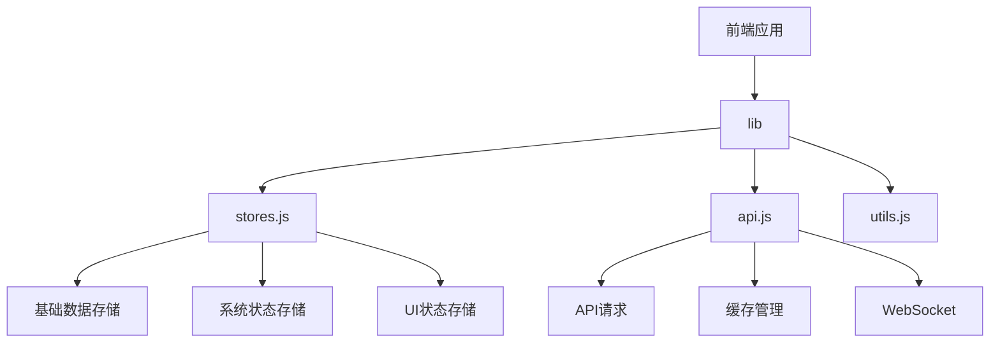
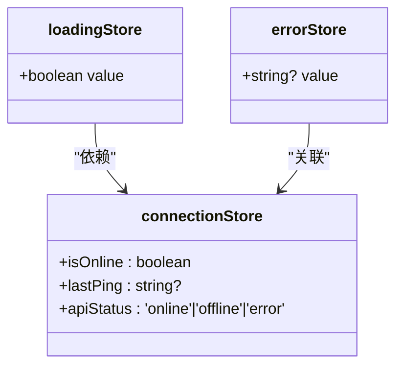
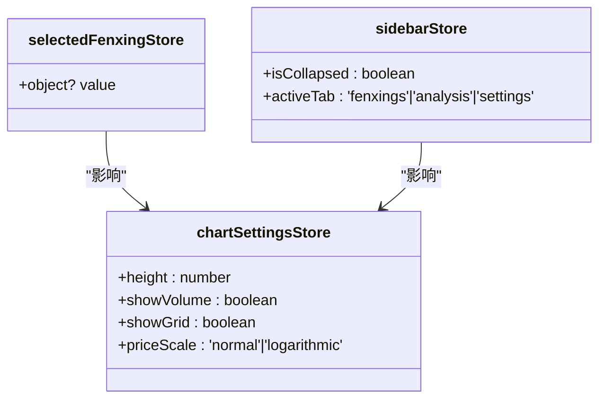
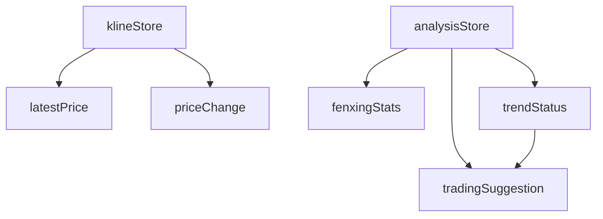
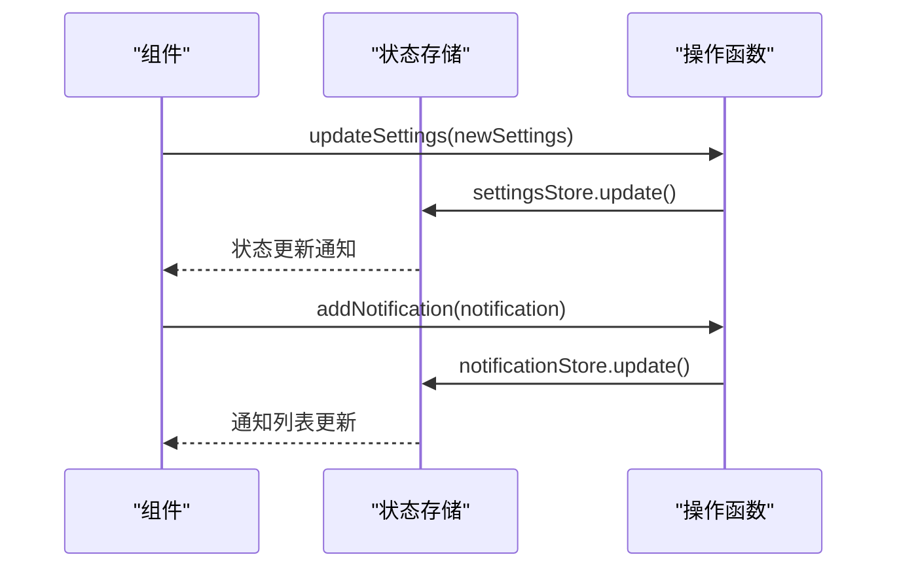
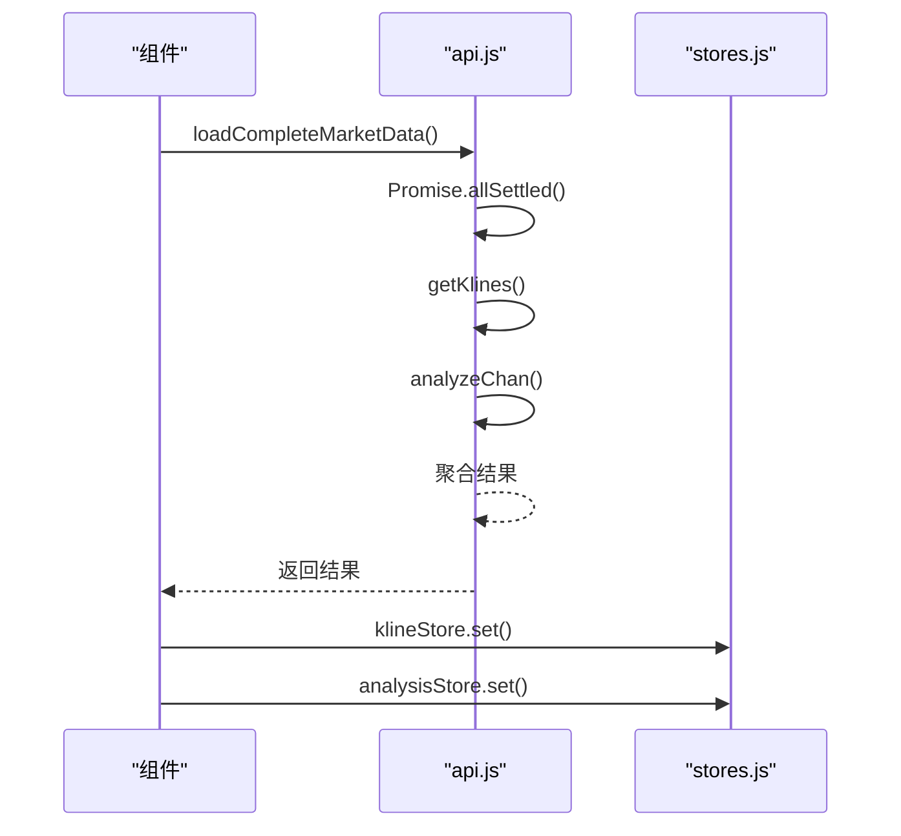

# 前端状态管理

<cite>
**本文档引用的文件**  
- [stores.js](file://frontend/src/lib/stores.js)
- [api.js](file://frontend/src/lib/api.js)
- [svelte.config.js](file://frontend/svelte.config.js)
</cite>

## 目录
1. [简介](#简介)
2. [项目结构](#项目结构)
3. [核心状态存储](#核心状态存储)
4. [系统与UI状态管理](#系统与ui状态管理)
5. [衍生状态与响应式数据流](#衍生状态与响应式数据流)
6. [状态操作与工具函数](#状态操作与工具函数)
7. [状态持久化机制](#状态持久化机制)
8. [数据验证与格式化](#数据验证与格式化)
9. [状态管理与API集成](#状态管理与api集成)
10. [调试与性能优化建议](#调试与性能优化建议)
11. [总结](#总结)

## 简介
本文档深入解析基于Svelte Stores的全局状态管理机制，重点分析`stores.js`中定义的可读写存储（writable stores）如何管理用户界面状态、图表配置和实时分析数据。文档详细说明自定义store的实现方式、状态更新逻辑、订阅机制以及与其他模块的集成策略，为开发者提供完整的状态管理实践指南。

## 项目结构
前端状态管理主要集中在`frontend/src/lib/`目录下，核心文件包括`stores.js`和`api.js`。通过Svelte的模块别名配置，这些状态存储可在整个应用中通过`$stores`统一导入使用。



**Diagram sources**  
- [stores.js](file://frontend/src/lib/stores.js#L1-L50)
- [api.js](file://frontend/src/lib/api.js#L1-L50)
- [svelte.config.js](file://frontend/svelte.config.js#L25-L30)

**Section sources**  
- [stores.js](file://frontend/src/lib/stores.js#L1-L50)
- [svelte.config.js](file://frontend/svelte.config.js#L25-L30)

## 核心状态存储
系统定义了三大核心可写存储，分别管理基础数据、系统状态和用户界面状态。

### K线数据存储
`klineStore`用于存储从后端获取的K线数据，初始值为空数组，通过API调用动态填充。

**Section sources**  
- [stores.js](file://frontend/src/lib/stores.js#L10-L13)

### 缠论分析结果存储
`analysisStore`保存缠论分析的核心结果，包括分型、笔、线段、买卖点等关键信息，结构化设计便于组件消费。

**Section sources**  
- [stores.js](file://frontend/src/lib/stores.js#L16-L27)

### 用户设置存储
`settingsStore`维护用户偏好设置，如时间周期、数据显示开关、图表主题等，支持动态更新。

**Section sources**  
- [stores.js](file://frontend/src/lib/stores.js#L30-L44)

## 系统与UI状态管理
### 系统状态存储
系统状态存储包括加载状态、错误状态和网络连接状态，为用户提供实时反馈。



**Diagram sources**  
- [stores.js](file://frontend/src/lib/stores.js#L48-L66)

**Section sources**  
- [stores.js](file://frontend/src/lib/stores.js#L48-L66)

### UI状态存储
UI状态存储管理用户界面的交互状态，包括选中分型、图表设置和侧边栏状态。



**Diagram sources**  
- [stores.js](file://frontend/src/lib/stores.js#L69-L94)

**Section sources**  
- [stores.js](file://frontend/src/lib/stores.js#L69-L94)

## 衍生状态与响应式数据流
### 响应式衍生状态
通过Svelte的`derived`函数创建响应式衍生状态，自动响应基础状态变化。



**Diagram sources**  
- [stores.js](file://frontend/src/lib/stores.js#L97-L228)

**Section sources**  
- [stores.js](file://frontend/src/lib/stores.js#L97-L228)

### 趋势状态衍生
`trendStatus`根据分析结果中的趋势方向和强度生成可读性强的状态描述，包含颜色和图标信息。

**Section sources**  
- [stores.js](file://frontend/src/lib/stores.js#L164-L197)

### 交易建议衍生
`tradingSuggestion`结合分析结果和趋势状态生成交易建议，实现智能决策支持。

**Section sources**  
- [stores.js](file://frontend/src/lib/stores.js#L199-L228)

## 状态操作与工具函数
### 存储操作函数
提供一系列工具函数用于安全地更新和操作状态存储。



**Diagram sources**  
- [stores.js](file://frontend/src/lib/stores.js#L231-L270)

**Section sources**  
- [stores.js](file://frontend/src/lib/stores.js#L231-L270)

### 数据重置功能
`resetAllData`函数提供一键重置所有相关状态的功能，确保状态一致性。

**Section sources**  
- [stores.js](file://frontend/src/lib/stores.js#L256-L268)

## 状态持久化机制
### 本地存储同步
通过`localStorage`实现关键设置的持久化存储，确保用户偏好在页面刷新后保留。

```mermaid
flowchart LR
A[页面加载] --> B{localStorage存在?}
B --> |是| C[loadSettingsFromStorage]
B --> |否| D[使用默认设置]
C --> E[settingsStore.set()]
D --> E
E --> F[应用设置]
G[设置变更] --> H[settingsStore.subscribe]
H --> I[saveSettingsToStorage]
I --> J[localStorage.setItem]
```

**Diagram sources**  
- [stores.js](file://frontend/src/lib/stores.js#L273-L310)

**Section sources**  
- [stores.js](file://frontend/src/lib/stores.js#L273-L310)

### 持久化范围
当前持久化策略覆盖用户设置和图表设置，确保用户体验的一致性。

**Section sources**  
- [stores.js](file://frontend/src/lib/stores.js#L273-L310)

## 数据验证与格式化
### 数据验证函数
提供`validateKlineData`和`validateAnalysisData`函数确保状态数据的完整性和正确性。

**Section sources**  
- [stores.js](file://frontend/src/lib/stores.js#L313-L341)

### 格式化工具函数
包含价格、百分比、成交量和时间的格式化函数，统一数据展示标准。

**Section sources**  
- [stores.js](file://frontend/src/lib/stores.js#L344-L395)

## 状态管理与API集成
### API请求与状态更新
`api.js`中的API函数与状态存储协同工作，实现数据获取和状态更新的无缝衔接。



**Diagram sources**  
- [api.js](file://frontend/src/lib/api.js#L350-L400)
- [stores.js](file://frontend/src/lib/stores.js#L10-L27)

**Section sources**  
- [api.js](file://frontend/src/lib/api.js#L350-L400)

### 缓存管理
`api.js`实现基于Map的内存缓存机制，减少重复请求，提升性能。

**Section sources**  
- [api.js](file://frontend/src/lib/api.js#L250-L270)

### WebSocket集成
`wsManager`提供WebSocket连接管理，支持实时数据推送和状态更新。

**Section sources**  
- [api.js](file://frontend/src/lib/api.js#L403-L480)

## 调试与性能优化建议
### 避免不必要的重渲染
- 使用`derived`存储计算衍生状态，避免在组件中重复计算
- 合理使用`subscribe`，及时取消订阅防止内存泄漏
- 对大型数据集采用分页或虚拟滚动

### 内存泄漏预防
- 在组件销毁时取消store订阅
- 定期清理不再使用的缓存数据
- 避免在闭包中持有store的长期引用

### 调试技巧
- 利用Svelte DevTools监控store状态变化
- 在关键状态更新处添加日志输出
- 使用`console.log($store)`实时查看store值

**Section sources**  
- [stores.js](file://frontend/src/lib/stores.js#L1-L441)
- [api.js](file://frontend/src/lib/api.js#L1-L553)

## 总结
本文档全面解析了基于Svelte Stores的前端状态管理机制。系统通过可写存储和衍生存储的组合，实现了高效、响应式的全局状态管理。状态持久化、数据验证和API集成策略确保了应用的稳定性和用户体验。建议开发者遵循最佳实践，合理使用状态管理功能，构建高性能的交易分析系统。