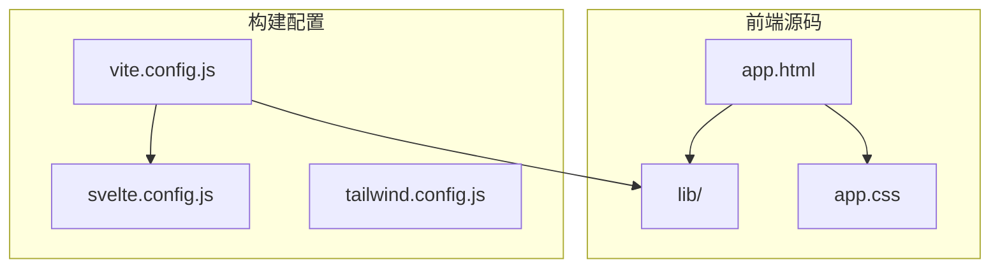
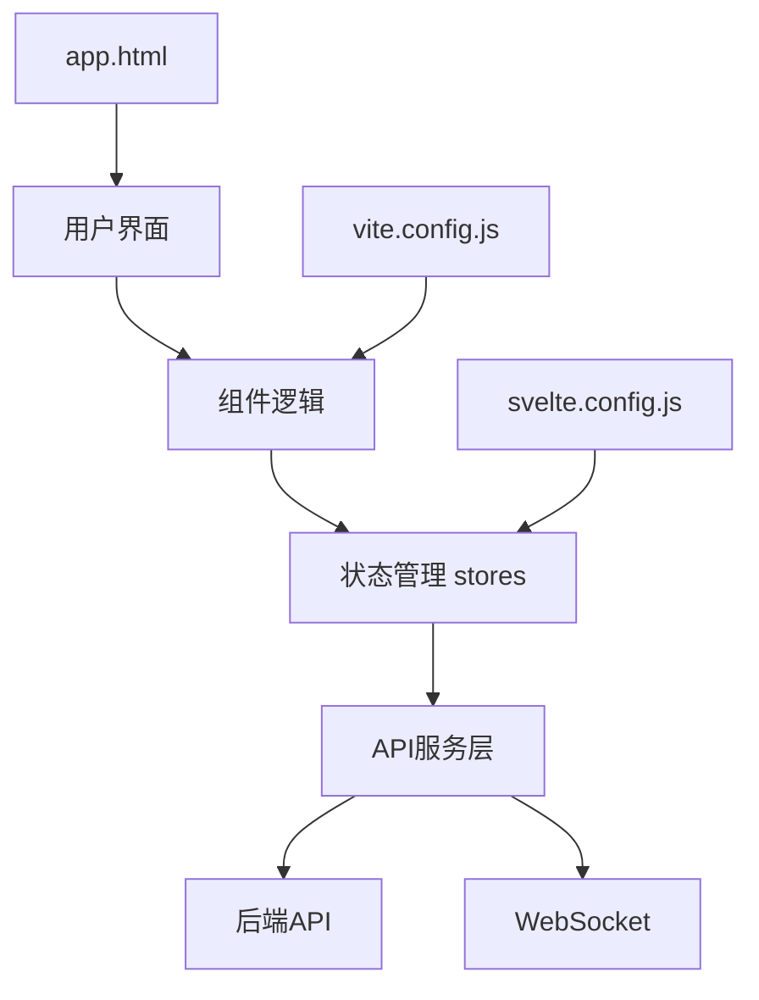
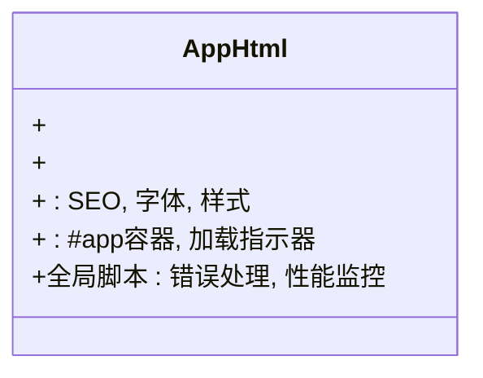
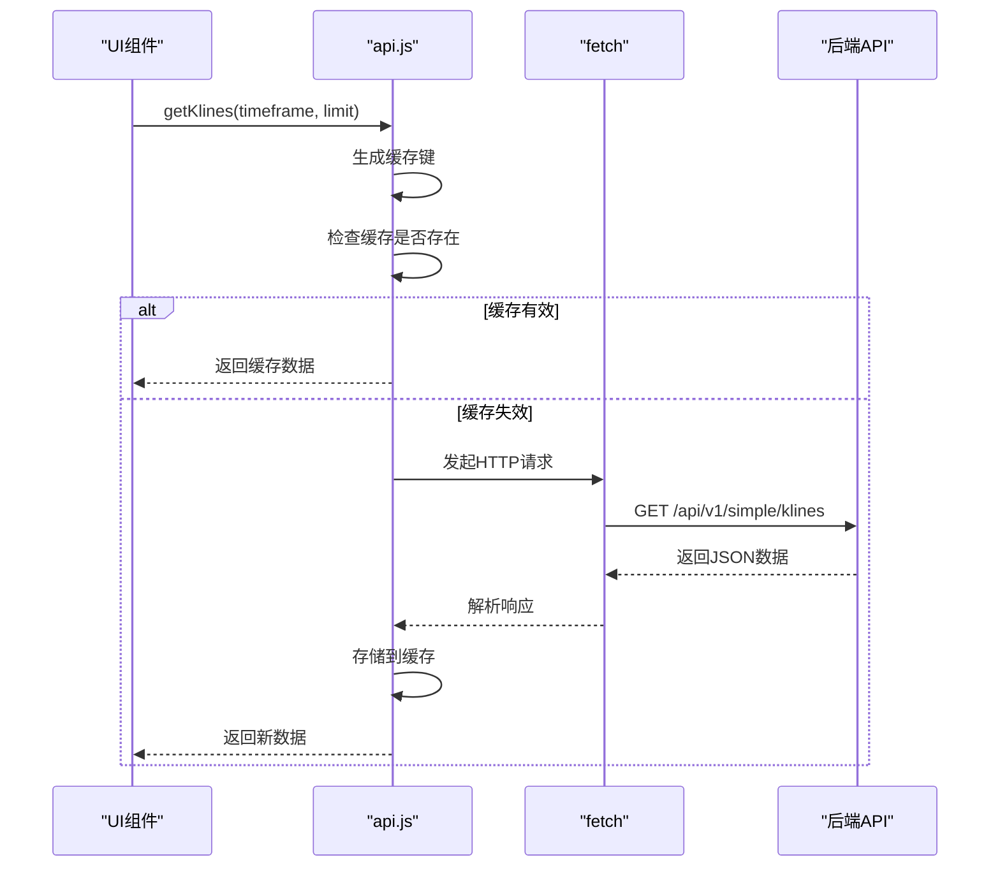
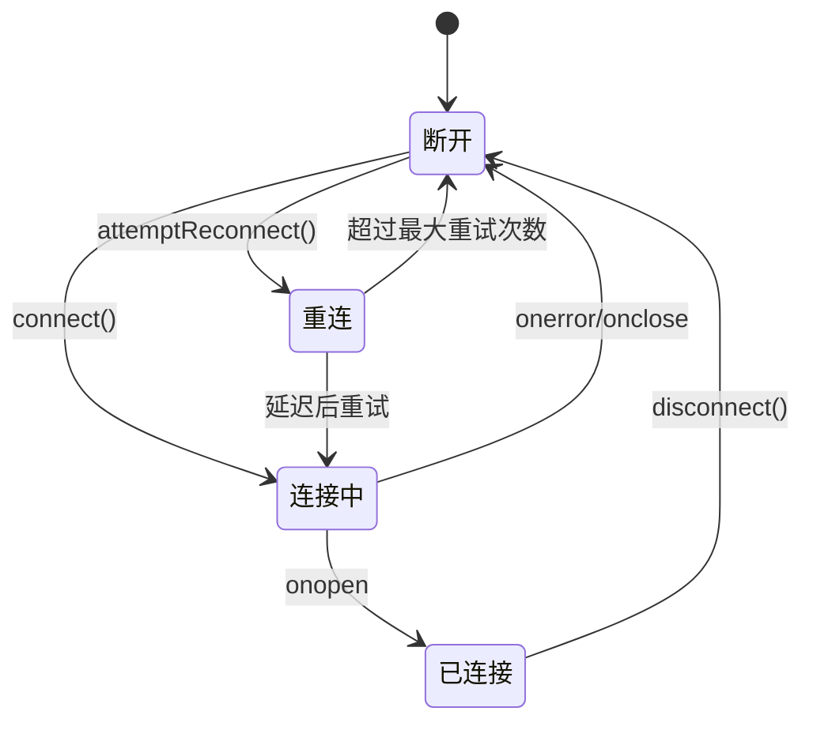
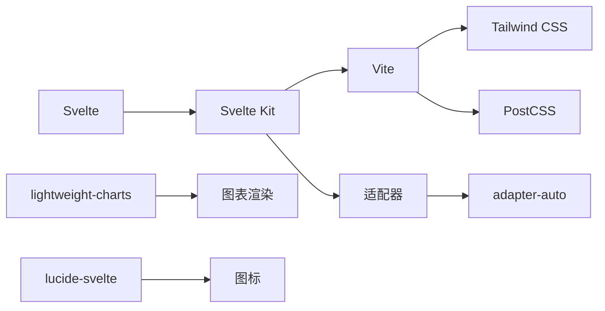

# 前端组件架构

<cite>
**本文档引用的文件**
- [app.html](file://frontend/src/app.html)
- [stores.js](file://frontend/src/lib/stores.js)
- [api.js](file://frontend/src/lib/api.js)
- [svelte.config.js](file://frontend/svelte.config.js)
- [vite.config.js](file://frontend/vite.config.js)
</cite>

## 目录
1. [简介](#简介)
2. [项目结构](#项目结构)
3. [核心组件](#核心组件)
4. [架构概览](#架构概览)
5. [详细组件分析](#详细组件分析)
6. [依赖分析](#依赖分析)
7. [性能考量](#性能考量)
8. [故障排除指南](#故障排除指南)
9. [结论](#结论)

## 简介
本文档详细解析基于Svelte的前端组件化设计，涵盖`app.html`作为应用根组件的结构与作用，阐述各UI组件（如图表容器、侧边栏、状态面板）的组织方式。文档说明组件间通信机制、事件处理流程和响应式数据绑定模式，并提供组件开发规范与最佳实践，包括命名约定、样式隔离和可访问性支持。结合代码示例展示组件生命周期管理和动态加载策略。

## 项目结构
前端项目采用标准Svelte Kit结构，核心源码位于`frontend/src`目录。`app.html`作为应用的根HTML模板，`lib`目录包含共享逻辑如API调用和状态管理。构建和开发配置通过`vite.config.js`和`svelte.config.js`进行管理。



**Diagram sources**
- [app.html](file://frontend/src/app.html#L1-L252)
- [svelte.config.js](file://frontend/svelte.config.js#L1-L39)
- [vite.config.js](file://frontend/vite.config.js#L1-L94)

**Section sources**
- [app.html](file://frontend/src/app.html#L1-L252)
- [svelte.config.js](file://frontend/svelte.config.js#L1-L39)
- [vite.config.js](file://frontend/vite.config.js#L1-L94)

## 核心组件
系统核心组件包括全局状态管理（stores.js）、API通信层（api.js）和根组件（app.html）。`stores.js`使用Svelte的`writable`和`derived`创建响应式数据流，`api.js`封装HTTP请求与WebSocket连接，`app.html`提供SEO优化和性能预加载。

**Section sources**
- [stores.js](file://frontend/src/lib/stores.js#L1-L442)
- [api.js](file://frontend/src/lib/api.js#L1-L554)
- [app.html](file://frontend/src/app.html#L1-L252)

## 架构概览
系统采用分层架构，前端通过Svelte Kit构建，利用Vite实现快速开发。状态管理基于Svelte stores，API通信通过模块化封装，支持缓存和错误重试机制。WebSocket用于实时数据更新。



**Diagram sources**
- [stores.js](file://frontend/src/lib/stores.js#L1-L442)
- [api.js](file://frontend/src/lib/api.js#L1-L554)
- [app.html](file://frontend/src/app.html#L1-L252)

## 详细组件分析

### 根组件分析
`app.html`作为Svelte应用的入口点，定义了完整的HTML文档结构，包含SEO元标签、Open Graph信息、图标资源和性能优化预加载指令。其核心作用是为Svelte Kit应用提供渲染容器和全局样式。

#### 根组件结构


**Diagram sources**
- [app.html](file://frontend/src/app.html#L1-L252)

#### 状态管理分析
系统使用Svelte stores实现全局状态管理，包括K线数据、分析结果、用户设置和UI状态。

##### 状态存储结构
```mermaid
classDiagram
class klineStore {
+writable([]) : K线数据
}
class analysisStore {
+writable({}) : 分型、笔、线段等
}
class settingsStore {
+writable({}) : 用户偏好设置
}
class loadingStore {
+writable(false) : 加载状态
}
class derivedStores {
+latestPrice : 派生最新价格
+priceChange : 派生价格变化
+fenxingStats : 分型统计
+trendStatus : 趋势状态
+tradingSuggestion : 交易建议
}
klineStore --> derivedStores : 提供数据源
analysisStore --> derivedStores : 提供数据源
```

**Diagram sources**
- [stores.js](file://frontend/src/lib/stores.js#L1-L442)

#### API通信分析
API层封装了所有与后端的交互，提供统一的请求接口和错误处理机制。

##### API请求流程


**Diagram sources**
- [api.js](file://frontend/src/lib/api.js#L1-L554)

##### WebSocket连接管理


**Diagram sources**
- [api.js](file://frontend/src/lib/api.js#L1-L554)

**Section sources**
- [stores.js](file://frontend/src/lib/stores.js#L1-L442)
- [api.js](file://frontend/src/lib/api.js#L1-L554)

## 依赖分析
项目依赖通过`package.json`管理，构建工具链基于Vite和Svelte Kit。开发依赖包括Tailwind CSS、PostCSS和TypeScript支持。



**Diagram sources**
- [package.json](file://frontend/package.json)
- [vite.config.js](file://frontend/vite.config.js#L1-L94)
- [svelte.config.js](file://frontend/svelte.config.js#L1-L39)

**Section sources**
- [vite.config.js](file://frontend/vite.config.js#L1-L94)
- [svelte.config.js](file://frontend/svelte.config.js#L1-L39)

## 性能考量
系统在多个层面进行了性能优化：`app.html`中预加载关键资源，Vite配置中启用依赖预构建，API层实现多级缓存机制。代码分割策略将大型依赖（如图表库）单独打包，提升初始加载速度。

- **资源预加载**：在`app.html`中使用`link rel="preload"`提前加载字体和关键样式
- **依赖预构建**：在`vite.config.js`中配置`optimizeDeps`提升开发服务器启动速度
- **缓存策略**：API层实现基于时间的缓存，区分静态数据（30分钟）和实时数据（30秒）
- **代码分割**：Rollup配置手动分割大型依赖到独立chunk

## 故障排除指南
常见问题及解决方案：

1. **WebSocket连接失败**：检查后端WebSocket服务是否运行在`ws://localhost:8001/ws`
2. **API请求超时**：确认后端API服务运行在`http://localhost:8000`
3. **数据不更新**：检查`settingsStore`中的`autoRefresh`设置和`refreshInterval`
4. **样式丢失**：验证`fonts.css`路径是否正确，检查Vite构建输出

**Section sources**
- [api.js](file://frontend/src/lib/api.js#L1-L554)
- [stores.js](file://frontend/src/lib/stores.js#L1-L442)
- [app.html](file://frontend/src/app.html#L1-L252)

## 结论
本系统采用现代化的Svelte技术栈，通过清晰的组件分层和响应式状态管理实现了高效的前端架构。`app.html`作为根组件提供了完整的HTML语义和性能优化基础，stores和api模块实现了关注点分离。系统具备良好的可维护性和扩展性，为缠论分析功能提供了稳定可靠的技术支撑。