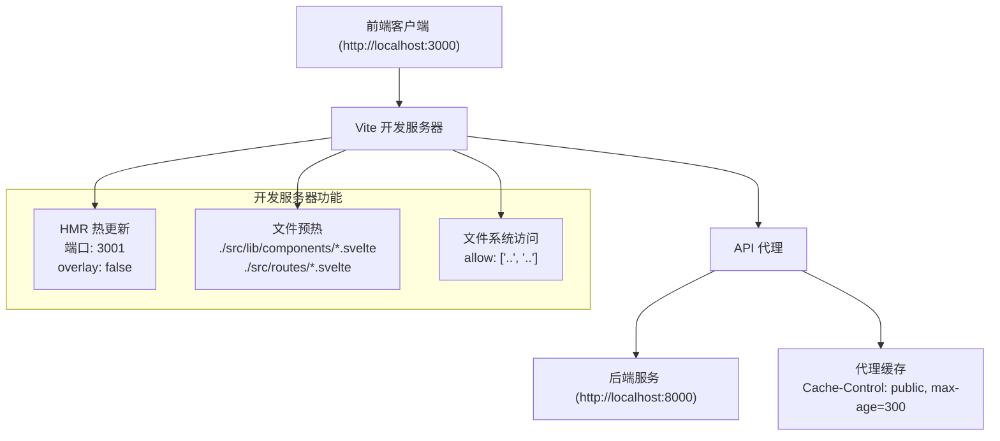
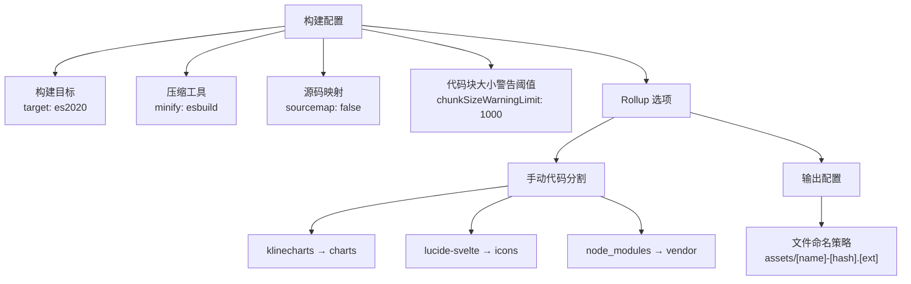
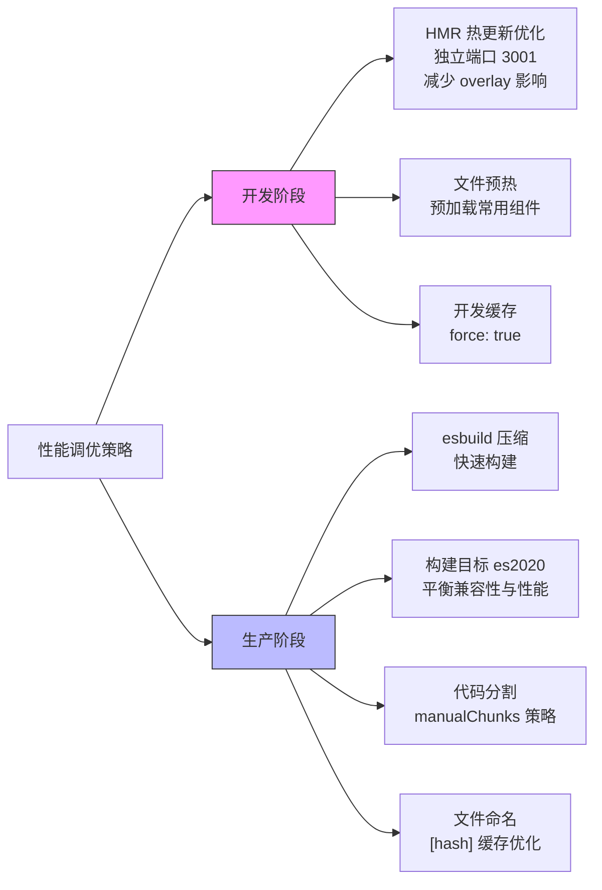
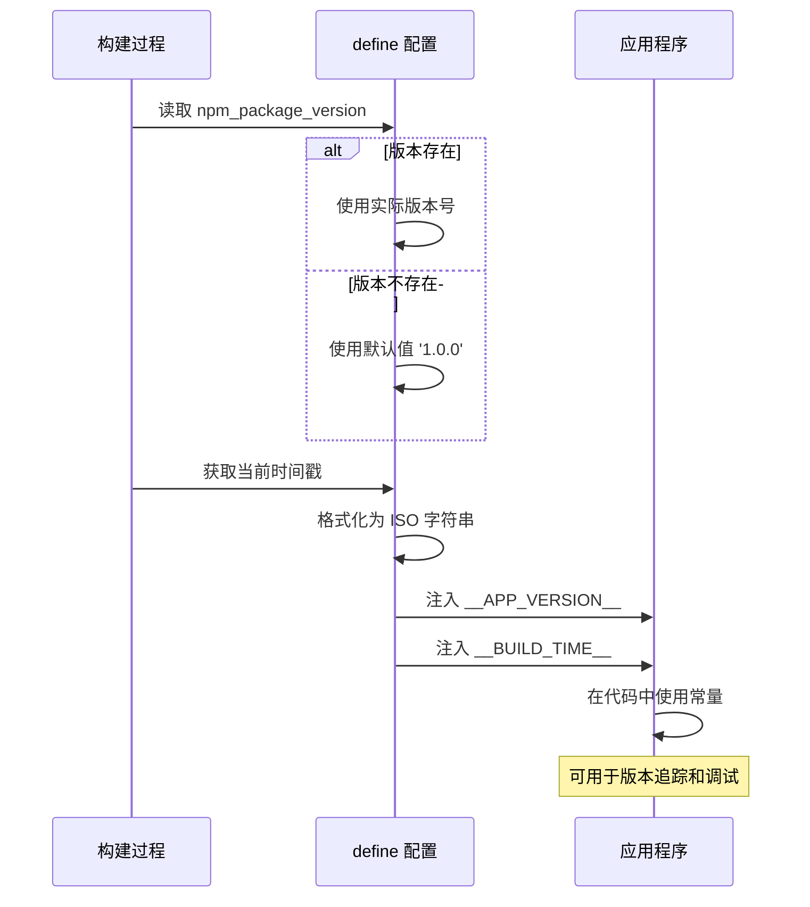
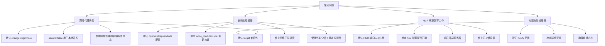

# Vite 配置详解

<cite>
**本文档引用的文件**   
- [vite.config.js](file://frontend/vite.config.js)
- [package.json](file://frontend/package.json)
- [api.js](file://frontend/src/lib/api.js)
- [performance_optimization.md](file://frontend/performance_optimization.md)
</cite>

## 目录
1. [开发服务器配置](#开发服务器配置)
2. [构建优化配置](#构建优化配置)
3. [依赖预构建配置](#依赖预构建配置)
4. [性能调优策略](#性能调优策略)
5. [环境变量注入机制](#环境变量注入机制)
6. [常见问题排查指南](#常见问题排查指南)

## 开发服务器配置

Vite 开发服务器配置旨在提升开发体验和性能，通过 HMR 热更新、代理设置和 API 请求转发机制实现高效的开发流程。



**图示来源**
- [vite.config.js](file://frontend/vite.config.js#L10-L45)

**本节来源**
- [vite.config.js](file://frontend/vite.config.js#L10-L45)
- [api.js](file://frontend/src/lib/api.js#L1-L10)

## 构建优化配置

构建优化配置通过代码分割策略、压缩工具选择和构建目标设置，提升生产环境下的打包性能和加载速度。



**图示来源**
- [vite.config.js](file://frontend/vite.config.js#L48-L72)

**本节来源**
- [vite.config.js](file://frontend/vite.config.js#L48-L72)
- [performance_optimization.md](file://frontend/performance_optimization.md#L20-L35)

## 依赖预构建配置

依赖预构建配置通过提前构建和缓存第三方依赖，显著提升开发服务器的启动速度和首次加载性能。

```mermaid
classDiagram
class OptimizeDeps {
+include : string[]
+force : boolean
+exclude : string[]
}
class IncludedDeps {
+klinecharts
+lucide-svelte
+clsx
+tailwind-merge
}
OptimizeDeps --> IncludedDeps : 包含
OptimizeDeps --> ExcludedDeps : 排除
class ExcludedDeps {
无
}
note right of OptimizeDeps
force : true
强制预构建以提升性能
end note
```

**图示来源**
- [vite.config.js](file://frontend/vite.config.js#L74-L79)
- [package.json](file://frontend/package.json#L25-L28)

**本节来源**
- [vite.config.js](file://frontend/vite.config.js#L74-L79)
- [package.json](file://frontend/package.json#L25-L28)
- [performance_optimization.md](file://frontend/performance_optimization.md#L12-L18)

## 性能调优策略

性能调优策略综合运用多种技术手段，包括 HMR 优化、warmup 预热、压缩工具选择和构建目标设置，全面提升开发体验与构建性能。



**图示来源**
- [vite.config.js](file://frontend/vite.config.js#L10-L22)
- [vite.config.js](file://frontend/vite.config.js#L48-L72)
- [vite.config.js](file://frontend/vite.config.js#L83-L86)

**本节来源**
- [vite.config.js](file://frontend/vite.config.js#L10-L22)
- [vite.config.js](file://frontend/vite.config.js#L48-L72)
- [vite.config.js](file://frontend/vite.config.js#L83-L86)
- [performance_optimization.md](file://frontend/performance_optimization.md#L1-L100)

## 环境变量注入机制

环境变量注入机制在构建时将版本信息和构建时间注入到应用程序中，便于版本追踪和调试。



**图示来源**
- [vite.config.js](file://frontend/vite.config.js#L88-L91)

**本节来源**
- [vite.config.js](file://frontend/vite.config.js#L88-L91)
- [package.json](file://frontend/package.json#L2-L3)

## 常见问题排查指南

针对开发过程中常见的跨域代理失败、依赖加载缓慢等问题提供详细的排查和解决方案。



**图示来源**
- [vite.config.js](file://frontend/vite.config.js#L24-L39)
- [vite.config.js](file://frontend/vite.config.js#L74-L79)

**本节来源**
- [vite.config.js](file://frontend/vite.config.js#L24-L39)
- [vite.config.js](file://frontend/vite.config.js#L74-L79)
- [api.js](file://frontend/src/lib/api.js#L1-L10)
- [performance_optimization.md](file://frontend/performance_optimization.md#L101-L172)