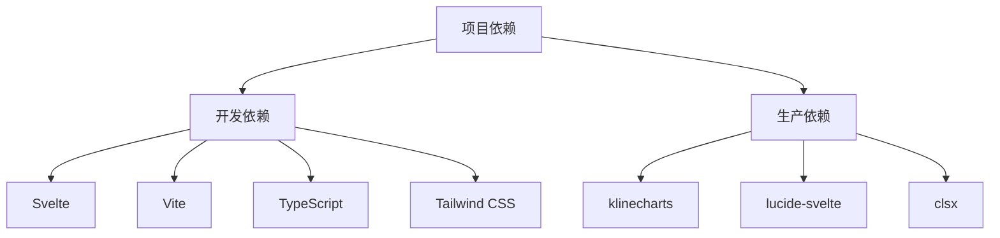
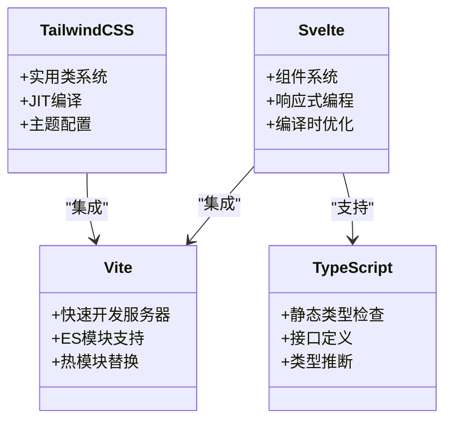
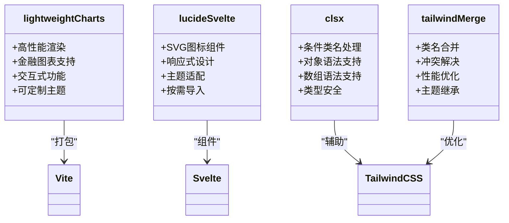
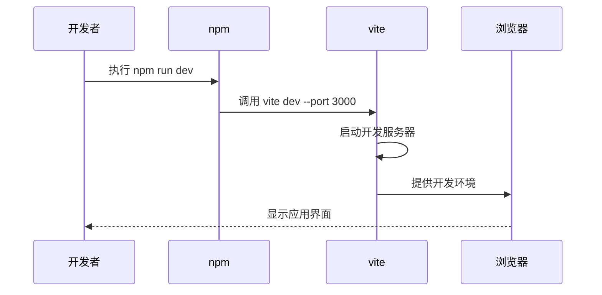
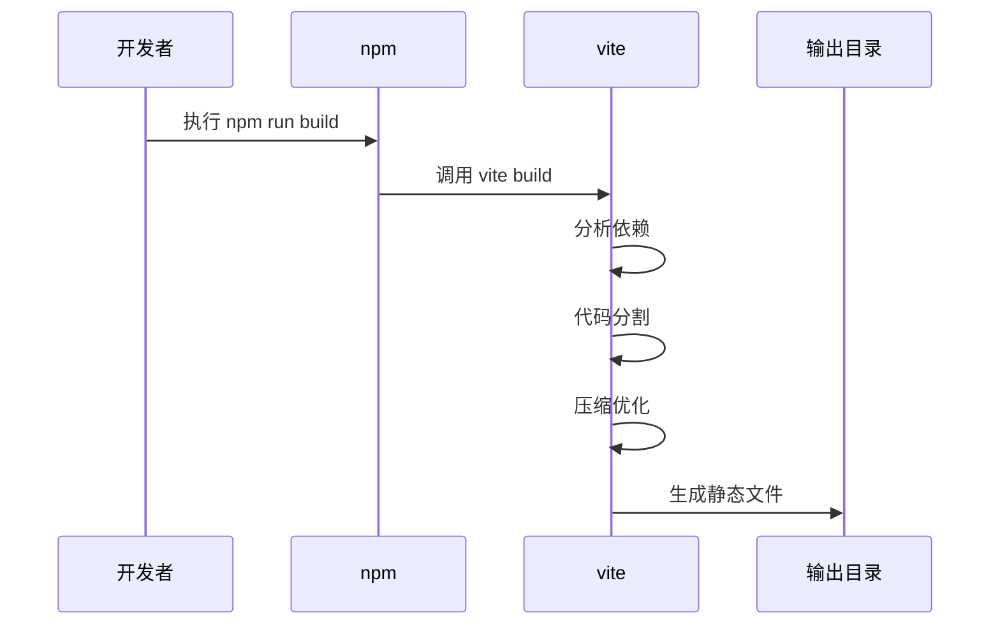
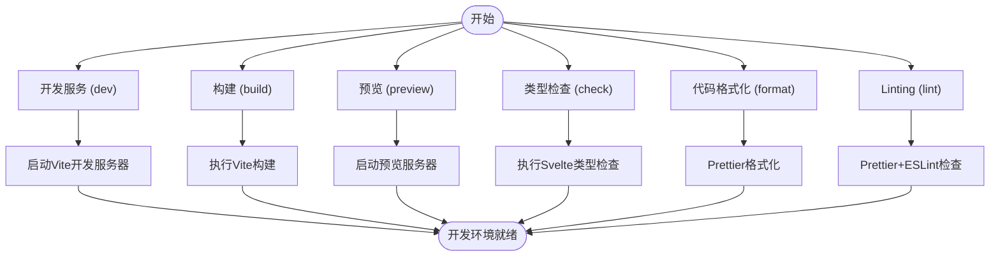
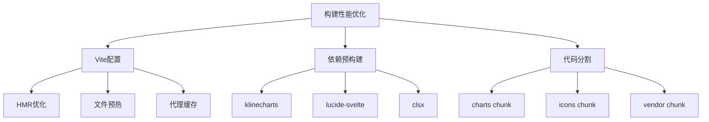
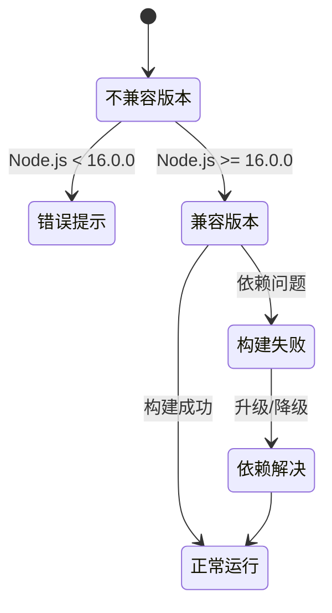
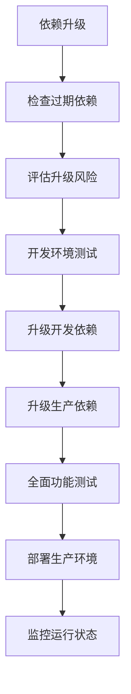
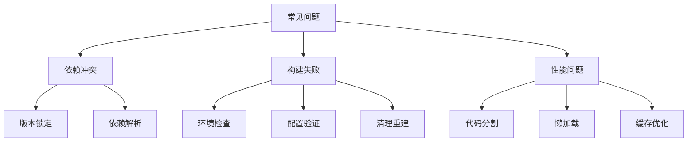

# 依赖管理与脚本命令

<cite>
**本文档引用文件**  
- [package.json](file://frontend/package.json)
- [vite.config.js](file://frontend/vite.config.js)
- [svelte.config.js](file://frontend/svelte.config.js)
- [tailwind.config.js](file://frontend/tailwind.config.js)
- [postcss.config.js](file://frontend/postcss.config.js)
</cite>

## 目录
1. [项目依赖结构](#项目依赖结构)
2. [开发依赖详解](#开发依赖详解)
3. [生产依赖详解](#生产依赖详解)
4. [脚本命令解析](#脚本命令解析)
5. [构建性能优化](#构建性能优化)
6. [Node.js版本要求](#nodejs版本要求)
7. [依赖升级建议](#依赖升级建议)
8. [常见问题解决方案](#常见问题解决方案)

## 项目依赖结构

本项目采用SvelteKit框架构建前端系统，依赖管理通过`package.json`文件进行配置。项目依赖分为开发依赖和生产依赖两大类，分别用于开发环境和生产环境。

**图表来源**
- [package.json](file://frontend/package.json#L1-L52)

**本节来源**
- [package.json](file://frontend/package.json#L1-L52)

## 开发依赖详解

开发依赖主要用于支持开发环境的构建、编译、检查和格式化工作。

### Svelte与SvelteKit
Svelte作为前端框架，提供响应式UI构建能力。SvelteKit是Svelte的官方应用框架，提供路由、服务端渲染等功能。

### Vite构建工具
Vite作为现代前端构建工具，提供快速的开发服务器和高效的构建能力。

### TypeScript支持
TypeScript为项目提供静态类型检查，提升代码质量和开发体验。

### Tailwind CSS生态
Tailwind CSS及其插件提供实用优先的CSS框架，`@tailwindcss/forms`和`@tailwindcss/typography`分别用于表单样式和排版优化。

**图表来源**
- [package.json](file://frontend/package.json#L20-L35)
- [vite.config.js](file://frontend/vite.config.js#L1-L93)
- [svelte.config.js](file://frontend/svelte.config.js#L1-L38)
- [tailwind.config.js](file://frontend/tailwind.config.js#L1-L205)

**本节来源**
- [package.json](file://frontend/package.json#L20-L35)

## 生产依赖详解

生产依赖是项目运行时必需的库，直接影响最终用户的体验。

### klinecharts
轻量级金融图表库，专为高性能金融数据可视化设计，支持K线图、技术指标等专业功能。

### lucide-svelte
Svelte版本的Lucide图标库，提供简洁现代的图标组件，用于界面元素装饰。

### clsx
条件类名处理工具，简化动态CSS类名的组合逻辑。

### tailwind-merge
Tailwind CSS类名合并工具，解决样式覆盖问题，优化CSS类名输出。

**图表来源**
- [package.json](file://frontend/package.json#L37-L44)
- [vite.config.js](file://frontend/vite.config.js#L60-L75)

**本节来源**
- [package.json](file://frontend/package.json#L37-L44)

## 脚本命令解析

项目提供了一系列npm脚本命令，覆盖开发、构建、检查等全生命周期。

### 开发服务 (dev)
启动开发服务器，监听3000端口，支持热更新。

### 构建 (build)
生产环境构建命令，生成优化的静态资源。

### 预览 (preview)
本地预览生产构建结果，模拟生产环境。

### 类型检查 (check)
执行Svelte类型检查，确保TypeScript类型安全。

### 代码格式化 (format)
使用Prettier格式化代码，保持代码风格一致。

### Linting (lint)
代码质量检查，结合Prettier和ESLint进行代码规范验证。

**图表来源**
- [package.json](file://frontend/package.json#L6-L17)
- [vite.config.js](file://frontend/vite.config.js#L10-L93)

**本节来源**
- [package.json](file://frontend/package.json#L6-L17)

## 构建性能优化

项目通过多种方式优化构建性能和运行时性能。

### Vite配置优化
- HMR独立端口配置
- 文件预热策略
- API请求代理缓存
- 代码分割策略

### 依赖预构建
在`vite.config.js`中配置`optimizeDeps`，提前预构建关键依赖。

### 代码分割策略
将大型依赖单独打包，优化加载性能。

**图表来源**
- [vite.config.js](file://frontend/vite.config.js#L10-L93)

**本节来源**
- [vite.config.js](file://frontend/vite.config.js#L10-L93)

## Node.js版本要求

项目要求Node.js版本不低于16.0.0，确保构建稳定性和功能兼容性。

**图表来源**
- [package.json](file://frontend/package.json#L50-L52)
- [vite.config.js](file://frontend/vite.config.js#L10-L93)

**本节来源**
- [package.json](file://frontend/package.json#L50-L52)

## 依赖升级建议

### 定期检查依赖更新
使用`npm outdated`命令检查过期依赖。

### 逐步升级策略
先升级开发依赖，再升级生产依赖，确保兼容性。

### 测试验证
每次升级后进行全面测试，特别是UI组件和图表功能。

**本节来源**
- [package.json](file://frontend/package.json#L1-L52)

## 常见问题解决方案

### 依赖冲突
当出现依赖版本冲突时，使用`npm dedupe`或手动调整版本。

### 构建失败
检查Node.js版本、依赖完整性、配置文件语法等。

### 性能问题
优化代码分割策略，减少不必要的依赖引入。

**本节来源**
- [package.json](file://frontend/package.json#L1-L52)
- [vite.config.js](file://frontend/vite.config.js#L1-L93)