# 构建流程与工具链

<cite>
**本文档引用文件**  
- [vite.config.js](file://frontend/vite.config.js)
- [tailwind.config.js](file://frontend/tailwind.config.js)
- [postcss.config.js](file://frontend/postcss.config.js)
- [package.json](file://frontend/package.json)
- [svelte.config.js](file://frontend/svelte.config.js)
</cite>

## 目录
1. [项目结构](#项目结构)
2. [Vite 构建系统](#vite-构建系统)
3. [TailwindCSS 配置](#tailwindcss-配置)
4. [PostCSS 处理流程](#postcss-处理流程)
5. [依赖管理与脚本](#依赖管理与脚本)
6. [代码格式化与 Linting](#代码格式化与-linting)
7. [生产环境构建优化](#生产环境构建优化)
8. [构建性能分析与体积优化](#构建性能分析与体积优化)

## 项目结构

前端构建系统位于 `frontend` 目录下，采用现代化 SvelteKit 架构，包含完整的工具链配置。核心配置文件包括 Vite、TailwindCSS、PostCSS 和 Svelte 配置，形成高效的开发与生产构建流程。

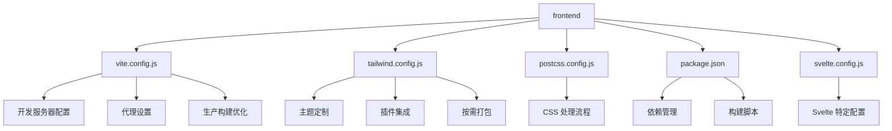

**Diagram sources**  
- [vite.config.js](file://frontend/vite.config.js)
- [tailwind.config.js](file://frontend/tailwind.config.js)
- [postcss.config.js](file://frontend/postcss.config.js)
- [package.json](file://frontend/package.json)
- [svelte.config.js](file://frontend/svelte.config.js)

**Section sources**  
- [frontend](file://frontend)

## Vite 构建系统

### 开发服务器配置

Vite 配置了高性能开发服务器，端口为 3000，支持跨域访问。通过独立的 HMR 端口（3001）提升热更新性能，并禁用错误覆盖层以减少性能影响。

开发服务器启用了文件系统访问权限，允许访问项目根目录，同时通过预热机制提前加载常用组件文件，显著提升启动和重载速度。

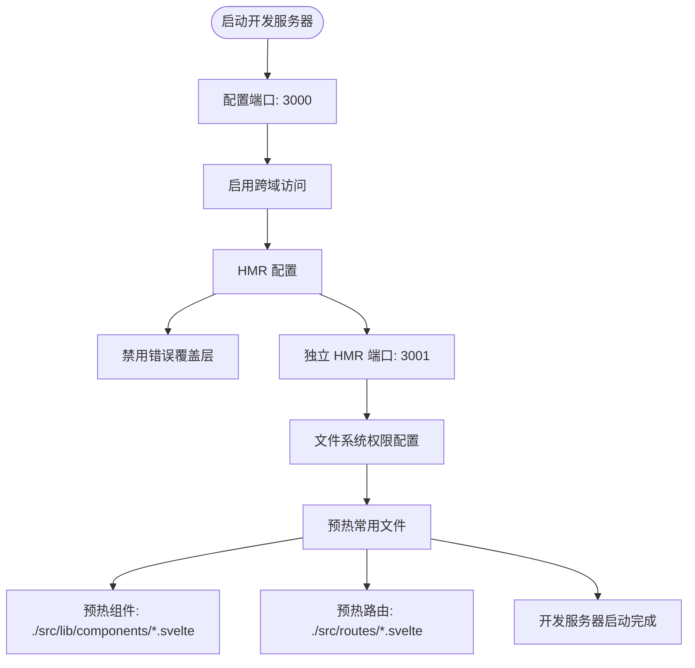

**Diagram sources**  
- [vite.config.js](file://frontend/vite.config.js#L10-L30)

**Section sources**  
- [vite.config.js](file://frontend/vite.config.js#L10-L47)

### 代理设置

开发环境通过 Vite 代理将 API 请求转发到后端服务（http://localhost:8000），实现前后端分离开发。代理配置启用了跨域原点变更和不安全连接，确保开发环境的灵活性。

代理层还集成了缓存机制，在 GET 请求中自动添加缓存头，提升开发环境下的响应性能。

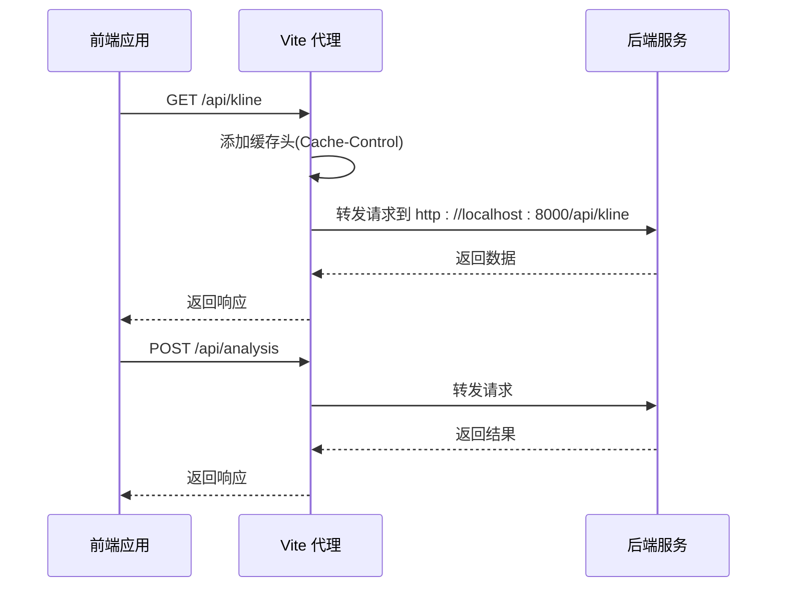

**Diagram sources**  
- [vite.config.js](file://frontend/vite.config.js#L31-L47)

**Section sources**  
- [vite.config.js](file://frontend/vite.config.js#L31-L47)

### 生产构建优化

生产构建针对性能进行了深度优化，目标为 ES2020 标准，使用 esbuild 进行快速压缩。通过自定义代码分割策略，将大型依赖库单独打包，优化加载性能。

构建输出采用哈希命名策略，确保缓存有效性，同时设置较高的代码块警告阈值（1000KB），适应金融图表应用的特性。

```mermaid
flowchart TD
A[生产构建] --> B[目标: ES2020]
B --> C[源码映射: 禁用]
C --> D[压缩: esbuild]
D --> E[代码分割策略]
E --> F{依赖类型判断}
F --> |klinecharts| G[打包到 charts 块]
F --> |lucide-svelte| H[打包到 icons 块]
F --> |node_modules| I[打包到 vendor 块]
E --> J[文件命名策略]
J --> K[chunk: assets/[name]-[hash].js]
J --> L[entry: assets/[name]-[hash].js]
J --> M[asset: assets/[name]-[hash].[ext]]
K --> N[构建完成]
L --> N
M --> N
```

**Diagram sources**  
- [vite.config.js](file://frontend/vite.config.js#L48-L77)

**Section sources**  
- [vite.config.js](file://frontend/vite.config.js#L48-L77)

## TailwindCSS 配置

### 主题定制

TailwindCSS 配置了专业的金融分析主题，包含缠论专用颜色、牛市/熊市色彩体系和中性色调。颜色系统遵循 50-900 的标准分级，确保设计一致性。

字体系统集成了 JetBrains Mono 和 Inter 等专业字体，支持代码显示和界面展示的不同需求。同时扩展了响应式断点，支持从 475px 到 1600px 的多设备适配。

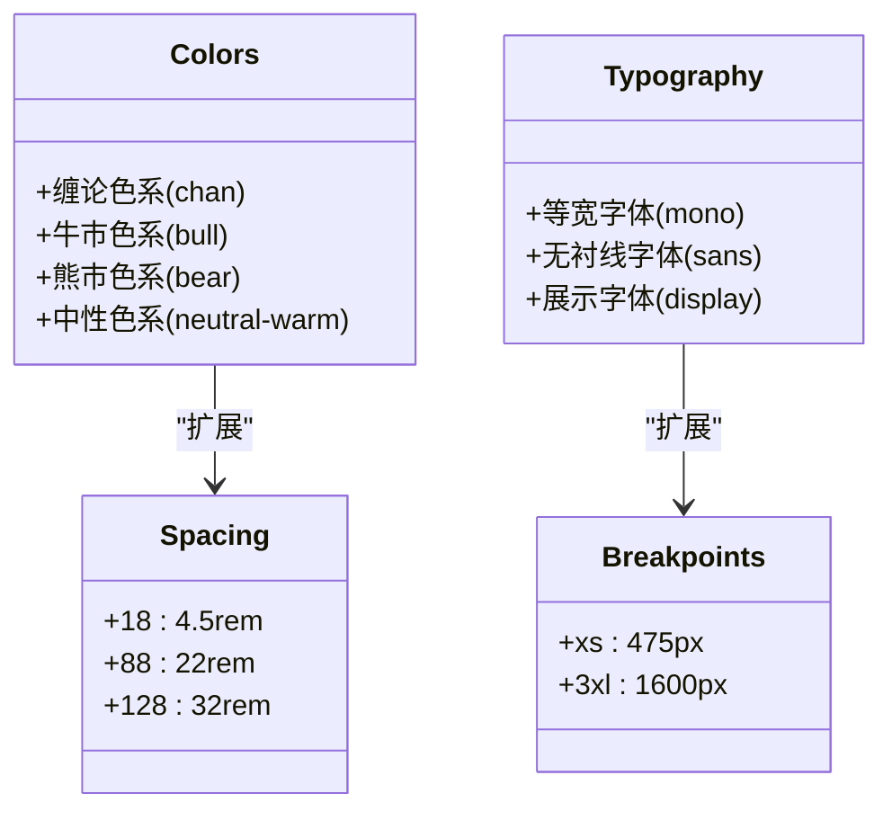

**Diagram sources**  
- [tailwind.config.js](file://frontend/tailwind.config.js#L6-L50)

**Section sources**  
- [tailwind.config.js](file://frontend/tailwind.config.js#L6-L50)

### 插件集成

集成了官方插件 @tailwindcss/forms 和 @tailwindcss/typography，增强表单和富文本的样式支持。同时实现了自定义插件系统，为缠论分析功能创建专用工具类。

自定义插件提供了分型标记、趋势指示器、价格变化样式等专业类名，通过 @apply 指令复用 Tailwind 原子类，确保样式一致性。

```mermaid
flowchart TD
A[Tailwind 插件系统] --> B[官方插件]
B --> C[@tailwindcss/forms]
B --> D[@tailwindcss/typography]
A --> E[自定义插件]
E --> F[分型标记样式]
F --> G[.fenxing-top]
F --> H[.fenxing-bottom]
E --> I[趋势指示器]
I --> J[.trend-up]
I --> K[.trend-down]
I --> L[.trend-neutral]
E --> M[价格变化样式]
M --> N[.price-up]
M --> O[.price-down]
E --> P[卡片样式]
P --> Q[.card]
P --> R[.card-hover]
E --> S[渐变文字]
S --> T[.gradient-text]
E --> U[玻璃形态]
U --> V[.glass]
```

**Diagram sources**  
- [tailwind.config.js](file://frontend/tailwind.config.js#L135-L181)

**Section sources**  
- [tailwind.config.js](file://frontend/tailwind.config.js#L135-L181)

### 按需打包配置

通过 content 配置指定扫描路径，确保只生成实际使用的 CSS 类，大幅减少生产包体积。配置覆盖了所有 Svelte 组件和 HTML 文件，确保样式完整性。

同时定义了动画和关键帧，支持缓慢脉冲、弹跳、旋转等专业动效，提升用户体验。图表相关尺寸也进行了预定义，确保金融图表的一致性。

```mermaid
flowchart LR
A[按需打包] --> B[内容扫描]
B --> C[./src/**/*.{html,js,svelte,ts}]
A --> D[动画定义]
D --> E[pulse-slow: 3s]
D --> F[bounce-slow: 2s]
D --> G[spin-slow: 2s]
D --> H[ping-slow: 2s]
D --> I[fadeIn: 0.5s]
A --> J[关键帧]
J --> K[fadeIn]
J --> L[slideUp]
J --> M[slideDown]
A --> N[尺寸定义]
N --> O[chart: 600px]
N --> P[chart-sm: 400px]
N --> Q[chart-lg: 800px]
```

**Diagram sources**  
- [tailwind.config.js](file://frontend/tailwind.config.js#L3-L6)
- [tailwind.config.js](file://frontend/tailwind.config.js#L93-L139)

**Section sources**  
- [tailwind.config.js](file://frontend/tailwind.config.js#L3-L139)

## PostCSS 处理流程

### 处理流程配置

PostCSS 配置简洁高效，仅包含必要的 tailwindcss 和 autoprefixer 插件。处理流程首先应用 Tailwind 生成的实用类，然后通过 Autoprefixer 自动添加浏览器厂商前缀。

这种极简配置确保了构建性能，避免了不必要的处理步骤，同时保证了跨浏览器兼容性。

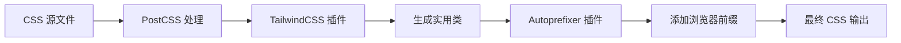

**Diagram sources**  
- [postcss.config.js](file://frontend/postcss.config.js)

**Section sources**  
- [postcss.config.js](file://frontend/postcss.config.js)

### CSS 模块化策略

通过 Svelte 的作用域 CSS 特性实现模块化，每个组件的样式默认隔离。结合 Tailwind 的原子化设计理念，通过组合实用类实现复杂样式，避免传统 CSS 的命名冲突问题。

在需要共享样式时，使用自定义插件定义的工具类，确保设计系统的一致性。

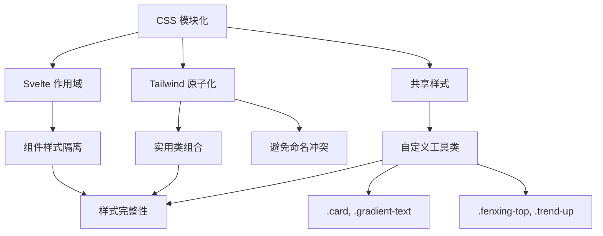

**Section sources**  
- [tailwind.config.js](file://frontend/tailwind.config.js#L135-L181)
- [svelte.config.js](file://frontend/svelte.config.js)

## 依赖管理与脚本

### package.json 配置

项目依赖清晰划分，生产依赖包含 klinecharts 专业图表库、lucide-svelte 图标库和性能优化工具。开发依赖包含 SvelteKit 生态、TypeScript 和构建工具。

引擎要求明确指定 Node.js 16+，确保团队开发环境一致性。

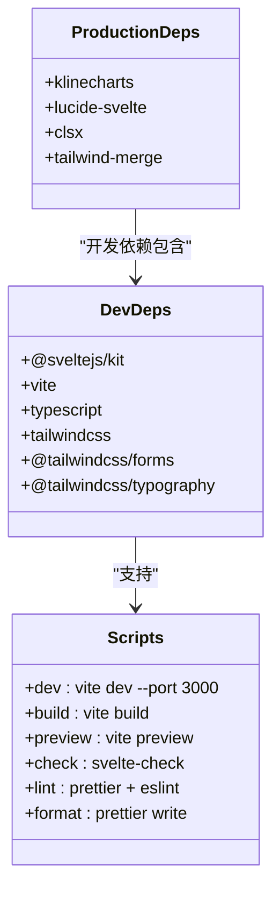

**Diagram sources**  
- [package.json](file://frontend/package.json)

**Section sources**  
- [package.json](file://frontend/package.json)

### 构建脚本

提供完整的开发工作流脚本，从开发服务器到生产构建，再到代码检查和格式化。脚本设计遵循最佳实践，确保团队开发的一致性和效率。

开发脚本直接调用 Vite 命令，构建脚本生成生产优化的静态文件，预览脚本用于本地验证构建结果。

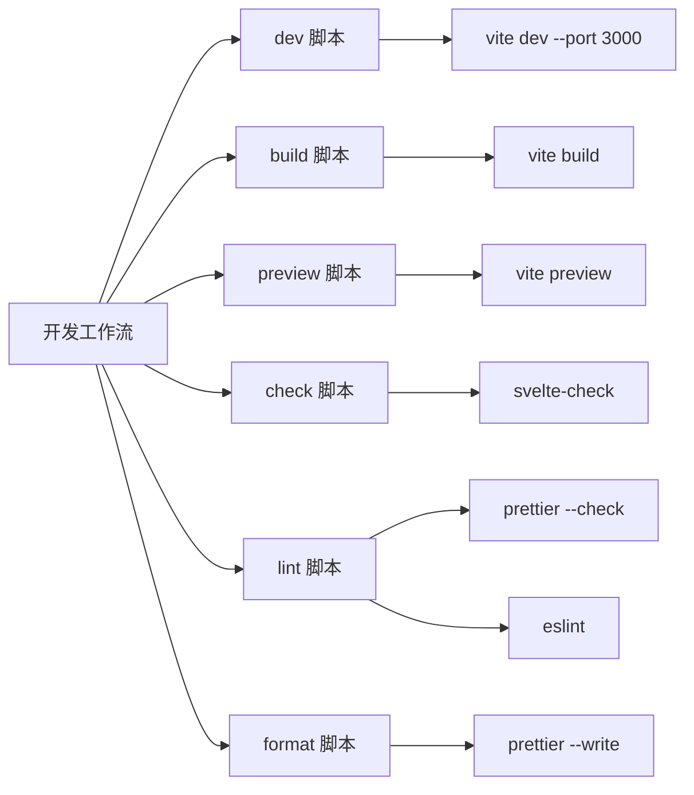

**Section sources**  
- [package.json](file://frontend/package.json#L6-L14)

## 代码格式化与 Linting

### 代码质量工具

集成 Prettier 和 ESLint 实现代码风格统一和质量检查。Prettier 负责代码格式化，ESLint 负责代码质量和潜在错误检测。

通过 --plugin-search-dir . 参数确保在项目目录中查找插件配置，支持 Svelte 特定的格式化规则。

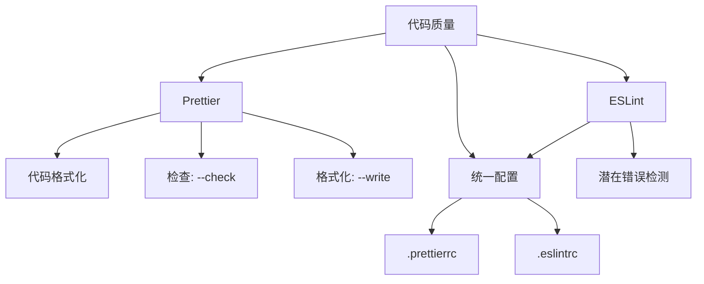

**Section sources**  
- [package.json](file://frontend/package.json#L15-L16)

### Svelte 特定配置

Svelte 配置文件定义了适配器、预处理器和别名系统。使用 @sveltejs/adapter-auto 自动选择部署适配器，vitePreprocess 支持 Vite 预处理功能。

别名系统简化了模块导入路径，提高代码可读性和维护性。

```mermaid
flowchart TD
A[Svelte 配置] --> B[适配器]
B --> C[@sveltejs/adapter-auto]
A --> D[预处理器]
D --> E[vitePreprocess]
A --> F[别名系统]
F --> G[$components: src/lib/components]
F --> H[$stores: src/lib/stores.js]
F --> I[$utils: src/lib/utils.js]
F --> J[$api: src/lib/api.js]
A --> K[预渲染]
K --> L[HTTP 错误处理: warn]
A --> M[CSP 安全]
M --> N[脚本源: self, unsafe-inline]
```

**Diagram sources**  
- [svelte.config.js](file://frontend/svelte.config.js)

**Section sources**  
- [svelte.config.js](file://frontend/svelte.config.js)

## 生产环境构建优化

### 依赖预构建

通过 optimizeDeps 配置显式声明需要预构建的依赖，包括 klinecharts、lucide-svelte 等大型库。强制预构建提升开发服务器启动速度和热更新性能。

预构建排除项为空，确保所有声明的依赖都被处理。

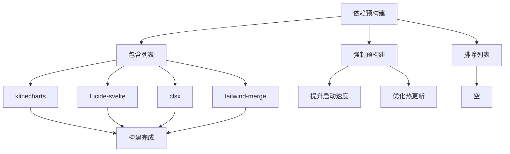

**Diagram sources**  
- [vite.config.js](file://frontend/vite.config.js#L78-L85)

**Section sources**  
- [vite.config.js](file://frontend/vite.config.js#L78-L85)

### 环境变量注入

在构建时通过 define 配置注入应用版本和构建时间，便于版本追踪和问题排查。版本号来自 package.json，构建时间为 ISO 格式的时间戳。

```mermaid
flowchart TD
A[环境变量注入] --> B[__APP_VERSION__]
B --> C[来源: npm_package_version]
B --> D[默认: 1.0.0]
A --> E[__BUILD_TIME__]
E --> F[来源: new Date().toISOString()]
C --> G[构建过程]
D --> G
F --> G
G --> H[注入到客户端代码]
```

**Diagram sources**  
- [vite.config.js](file://frontend/vite.config.js#L87-L93)

**Section sources**  
- [vite.config.js](file://frontend/vite.config.js#L87-L93)

## 构建性能分析与体积优化

### 性能优化策略

综合运用多种优化技术：开发服务器预热、HMR 独立端口、依赖预构建、代码分割和哈希命名。这些策略共同作用，确保开发体验流畅和生产性能优异。

通过禁用源码映射和使用 esbuild 压缩，进一步优化生产构建速度和包体积。

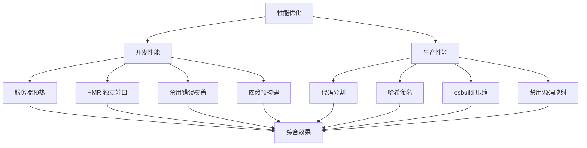

**Section sources**  
- [vite.config.js](file://frontend/vite.config.js)

### 体积优化建议

1. **按需引入**：确保 TailwindCSS 的 content 配置准确，避免生成未使用的类
2. **代码分割**：利用 Vite 的 manualChunks 策略，将大型库单独打包
3. **依赖分析**：定期使用 bundle 分析工具检查包体积构成
4. **Tree Shaking**：确保使用 ES 模块语法，最大化摇树优化效果
5. **压缩优化**：考虑生产环境启用 Brotli 压缩

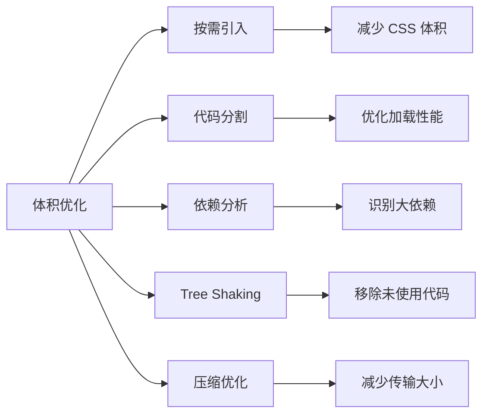

**Section sources**  
- [tailwind.config.js](file://frontend/tailwind.config.js#L3-L6)
- [vite.config.js](file://frontend/vite.config.js#L48-L77)