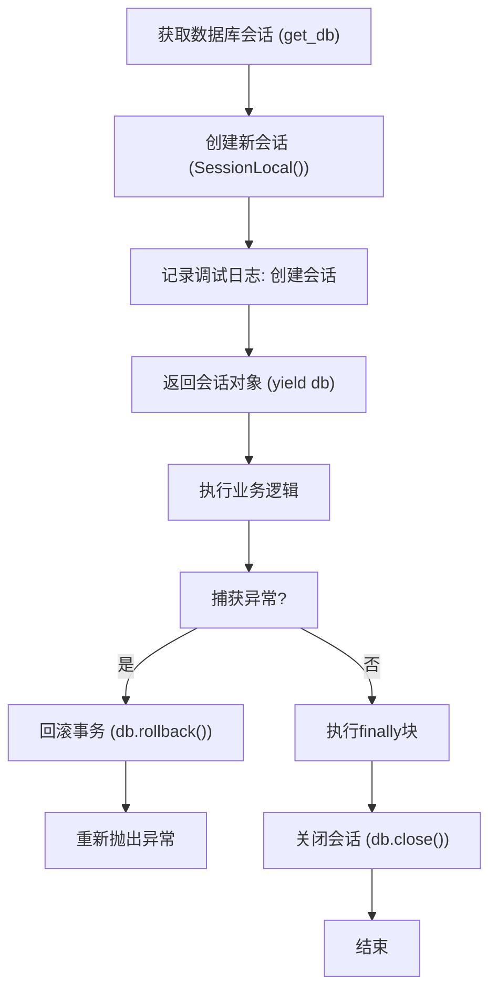
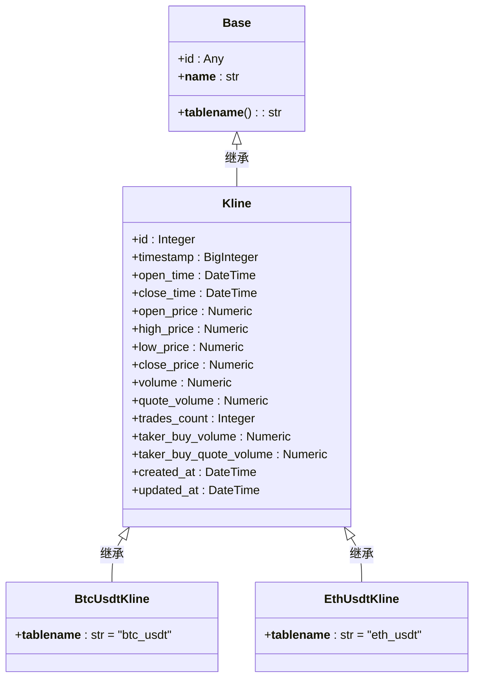
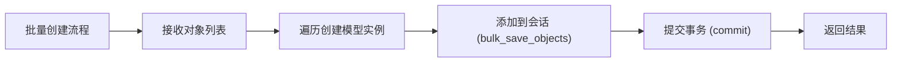

# 数据访问层

<cite>
**本文档中引用的文件**  
- [session.py](file://app/db/session.py)
- [base_class.py](file://app/db/base_class.py)
- [kline.py](file://app/models/kline.py)
- [kline.py](file://app/crud/kline.py)
- [deps.py](file://app/api/deps.py)
</cite>

## 目录
1. [简介](#简介)
2. [数据库会话管理机制](#数据库会话管理机制)
3. [基类模型定义与继承结构](#基类模型定义与继承结构)
4. [K线数据模型设计](#k线数据模型设计)
5. [CRUD操作实现详解](#crud操作实现详解)
6. [批量操作与性能优化策略](#批量操作与性能优化策略)
7. [服务层数据库交互示例](#服务层数据库交互示例)
8. [查询编写最佳实践](#查询编写最佳实践)
9. [总结](#总结)

## 简介
本文档全面介绍交易系统中基于SQLAlchemy ORM的数据访问层实现。重点阐述K线数据的持久化机制、数据库会话管理、模型继承结构以及高效CRUD操作的实现方式。通过分析核心组件，为开发者提供清晰的数据库交互指南和性能优化建议。

## 数据库会话管理机制

本系统采用SQLAlchemy ORM进行数据库操作，通过`session.py`模块实现高效的会话管理。会话工厂`SessionLocal`由数据库引擎创建，并配置了完整的连接池参数，确保高并发场景下的稳定性和性能。

**图示来源**  
- [session.py](file://app/db/session.py#L38-L43)
- [deps.py](file://app/api/deps.py#L7-L11)

**本节来源**  
- [session.py](file://app/db/session.py#L1-L43)
- [deps.py](file://app/api/deps.py#L1-L10)

## 基类模型定义与继承结构

数据模型基类`Base`继承自SQLAlchemy的`DeclarativeBase`，通过`@declared_attr`装饰器实现了表名的自动生成功能。所有模型类的表名均为其类名的小写形式，确保命名一致性。

**图示来源**  
- [base_class.py](file://app/db/base_class.py#L5-L12)
- [kline.py](file://app/models/kline.py#L5-L36)

**本节来源**  
- [base_class.py](file://app/db/base_class.py#L1-L12)
- [kline.py](file://app/models/kline.py#L1-L36)

## K线数据模型设计

K线数据模型采用抽象基类模式，`Kline`类定义了所有K线数据的通用字段，包括价格、成交量、时间戳等核心属性。具体交易对模型（如`BtcUsdtKline`、`EthUsdtKline`）继承自`Kline`基类，并指定具体的表名。

模型中配置了多个索引以优化查询性能：
- `id`字段为主键索引
- `timestamp`和`open_time`字段为时间查询索引
- `created_at`和`updated_at`自动维护时间戳

通过`SYMBOL_TO_MODEL`字典实现交易对与模型类的映射，便于动态选择对应的数据表进行操作。

**本节来源**  
- [kline.py](file://app/models/kline.py#L5-L36)

## CRUD操作实现详解

CRUD操作通过`CRUDKline`类封装，提供了一套完整的K线数据操作接口。每个方法都包含详细的日志记录和异常处理机制，确保操作的可追溯性和稳定性。

核心操作包括：
- `create`: 创建单条K线记录
- `get`: 根据ID获取记录
- `get_by_timestamp`: 根据时间戳获取记录
- `get_multi`: 分页获取多条记录
- `get_by_time_range`: 获取指定时间范围内的记录
- `update`: 更新记录
- `remove`: 删除记录

所有查询操作均通过`get_model`方法动态获取对应交易对的模型类，实现了多表操作的统一接口。

**本节来源**  
- [kline.py](file://app/crud/kline.py#L1-L354)

## 批量操作与性能优化策略

为提高数据写入效率，系统实现了批量创建功能`bulk_create`。该方法使用SQLAlchemy的`bulk_save_objects`接口，避免了逐条插入的性能开销，显著提升了大批量数据导入的速度。

此外，系统还提供了原生SQL查询接口`get_kline_data`，利用PostgreSQL的`time_bucket`函数实现K线聚合查询。这种方式相比ORM级别的聚合操作具有更高的执行效率，特别适用于大时间跨度的数据分析场景。

连接池配置方面，系统设置了合理的参数：
- `pool_size=10`: 基础连接数
- `max_overflow=20`: 最大溢出连接数
- `pool_recycle=3600`: 连接回收时间（1小时）
- `pool_pre_ping=True`: 自动检测连接有效性

这些配置有效避免了连接泄漏和长时间空闲连接导致的问题。

**图示来源**  
- [kline.py](file://app/crud/kline.py#L208-L246)
- [session.py](file://app/db/session.py#L10-L20)

**本节来源**  
- [kline.py](file://app/crud/kline.py#L208-L354)
- [session.py](file://app/db/session.py#L10-L20)

## 服务层数据库交互示例

服务层通过依赖注入方式获取数据库会话。在FastAPI应用中，`get_db`依赖项被用于API路由，确保每个请求都能获得独立的数据库会话。

典型的服务层调用模式如下：
1. 通过`Depends(get_db)`获取数据库会话
2. 实例化`CRUDKline`对象
3. 调用相应的CRUD方法执行数据操作
4. 异常自动回滚，会话自动关闭

这种设计模式实现了数据库操作与业务逻辑的解耦，提高了代码的可测试性和可维护性。

**本节来源**  
- [deps.py](file://app/api/deps.py#L1-L10)
- [kline.py](file://app/crud/kline.py#L1-L354)

## 查询编写最佳实践

为编写高效的数据库查询，建议遵循以下最佳实践：

### 避免N+1查询问题
使用`joinedload`或`selectinload`等预加载技术，避免在循环中执行额外的数据库查询。

### 合理使用事务
对于多个相关操作，应放在同一个事务中执行，确保数据一致性。使用`try-catch-finally`结构确保事务正确提交或回滚。

### 选择合适的查询方法
- 对于简单查询，使用ORM查询接口
- 对于复杂聚合查询，考虑使用原生SQL
- 对于大批量数据读取，使用分页或流式查询

### 索引优化
确保常用查询条件的字段已建立适当索引，特别是时间范围查询和ID查询。

### 连接池配置建议
根据实际负载调整连接池参数：
- 生产环境建议设置`pool_size`为CPU核心数的2-4倍
- `max_overflow`可根据峰值负载适当增加
- `pool_recycle`建议设置为小于数据库服务器连接超时时间

**本节来源**  
- [kline.py](file://app/crud/kline.py#L1-L354)
- [session.py](file://app/db/session.py#L1-L43)

## 总结
本文档详细介绍了交易系统数据访问层的设计与实现。通过SQLAlchemy ORM提供的强大功能，系统实现了高效、可靠的数据库操作。从会话管理到模型设计，从CRUD操作到性能优化，每个环节都经过精心设计，确保系统在高并发场景下的稳定运行。开发者应遵循文档中的最佳实践，合理使用提供的API接口，编写高效、可维护的数据库代码。