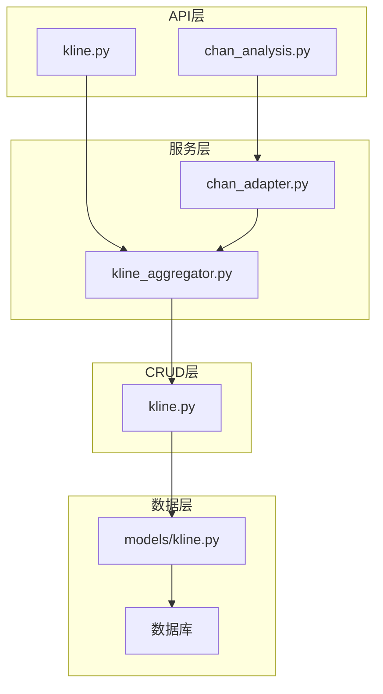
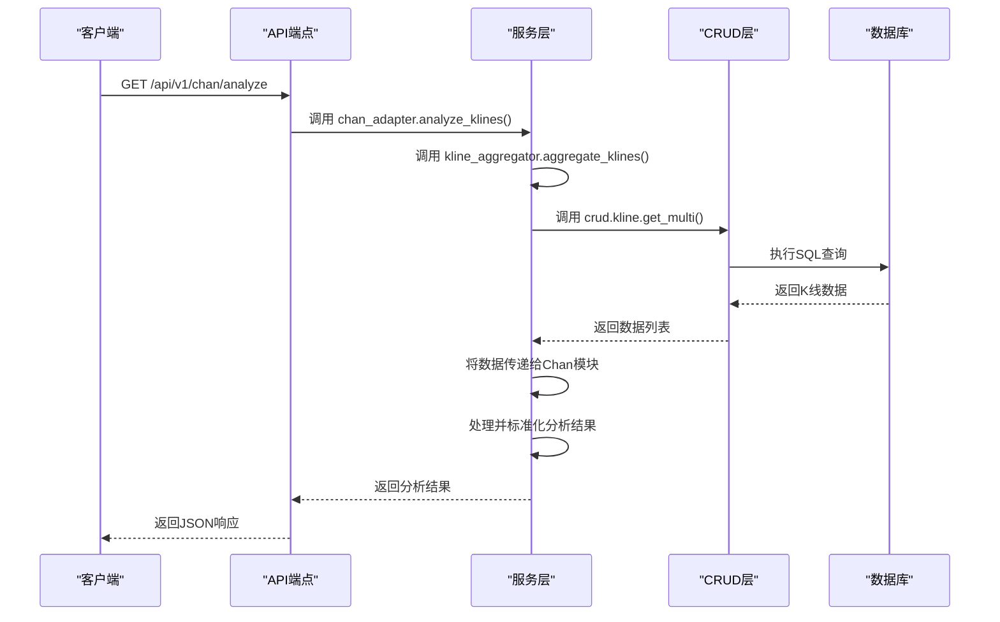
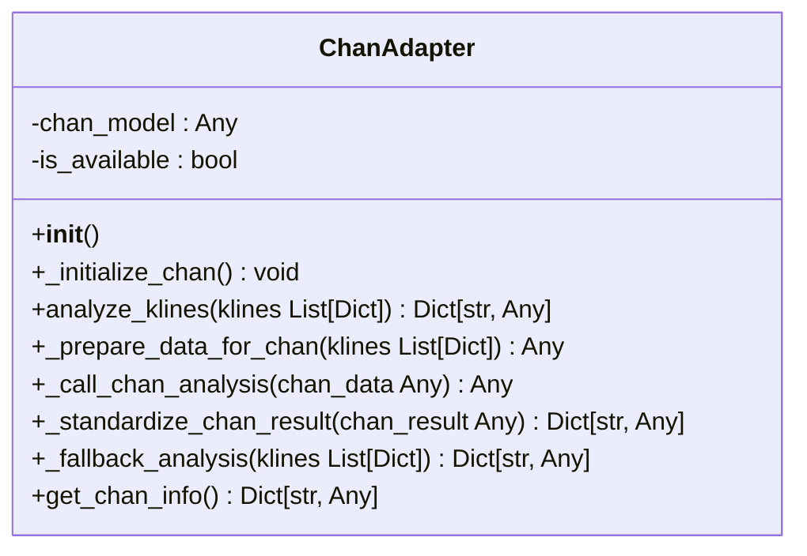
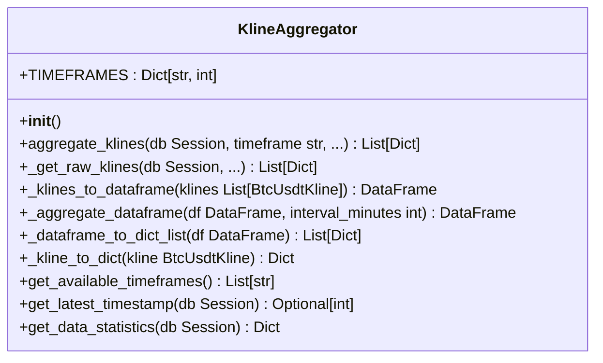
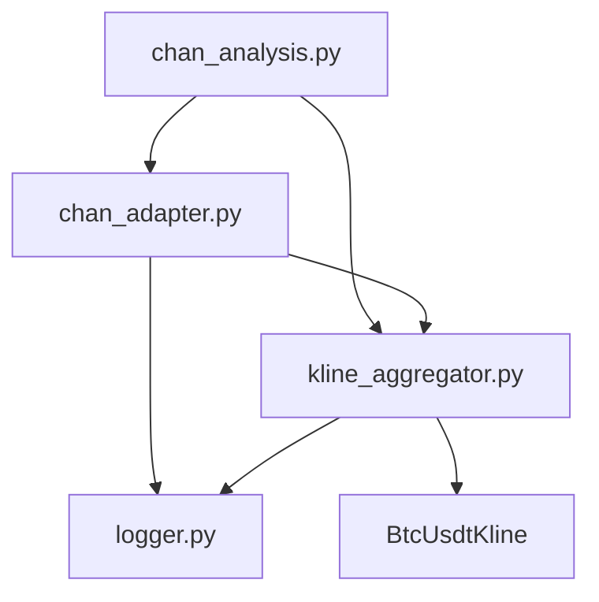

# 服务层

<cite>
**本文档中引用的文件**  
- [chan_adapter.py](file://app/services/chan_adapter.py)
- [kline_aggregator.py](file://app/services/kline_aggregator.py)
- [chan_analysis.py](file://app/api/v1/endpoints/chan_analysis.py)
- [kline.py](file://app/api/v1/endpoints/kline.py)
- [kline.py](file://app/crud/kline.py)
- [kline.py](file://app/models/kline.py)
- [kline.py](file://app/schemas/kline.py)
</cite>

## 目录
1. [简介](#简介)
2. [项目结构](#项目结构)
3. [核心组件](#核心组件)
4. [架构概述](#架构概述)
5. [详细组件分析](#详细组件分析)
6. [依赖分析](#依赖分析)
7. [性能考虑](#性能考虑)
8. [故障排除指南](#故障排除指南)
9. [结论](#结论)

## 简介
本文档深入探讨了交易系统中的服务层，重点分析了业务逻辑处理的核心机制。重点内容包括 `chan_adapter.py` 如何作为外部缠论模块（`chan.py`）的适配器，封装复杂的分析逻辑并提供简洁的接口；以及 `kline_aggregator.py` 如何实现多时间周期K线数据的聚合与转换。文档阐明了服务层与API层、CRUD层之间的调用关系和数据流转过程，为开发者提供了新增业务服务的指导，包括如何正确注入数据库会话、处理异常和集成缓存机制。

## 项目结构
项目采用分层架构，清晰地分离了关注点。服务层（`app/services`）位于API层和数据访问层之间，负责核心业务逻辑。API端点（`app/api/v1/endpoints`）调用服务层，服务层再调用CRUD层（`app/crud`）与数据库交互。模型（`app/models`）定义了数据库表结构，而模式（`app/schemas`）则定义了API的数据输入输出格式。

**图示来源**
- [chan_analysis.py](file://app/api/v1/endpoints/chan_analysis.py)
- [kline.py](file://app/api/v1/endpoints/kline.py)
- [chan_adapter.py](file://app/services/chan_adapter.py)
- [kline_aggregator.py](file://app/services/kline_aggregator.py)
- [kline.py](file://app/crud/kline.py)
- [kline.py](file://app/models/kline.py)

**本节来源**
- [chan_analysis.py](file://app/api/v1/endpoints/chan_analysis.py)
- [kline.py](file://app/api/v1/endpoints/kline.py)
- [chan_adapter.py](file://app/services/chan_adapter.py)
- [kline_aggregator.py](file://app/services/kline_aggregator.py)
- [kline.py](file://app/crud/kline.py)
- [kline.py](file://app/models/kline.py)

## 核心组件
服务层的核心是 `chan_adapter.py` 和 `kline_aggregator.py` 两个模块。`ChanAdapter` 类封装了与外部 `chan.py` 模块的复杂交互，提供了一个稳定、简化的接口供API层调用。`KlineAggregator` 类则负责将原始的1分钟K线数据聚合为更长的时间周期（如5分钟、1小时等），以满足不同分析需求。

**本节来源**
- [chan_adapter.py](file://app/services/chan_adapter.py#L1-L517)
- [kline_aggregator.py](file://app/services/kline_aggregator.py#L1-L251)

## 架构概述
系统遵循典型的分层架构模式。API层接收HTTP请求，进行参数验证和路由。服务层是业务逻辑的中心，它协调数据获取、处理和分析。CRUD层负责与数据库进行直接的增删改查操作。这种分层设计确保了代码的可维护性和可测试性。

**图示来源**
- [chan_analysis.py](file://app/api/v1/endpoints/chan_analysis.py#L50-L150)
- [chan_adapter.py](file://app/services/chan_adapter.py#L100-L200)
- [kline_aggregator.py](file://app/services/kline_aggregator.py#L50-L100)
- [kline.py](file://app/crud/kline.py#L50-L100)

## 详细组件分析
本节将深入分析 `ChanAdapter` 和 `KlineAggregator` 两个核心服务类的实现细节。

### ChanAdapter 分析
`ChanAdapter` 类是一个关键的适配器，它桥接了本系统与外部的 `chan.py` 缠论分析模块。

#### 类图

**图示来源**
- [chan_adapter.py](file://app/services/chan_adapter.py#L1-L517)

#### 功能与流程
`ChanAdapter` 的主要职责是：
1.  **初始化**: 在 `__init__` 中调用 `_initialize_chan`，尝试导入并实例化 `chan.py` 模块。
2.  **分析**: `analyze_klines` 方法是主入口。它首先检查模块是否可用，然后准备数据、调用分析、并标准化结果。
3.  **数据准备**: `_prepare_data_for_chan` 将系统内部的K线字典列表转换为 `chan.py` 模块期望的格式（如Pandas DataFrame）。
4.  **调用分析**: `_call_chan_analysis` 使用反射机制调用 `chan.py` 模块中的各种分析方法（如 `get_fenxing`, `get_bi`）。
5.  **结果标准化**: `_standardize_chan_result` 将 `chan.py` 模块的原始输出转换为系统内部统一的、结构化的字典格式，确保API层可以一致地处理结果。
6.  **降级处理**: 当 `chan.py` 模块不可用时，`_fallback_analysis` 提供一个简化的分析结果，保证系统不会完全崩溃。

**本节来源**
- [chan_adapter.py](file://app/services/chan_adapter.py#L1-L517)

### KlineAggregator 分析
`KlineAggregator` 类负责K线数据的聚合，是多时间周期分析的基础。

#### 类图

**图示来源**
- [kline_aggregator.py](file://app/services/kline_aggregator.py#L1-L251)

#### 功能与流程
`KlineAggregator` 的工作流程如下：
1.  **参数验证**: `aggregate_klines` 方法首先验证时间周期是否支持。
2.  **数据获取**: 如果是1分钟周期，直接从数据库获取原始数据；否则，获取1分钟的原始数据用于聚合。
3.  **数据转换**: `_klines_to_dataframe` 将数据库查询结果转换为Pandas DataFrame。
4.  **数据聚合**: `_aggregate_dataframe` 利用Pandas的 `resample` 功能，根据指定的时间间隔（如'5T'代表5分钟）对数据进行重采样。开盘价取第一个，收盘价取最后一个，最高价取最大值，最低价取最小值，成交量求和。
5.  **结果转换**: `_dataframe_to_dict_list` 将聚合后的DataFrame转换回字典列表，以便于序列化为JSON。
6.  **结果返回**: 最终结果被限制在指定的 `limit` 内并返回。

**本节来源**
- [kline_aggregator.py](file://app/services/kline_aggregator.py#L1-L251)

## 依赖分析
服务层的依赖关系清晰且合理。`chan_adapter.py` 依赖于 `kline_aggregator.py` 来获取K线数据，这体现了服务层内部的协作。两个服务都依赖于 `app.core.logger` 进行日志记录。`kline_aggregator.py` 依赖于 `app.models.kline` 中的 `BtcUsdtKline` 模型来定义数据库查询。API层的 `chan_analysis.py` 依赖于这两个服务，形成了从API到服务再到数据的单向依赖流，避免了循环依赖。

**图示来源**
- [chan_analysis.py](file://app/api/v1/endpoints/chan_analysis.py)
- [chan_adapter.py](file://app/services/chan_adapter.py)
- [kline_aggregator.py](file://app/services/kline_aggregator.py)
- [logger.py](file://app/core/logger.py)
- [kline.py](file://app/models/kline.py)

**本节来源**
- [chan_analysis.py](file://app/api/v1/endpoints/chan_analysis.py)
- [chan_adapter.py](file://app/services/chan_adapter.py)
- [kline_aggregator.py](file://app/services/kline_aggregator.py)

## 性能考虑
`KlineAggregator` 的性能是关键。它使用Pandas进行数据聚合，这在处理大量数据时非常高效。然而，对于实时性要求极高的场景，可以考虑以下优化：
1.  **缓存**: 对聚合结果进行缓存，避免对相同时间范围的重复计算。
2.  **增量聚合**: 只聚合自上次请求以来的新数据，而不是每次都从头开始。
3.  **数据库原生聚合**: 对于简单的聚合，可以直接在数据库层面使用SQL的 `GROUP BY` 和 `time_bucket` 函数，减少数据传输量。

## 故障排除指南
*   **Chan模块不可用**: 检查 `chan.py` 子模块是否已通过 `git submodule update --init` 正确初始化。查看日志中的导入错误。
*   **K线数据为空**: 确保已通过 `fetch_binance_data.py` 脚本获取了原始数据。检查数据库中 `btc_usdt` 表是否有数据。
*   **聚合结果不正确**: 检查 `TIMEFRAMES` 字典中的时间周期定义是否正确，以及Pandas `resample` 的聚合函数是否符合预期。

**本节来源**
- [chan_adapter.py](file://app/services/chan_adapter.py#L200-L250)
- [kline_aggregator.py](file://app/services/kline_aggregator.py#L50-L100)

## 结论
服务层是本交易系统的核心，它成功地将复杂的缠论分析和K线聚合逻辑封装起来，为上层API提供了简洁、稳定的接口。`ChanAdapter` 和 `KlineAggregator` 的设计遵循了单一职责和无状态性原则，使得代码易于测试和维护。通过清晰的分层和依赖管理，系统具备了良好的可扩展性，为未来新增业务服务奠定了坚实的基础。