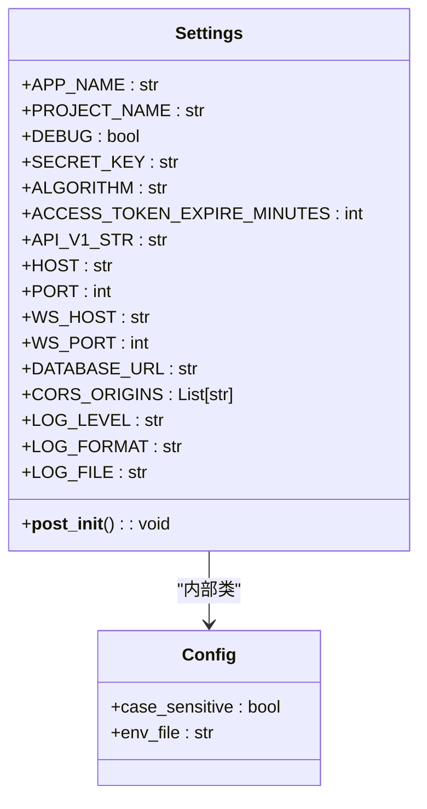
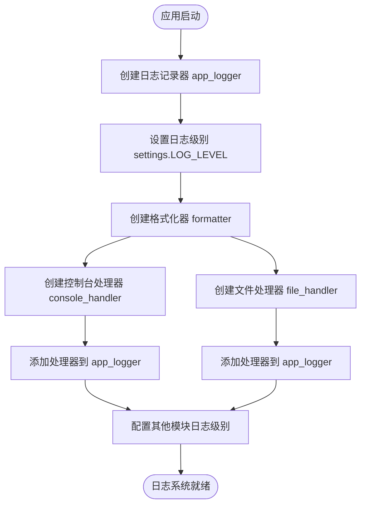
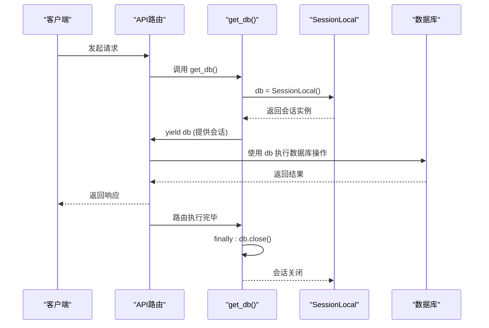

# 核心组件

<cite>
**本文档中引用的文件**
- [config.py](file://app/core/config.py)
- [logger.py](file://app/core/logger.py)
- [exceptions.py](file://app/core/exceptions.py)
- [deps.py](file://app/api/deps.py)
- [session.py](file://app/db/session.py)
</cite>

## 目录
1. [引言](#引言)
2. [配置管理](#配置管理)
3. [日志记录](#日志记录)
4. [异常处理](#异常处理)
5. [依赖注入](#依赖注入)
6. [组件协同工作示例](#组件协同工作示例)
7. [扩展指南](#扩展指南)
8. [结论](#结论)

## 引言
本文档系统性地介绍了交易系统中的四大基础能力：配置管理、日志记录、异常处理和依赖注入。这些核心组件构成了系统的稳定性和可维护性的基石，为开发者提供了一致的开发模式和清晰的扩展路径。

## 配置管理

本系统通过 `config.py` 文件实现了基于 Pydantic Settings 的环境变量驱动配置机制。`Settings` 类继承自 `BaseSettings`，能够自动从 `.env` 文件和环境变量中加载配置项，并提供类型安全和默认值支持。

配置项涵盖应用基本信息（如 `APP_NAME`、`SECRET_KEY`）、API 路由前缀（`API_V1_STR`）、服务器地址与端口（`HOST`、`PORT`）、数据库连接（`DATABASE_URL`）、CORS 跨域设置（`CORS_ORIGINS`）以及日志级别（`LOG_LEVEL`）等。

特别地，`CORS_ORIGINS` 字段通过自定义的 `validator` 装饰器，支持从环境变量中解析 JSON 字符串或逗号分隔的字符串列表，极大地增强了配置的灵活性。此外，`__post_init__` 方法确保了关键配置项（如 `SECRET_KEY`）在缺失时会抛出错误，防止系统在不安全的配置下运行。



**图示来源**
- [config.py](file://app/core/config.py#L15-L65)

**本节来源**
- [config.py](file://app/core/config.py#L1-L65)

## 日志记录

`logger.py` 模块负责系统的结构化日志记录。它利用 Python 内置的 `logging` 模块，结合 `config.py` 中的配置，构建了一个功能完备的日志系统。

该模块创建了名为 `"app"` 的主日志记录器 `app_logger`，并配置了两个处理器：`console_handler` 将日志输出到标准输出，`file_handler` 使用 `RotatingFileHandler` 将日志写入文件，当文件大小超过 50MB 时自动轮转，最多保留 10 个备份文件，有效防止日志文件无限增长。

日志格式和级别均从 `settings` 对象中读取，确保了配置的一致性。同时，该模块还专门配置了 `sqlalchemy.engine` 的日志级别，便于在调试模式下观察 SQL 执行情况。



**图示来源**
- [logger.py](file://app/core/logger.py#L1-L45)
- [config.py](file://app/core/config.py#L55-L60)

**本节来源**
- [logger.py](file://app/core/logger.py#L1-L45)

## 异常处理

`exceptions.py` 定义了一个分层的异常体系，旨在清晰地区分不同类型的错误，并提供统一的错误响应。

体系以 `AppException` 为基类，派生出多个子类，按错误类型分为：
- **系统级异常** (`SystemException`): 代码 1000-1999，如 `DatabaseException` (1001)、`ConfigException` (1002)，对应 HTTP 500 错误。
- **业务级异常** (`BusinessException`): 代码 2000-2999，如 `ResourceNotFoundException` (2002)、`InvalidParameterException` (2001)，对应 HTTP 400 或 404 错误。
- **数据验证异常** (`ValidationException`): 代码 3000-3999，对应 HTTP 422 错误。
- **权限认证异常** (`AuthenticationException`, `AuthorizationException`): 代码 4000-4999，对应 HTTP 401 和 403 错误。
- **第三方服务异常** (`ExternalServiceException`): 代码 5000-5999，对应 HTTP 503 错误。

模块还提供了 `create_error_response` 和 `create_success_response` 函数，用于生成符合 `{success, code, message, data}` 格式的标准化 JSON 响应。同时，定义了多个异步异常处理器（如 `app_exception_handler`, `sqlalchemy_exception_handler`），它们会捕获特定异常，记录详细的错误日志（包含堆栈信息），并返回标准化的错误响应。

```mermaid
classDiagram
AppException <|-- SystemException
AppException <|-- BusinessException
AppException <|-- ValidationException
AppException <|-- AuthenticationException
AppException <|-- AuthorizationException
AppException <|-- ExternalServiceException
SystemException <|-- DatabaseException
SystemException <|-- ConfigException
BusinessException <|-- ResourceNotFoundException
BusinessException <|-- InvalidParameterException
class AppException {
+code : int
+message : str
+__init__(code, message, status_code)
}
class SystemException {
+__init__(code, message)
}
class BusinessException {
+__init__(code, message)
}
class create_error_response(code, message, status_code)~JSONResponse~
class create_success_response(data, message)~JSONResponse~
class app_exception_handler(request, exc)~JSONResponse~
class sqlalchemy_exception_handler(request, exc)~JSONResponse~
class validation_exception_handler(request, exc)~JSONResponse~
class general_exception_handler(request, exc)~JSONResponse~
```

**图示来源**
- [exceptions.py](file://app/core/exceptions.py#L1-L110)

**本节来源**
- [exceptions.py](file://app/core/exceptions.py#L1-L110)

## 依赖注入

依赖注入主要通过 `deps.py` 和 `session.py` 两个文件实现。`deps.py` 中的 `get_db` 函数是一个 FastAPI 依赖项，它使用 Python 的生成器（`Generator`）来管理数据库会话的生命周期。

当一个 API 路由函数通过 `Depends(get_db)` 注入数据库会话时，FastAPI 会调用 `get_db`。该函数首先从 `SessionLocal` 工厂创建一个新的数据库会话 `db`，然后使用 `yield` 将这个会话提供给路由函数。在路由函数执行完毕后（无论成功或抛出异常），`finally` 块中的 `db.close()` 都会被执行，确保会话被正确关闭，防止连接泄漏。

`session.py` 文件负责创建数据库引擎 `engine` 和会话工厂 `SessionLocal`。`engine` 的配置从 `settings.DATABASE_URL` 读取，并启用了连接池（`pool_size`, `max_overflow`）和连接有效性检测（`pool_pre_ping`），以优化数据库性能和稳定性。`SessionLocal` 是一个线程安全的会话工厂，每次调用都会产生一个独立的会话实例。



**图示来源**
- [deps.py](file://app/api/deps.py#L1-L10)
- [session.py](file://app/db/session.py#L1-L43)

**本节来源**
- [deps.py](file://app/api/deps.py#L1-L10)
- [session.py](file://app/db/session.py#L1-L43)

## 组件协同工作示例

以下是一个典型的 API 请求流程，展示了四大核心组件如何协同工作：

1.  **配置管理**: 当请求到达时，系统使用 `config.py` 中的 `API_V1_STR` 来匹配路由。
2.  **依赖注入**: 路由函数通过 `Depends(get_db)` 获取数据库会话。`get_db` 从 `session.py` 创建的 `SessionLocal` 工厂获取一个会话。
3.  **业务逻辑**: 在执行业务逻辑时，如果传入的参数无效，代码会抛出 `InvalidParameterException`。
4.  **异常处理**: FastAPI 捕获到 `InvalidParameterException`，并调用 `app_exception_handler` 处理器。该处理器使用 `app_logger` 记录一条包含错误信息和完整堆栈跟踪的 `ERROR` 级别日志。
5.  **响应生成**: 处理器调用 `create_error_response`，生成一个包含 `success: false`、`code: 2001`、`message: "参数无效"` 的标准化 JSON 响应，并返回给客户端。

此流程确保了即使发生错误，系统也能提供清晰的反馈，同时将关键信息记录下来，便于后续排查。

**本节来源**
- [config.py](file://app/core/config.py)
- [logger.py](file://app/core/logger.py)
- [exceptions.py](file://app/core/exceptions.py)
- [deps.py](file://app/api/deps.py)

## 扩展指南

### 添加新的配置项
在 `config.py` 的 `Settings` 类中添加新的字段。例如，添加 `REDIS_URL`：
```python
class Settings(BaseSettings):
    # ... existing fields ...
    REDIS_URL: str = os.getenv("REDIS_URL", "redis://localhost:6379/0")
```
然后在需要的地方通过 `from app.core.config import settings; settings.REDIS_URL` 访问。

### 自定义异常类型
在 `exceptions.py` 中，根据错误的性质继承相应的基类。例如，添加一个“交易异常”：
```python
class TradingException(BusinessException):
    """交易业务异常"""
    def __init__(self, message: str):
        super().__init__(code=2003, message=message)
```
之后在交易逻辑中即可抛出 `raise TradingException("余额不足")`。

### 创建新的依赖注入函数
在 `deps.py` 中定义新的函数。例如，创建一个获取当前用户身份的依赖：
```python
from fastapi import Depends, HTTPException
from app.core import security

def get_current_user(token: str = Depends(oauth2_scheme)):
    try:
        payload = security.decode_access_token(token)
        user_id: str = payload.get("sub")
        if user_id is None:
            raise AuthenticationException("无效的凭证")
        return user_id
    except Exception:
        raise AuthenticationException("无效的凭证")
```
然后在路由中使用 `current_user: str = Depends(get_current_user)`。

**本节来源**
- [config.py](file://app/core/config.py)
- [exceptions.py](file://app/core/exceptions.py)
- [deps.py](file://app/api/deps.py)

## 结论
配置管理、日志记录、异常处理和依赖注入这四大核心组件共同构建了一个健壮、可维护且易于扩展的应用程序基础。通过环境变量驱动的配置、结构化的日志输出、分层的异常体系以及声明式的依赖注入，开发者可以更专注于业务逻辑的实现，同时确保系统在各种情况下都能稳定运行并提供清晰的诊断信息。