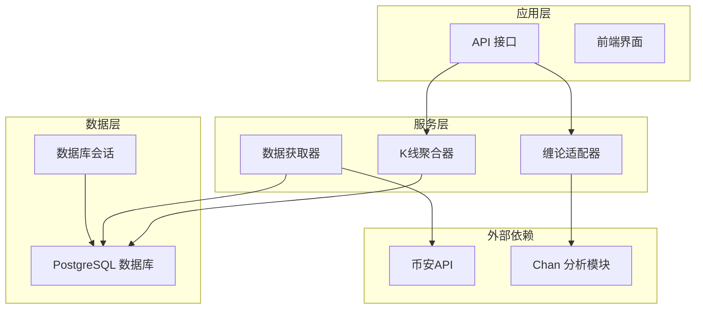
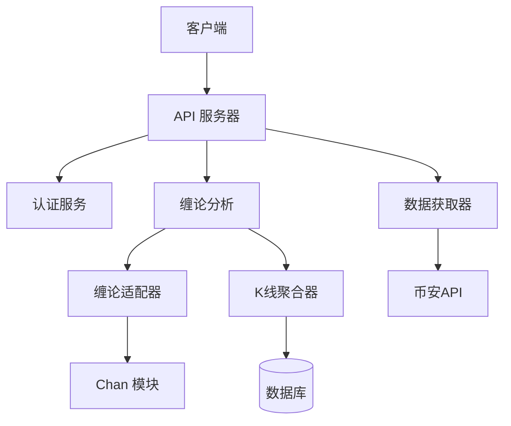
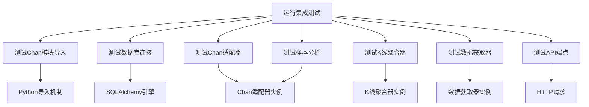
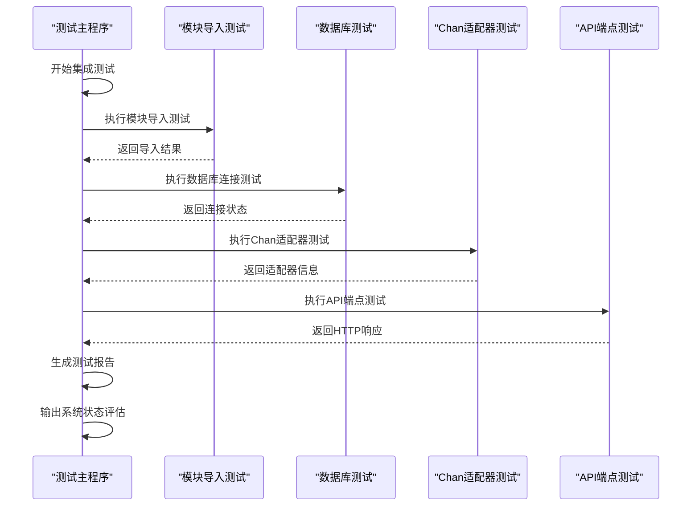
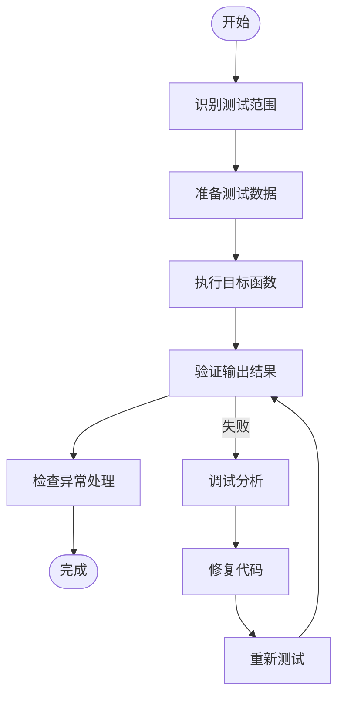
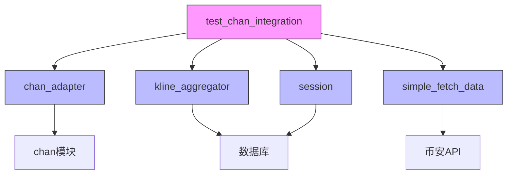

# 测试策略

<cite>
**本文档中引用的文件**   
- [test_chan_integration.py](file://test_chan_integration.py)
- [chan_adapter.py](file://app/services/chan_adapter.py)
- [kline_aggregator.py](file://app/services/kline_aggregator.py)
- [simple_fetch_data.py](file://app/scripts/simple_fetch_data.py)
- [session.py](file://app/db/session.py)
- [chan_analysis.py](file://app/api/v1/endpoints/chan_analysis.py)
- [kline_simple.py](file://app/api/v1/endpoints/kline_simple.py)
- [main.py](file://app/main.py)
</cite>

## 目录
1. [简介](#简介)
2. [项目结构](#项目结构)
3. [核心组件](#核心组件)
4. [架构概述](#架构概述)
5. [详细组件分析](#详细组件分析)
6. [依赖分析](#依赖分析)
7. [性能考虑](#性能考虑)
8. [故障排除指南](#故障排除指南)
9. [结论](#结论)

## 简介
本文档详细说明了缠论分析系统的测试策略和实践，以 `test_chan_integration.py` 为核心，全面解释集成测试的结构和执行流程。文档涵盖模块导入测试、数据库连接测试、API端点测试等关键环节，指导开发者如何编写新的测试用例、运行测试套件以及解读测试报告。同时强调测试覆盖率的重要性，并提供改进测试的具体建议，帮助开发者使用测试脚本验证新功能并防止回归问题。

## 项目结构
本项目采用分层架构设计，主要分为应用层、服务层、数据访问层和外部依赖层。核心功能集中在 `app` 目录下，包括API接口、业务逻辑服务和数据库操作。`chan.py` 子模块作为独立的缠论分析引擎被集成到系统中。测试脚本 `test_chan_integration.py` 位于项目根目录，用于验证整个系统的集成状态。

**图示来源**
- [test_chan_integration.py](file://test_chan_integration.py#L1-L400)
- [app/main.py](file://app/main.py#L1-L110)

## 核心组件
系统的核心组件包括缠论适配器（ChanAdapter）、K线聚合器（KlineAggregator）和数据获取器（SimpleBinanceDataFetcher）。这些组件通过清晰的接口相互协作，形成完整的分析流水线。测试策略重点关注这些核心组件的集成状态和交互正确性。

**章节来源**
- [test_chan_integration.py](file://test_chan_integration.py#L1-L400)
- [chan_adapter.py](file://app/services/chan_adapter.py#L1-L517)
- [kline_aggregator.py](file://app/services/kline_aggregator.py#L1-L251)

## 架构概述
系统采用微服务风格的模块化架构，各组件职责分明。API层负责接收外部请求，服务层处理业务逻辑，数据层管理持久化存储。集成测试验证了从API端点到后端服务再到数据库的完整调用链路，确保各层之间的无缝集成。

**图示来源**
- [test_chan_integration.py](file://test_chan_integration.py#L1-L400)
- [main.py](file://app/main.py#L1-L110)
- [chan_analysis.py](file://app/api/v1/endpoints/chan_analysis.py#L1-L421)

## 详细组件分析

### 集成测试结构分析
`test_chan_integration.py` 文件定义了完整的集成测试流程，包含多个独立的测试函数，每个函数验证系统的一个关键方面。

#### 测试函数结构

**图示来源**
- [test_chan_integration.py](file://test_chan_integration.py#L1-L400)

#### 测试执行流程

**图示来源**
- [test_chan_integration.py](file://test_chan_integration.py#L274-L315)
- [test_chan_integration.py](file://test_chan_integration.py#L309-L347)

### 测试实践指导
本节提供开发者编写和运行测试的具体指导。

#### 编写新测试用例
当添加新功能时，应遵循以下步骤编写相应的测试用例：
1. 确定测试范围：明确要测试的功能边界
2. 准备测试数据：创建代表性的输入数据
3. 调用目标函数：执行被测试的代码
4. 验证输出结果：检查返回值是否符合预期
5. 处理异常情况：测试错误路径和边界条件

**图示来源**
- [test_chan_integration.py](file://test_chan_integration.py#L344-L383)

#### 运行测试套件
测试套件可以通过以下方式运行：
- 直接执行：`python test_chan_integration.py`
- 作为模块：`python -m test_chan_integration`
- 在启动流程中：测试通过后可选择自动启动系统

测试结果以清晰的报告形式输出，包含每个测试项的状态和详细信息，帮助开发者快速定位问题。

**章节来源**
- [test_chan_integration.py](file://test_chan_integration.py#L380-L400)

## 依赖分析
系统依赖关系复杂，涉及内部模块和外部服务。集成测试验证了这些依赖的正确配置和可用性。

**图示来源**
- [test_chan_integration.py](file://test_chan_integration.py#L1-L400)
- [go.mod](file://go.mod#L1-L10)

## 性能考虑
虽然集成测试主要关注功能正确性，但也间接反映了系统的性能特征。测试中包含了对数据库连接、API响应时间和数据处理速度的验证，这些都与系统性能密切相关。建议定期运行集成测试以监控系统性能的变化趋势。

## 故障排除指南
当测试失败时，可以根据测试报告中的建议进行问题排查：

**章节来源**
- [test_chan_integration.py](file://test_chan_integration.py#L344-L383)
- [test_chan_integration.py](file://test_chan_integration.py#L274-L315)

## 结论
`test_chan_integration.py` 提供了一个全面的集成测试框架，有效验证了缠论分析系统的各个关键组件。通过遵循本文档的指导，开发者可以确保新功能的正确集成，防止回归问题，并维持系统的整体稳定性。建议将集成测试作为开发流程的标准环节，以保证软件质量。