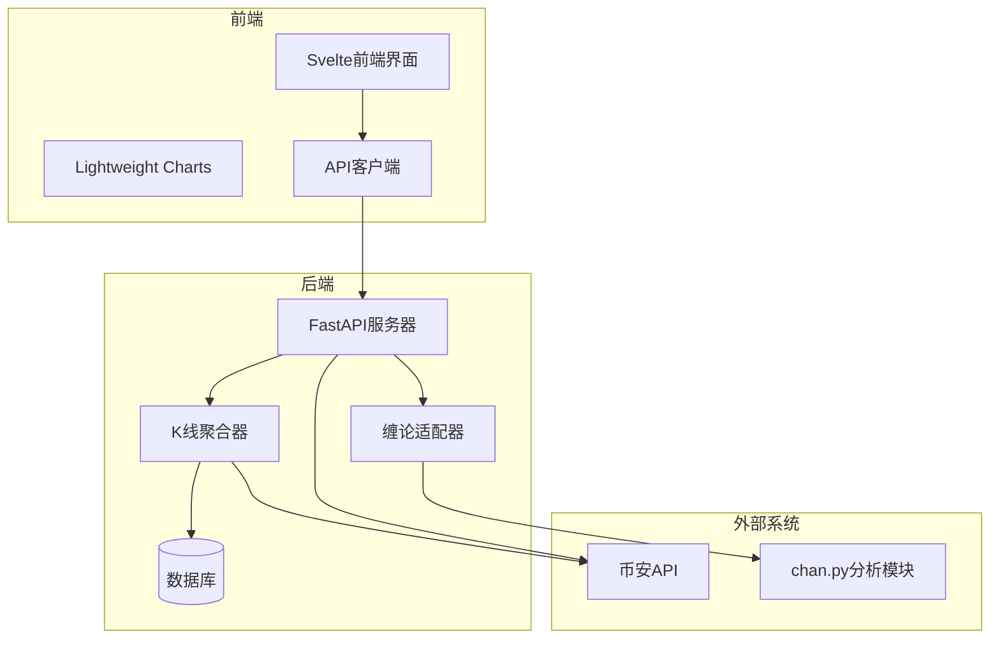
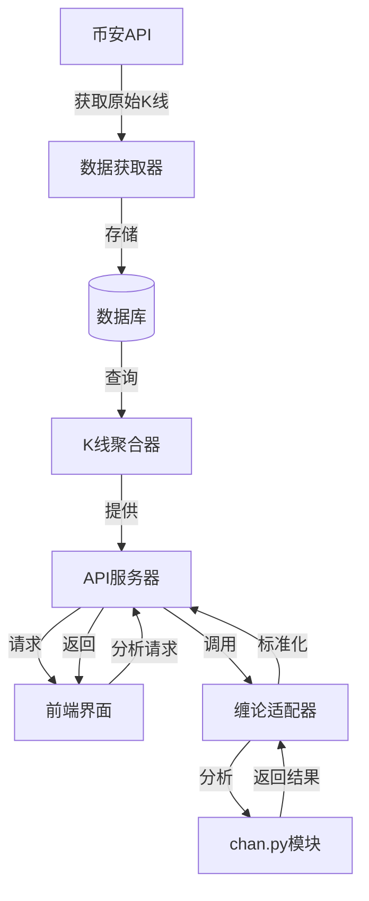
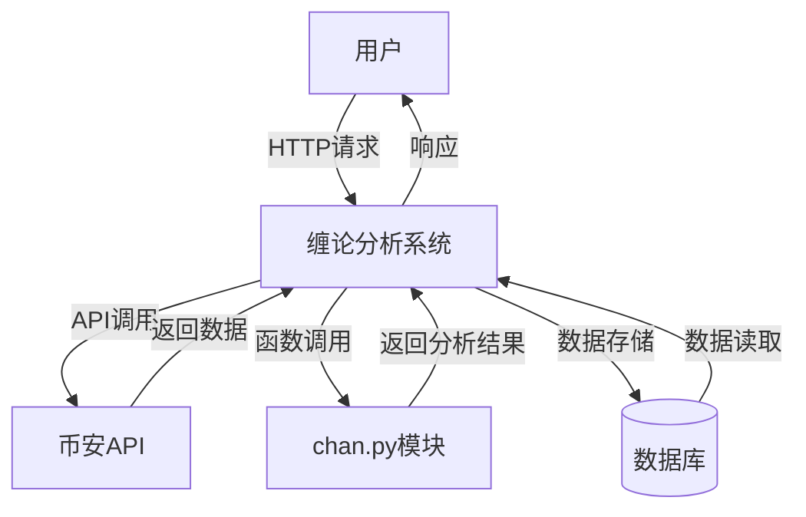

# 系统概述

<cite>
**本文档引用文件**  
- [main.py](file://app/main.py)
- [run.py](file://run.py)
- [kline_simple.py](file://app/api/v1/endpoints/kline_simple.py)
- [chan_analysis.py](file://app/api/v1/endpoints/chan_analysis.py)
- [kline_aggregator.py](file://app/services/kline_aggregator.py)
- [chan_adapter.py](file://app/services/chan_adapter.py)
- [simple_fetch_data.py](file://app/scripts/simple_fetch_data.py)
- [api.js](file://frontend/src/lib/api.js)
- [svelte.config.js](file://frontend/svelte.config.js)
- [vite.config.js.timestamp-1756466902582-2b28726afe1f1.mjs](file://frontend/vite.config.js.timestamp-1756466902582-2b28726afe1f1.mjs)
- [Chan.py](file://chan.py/Chan.py)
- [binance.py](file://chan.py/DataAPI/binance.py)
</cite>

## 目录
1. [系统架构](#系统架构)
2. [核心组件](#核心组件)
3. [数据流与功能](#数据流与功能)
4. [技术栈与依赖](#技术栈与依赖)
5. [系统上下文图](#系统上下文图)

## 系统架构

缠论分析系统（Turtle Chan Analysis System）是一个基于缠中说禅理论的专业数字货币技术分析平台，采用现代化的前后端分离架构。系统由三大核心部分构成：基于FastAPI的后端服务、基于Svelte的前端界面，以及独立的缠论分析模块（chan.py）。这种架构设计实现了关注点分离，提高了系统的可维护性和可扩展性。

后端服务作为系统的核心，负责数据获取、处理和API提供。它通过FastAPI框架构建RESTful API，为前端提供标准化的数据接口。后端不仅从币安等交易所获取实时K线数据，还负责将原始数据存储到数据库，并通过聚合算法生成多时间周期的K线数据。同时，后端集成了独立的缠论分析模块，将复杂的缠论计算逻辑封装在独立组件中，确保了分析算法的独立性和可复用性。

前端界面采用Svelte框架构建，提供了现代化的用户交互体验。前端通过API与后端通信，获取K线数据和缠论分析结果，并使用Lightweight Charts等专业图表库进行可视化展示。前端的模块化设计使得界面组件可以灵活组合，为用户提供丰富的技术分析视图。

**系统架构图**

**Diagram sources**
- [main.py](file://app/main.py)
- [svelte.config.js](file://frontend/svelte.config.js)
- [Chan.py](file://chan.py/Chan.py)

**Section sources**
- [main.py](file://app/main.py)
- [svelte.config.js](file://frontend/svelte.config.js)
- [Chan.py](file://chan.py/Chan.py)

## 核心组件

系统的核心组件包括后端API服务、K线聚合器、缠论适配器和前端API客户端。后端API服务是系统的入口点，通过FastAPI框架提供RESTful接口。K线聚合器负责将1分钟原始K线数据聚合为5分钟、15分钟、1小时等多种时间周期，满足不同交易策略的需求。缠论适配器作为系统的关键集成点，负责调用独立的chan.py模块进行专业的缠论分析。

前端API客户端封装了与后端通信的所有细节，提供了简洁的接口供前端组件调用。这种设计模式不仅简化了前端开发，还实现了API调用的集中管理，便于错误处理和缓存策略的实施。

**Section sources**
- [kline_aggregator.py](file://app/services/kline_aggregator.py)
- [chan_adapter.py](file://app/services/chan_adapter.py)
- [api.js](file://frontend/src/lib/api.js)

## 数据流与功能

系统的主要数据流始于从币安API获取原始K线数据。通过`simple_fetch_data.py`脚本，系统可以定期或手动触发数据获取，将最新的市场数据存储到本地数据库。后端服务通过`kline_aggregator`组件对原始数据进行聚合处理，生成多时间周期的K线数据，支持从1分钟到1天的不同分析需求。

当用户请求缠论分析时，系统首先通过`kline_aggregator`获取指定时间周期的K线数据，然后由`chan_adapter`将数据传递给chan.py模块进行专业分析。分析结果包括分型识别、笔段构建、买卖点分析等，这些结果被标准化后通过API返回给前端。

前端通过`api.js`中的API客户端调用后端服务，获取K线数据和分析结果。系统提供了多种API端点，如`/simple/klines`获取K线数据，`/chan/analyze`执行缠论分析，`/chan/chart-data`获取图表专用数据等。这种细粒度的API设计使得前端可以根据需要灵活获取数据，优化了用户体验。

**数据流图**

**Diagram sources**
- [simple_fetch_data.py](file://app/scripts/simple_fetch_data.py)
- [kline_aggregator.py](file://app/services/kline_aggregator.py)
- [chan_adapter.py](file://app/services/chan_adapter.py)

**Section sources**
- [simple_fetch_data.py](file://app/scripts/simple_fetch_data.py)
- [kline_aggregator.py](file://app/services/kline_aggregator.py)
- [chan_adapter.py](file://app/services/chan_adapter.py)

## 技术栈与依赖

系统采用Python作为后端开发语言，利用其丰富的数据处理和科学计算库。FastAPI框架提供了高性能的API服务，支持异步处理和自动API文档生成。数据库使用SQLAlchemy作为ORM工具，实现了数据库操作的抽象化和安全性。

缠论分析模块（chan.py）是一个独立的Python包，实现了缠中说禅理论的核心算法。该模块通过适配器模式集成到主系统中，确保了分析逻辑的独立性和可测试性。前端采用Svelte框架，以其高性能和简洁的语法著称，配合Vite构建工具实现了快速的开发体验。

系统依赖的主要第三方库包括：ccxt用于连接加密货币交易所，pandas用于数据处理和聚合，lightweight-charts用于前端图表展示。这些经过验证的开源库为系统提供了稳定可靠的基础功能。

**Section sources**
- [requirements.txt](file://requirements.txt)
- [package-lock.json](file://frontend/package-lock.json)

## 系统上下文图

系统上下文图展示了缠论分析系统与其外部环境的交互关系。系统主要与三个外部实体交互：币安API提供原始市场数据，chan.py模块提供专业的缠论分析能力，以及最终用户通过前端界面与系统交互。

系统通过API网关统一对外提供服务，所有内部组件的交互都通过明确定义的接口进行。这种设计不仅提高了系统的安全性，还便于未来的扩展和维护。例如，未来可以轻松添加对其他交易所的支持，或集成其他技术分析模块。

**Diagram sources**
- [main.py](file://app/main.py)
- [simple_fetch_data.py](file://app/scripts/simple_fetch_data.py)
- [Chan.py](file://chan.py/Chan.py)

**Section sources**
- [main.py](file://app/main.py)
- [simple_fetch_data.py](file://app/scripts/simple_fetch_data.py)
- [Chan.py](file://chan.py/Chan.py)