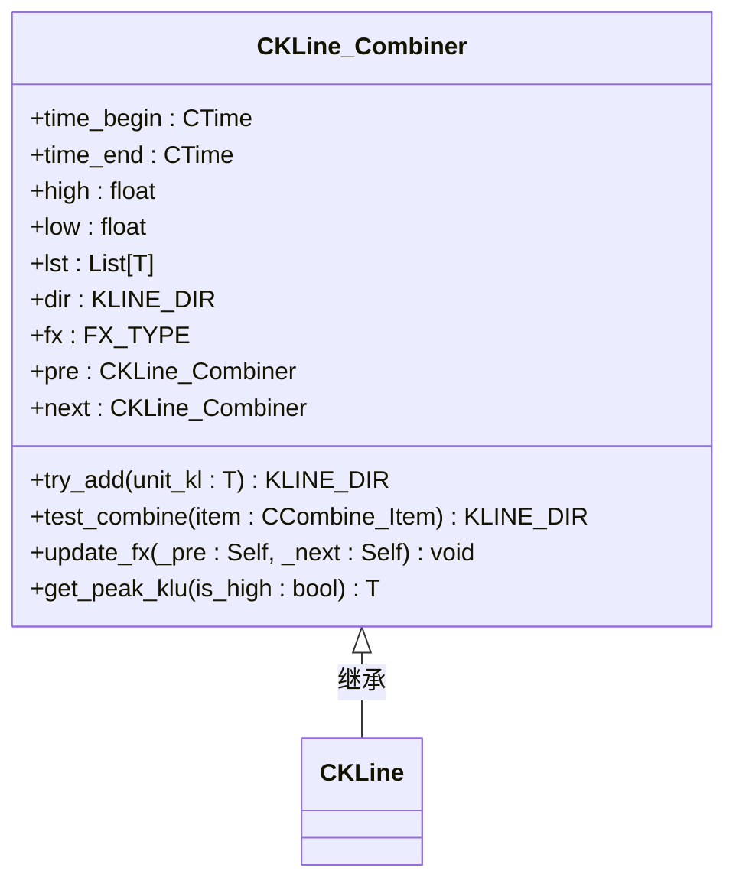
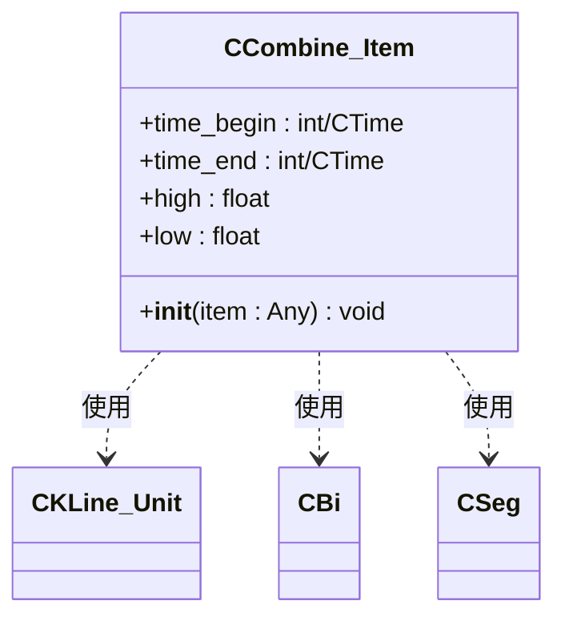
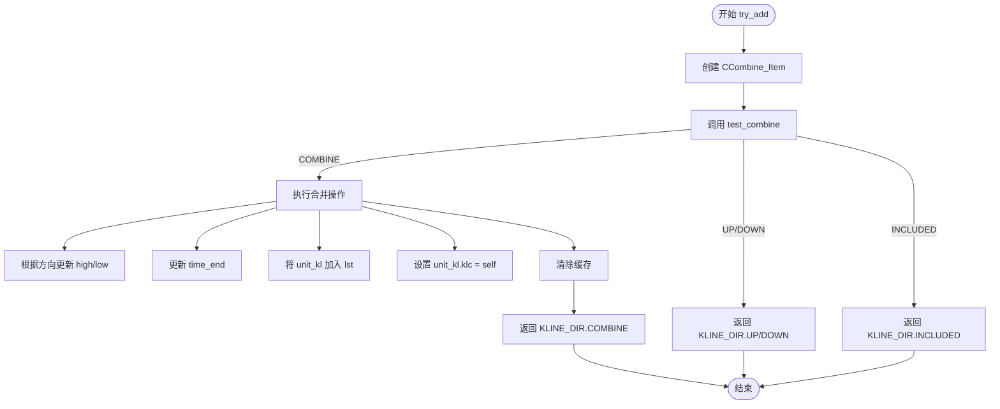
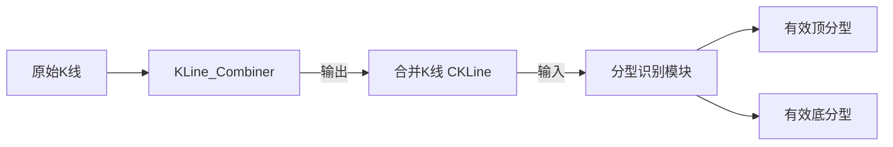

# K线合并逻辑

<cite>
**本文档引用文件**  
- [KLine_Combiner.py](file://chan.py/Combiner/KLine_Combiner.py)
- [Combine_Item.py](file://chan.py/Combiner/Combine_Item.py)
- [KLine.py](file://chan.py/KLine/KLine.py)
- [KLine_Unit.py](file://chan.py/KLine/KLine_Unit.py)
- [CEnum.py](file://chan.py/Common/CEnum.py)
</cite>

## 目录
1. [引言](#引言)
2. [核心组件分析](#核心组件分析)
3. [KLine_Combiner类实现机制](#kline_combiner类实现机制)
4. [Combine_Item中间状态对象](#combine_item中间状态对象)
5. [K线合并流程详解](#k线合并流程详解)
6. [顶底分型前置条件支持](#顶底分型前置条件支持)
7. [实际调用示例](#实际调用示例)
8. [输出作为分型识别输入](#输出作为分型识别输入)

## 引言
在缠论分析体系中，原始交易K线（如1分钟K线）需要经过标准化处理，形成符合缠论理论要求的“合并K线”（CKLine），以确保每根K线具备明确的高低点结构。`KLine_Combiner`类是实现这一过程的核心组件，负责将原始K线序列通过包含关系判断算法进行合并，为后续的顶底分型识别和笔、段划分提供基础数据支持。

## 核心组件分析

**Section sources**
- [KLine_Combiner.py](file://chan.py/Combiner/KLine_Combiner.py#L12-L175)
- [Combine_Item.py](file://chan.py/Combiner/Combine_Item.py#L1-L25)

## KLine_Combiner类实现机制

`CKLine_Combiner` 是一个泛型类，用于封装K线合并的核心逻辑。它通过维护一个合并状态，逐步将符合条件的原始K线（`CKLine_Unit`）合并为一根标准化的“合并K线”。

### 核心属性
- `time_begin` / `time_end`：合并K线的时间范围，由首尾K线决定。
- `high` / `low`：合并K线的最高价和最低价，动态更新。
- `lst`：存储构成该合并K线的所有原始K线单元（`CKLine_Unit`）列表。
- `dir`：表示当前合并K线的方向（`KLINE_DIR.UP` 或 `KLINE_DIR.DOWN`）。
- `fx`：标记该合并K线是否为顶分型（`FX_TYPE.TOP`）或底分型（`FX_TYPE.BOTTOM`）。
- `pre` / `next`：指向前一个和后一个合并K线的指针，用于构建链式结构。

### 核心方法
- `__init__`：以第一个原始K线单元初始化合并器，设置初始的高低点和时间范围。
- `try_add`：尝试将新的原始K线加入当前合并K线，是合并逻辑的核心入口。
- `test_combine`：判断新K线与当前合并K线的关系（合并、向上、向下或包含）。
- `update_fx`：根据前后合并K线的相对位置，判断并设置当前K线是否为顶/底分型。
- `get_peak_klu`：获取构成当前合并K线中最高点或最低点所对应的原始K线单元。



**Diagram sources**
- [KLine_Combiner.py](file://chan.py/Combiner/KLine_Combiner.py#L12-L175)
- [KLine.py](file://chan.py/KLine/KLine.py#L5-L15)

## Combine_Item中间状态对象

`CCombine_Item` 是一个辅助类，用于统一处理不同类型对象（如`CKLine_Unit`、`CBi`、`CSeg`）的合并逻辑。它为`KLine_Combiner`提供了一个标准化的接口，提取出对象的`time_begin`、`time_end`、`high`、`low`四个关键属性。

当`KLine_Combiner`需要比较或合并一个对象时，会先将其包装成一个`CCombine_Item`实例，从而屏蔽了底层对象类型的差异，实现了逻辑的复用。



**Diagram sources**
- [Combine_Item.py](file://chan.py/Combiner/Combine_Item.py#L1-L25)
- [KLine_Combiner.py](file://chan.py/Combiner/KLine_Combiner.py#L52-L55)

## K线合并流程详解

合并过程是一个迭代过程，`KLine_Combiner`通过遍历原始K线序列，应用包含关系判断算法来完成合并。

### 合并判断逻辑 (`test_combine`)
该方法根据当前合并K线与新K线的高低点关系，返回四种可能的方向：
1.  **KLINE_DIR.COMBINE**：两根K线存在包含关系，需要合并。
    - 当前K线完全包含新K线（高更高，低更低）。
    - 新K线完全包含当前K线（高更高，低更低），且`exclude_included`为False。
2.  **KLINE_DIR.INCLUDED**：新K线被当前K线包含，但根据配置（`exclude_included=True`）不进行合并。
3.  **KLINE_DIR.UP**：新K线的高点和低点都高于当前K线，形成向上的独立K线。
4.  **KLINE_DIR.DOWN**：新K线的高点和低点都低于当前K线，形成向下的独立K线。

### 合并执行逻辑 (`try_add`)
1.  创建新K线的`CCombine_Item`。
2.  调用`test_combine`判断关系。
3.  若返回`COMBINE`，则执行合并：
    - 将新K线加入`lst`列表。
    - 如果新K线是`CKLine_Unit`，则设置其`klc`指针指向当前合并器。
    - 根据当前合并方向（`dir`）更新`high`和`low`：
        - **UP方向**：取两者高点的最大值，低点的最大值（处理一字K线）。
        - **DOWN方向**：取两者高点的最小值，低点的最小值（处理一字K线）。
    - 更新`time_end`为新K线的结束时间。
    - 清除缓存。
4.  返回判断结果，供上层逻辑（如`KL_List`）决定后续操作。



**Diagram sources**
- [KLine_Combiner.py](file://chan.py/Combiner/KLine_Combiner.py#L81-L106)
- [KLine_Combiner.py](file://chan.py/Combiner/KLine_Combiner.py#L47-L67)

## 顶底分型前置条件支持

`KLine_Combiner`通过`update_fx`方法为顶底分型的识别提供了前置条件支持。该方法在合并K线链表构建完成后被调用，用于标记哪些合并K线可能是潜在的顶或底。

### 判断逻辑
该方法接收前一个（`_pre`）和后一个（`_next`）合并K线作为参数，通过比较三者的相对高低点来判断：
- **顶分型 (TOP)**：当前K线的高点同时高于前后两个K线的高点，且低点也高于前后K线的低点。
- **底分型 (BOTTOM)**：当前K线的低点同时低于前后两个K线的低点，且高点也低于前后K线的高点。

此判断为后续的分型识别模块提供了候选点，大大简化了搜索范围。

**Section sources**
- [KLine_Combiner.py](file://chan.py/Combiner/KLine_Combiner.py#L106-L137)

## 实际调用示例

以下是一个典型的调用流程，展示如何配置和使用`KLine_Combiner`：

```python
# 假设已有原始K线列表 raw_kline_units
combiner_list = []  # 存储合并后的K线
current_combiner = None

for klu in raw_kline_units:
    if current_combiner is None:
        # 初始化第一个合并器，方向默认为UP
        current_combiner = CKLine_Combiner(klu, KLINE_DIR.UP)
        combiner_list.append(current_combiner)
    else:
        # 尝试将当前K线加入
        result = current_combiner.try_add(klu)
        if result == KLINE_DIR.UP:
            # 形成新的向上K线，创建新的合并器
            current_combiner = CKLine_Combiner(klu, KLINE_DIR.UP)
            combiner_list.append(current_combiner)
        elif result == KLINE_DIR.DOWN:
            # 形成新的向下K线，创建新的合并器
            current_combiner = CKLine_Combiner(klu, KLINE_DIR.DOWN)
            combiner_list.append(current_combiner)
        # 若为COMBINE，则已合并，无需操作

# 构建合并K线链表的前后指针
for i in range(len(combiner_list) - 1):
    combiner_list[i].set_next(combiner_list[i + 1])
    combiner_list[i + 1].set_pre(combiner_list[i])

# 为每个合并K线标记分型
for i in range(1, len(combiner_list) - 1):
    combiner_list[i].update_fx(combiner_list[i-1], combiner_list[i+1])
```

**Section sources**
- [KLine_Combiner.py](file://chan.py/Combiner/KLine_Combiner.py#L81-L137)

## 输出作为分型识别输入

`KLine_Combiner`的输出——即经过合并处理的`CKLine`对象列表——是分型识别模块的直接输入。`CKLine`类继承自`CKLine_Combiner[CKLine_Unit]`，它不仅包含了合并后的价格和时间信息，还通过`update_fx`方法预先标记了潜在的顶底分型点（`fx`属性）。

分型识别模块可以遍历这个`CKLine`列表，直接查找`fx`属性为`FX_TYPE.TOP`或`FX_TYPE.BOTTOM`的节点，然后应用更严格的分型确认规则（例如，检查分型的包含关系处理、缺口等），最终确认有效的顶分型和底分型，为后续的“笔”和“段”的划分奠定基础。



**Diagram sources**
- [KLine.py](file://chan.py/KLine/KLine.py#L5-L15)
- [KLine_Combiner.py](file://chan.py/Combiner/KLine_Combiner.py#L12-L175)