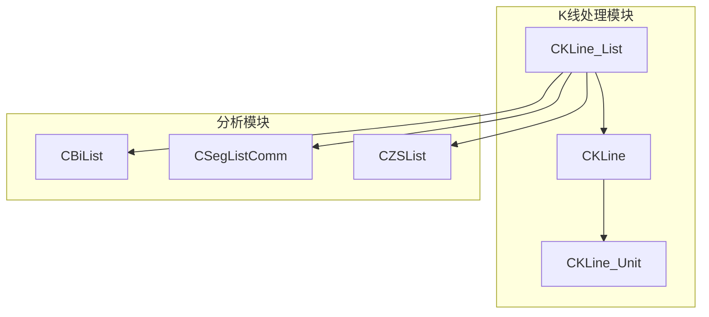
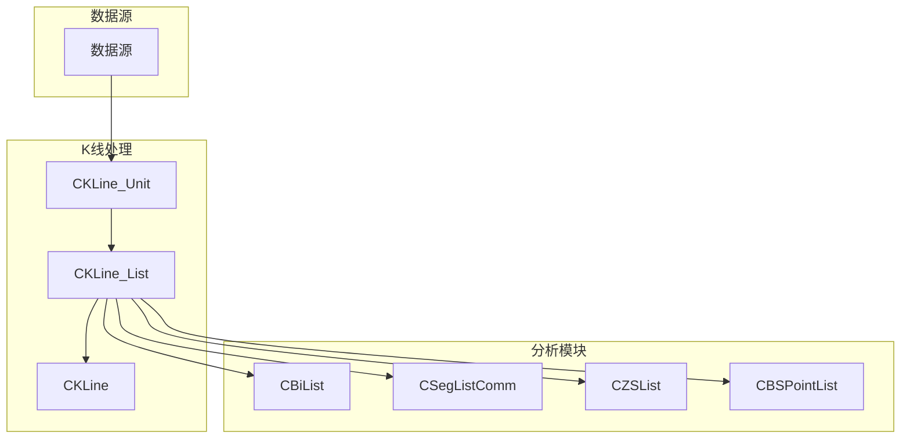
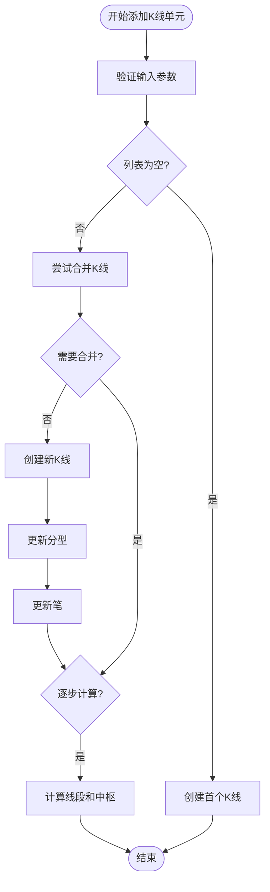
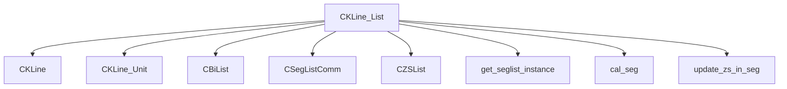

# K线序列管理

<cite>
**本文档引用的文件**
- [KLine_List.py](file://chan.py/KLine/KLine_List.py)
- [KLine_Unit.py](file://chan.py/KLine/KLine_Unit.py)
- [KLine.py](file://chan.py/KLine/KLine.py)
- [Chan.py](file://chan.py/Chan.py)
</cite>

## 目录
1. [简介](#简介)
2. [项目结构](#项目结构)
3. [核心组件](#核心组件)
4. [架构概述](#架构概述)
5. [详细组件分析](#详细组件分析)
6. [依赖分析](#依赖分析)
7. [性能考虑](#性能考虑)
8. [故障排除指南](#故障排除指南)
9. [结论](#结论)

## 简介
`CKLine_List` 类是缠论分析系统中的核心数据结构，负责管理有序的K线序列集合。该类封装了 `CKLine_Unit` 对象列表，提供高效的数据访问接口，如按索引获取、范围查询和尾部追加。它内部维护时间序列一致性机制，确保K线按时间升序排列，并在动态更新场景下自动处理新K线的插入与校验。作为分型检测和笔构建等上层分析模块的数据源，`CKLine_List` 提供稳定的数据访问接口。本文档全面文档化 `CKLine_List` 类的设计与实现。

## 项目结构
`CKLine_List` 类位于 `chan.py/KLine/` 目录下，是缠论分析系统中K线处理模块的核心部分。该模块包含 `KLine_List.py`、`KLine.py` 和 `KLine_Unit.py` 三个主要文件，分别定义了K线序列、合并K线和基础K线单元。`CKLine_List` 与 `CBiList`（笔列表）、`CSegListComm`（线段列表）等组件紧密协作，共同完成技术分析任务。

**图示来源**
- [KLine_List.py](file://chan.py/KLine/KLine_List.py#L32-L64)
- [KLine.py](file://chan.py/KLine/KLine.py#L0-L36)
- [KLine_Unit.py](file://chan.py/KLine/KLine_Unit.py#L0-L36)

**本节来源**
- [KLine_List.py](file://chan.py/KLine/KLine_List.py#L0-L204)
- [KLine.py](file://chan.py/KLine/KLine.py#L0-L97)
- [KLine_Unit.py](file://chan.py/KLine/KLine_Unit.py#L0-L154)

## 核心组件
`CKLine_List` 类是K线序列管理的核心，它封装了 `CKLine` 对象列表，并通过 `add_single_klu` 方法接收 `CKLine_Unit` 对象进行动态更新。该类维护了多个分析组件的实例，包括 `bi_list`（笔列表）、`seg_list`（线段列表）和 `zs_list`（中枢列表），并在K线更新时触发相应的计算逻辑。`__getitem__` 和 `__len__` 方法提供了类似列表的访问接口，使得外部模块可以方便地遍历和查询K线数据。

**本节来源**
- [KLine_List.py](file://chan.py/KLine/KLine_List.py#L32-L64)
- [KLine_List.py](file://chan.py/KLine/KLine_List.py#L116-L150)

## 架构概述
`CKLine_List` 类在系统架构中扮演着数据聚合和分发中心的角色。它接收来自数据源的原始K线数据（`CKLine_Unit`），将其组织成有序的K线序列（`CKLine`），并为上层分析模块提供数据支持。当新K线到来时，`CKLine_List` 负责更新内部状态，并触发笔、线段、中枢等技术指标的重新计算。这种设计实现了数据处理与分析逻辑的解耦，提高了系统的可维护性和扩展性。

**图示来源**
- [KLine_List.py](file://chan.py/KLine/KLine_List.py#L32-L64)
- [Chan.py](file://chan.py/Chan.py#L85)

## 详细组件分析

### CKLine_List 类分析
`CKLine_List` 类通过 `lst` 字段维护一个 `CKLine` 对象列表，确保K线按时间升序排列。`add_single_klu` 方法是其核心功能，负责处理新K线的插入。该方法首先调用 `CKLine` 的 `try_add` 方法判断是否需要合并K线，如果不需要合并，则创建新的 `CKLine` 对象并添加到列表末尾。随后，它会更新倒数第二个K线的分型信息，并触发笔的更新逻辑。如果配置为逐步计算模式（`step_calculation`），还会调用 `cal_seg_and_zs` 方法更新线段和中枢。

**图示来源**
- [KLine_List.py](file://chan.py/KLine/KLine_List.py#L116-L150)

**本节来源**
- [KLine_List.py](file://chan.py/KLine/KLine_List.py#L32-L64)
- [KLine_List.py](file://chan.py/KLine/KLine_List.py#L116-L150)

### 数据访问与遍历
`CKLine_List` 提供了多种数据访问接口。`__getitem__` 方法支持通过索引或切片访问K线，`__len__` 方法返回K线数量。`klu_iter` 方法提供了一个生成器，可以遍历指定起始索引之后的所有 `CKLine_Unit` 对象，方便进行逐根K线的处理。`__deepcopy__` 方法实现了深拷贝逻辑，确保在需要复制 `CKLine_List` 实例时，所有内部对象的状态都能正确复制。

**本节来源**
- [KLine_List.py](file://chan.py/KLine/KLine_List.py#L66-L86)
- [KLine_List.py](file://chan.py/KLine/KLine_List.py#L152-L154)

## 依赖分析
`CKLine_List` 类依赖于多个其他组件。它直接依赖 `CKLine` 和 `CKLine_Unit` 类来构建K线序列，依赖 `CBiList`、`CSegListComm` 和 `CZSList` 类来执行技术分析。`get_seglist_instance` 函数根据配置动态创建不同算法的线段列表实例。`cal_seg` 和 `update_zs_in_seg` 函数负责线段和中枢的计算逻辑。这些依赖关系确保了 `CKLine_List` 能够作为一个完整的数据处理单元，为上层应用提供丰富的分析结果。

**图示来源**
- [KLine_List.py](file://chan.py/KLine/KLine_List.py#L0-L204)

**本节来源**
- [KLine_List.py](file://chan.py/KLine/KLine_List.py#L0-L204)

## 性能考虑
`CKLine_List` 在设计时考虑了性能优化。通过 `step_calculation` 标志位控制是否在每次K线更新时都重新计算所有技术指标，避免了不必要的计算开销。`cal_seg` 函数从后往前遍历笔列表，利用已知的确定线段信息进行剪枝，提高了计算效率。`__deepcopy__` 方法在复制大量数据时可能会成为性能瓶颈，但在实际应用中通常只在特定场景下使用，如回测或状态保存。

## 故障排除指南
在使用 `CKLine_List` 时，常见的问题包括K线时间不一致、数据缺失和配置错误。`Chan` 类中的 `check_kl_consitent` 和 `check_kl_align` 方法可以帮助检测父级和子级K线时间的不一致性。如果出现 `CChanException` 异常，应检查数据源是否提供了完整且有序的K线数据。配置错误通常会导致分析结果异常，应确保 `CChanConfig` 中的参数设置正确。

**本节来源**
- [Chan.py](file://chan.py/Chan.py#L250-L290)

## 结论
`CKLine_List` 类是缠论分析系统中不可或缺的核心组件，它有效地管理了K线序列的生命周期，从数据接收、组织到为上层分析提供支持。其设计体现了高内聚、低耦合的原则，通过清晰的接口和模块化的设计，使得系统易于维护和扩展。理解 `CKLine_List` 的工作原理对于开发和调试基于缠论的交易系统至关重要。