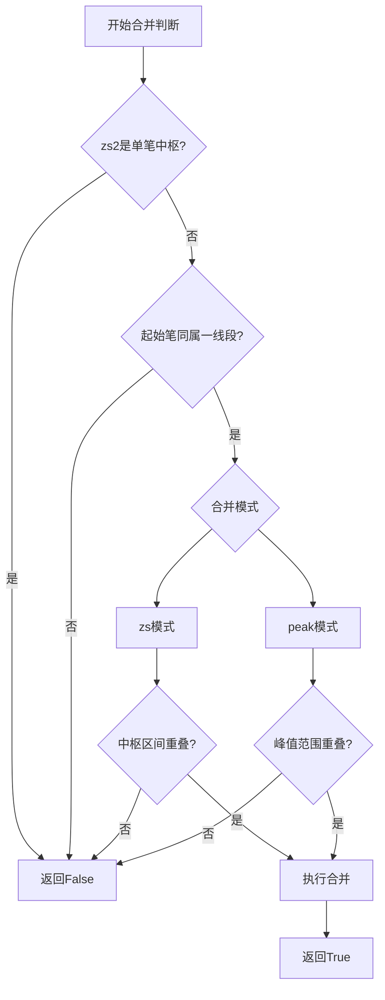
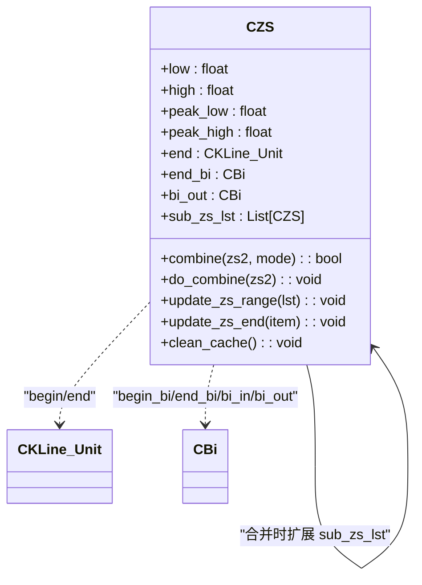
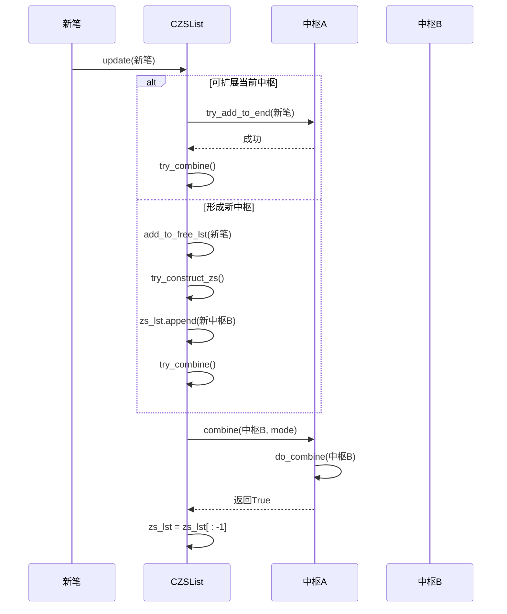

# 中枢合并逻辑

<cite>
**本文档引用文件**  
- [ZS.py](file://chan.py/ZS/ZS.py)
- [ZSList.py](file://chan.py/ZS/ZSList.py)
- [ZSConfig.py](file://chan.py/ZS/ZSConfig.py)
</cite>

## 目录
1. [引言](#引言)
2. [中枢合并条件判断](#中枢合并条件判断)
3. [合并操作的内部实现](#合并操作的内部实现)
4. [循环合并策略与触发机制](#循环合并策略与触发机制)
5. [合并前后结构变化示例](#合并前后结构变化示例)
6. [对买卖点识别的影响分析](#对买卖点识别的影响分析)
7. [总结](#总结)

## 引言
在缠论分析系统中，中枢（ZS）是判断趋势延续与反转的核心结构。当两个相邻中枢满足特定条件时，系统会将其合并为一个更大的中枢，以更准确地反映价格运动的区间聚集特征。本文深度解析中枢合并的实现机制，重点阐述`combine`方法如何根据`zs_combine_mode`参数判断合并条件，`do_combine`方法的内部操作流程，以及`try_combine`在`CZSList`中的触发时机和循环策略。

**Section sources**  
- [ZS.py](file://chan.py/ZS/ZS.py#L0-L234)
- [ZSList.py](file://chan.py/ZS/ZSList.py#L0-L161)

## 中枢合并条件判断

中枢合并的判断由`CZS`类的`combine`方法实现，其逻辑取决于配置参数`zs_combine_mode`，该参数在`CZSConfig`中定义，默认值为`"zs"`。

### zs模式下的重叠检查
当`zs_combine_mode`设置为`"zs"`时，系统检查两个中枢的**价格区间是否重叠**。具体而言，比较当前中枢（`self`）与待合并中枢（`zs2`）的`low`和`high`范围：
- 使用`has_overlap(self.low, self.high, zs2.low, zs2.high, equal=True)`判断区间是否有交集。
- 若存在重叠，则满足合并条件；否则不合并。

此模式强调中枢本体的价格重叠，是传统缠论中判断中枢扩展的标准方式。

### peak模式下的峰值范围检查
当`zs_combine_mode`设置为`"peak"`时，系统检查两个中枢的**峰值范围是否重叠**。峰值范围由`peak_low`和`peak_high`定义，分别表示中枢内所有笔的最低点和最高点。
- 使用`has_overlap(self.peak_low, self.peak_high, zs2.peak_low, zs2.peak_high)`判断峰值区间是否重叠。
- 若重叠，则触发合并。

此模式更为宽松，允许中枢本体不重叠但波动范围有交集时进行合并，适用于捕捉更广泛的盘整区域。

### 其他限制条件
无论何种模式，`combine`方法均需满足以下前置条件：
- `zs2`不能是单笔中枢（`is_one_bi_zs()`为`False`）。
- 两个中枢的起始笔必须属于同一笔段（`seg_idx`相同），确保它们在同一个趋势结构内。

若不满足上述任一条件，合并将被拒绝。



**Diagram sources**  
- [ZS.py](file://chan.py/ZS/ZS.py#L130-L155)

**Section sources**  
- [ZS.py](file://chan.py/ZS/ZS.py#L130-L155)
- [ZSConfig.py](file://chan.py/ZS/ZSConfig.py#L0-L6)

## 合并操作的内部实现

当`combine`方法判定可以合并后，会调用`do_combine`方法执行实际的合并操作。该方法对当前中枢（`self`）进行原地修改，吸收`zs2`的信息。

### 更新中枢范围
- **价格区间**：`low`取两者最小值，`high`取两者最大值，从而扩展中枢的震荡区间。
- **峰值范围**：`peak_low`和`peak_high`同样取最小和最大值，确保覆盖所有历史波动。

### 扩展子中枢列表
- 若当前中枢的`sub_zs_lst`为空，首先将自身的副本（通过`make_copy()`创建）加入列表。
- 然后将`zs2`直接添加到`sub_zs_lst`中。
- 这样，合并后的中枢就包含了其所有历史子结构，形成树状层级。

### 重置结束状态
- **结束K线单元（end）**：更新为`zs2`的`end`。
- **结束笔（end_bi）**：更新为`zs2`的`end_bi`。
- **出中枢笔（bi_out）**：更新为`zs2`的`bi_out`。

这些更新确保了合并后的中枢能正确反映最新的结构终点，为后续的突破判断提供依据。

### 缓存清理
在所有更新操作完成后，调用`clean_cache()`方法清除可能存在的缓存数据，保证后续计算（如`is_divergence`）的准确性。



**Diagram sources**  
- [ZS.py](file://chan.py/ZS/ZS.py#L157-L178)

**Section sources**  
- [ZS.py](file://chan.py/ZS/ZS.py#L157-L178)

## 循环合并策略与触发机制

中枢的合并并非一次性操作，而是一个持续的、循环的过程，由`CZSList`类的`try_combine`方法驱动。

### 触发时机
`try_combine`方法在以下关键时机被调用：
1. **新中枢形成时**：在`add_to_free_lst`方法中，每当成功构造一个新中枢并加入`zs_lst`后，立即调用`try_combine`。
2. **尝试扩展现有中枢时**：在`update`方法中，如果`try_add_to_end`成功（即新笔被添加到当前中枢末尾），也会调用`try_combine`。

这确保了系统在任何可能产生合并的事件发生后，都能立即进行检查。

### 循环合并策略
`try_combine`的核心是一个`while`循环：
```python
while len(self.zs_lst) >= 2 and self.zs_lst[-2].combine(self.zs_lst[-1], combine_mode=self.config.zs_combine_mode):
    self.zs_lst = self.zs_lst[:-1]  # 合并后删除最后一个
```
- **循环条件**：列表中至少存在两个中枢，且倒数第二个中枢（`zs_lst[-2]`）能够成功合并最后一个中枢（`zs_lst[-1]`）。
- **合并操作**：`combine`方法在`zs_lst[-2]`上执行，将`zs_lst[-1]`的信息合并进去。
- **列表更新**：合并成功后，通过切片`zs_lst[:-1]`移除最后一个已被合并的中枢。

这种策略允许**链式合并**。例如，若连续形成三个可合并的中枢A、B、C，系统会先合并A和B，然后立即检查新的A（已包含B）是否能与C合并，从而形成一个包含三者的更大中枢。



**Diagram sources**  
- [ZSList.py](file://chan.py/ZS/ZSList.py#L147-L161)

**Section sources**  
- [ZSList.py](file://chan.py/ZS/ZSList.py#L147-L161)

## 合并前后结构变化示例

假设系统配置`zs_combine_mode="zs"`，并有以下两个相邻中枢：

- **中枢A**：`low=10.0, high=12.0`, 由第3-5笔构成。
- **中枢B**：`low=11.0, high=13.0`, 由第6-8笔构成。

### 合并前
```python
zs_lst = [CZS(3->5), CZS(6->8)]
# 中枢A: low=10.0, high=12.0
# 中枢B: low=11.0, high=13.0
```

### 合并过程
1. `try_combine`被触发。
2. `CZS(3->5).combine(CZS(6->8), "zs")`被调用。
3. 检查区间重叠：`has_overlap(10.0, 12.0, 11.0, 13.0) = True`。
4. 调用`do_combine`：
   - `low = min(10.0, 11.0) = 10.0`
   - `high = max(12.0, 13.0) = 13.0`
   - `sub_zs_lst = [copy of CZS(3->5), CZS(6->8)]`
   - `end_bi`和`bi_out`更新为第8笔。
5. `zs_lst`更新为`[CZS(3->8)]`。

### 合并后
```python
zs_lst = [CZS(3->8)]
# 合并中枢: low=10.0, high=13.0
# sub_zs_lst: [CZS(3->5), CZS(6->8)]
```

**Section sources**  
- [ZS.py](file://chan.py/ZS/ZS.py#L130-L178)
- [ZSList.py](file://chan.py/ZS/ZSList.py#L147-L161)

## 对买卖点识别的影响分析

中枢合并操作对后续的买卖点（Buy/Sell Point）识别具有深远影响：

### 1. 扩大买卖点判断基础
合并后的中枢拥有更宽的价格区间（`low`到`high`）。任何买卖点的识别都必须基于这个新的、更大的区间。例如，三类买卖点要求突破中枢区间，合并后突破的难度增加，信号可能被推迟，但一旦形成，其有效性可能更强。

### 2. 改变背驰判断的参照物
背驰（divergence）判断依赖于进出中枢两笔的力度对比。合并操作会改变`bi_in`（进中枢笔）和`bi_out`（出中枢笔）的定义：
- `bi_in`通常指向合并前第一个子中枢的进中枢笔。
- `bi_out`则指向最后一个子中枢的出中枢笔。
这使得背驰判断跨越了更长的时间和价格范围，可能捕捉到更大级别的趋势衰竭信号。

### 3. 提升结构稳定性
通过合并相邻中枢，系统减少了中枢数量，使整体结构更加稳定和清晰。这有助于过滤掉由短期波动引起的“假”中枢，使分析者能更专注于主要的趋势结构。

### 4. 影响后续中枢的形成
一个大的合并中枢会成为后续价格运动的重要参照。新的笔段需要突破这个大中枢才能确认趋势延续，否则可能被视为在该大中枢内的震荡，从而影响新中枢的划分。

**Section sources**  
- [ZS.py](file://chan.py/ZS/ZS.py#L90-L110)
- [ZS.py](file://chan.py/ZS/ZS.py#L190-L210)

## 总结
中枢合并机制是缠论分析系统中的关键环节，它通过`combine`方法根据`zs_combine_mode`参数灵活判断合并条件（区间重叠或峰值重叠），并通过`do_combine`方法实现中枢范围、子结构列表和结束状态的更新。`CZSList`中的`try_combine`方法在新中枢形成或扩展时被触发，采用循环策略实现链式合并。这一机制不仅动态地优化了中枢结构，使其更符合市场实际走势，而且深刻影响了后续买卖点和背驰的识别逻辑，是系统实现高级别趋势分析的基础。

**Section sources**  
- [ZS.py](file://chan.py/ZS/ZS.py#L0-L234)
- [ZSList.py](file://chan.py/ZS/ZSList.py#L0-L161)