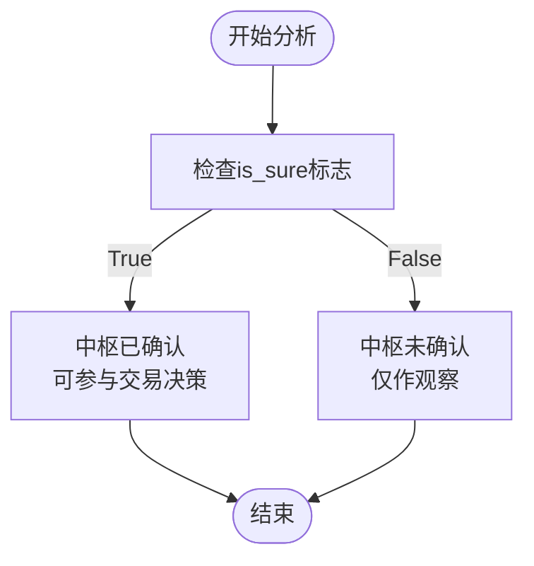

# 中枢核心数据结构

<cite>
**本文档中引用的文件**  
- [ZS.py](file://chan.py/ZS/ZS.py)
- [ZSConfig.py](file://chan.py/ZS/ZSConfig.py)
- [ZSList.py](file://chan.py/ZS/ZSList.py)
- [PlotMeta.py](file://chan.py/Plot/PlotMeta.py)
</cite>

## 目录
1. [引言](#引言)
2. [中枢几何构成](#中枢几何构成)
3. [笔列表与进出中枢逻辑](#笔列表与进出中枢逻辑)
4. [__is_sure标志位的作用](#is_sure标志位的作用)
5. [子中枢列表与合并机制](#子中枢列表与合并机制)
6. [代码示例与交易分析价值](#代码示例与交易分析价值)
7. [结论](#结论)

## 引言
在缠论分析系统中，`CZS`类是中枢（Zhongshu）的核心数据结构，用于描述价格走势中形成的盘整区间。该类不仅记录了中枢的几何边界，还管理了其内部的笔结构、进出关系以及层级合并逻辑。本文将深入解析`CZS`类的内部实现机制，揭示其在实时行情分析中的关键作用。

**Section sources**
- [ZS.py](file://chan.py/ZS/ZS.py#L12-L233)

## 中枢几何构成
`CZS`类通过多个属性精确描述中枢的几何结构，这些属性共同定义了中枢的空间范围和关键点位。

### 起止K线与高低范围
- **begin/end**：始终指向构成中枢的起始和结束K线单元（`CKLine_Unit`），标识中枢在时间轴上的跨度。
- **low/high**：表示中枢的价格区间，即所有构成笔的重叠部分。`low`为各笔最低点的最大值，`high`为各笔最高点的最小值，二者共同构成中枢的有效震荡区域。
- **mid**：中枢中点，计算公式为`(low + high) / 2`，常用于判断价格偏离和均值回归。

### 峰值范围
- **peak_low/peak_high**：记录中枢所涉及所有笔的最低点和最高点，即中枢波动的极值范围。该范围大于等于`low/high`，反映了中枢形成过程中的最大价格波动。


**Diagram sources**
- [ZS.py](file://chan.py/ZS/ZS.py#L12-L233)

**Section sources**
- [ZS.py](file://chan.py/ZS/ZS.py#L12-L45)

## 笔列表与进出中枢逻辑
`CZS`类通过管理笔列表和识别进出中枢的笔，实现了对中枢动态演化过程的跟踪。

### 中枢内部笔列表（bi_lst）
- **bi_lst**：存储从`begin_bi`到`end_bi`之间的所有笔对象。该列表在`update_zs_in_seg`函数中更新，反映了中枢内部的完整笔序列。
- 该列表用于计算中枢的统计特征、判断背驰以及分析内部结构。

### 进出中枢的笔识别
- **bi_in**：指向进入中枢的那一笔，即在中枢形成前最后一笔突破前中枢或趋势线的笔。
- **bi_out**：指向离开中枢的那一笔，即突破当前中枢`low/high`范围的笔，标志着中枢的结束。
- 通过`set_bi_in()`和`set_bi_out()`方法设置，`get_bi_in()`和`get_bi_out()`方法获取，确保了进出关系的明确性。


**Diagram sources**
- [ZS.py](file://chan.py/ZS/ZS.py#L67-L85)
- [ZS.py](file://chan.py/ZS/ZS.py#L210-L233)

**Section sources**
- [ZS.py](file://chan.py/ZS/ZS.py#L67-L85)

## __is_sure标志位的作用
`__is_sure`是`CZS`类中的一个布尔标志位，用于标识该中枢是否为“确认的”中枢。

### 实时分析中的意义
- **实时性判断**：在实时行情中，新形成的中枢可能因后续K线的变动而被修正或取消。`is_sure=True`表示该中枢已经稳定，不会被后续数据修改。
- **策略过滤**：交易策略通常只对`is_sure=True`的中枢做出反应，避免因未确认中枢产生的虚假信号。
- **绘图区分**：在图表绘制时，`is_sure=True`的中枢用实线表示，`False`则用虚线表示，便于用户直观区分。



**Diagram sources**
- [ZS.py](file://chan.py/ZS/ZS.py#L14)
- [PlotMeta.py](file://chan.py/Plot/PlotMeta.py#L90-L118)

**Section sources**
- [ZS.py](file://chan.py/ZS/ZS.py#L14)
- [PlotMeta.py](file://chan.py/Plot/PlotMeta.py#L90-L118)

## 子中枢列表与合并机制
`CZS`类通过`sub_zs_lst`属性和合并算法，实现了中枢的层级结构管理。

### sub_zs_lst的用途
- **层级结构**：`sub_zs_lst`存储了构成当前中枢的子中枢列表。当两个相邻中枢合并时，原中枢成为新中枢的子中枢。
- **历史追溯**：通过遍历`sub_zs_lst`，可以还原中枢的演化过程，分析其扩张或收缩的历史。

### 中枢合并逻辑
- **合并条件**：由`CZSConfig`配置决定，支持两种模式：
  - `zs`模式：要求两个中枢的`low/high`范围有重叠。
  - `peak`模式：要求两个中枢的`peak_low/peak_high`范围有重叠。
- **合并过程**：调用`do_combine()`方法，更新当前中枢的`low/high`、`peak_low/peak_high`、`end`、`bi_out`等属性，并将被合并的中枢加入`sub_zs_lst`。


**Diagram sources**
- [ZS.py](file://chan.py/ZS/ZS.py#L110-L160)
- [ZSConfig.py](file://chan.py/ZS/ZSConfig.py#L0-L5)

**Section sources**
- [ZS.py](file://chan.py/ZS/ZS.py#L110-L160)
- [ZSConfig.py](file://chan.py/ZS/ZSConfig.py#L0-L5)

## 代码示例与交易分析价值
以下示例展示如何通过`CZS`的属性访问关键信息，并解释其在交易分析中的价值。

### 访问中枢关键信息
```python
# 假设 zs 是一个 CZS 实例
print(f"中枢区间: [{zs.low:.2f}, {zs.high:.2f}]")
print(f"中枢中点: {zs.mid:.2f}")
print(f"波动范围: [{zs.peak_low:.2f}, {zs.peak_high:.2f}]")
print(f"是否确认: {zs.is_sure}")
if zs.bi_out:
    print(f"离开笔索引: {zs.bi_out.idx}")
```

### 交易分析价值
- **区间交易**：`low/high`为区间交易提供明确的支撑阻力位，可在`low`附近做多，`high`附近做空。
- **突破策略**：`bi_out`的出现标志着趋势的延续，可作为突破入场信号。
- **背驰判断**：结合`bi_in`和`bi_out`的MACD指标（通过`is_divergence`方法），可判断趋势背驰，预示反转。
- **风险控制**：`peak_low/peak_high`定义了最大波动范围，有助于设置止损和评估风险。

**Section sources**
- [ZS.py](file://chan.py/ZS/ZS.py#L46-L66)
- [ZS.py](file://chan.py/ZS/ZS.py#L161-L180)

## 结论
`CZS`类作为缠论分析系统的核心数据结构，通过精确的几何定义、动态的笔管理、明确的确认机制和灵活的合并策略，全面刻画了价格中枢的形成、演化和终结过程。深入理解其内部结构不仅有助于开发更精准的交易策略，也为实时行情分析提供了坚实的理论基础和数据支持。