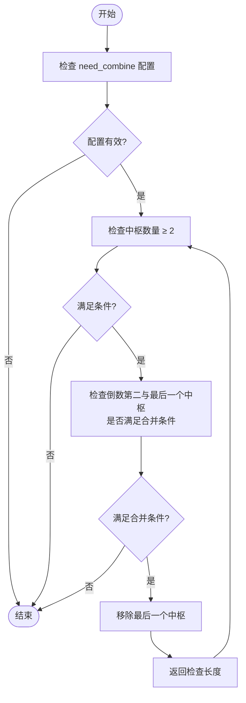
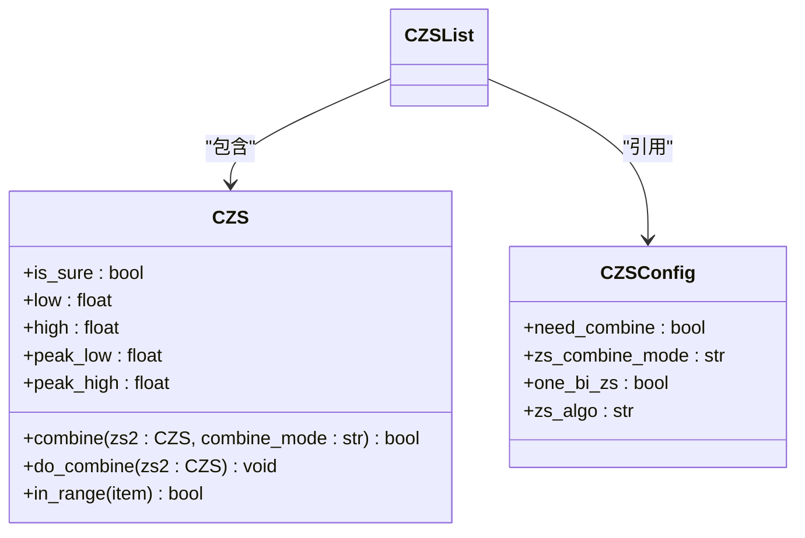

# 链式合并处理机制

<cite>
**Referenced Files in This Document**   
- [ZSList.py](file://chan.py/ZS/ZSList.py)
- [ZS.py](file://chan.py/ZS/ZS.py)
- [ZSConfig.py](file://chan.py/ZS/ZSConfig.py)
</cite>

## Table of Contents
1. [链式合并流程概述](#链式合并流程概述)
2. [try_combine方法实现分析](#try_combine方法实现分析)
3. [中枢合并条件与模式](#中枢合并条件与模式)
4. [last_sure_pos与is_sure标志的作用](#last_sure_pos与is_sure标志的作用)
5. [动态更新过程示意图](#动态更新过程示意图)

## 链式合并流程概述

在缠论分析系统中，中枢（ZS）的链式合并机制是确保中枢序列最简化表达的核心处理流程。当新的中枢生成后，系统通过`try_combine`方法持续检查倒数第二个与最后一个中枢是否满足合并条件。若满足条件，则执行合并操作并移除末尾中枢，此过程在while循环中反复进行，直到无法继续合并为止。该机制有效避免了中枢序列的冗余，确保了技术分析的清晰性和准确性。

**Section sources**
- [ZSList.py](file://chan.py/ZS/ZSList.py#L12-L160)

## try_combine方法实现分析

`try_combine`方法是实现链式合并的核心逻辑，其执行流程如下：

1. 首先检查配置项`need_combine`，若为`False`则直接返回，不执行任何合并操作
2. 进入while循环，条件为中枢列表长度大于等于2且倒数第二个中枢与最后一个中枢满足合并条件
3. 在循环体内，调用`combine`方法判断两个中枢是否可以合并
4. 若满足合并条件，则通过切片操作`self.zs_lst = self.zs_lst[:-1]`移除最后一个中枢，实现合并

该方法在两个关键时机被调用：一是在新中枢成功构造后，二是在尝试将新笔添加到现有中枢末尾时。这种设计确保了中枢序列的实时优化。



**Diagram sources**
- [ZSList.py](file://chan.py/ZS/ZSList.py#L148-L160)

**Section sources**
- [ZSList.py](file://chan.py/ZS/ZSList.py#L148-L160)

## 中枢合并条件与模式

中枢合并的条件由`CZS`类的`combine`方法定义，主要包含以下几种模式：

### 合并模式配置
合并行为受`ZSConfig`中的`zs_combine_mode`参数控制，支持两种模式：
- **"zs"模式**：基于中枢范围（low/high）的重叠判断
- **"peak"模式**：基于中枢涉及笔的极值范围（peak_low/peak_high）的重叠判断

```python
class CZSConfig:
    def __init__(self, need_combine=True, zs_combine_mode="zs", one_bi_zs=False, zs_algo="normal"):
        self.need_combine = need_combine
        self.zs_combine_mode = zs_combine_mode
        self.one_bi_zs = one_bi_zs
        self.zs_algo = zs_algo
```

### 合并条件判断
合并需满足以下基本条件：
1. 待合并的第二个中枢不能是单笔中枢
2. 两个中枢的起始笔必须属于同一线段（seg_idx相同）
3. 根据合并模式，中枢范围或极值范围存在重叠



**Diagram sources**
- [ZS.py](file://chan.py/ZS/ZS.py#L12-L233)
- [ZSConfig.py](file://chan.py/ZS/ZSConfig.py#L1-L6)

**Section sources**
- [ZS.py](file://chan.py/ZS/ZS.py#L120-L145)
- [ZSConfig.py](file://chan.py/ZS/ZSConfig.py#L1-L6)

## last_sure_pos与is_sure标志的作用

`last_sure_pos`和`is_sure`标志在合并过程中起到关键的稳定性保障作用，防止未确认中枢的过早合并影响分析结果。

### last_sure_pos的作用
`last_sure_pos`记录了最后一个已确认线段的起始笔索引，用于确定哪些中枢是基于已确认数据构建的。在`update_last_pos`方法中，系统从后向前遍历线段列表，找到第一个`is_sure`为`True`的线段，并将其起始笔索引赋值给`last_sure_pos`。

### is_sure标志的作用
`is_sure`标志表示中枢或线段的确认状态：
- `True`：表示该中枢/线段已确认，基于完整且不可变的数据
- `False`：表示该中枢/线段未确认，可能随新数据到来而调整

这两个标志共同确保了只有基于已确认数据的中枢才会参与合并过程，避免了因市场数据实时变化导致的分析结果不稳定。当新数据到来可能导致线段调整时，系统会先移除所有起始笔索引大于`last_sure_pos`的中枢，然后重新计算，最后再执行合并。

```mermaid
sequenceDiagram
participant 系统 as 系统
participant 中枢列表 as zs_lst
participant 配置 as config
系统->>系统 : 新中枢生成
系统->>中枢列表 : 添加新中枢
系统->>系统 : 调用 try_combine()
loop 检查合并条件
系统->>配置 : need_combine?
配置-->>系统 : True
系统->>中枢列表 : 长度≥2?
中枢列表-->>系统 : Yes
系统->>CZS : combine(zs[-2], zs[-1])?
CZS-->>系统 : True/False
alt 可以合并
系统->>中枢列表 : 移除最后一个中枢
else 无法合并
break
end
end
系统->>系统 : 合并完成
```

**Diagram sources**
- [ZSList.py](file://chan.py/ZS/ZSList.py#L20-L35)
- [ZSList.py](file://chan.py/ZS/ZSList.py#L148-L160)

**Section sources**
- [ZSList.py](file://chan.py/ZS/ZSList.py#L20-L35)
- [ZSList.py](file://chan.py/ZS/ZSList.py#L148-L160)

## 动态更新过程示意图

中枢列表的动态更新过程体现了链式合并机制的完整生命周期：

1. **初始状态**：中枢列表为空或包含若干已确认中枢
2. **新中枢生成**：基于新笔数据构造新中枢并添加到列表末尾
3. **触发合并**：立即调用`try_combine`方法启动合并流程
4. **循环检查**：持续检查倒数第二与最后一个中枢的合并条件
5. **执行合并**：满足条件时合并并移除末尾中枢
6. **终止条件**：直到无法继续合并或中枢数量少于2

此过程确保了中枢序列始终保持最简化状态，为后续的技术分析提供了清晰、准确的基础数据。

```mermaid
flowchart LR
A[初始中枢序列] --> B[新中枢生成]
B --> C[添加到zs_lst末尾]
C --> D[调用try_combine]
D --> E{need_combine?}
E --> |否| F[结束]
E --> |是| G{len(zs_lst)≥2?}
G --> |否| F
G --> |是| H{zs[-2].combine(zs[-1])?}
H --> |否| F
H --> |是| I[zs_lst = zs_lst[:-1]]
I --> G
```

**Diagram sources**
- [ZSList.py](file://chan.py/ZS/ZSList.py#L148-L160)