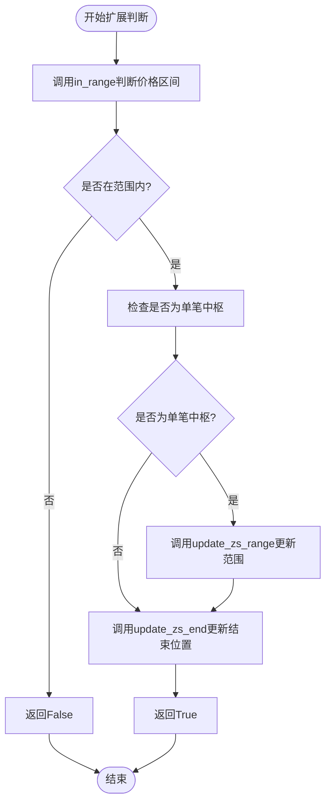
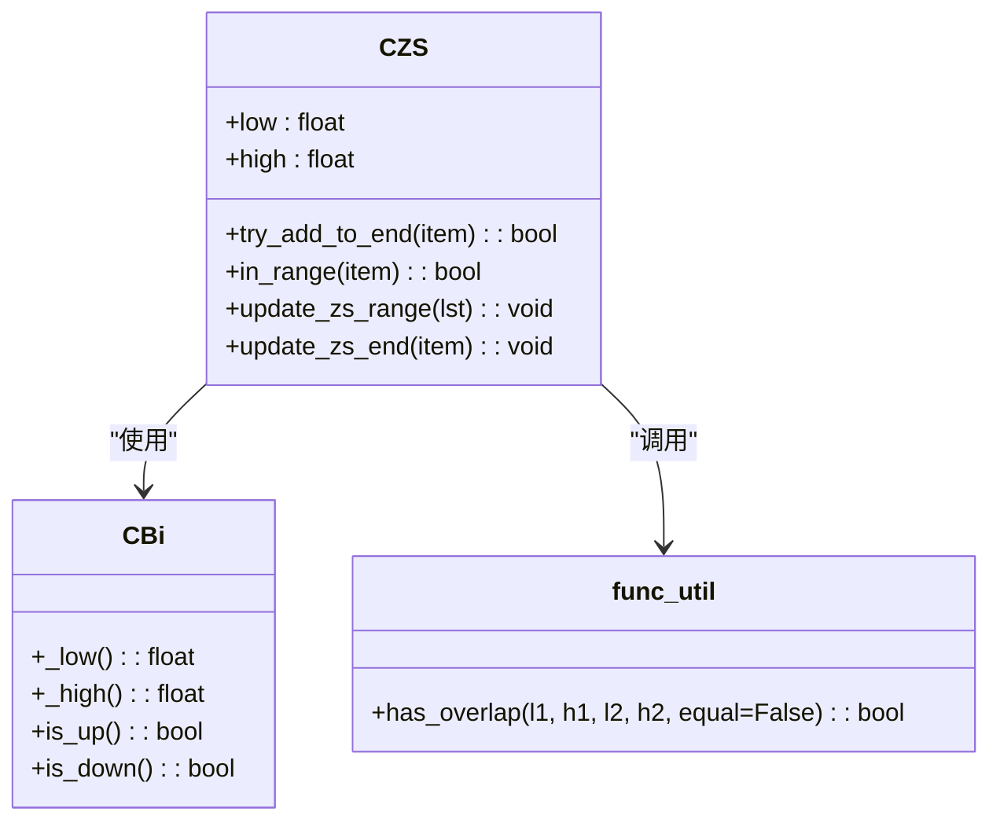
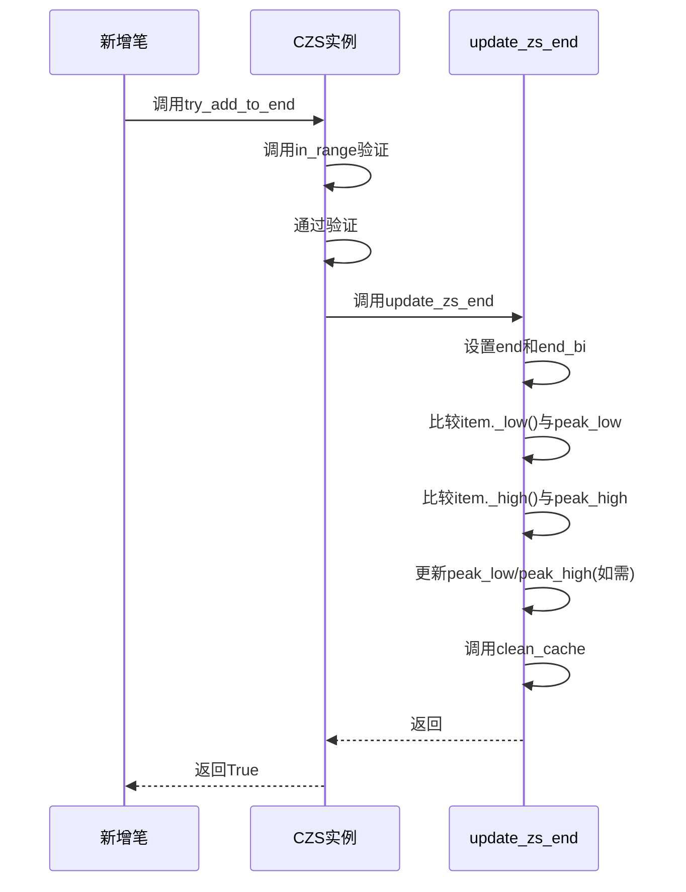

# 中枢扩展机制

<cite>
**Referenced Files in This Document**   
- [ZS.py](file://chan.py/ZS/ZS.py)
- [func_util.py](file://chan.py/Common/func_util.py)
- [ZSList.py](file://chan.py/ZS/ZSList.py)
- [Bi.py](file://chan.py/Bi/Bi.py)
</cite>

## Table of Contents
1. [中枢扩展机制](#中枢扩展机制)
2. [核心组件分析](#核心组件分析)
3. [扩展判断逻辑](#扩展判断逻辑)
4. [价格区间重叠判断](#价格区间重叠判断)
5. [中枢范围更新机制](#中枢范围更新机制)
6. [峰值维护逻辑](#峰值维护逻辑)
7. [实时行情处理意义](#实时行情处理意义)

## 核心组件分析

中枢扩展机制的核心实现位于`CZS`类中，该类负责管理中枢的生命周期和动态扩展。中枢的扩展操作主要通过`try_add_to_end`方法触发，该方法作为中枢扩展的入口点，协调多个内部方法完成扩展逻辑。

**Section sources**
- [ZS.py](file://chan.py/ZS/ZS.py#L12-L233)

## 扩展判断逻辑

中枢的扩展判断由`try_add_to_end`方法主导，该方法首先通过`in_range`函数判断新增笔是否落入现有中枢的价格区间。如果判断结果为否，则直接返回`False`，拒绝扩展。此机制确保了中枢的连续性和逻辑一致性。

当新增笔满足进入条件时，方法会进一步检查中枢是否为单笔中枢（通过`is_one_bi_zs`判断）。如果是单笔中枢，则需要调用`update_zs_range`重新计算中枢范围，因为单笔中枢的高低点范围需要根据新加入的笔进行调整。

**Diagram sources**
- [ZS.py](file://chan.py/ZS/ZS.py#L150-L158)

**Section sources**
- [ZS.py](file://chan.py/ZS/ZS.py#L150-L158)

## 价格区间重叠判断

价格区间重叠判断由`in_range`方法实现，该方法内部调用`has_overlap`函数进行实际的区间比较。`has_overlap`函数接收四个参数：两个区间的低点和高点，通过数学比较判断两个区间是否存在重叠。

中枢的当前价格区间由`low`和`high`属性定义，而新增笔的价格区间通过其`_low()`和`_high()`方法获取。`CBi`类中的`_low`和`_high`方法根据笔的方向（上涨或下跌）返回相应的极值点，确保了价格区间的正确性。

**Diagram sources**
- [ZS.py](file://chan.py/ZS/ZS.py#L155-L156)
- [func_util.py](file://chan.py/Common/func_util.py#L36-L37)
- [Bi.py](file://chan.py/Bi/Bi.py#L270-L277)

**Section sources**
- [ZS.py](file://chan.py/ZS/ZS.py#L155-L156)
- [func_util.py](file://chan.py/Common/func_util.py#L36-L37)

## 中枢范围更新机制

中枢范围的更新由`update_zs_range`方法负责，该方法接收一个笔的列表作为参数，通过遍历列表中的所有笔，计算出新的中枢高低点。具体而言，中枢的低点`low`被设置为所有笔中最高低点（`max(bi._low())`），而高点`high`被设置为所有笔中最低高点（`min(bi._high())`）。

这种计算方式确保了中枢范围是所有构成笔的共同重叠区域，体现了中枢作为价格震荡区间的本质。每次范围更新后，都会调用`clean_cache`方法清除内部缓存，保证后续计算的准确性。

**Section sources**
- [ZS.py](file://chan.py/ZS/ZS.py#L88-L92)

## 峰值维护逻辑

在中枢扩展过程中，`peak_high`和`peak_low`属性的维护对于保持中枢范围的准确性至关重要。这两个属性分别记录了中枢所涉及的所有笔中的最高点和最低点，通过`update_zs_end`方法在每次扩展时进行更新。

当新增一笔时，系统会比较该笔的高低点与当前记录的`peak_high`和`peak_low`。如果新增笔的低点低于当前`peak_low`，则更新`peak_low`；如果其高点高于当前`peak_high`，则更新`peak_high`。这种动态维护机制确保了中枢能够准确反映其历史价格波动范围。

**Diagram sources**
- [ZS.py](file://chan.py/ZS/ZS.py#L100-L108)
- [ZS.py](file://chan.py/ZS/ZS.py#L150-L158)

**Section sources**
- [ZS.py](file://chan.py/ZS/ZS.py#L100-L108)

## 实时行情处理意义

中枢扩展机制在实时行情处理中具有重要意义。通过`ZSList`类的`try_add_to_end`方法，系统能够高效地判断最新笔是否可以扩展现有中枢，而无需重新计算整个中枢序列。这种增量式更新方式极大地提高了处理效率，特别适合高频行情数据的实时分析。

当市场出现连续的价格波动时，该机制能够动态地延长中枢的时间跨度，准确捕捉价格的盘整区间。这对于技术分析中的买卖点识别、趋势判断和风险控制提供了可靠的基础。同时，通过`combine`方法支持的中枢合并功能，系统还能处理复杂的价格结构，为高级分析提供支持。

**Section sources**
- [ZSList.py](file://chan.py/ZS/ZSList.py#L58-L59)