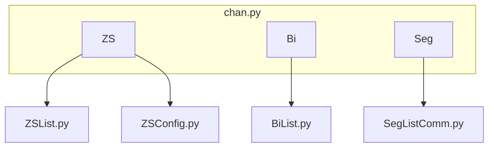
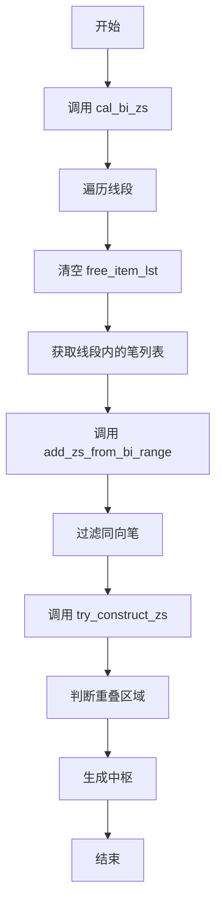
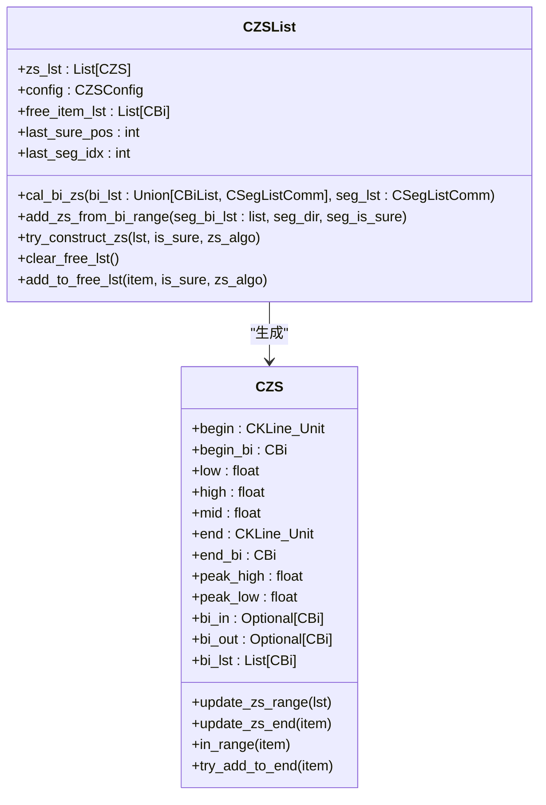
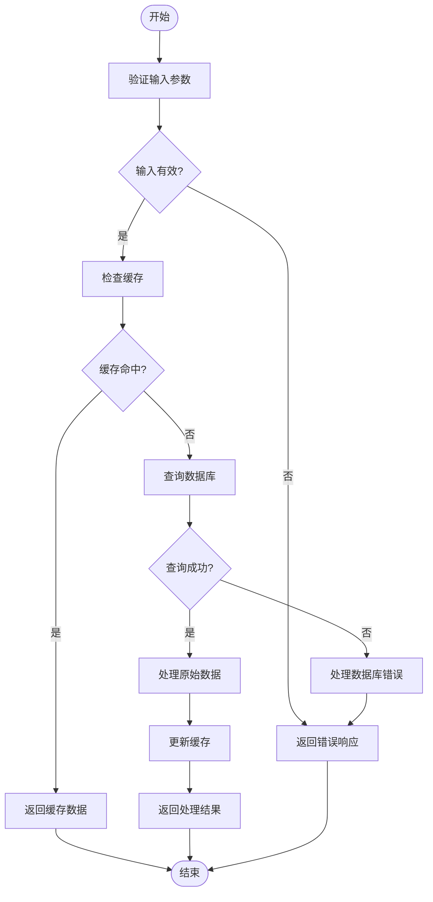
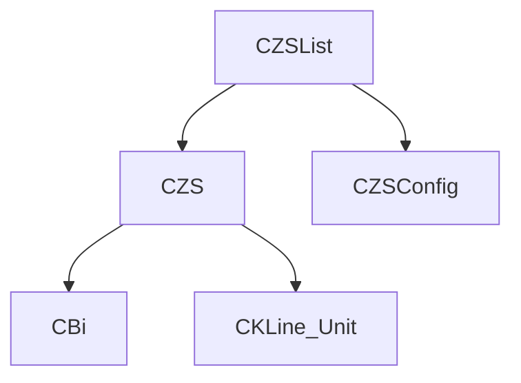

# normal模式中枢构建

<cite>
**本文档中引用的文件**   
- [ZSList.py](file://chan.py/ZS/ZSList.py)
- [ZS.py](file://chan.py/ZS/ZS.py)
- [ZSConfig.py](file://chan.py/ZS/ZSConfig.py)
- [BiList.py](file://chan.py/Bi/BiList.py)
- [SegListComm.py](file://chan.py/Seg/SegListComm.py)
</cite>

## 目录
1. [简介](#简介)
2. [项目结构](#项目结构)
3. [核心组件](#核心组件)
4. [架构概述](#架构概述)
5. [详细组件分析](#详细组件分析)
6. [依赖分析](#依赖分析)
7. [性能考虑](#性能考虑)
8. [故障排除指南](#故障排除指南)
9. [结论](#结论)

## 简介
本文档详细阐述在 `zs_algo='normal'` 模式下，如何基于线段划分的笔列表生成中枢。重点解析从 `CZSList` 类的 `cal_bi_zs` 方法开始的中枢构建流程，说明至少需要两笔重叠才能形成中枢的基本规则，以及 `free_item_lst` 在每一线段内作为临时缓冲区的作用。描述 `clear_free_lst` 在每次新线段处理前的清空机制，并结合 `add_zs_from_bi_range` 方法说明如何过滤与线段同向的笔。通过代码示例展示从线段边界确定到调用 `try_construct_zs` 判断重叠区域的完整过程，包括中枢高低点计算（`min_high > max_low`）和禁止第一笔作为中枢起点的边界条件处理。

## 项目结构
项目结构清晰，主要模块包括 `app`、`chan.py`、`frontend` 等。`chan.py` 模块下包含 `ZS`、`Bi`、`Seg` 等子模块，分别负责中枢、笔、线段的处理。

**图示来源**
- [ZSList.py](file://chan.py/ZS/ZSList.py)
- [ZSConfig.py](file://chan.py/ZS/ZSConfig.py)
- [BiList.py](file://chan.py/Bi/BiList.py)
- [SegListComm.py](file://chan.py/Seg/SegListComm.py)

**节来源**
- [ZSList.py](file://chan.py/ZS/ZSList.py)
- [ZSConfig.py](file://chan.py/ZS/ZSConfig.py)

## 核心组件
`CZSList` 类是中枢列表的核心组件，负责管理中枢的生成和合并。`CZS` 类表示单个中枢，包含中枢的范围、高低点等信息。

**节来源**
- [ZSList.py](file://chan.py/ZS/ZSList.py#L12-L160)
- [ZS.py](file://chan.py/ZS/ZS.py#L12-L233)

## 架构概述
系统架构基于笔和线段的划分，通过 `CZSList` 类的 `cal_bi_zs` 方法生成中枢。中枢的生成依赖于笔的重叠区域，且至少需要两笔重叠才能形成中枢。

**图示来源**
- [ZSList.py](file://chan.py/ZS/ZSList.py#L12-L160)

**节来源**
- [ZSList.py](file://chan.py/ZS/ZSList.py#L12-L160)

## 详细组件分析
### CZSList 类分析
`CZSList` 类负责管理中枢的生成和合并。`cal_bi_zs` 方法是中枢生成的入口，`add_zs_from_bi_range` 方法用于处理线段内的笔列表，`try_construct_zs` 方法用于判断笔的重叠区域。

#### 对象导向组件

**图示来源**
- [ZSList.py](file://chan.py/ZS/ZSList.py#L12-L160)
- [ZS.py](file://chan.py/ZS/ZS.py#L12-L233)

**节来源**
- [ZSList.py](file://chan.py/ZS/ZSList.py#L12-L160)
- [ZS.py](file://chan.py/ZS/ZS.py#L12-L233)

### 复杂逻辑组件

**图示来源**
- [ZSList.py](file://chan.py/ZS/ZSList.py#L12-L160)

**节来源**
- [ZSList.py](file://chan.py/ZS/ZSList.py#L12-L160)

## 依赖分析
`CZSList` 类依赖于 `CZS` 类和 `CZSConfig` 类。`CZS` 类依赖于 `CBi` 类和 `CKLine_Unit` 类。

**图示来源**
- [ZSList.py](file://chan.py/ZS/ZSList.py#L12-L160)
- [ZS.py](file://chan.py/ZS/ZS.py#L12-L233)
- [ZSConfig.py](file://chan.py/ZS/ZSConfig.py#L1-L7)

**节来源**
- [ZSList.py](file://chan.py/ZS/ZSList.py#L12-L160)
- [ZS.py](file://chan.py/ZS/ZS.py#L12-L233)
- [ZSConfig.py](file://chan.py/ZS/ZSConfig.py#L1-L7)

## 性能考虑
中枢生成过程中，`free_item_lst` 作为临时缓冲区，避免了重复计算。`clear_free_lst` 方法在每次新线段处理前清空缓冲区，确保数据的准确性。

## 故障排除指南
常见问题包括中枢生成失败、笔列表为空等。可通过检查 `free_item_lst` 和 `zs_lst` 的状态进行调试。

**节来源**
- [ZSList.py](file://chan.py/ZS/ZSList.py#L12-L160)

## 结论
本文档详细阐述了在 `zs_algo='normal'` 模式下中枢的构建流程，从 `CZSList` 类的 `cal_bi_zs` 方法开始，解析了如何基于线段划分的笔列表生成中枢。重点说明了至少需要两笔重叠才能形成中枢的基本规则，以及 `free_item_lst` 在每一线段内作为临时缓冲区的作用。描述了 `clear_free_lst` 在每次新线段处理前的清空机制，并结合 `add_zs_from_bi_range` 方法说明了如何过滤与线段同向的笔。通过代码示例展示了从线段边界确定到调用 `try_construct_zs` 判断重叠区域的完整过程，包括中枢高低点计算（`min_high > max_low`）和禁止第一笔作为中枢起点的边界条件处理。