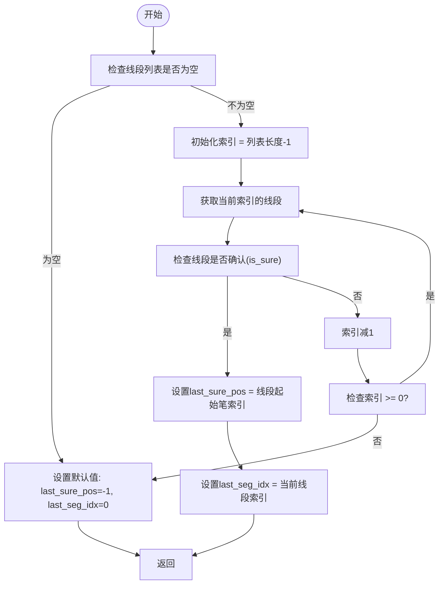
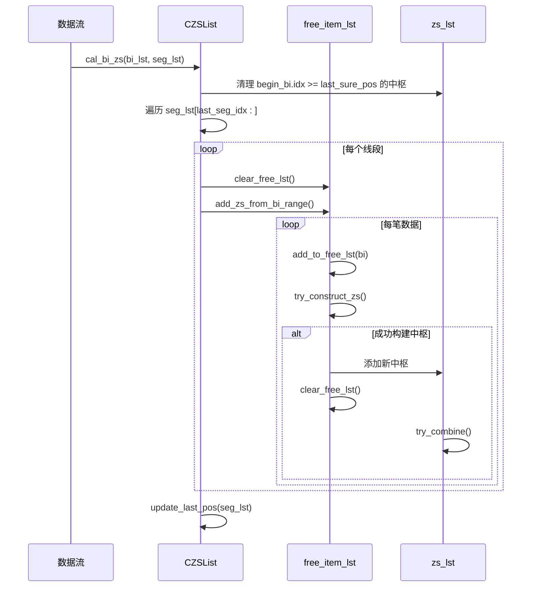

# 中枢状态管理

<cite>
**本文档中引用的文件**   
- [ZSList.py](file://chan.py/ZS/ZSList.py)
- [ZS.py](file://chan.py/ZS/ZS.py)
- [SegListComm.py](file://chan.py/Seg/SegListComm.py)
</cite>

## 目录
1. [引言](#引言)
2. [核心状态变量](#核心状态变量)
3. [last_sure_pos与last_seg_idx的作用](#last_sure_pos与last_seg_idx的作用)
4. [update_last_pos方法解析](#update_last_pos方法解析)
5. [free_item_lst缓冲区机制](#free_item_lst缓冲区机制)
6. [clear_free_lst调用时机](#clear_free_lst调用时机)
7. [状态协同工作机制](#状态协同工作机制)
8. [总结](#总结)

## 引言
在缠论中枢识别系统中，状态管理是确保分析过程稳定性和一致性的关键。`CZSList`类作为中枢列表的核心管理器，通过一系列状态变量和方法协调中枢的构建、更新与合并过程。本文将深入解析其中的关键状态管理机制，包括`last_sure_pos`、`last_seg_idx`、`free_item_lst`等变量的作用及其协同工作原理。

## 核心状态变量
`CZSList`类维护了多个关键状态变量，用于跟踪中枢识别过程中的动态变化：

- **zs_lst**: 存储已确认的中枢列表
- **config**: 中枢配置对象，控制识别算法行为
- **free_item_lst**: 临时缓冲区，用于暂存未确认的笔或线段
- **last_sure_pos**: 记录最后一个确认线段的起始笔索引
- **last_seg_idx**: 记录最后一个确认线段的索引

这些变量共同构成了中枢识别的状态上下文，确保系统能够在增量数据到来时正确地进行重新计算和状态更新。

**Section sources**
- [ZSList.py](file://chan.py/ZS/ZSList.py#L12-L16)

## last_sure_pos与last_seg_idx的作用
`last_sure_pos`和`last_seg_idx`是两个关键的状态追踪变量，它们共同定义了可重新计算的起点边界。

`last_sure_pos`记录了最后一个被确认线段（`is_sure=True`）的起始笔（`start_bi`）的索引位置。这个值作为中枢重算的安全边界，确保只有从该位置之后的数据才会被重新处理。通过这种方式，系统避免了对已确认历史数据的重复计算，提高了处理效率。

`last_seg_idx`则记录了最后一个确认线段在整个线段列表中的索引位置。它与`last_sure_pos`配合使用，提供了双重定位机制：`last_seg_idx`用于快速定位线段位置，而`last_sure_pos`用于精确到笔级别的计算边界。

这两个变量的组合使用确保了中枢识别过程的稳定性，即使在市场数据出现回溯修正的情况下，也能保证分析结果的一致性。

**Section sources**
- [ZSList.py](file://chan.py/ZS/ZSList.py#L15-L16)

## update_last_pos方法解析
`update_last_pos`方法是中枢状态管理的核心，负责定位最后一个确认线段的位置，从而确定可重新计算的起点。

该方法从线段列表的末尾开始逆向遍历，查找第一个`is_sure=True`的线段。一旦找到，立即设置`last_sure_pos`为该线段起始笔的索引，并将`last_seg_idx`设为该线段的索引，然后返回。如果未找到确认线段，则保持初始值（`last_sure_pos=-1`, `last_seg_idx=0`）。

这种方法的设计优势在于：
1. **高效性**: 逆向遍历确保在找到第一个确认线段后立即停止，避免了全量扫描
2. **确定性**: 总是选择最新的确认线段作为基准，保证了状态的一致性
3. **安全性**: 通过笔索引而非线段索引作为计算边界，提供了更精细的控制粒度

此方法在每次中枢计算完成后被调用，确保状态变量始终反映最新的确认数据边界。

**Diagram sources**
- [ZSList.py](file://chan.py/ZS/ZSList.py#L18-L26)

**Section sources**
- [ZSList.py](file://chan.py/ZS/ZSList.py#L18-L26)

## free_item_lst缓冲区机制
`free_item_lst`作为临时缓冲区，在未确认数据处理中扮演着至关重要的角色。它主要用于暂存那些尚未形成完整中枢的笔或线段数据。

当系统接收到新的笔数据时，首先将其添加到`free_item_lst`中。随后尝试使用`try_construct_zs`方法基于缓冲区中的数据构建中枢。如果成功构建出有效中枢（满足重叠条件且非第一笔），则将该中枢添加到主列表`zs_lst`中，并清空缓冲区。

这种缓冲机制的优势包括：
1. **容错性**: 允许系统在数据不完整时暂存信息，等待后续数据确认
2. **灵活性**: 支持不同算法模式（normal、over_seg、auto）下的中枢构建
3. **一致性**: 通过集中管理未确认数据，避免了状态碎片化

缓冲区还包含防重机制：当新加入的笔与缓冲区末尾笔的索引相同时，会先移除末尾笔再添加新笔，防止因笔的新高/新低更新导致的状态错误。

**Section sources**
- [ZSList.py](file://chan.py/ZS/ZSList.py#L14)

## clear_free_lst调用时机
`clear_free_lst`方法的调用时机严格遵循中枢识别的逻辑流程，主要在以下三种情况下触发：

1. **成功构建中枢后**: 当`add_to_free_lst`方法成功构造出有效中枢并添加到`zs_lst`时，立即调用`clear_free_lst`清空缓冲区
2. **开始新线段处理前**: 在`cal_bi_zs`方法中，每当开始处理一个新的线段范围时，都会先调用`clear_free_lst`确保缓冲区干净
3. **算法模式切换时**: 在"auto"算法模式下，当从一种构建策略切换到另一种时，会先清空缓冲区再开始新的构建过程

这种严格的清空策略确保了每次中枢构建都是基于清晰的上下文，避免了跨线段或跨算法模式的数据污染。同时，它也实现了缓冲区的资源回收，防止内存无限增长。

**Section sources**
- [ZSList.py](file://chan.py/ZS/ZSList.py#L38)
- [ZSList.py](file://chan.py/ZS/ZSList.py#L75)
- [ZSList.py](file://chan.py/ZS/ZSList.py#L90)

## 状态协同工作机制
`CZSList`中的各个状态变量通过精心设计的协同机制，共同确保中枢识别的稳定性和一致性。

整个工作流程始于`cal_bi_zs`方法的调用。该方法首先根据`last_sure_pos`清理可能失效的尾部中枢，然后从`last_seg_idx`开始遍历线段列表。对于每个需要计算的线段（通过`seg_need_cal`判断），先清空`free_item_lst`，然后逐笔处理构建潜在中枢。

当新数据到来时，`update`方法会尝试将其直接附加到现有中枢末尾（通过`try_add_to_end`），若失败则加入`free_item_lst`缓冲区。一旦缓冲区中的数据满足中枢条件，立即创建新中枢，清空缓冲区，并尝试与前一个中枢合并（`try_combine`）。

`update_last_pos`在每次完整计算周期结束时被调用，更新`last_sure_pos`和`last_seg_idx`，为下一次增量计算建立新的基准。这种"计算-清理-定位"的循环确保了系统状态的持续同步和一致性。

**Diagram sources**
- [ZSList.py](file://chan.py/ZS/ZSList.py#L70-L158)

**Section sources**
- [ZSList.py](file://chan.py/ZS/ZSList.py#L70-L158)

## 总结
`CZSList`类通过`last_sure_pos`、`last_seg_idx`和`free_item_lst`等状态变量的协同工作，构建了一个稳健的中枢识别状态管理系统。`last_sure_pos`和`last_seg_idx`共同定义了安全的重算边界，`update_last_pos`方法确保了这一边界的准确更新，而`free_item_lst`作为临时缓冲区则提供了处理未确认数据的灵活性。这些机制的有机结合，使得系统能够在保证分析结果一致性的同时，高效地处理增量市场数据。