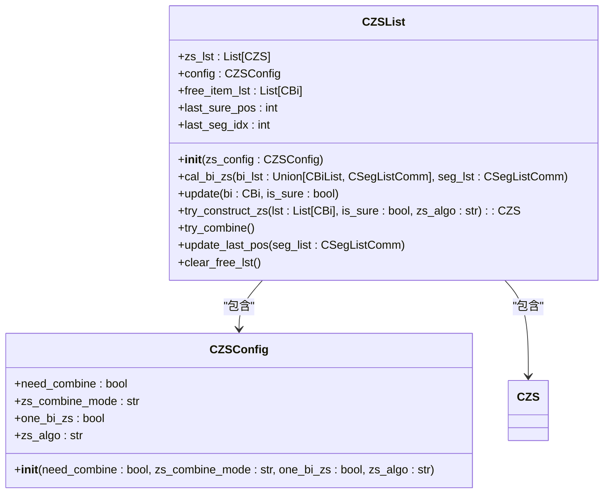
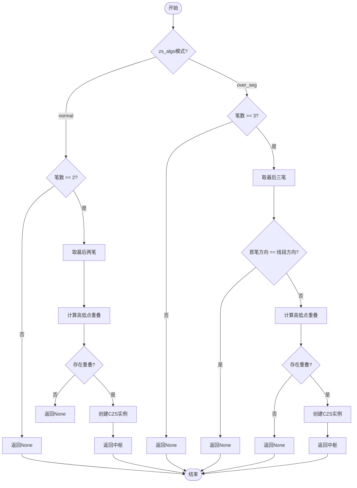
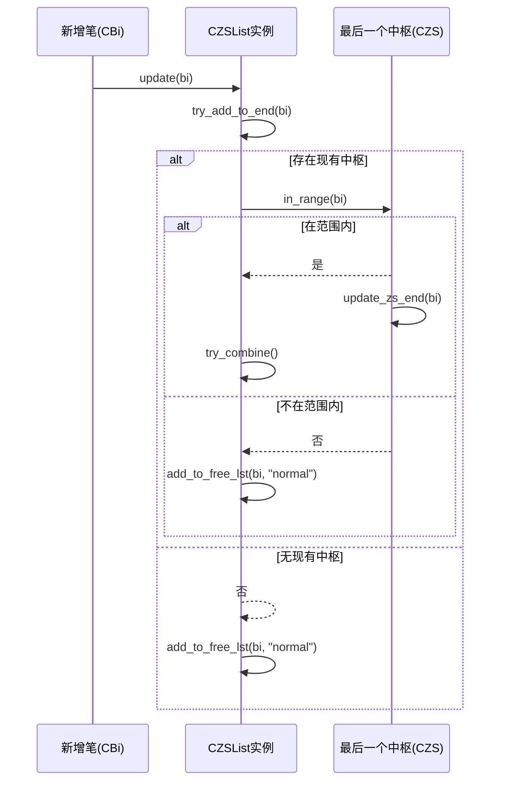
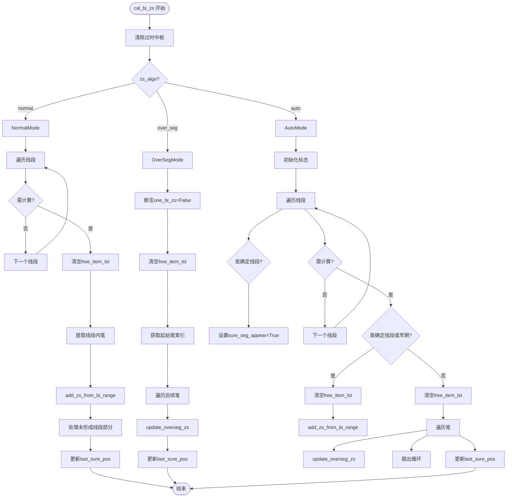

# 中枢识别算法实现

<cite>
**本文档引用文件**  
- [ZSList.py](file://chan.py/ZS/ZSList.py)
- [ZS.py](file://chan.py/ZS/ZS.py)
- [ZSConfig.py](file://chan.py/ZS/ZSConfig.py)
- [Bi.py](file://chan.py/Bi/Bi.py)
- [BiList.py](file://chan.py/Bi/BiList.py)
</cite>

## 目录
1. [引言](#引言)
2. [中枢识别核心流程](#中枢识别核心流程)
3. [CZSList类结构与状态管理](#czslist类结构与状态管理)
4. [中枢构建逻辑：try_construct_zs方法](#中枢构建逻辑try_construct_zs方法)
5. [实时数据处理：update与try_add_to_end方法](#实时数据处理update与try_add_to_end方法)
6. [中枢合并机制：try_combine方法](#中枢合并机制try_combine方法)
7. [完整中枢生成流程：cal_bi_zs方法](#完整中枢生成流程cal_bi_zs方法)
8. [边界条件与异常处理](#边界条件与异常处理)
9. [总结](#总结)

## 引言
中枢识别是缠论分析体系中的核心环节，用于捕捉价格走势中的盘整区间。本文档系统阐述了中枢识别的完整算法流程，重点解析`CZSList`类中`cal_bi_zs`方法如何基于笔或线段列表逐步构建中枢。详细说明`try_construct_zs`函数在不同`zs_algo`模式下的中枢生成逻辑，包括`normal`模式和`over_seg`模式的具体要求。同时，解释`free_item_lst`临时列表的作用及其在实时数据流中的缓冲机制，并描述`update`和`try_add_to_end`方法如何处理新增笔数据并尝试扩展现有中枢。

**Section sources**
- [ZSList.py](file://chan.py/ZS/ZSList.py#L12-L160)

## 中枢识别核心流程
中枢识别算法以笔（CBi）为基础单元，通过检测笔之间的重叠区域来构建中枢（CZS）。整个流程由`CZSList`类管理，其核心方法`cal_bi_zs`负责协调笔列表与线段列表，按照配置的算法模式（`zs_algo`）逐步生成中枢。算法支持三种模式：`normal`、`over_seg`和`auto`，分别对应不同的中枢构建规则。

**Section sources**
- [ZSList.py](file://chan.py/ZS/ZSList.py#L12-L160)

## CZSList类结构与状态管理
`CZSList`类是中枢列表的管理容器，负责维护当前已识别的中枢列表、临时缓冲区以及与线段相关的状态信息。

**Diagram sources**
- [ZSList.py](file://chan.py/ZS/ZSList.py#L12-L160)
- [ZSConfig.py](file://chan.py/ZS/ZSConfig.py#L1-L7)

**Section sources**
- [ZSList.py](file://chan.py/ZS/ZSList.py#L12-L160)
- [ZSConfig.py](file://chan.py/ZS/ZSConfig.py#L1-L7)

## 中枢构建逻辑：try_construct_zs方法
`try_construct_zs`方法是中枢生成的核心逻辑，根据不同的`zs_algo`模式判断输入的笔列表是否能构成一个有效的中枢。

**Diagram sources**
- [ZSList.py](file://chan.py/ZS/ZSList.py#L72-L88)

**Section sources**
- [ZSList.py](file://chan.py/ZS/ZSList.py#L72-L88)

### normal模式
在`normal`模式下，算法要求至少有两笔（除非配置`one_bi_zs`为`True`）且这两笔存在价格重叠区域。算法会取输入列表中的最后两笔进行重叠判断。中枢的高低点范围由这两笔的最高点中的最低值和最低点中的最高值确定。

### over_seg模式
在`over_seg`模式下，算法要求至少有三笔，且首笔的方向必须与所属线段的方向相反。这是为了确保中枢的形成是基于对线段方向的有效回撤。同样，需要这三笔中存在价格重叠区域才能构成中枢。

## 实时数据处理：update与try_add_to_end方法
`update`方法是处理新增笔数据的入口。它首先尝试调用`try_add_to_end`方法，看是否能将新笔直接添加到现有中枢的末端。如果成功，则可能触发中枢合并；如果失败，则将新笔加入`free_item_lst`临时列表，并以`normal`模式尝试构建新中枢。

`try_add_to_end`方法检查当前最后一个中枢是否能容纳新笔。它通过调用中枢的`in_range`方法判断新笔的价格区间是否与中枢的高低范围有重叠。如果有重叠，则调用中枢的`try_add_to_end`方法更新中枢的结束位置。

**Diagram sources**
- [ZSList.py](file://chan.py/ZS/ZSList.py#L58-L65)
- [ZS.py](file://chan.py/ZS/ZS.py#L120-L125)

**Section sources**
- [ZSList.py](file://chan.py/ZS/ZSList.py#L58-L65)
- [ZS.py](file://chan.py/ZS/ZS.py#L120-L125)

## 中枢合并机制：try_combine方法
`try_combine`方法负责将符合条件的相邻中枢进行合并。该操作仅在`config.need_combine`为`True`时执行。合并的条件取决于`zs_combine_mode`配置：
- `zs`模式：要求两个中枢的价格范围（`low`到`high`）存在重叠。
- `peak`模式：要求两个中枢所涉及笔的极值范围（`peak_low`到`peak_high`）存在重叠。

合并后，原中枢的范围会被扩展，并将其加入`sub_zs_lst`子中枢列表中。

**Section sources**
- [ZSList.py](file://chan.py/ZS/ZSList.py#L154-L160)
- [ZS.py](file://chan.py/ZS/ZS.py#L105-L118)

## 完整中枢生成流程：cal_bi_zs方法
`cal_bi_zs`方法是中枢识别的总调度器，它协调笔列表和线段列表，按照配置的算法模式执行完整的中枢生成流程。

**Diagram sources**
- [ZSList.py](file://chan.py/ZS/ZSList.py#L89-L153)

**Section sources**
- [ZSList.py](file://chan.py/ZS/ZSList.py#L89-L153)

### normal模式流程
1.  **状态清理**：移除所有起始位置在`last_sure_pos`之后的中枢，确保计算基于确定的线段。
2.  **遍历线段**：从`last_seg_idx`开始，遍历每一个线段。
3.  **笔列表提取**：对于每个线段，提取其内部的所有笔。
4.  **中枢构建**：调用`add_zs_from_bi_range`方法，该方法会将线段内的第一笔加入`free_item_lst`并尝试构建中枢，后续笔则通过`update`方法处理。
5.  **处理尾部**：处理最后一个线段之后、尚未形成新线段的笔数据。

### over_seg模式流程
该模式不依赖线段划分，而是从上一个中枢的结束位置之后开始，逐笔调用`update_overseg_zs`方法进行处理。此方法会检查新笔是否能与现有中枢合并或直接扩展，否则将其加入`free_item_lst`并以`over_seg`模式尝试构建新中枢。

## 边界条件与异常处理
算法在设计时充分考虑了多种边界和异常情况：
- **第一笔中枢**：通过`res.begin_bi.idx > 0`的判断，禁止第一笔就作为中枢的起点。
- **重复笔索引**：在`add_to_free_lst`中，如果新加入的笔与列表末尾笔的索引相同，则先移除末尾笔，防止因笔的新高/新低更新导致的bug。
- **配置校验**：在`over_seg`模式下，强制断言`one_bi_zs`必须为`False`。
-   **未知算法模式**：如果`zs_algo`配置为未知值，会抛出异常。
-   **空列表处理**：在`add_zs_from_bi_range`等方法中，通过`deal_bi_cnt`计数器防止`try_add_to_end`误操作。

**Section sources**
- [ZSList.py](file://chan.py/ZS/ZSList.py#L40-L43)
- [ZSList.py](file://chan.py/ZS/ZSList.py#L138-L140)
- [ZSList.py](file://chan.py/ZS/ZSList.py#L151-L153)

## 总结
本文档详细解析了中枢识别算法的完整实现流程。`CZSList`类通过`free_item_lst`作为缓冲区，结合`try_construct_zs`的模式化判断，实现了灵活的中枢构建。`update`和`try_add_to_end`方法构成了实时数据处理的核心，能够动态地扩展现有中枢或生成新的中枢。`cal_bi_zs`方法作为总入口，根据不同模式协调笔和线段数据，确保了算法的鲁棒性和准确性。整个设计充分考虑了实时数据流的特点和各种边界情况，为缠论分析提供了可靠的中枢识别基础。

**Section sources**
- [ZSList.py](file://chan.py/ZS/ZSList.py#L12-L160)
- [ZS.py](file://chan.py/ZS/ZS.py#L12-L233)
- [ZSConfig.py](file://chan.py/ZS/ZSConfig.py#L1-L7)