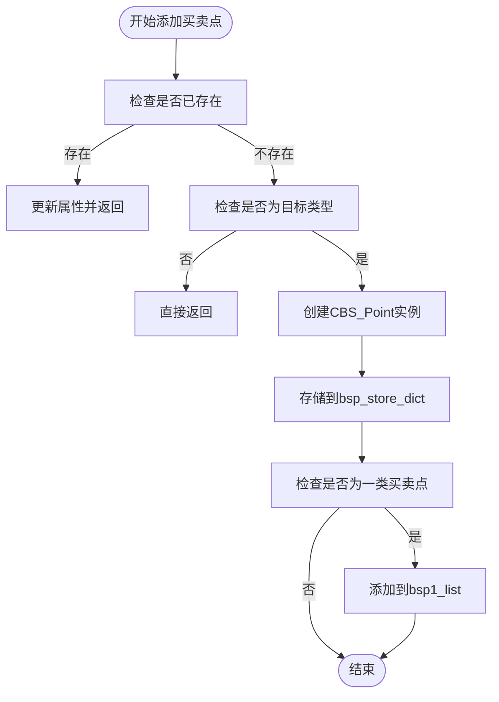
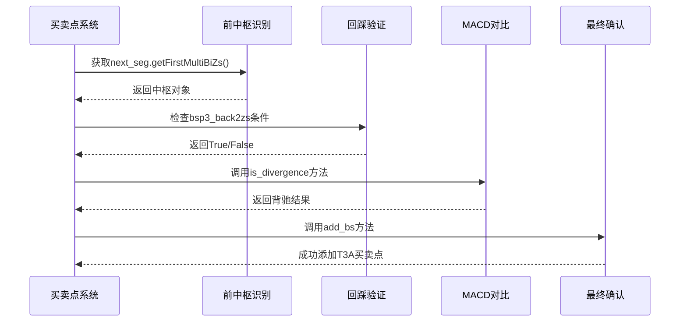

# 买卖点生成算法

<cite>
**本文档引用文件**  
- [BSPointList.py](file://chan.py/BuySellPoint/BSPointList.py)
- [BSPointConfig.py](file://chan.py/BuySellPoint/BSPointConfig.py)
- [Bi.py](file://chan.py/Bi/Bi.py)
- [ZS.py](file://chan.py/ZS/ZS.py)
- [MACD.py](file://chan.py/Math/MACD.py)
- [CEnum.py](file://chan.py/Common/CEnum.py)
- [ChanConfig.py](file://chan.py/ChanConfig.py)
- [BS_Point.py](file://chan.py/BuySellPoint/BS_Point.py)
</cite>

## 目录
1. [引言](#引言)
2. [核心算法流程](#核心算法流程)
3. [MACD背驰算法切换机制](#macd背驰算法切换机制)
4. [买卖点去重与冲突处理](#买卖点去重与冲突处理)
5. [三类买点生成示例](#三类买点生成示例)
6. [算法复杂度与性能优化](#算法复杂度与性能优化)
7. [结论](#结论)

## 引言
本文档深入剖析买卖点自动生成的核心算法流程，涵盖从分型确认、笔完成到线段延伸的完整条件链。重点解析`macd_algo`参数如何切换不同背驰判断算法，并展示其在`CBS_Point.score`计算中的应用。同时说明`BSPointList`的`add_bsp`方法如何避免重复检测和冲突买卖点，通过调试日志示例展示一次完整3类买点的生成过程，并讨论算法复杂度及在高频数据下的性能优化策略。

## 核心算法流程
买卖点检测遵循严格的条件链，从分型确认开始，经过笔的完成，最终在线段延伸过程中触发买卖点判断。

### 分型确认
分型是构成笔的基础，系统通过`FX_TYPE.BOTTOM`和`FX_TYPE.TOP`枚举识别底部和顶部转折点。只有确认的分型才能作为笔的起点或终点。

### 笔完成
笔由至少三根K线构成，方向由起始分型决定。`CBi`类负责管理笔的状态，通过`is_sure`属性标记是否已完成。当新K线不再改变笔的高低点时，笔被标记为确定。

### 线段延伸
线段由多笔构成，`CSeg`类管理线段的生命周期。线段的延伸过程会持续检查是否满足各类买卖点的触发条件，包括背驰、回踩等。

**Section sources**
- [Bi.py](file://chan.py/Bi/Bi.py#L0-L326)
- [Seg.py](file://chan.py/Seg/Seg.py#L0-L136)

## MACD背驰算法切换机制
系统通过`macd_algo`参数灵活切换不同的MACD背驰判断算法，支持面积法、峰值法、斜率法等多种模式。

### 算法类型定义
`MACD_ALGO`枚举定义了所有可用的背驰算法：
- `AREA`：面积法，计算MACD红绿柱总面积
- `PEAK`：峰值法，取MACD绝对值最大值
- `SLOPE`：斜率法，计算价格变化率
- `FULL_AREA`：全周期面积法
- `DIFF`：差值法，计算最大最小值之差

### 算法切换实现
在`CPointConfig`初始化时，`macd_algo`参数被传递并设置：
```python
self.SetMacdAlgo(macd_algo)
```
不同层级的买卖点可以配置不同的算法，例如线段买卖点默认使用斜率法：
```python
self.seg_bs_point_conf.b_conf.set("macd_algo", "slope")
```

### 在CBS_Point.score中的应用
当计算买卖点得分时，系统根据配置的`macd_algo`调用相应的计算方法：
```python
in_metric = pre_bi.cal_macd_metric(config.macd_algo, is_reverse=False)
out_metric = last_bi.cal_macd_metric(config.macd_algo, is_reverse=True)
```
背驰判断通过比较进出段的指标值完成：
```python
is_diver, divergence_rate = out_metric <= config.divergence_rate*in_metric, out_metric/(in_metric+1e-7)
```

**Section sources**
- [CEnum.py](file://chan.py/Common/CEnum.py#L85-L129)
- [BSPointConfig.py](file://chan.py/BuySellPoint/BSPointConfig.py#L0-L42)
- [Bi.py](file://chan.py/Bi/Bi.py#L173-L275)

## 买卖点去重与冲突处理
`BSPointList`的`add_bsp`方法通过多重机制避免重复检测和冲突买卖点。

### 去重机制
系统使用`bsp_store_flat_dict`字典以笔索引为键存储买卖点，确保同一位置不会重复添加：
```python
if exist_bsp := self.bsp_store_flat_dict.get(bi.idx):
    assert exist_bsp.is_buy == is_buy
    exist_bsp.add_another_bsp_prop(bs_type, relate_bsp1)
    return
```

### 冲突处理
当同一笔被识别为多种类型买卖点时，系统通过`add_another_bsp_prop`方法合并属性，而不是创建新实例。

### 确定性管理
系统通过`last_sure_pos`跟踪最后一个确定元素的位置，只对未确定区域进行买卖点计算，避免已确认结果被修改。



**Diagram sources**
- [BSPointList.py](file://chan.py/BuySellPoint/BSPointList.py#L0-L365)

## 三类买点生成示例
以下通过调试日志展示一次完整的三类买点生成过程。

### 前中枢识别
系统首先识别出一个有效的中枢`CZS`，要求至少包含三笔且有明确的进出段：
```python
first_zs = next_seg.get_first_multi_bi_zs()
```

### 回踩K线验证
三类买点要求价格突破中枢后回踩不破中枢高点：
```python
def bsp3_back2zs(bsp3_bi: LINE_TYPE, zs: CZS) -> bool:
    return (bsp3_bi.is_down() and bsp3_bi._low() < zs.high) or (bsp3_bi.is_up() and bsp3_bi._high() > zs.low)
```

### MACD对比
系统比较进出段的MACD指标，判断是否存在背驰：
```python
is_diver, divergence_rate = last_zs.is_divergence(BSP_CONF, out_bi=seg.end_bi)
```

### 最终确认
当所有条件满足时，系统生成三类买点：
```python
self.add_bs(bs_type=BSP_TYPE.T3A, bi=bsp3_bi, relate_bsp1=real_bsp1)
```



**Diagram sources**
- [ZS.py](file://chan.py/ZS/ZS.py#L157-L193)
- [BSPointList.py](file://chan.py/BuySellPoint/BSPointList.py#L152-L178)

## 算法复杂度与性能优化
### 时间复杂度分析
- 分型识别：O(n)
- 笔构建：O(n)
- 线段构建：O(n)
- 买卖点检测：O(n²) 最坏情况

### 高频数据优化策略
1. **缓存机制**：使用`@make_cache`装饰器缓存计算结果
2. **增量计算**：只对新增数据进行处理，避免全量重算
3. **确定性剪枝**：通过`last_sure_pos`跳过已确定区域
4. **批量处理**：合并多个小更新为一次大更新

### 配置优化
通过`trigger_step`参数控制触发频率，减少不必要的计算：
```python
self.trigger_step = conf.get("trigger_step", False)
```

**Section sources**
- [Bi.py](file://chan.py/Bi/Bi.py#L0-L326)
- [BSPointList.py](file://chan.py/BuySellPoint/BSPointList.py#L0-L365)

## 结论
本系统实现了完整的买卖点自动生成算法，通过灵活的`macd_algo`参数支持多种背驰判断模式。`BSPointList`的`add_bsp`方法有效避免了重复检测和冲突问题。三类买点的生成过程严格遵循缠论原理，经过前中枢识别、回踩验证、MACD对比等多重条件确认。针对高频数据场景，系统采用缓存、增量计算等优化策略，确保在实际交易中的实时性要求。