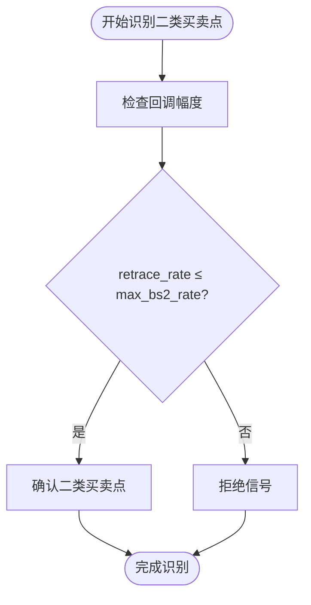
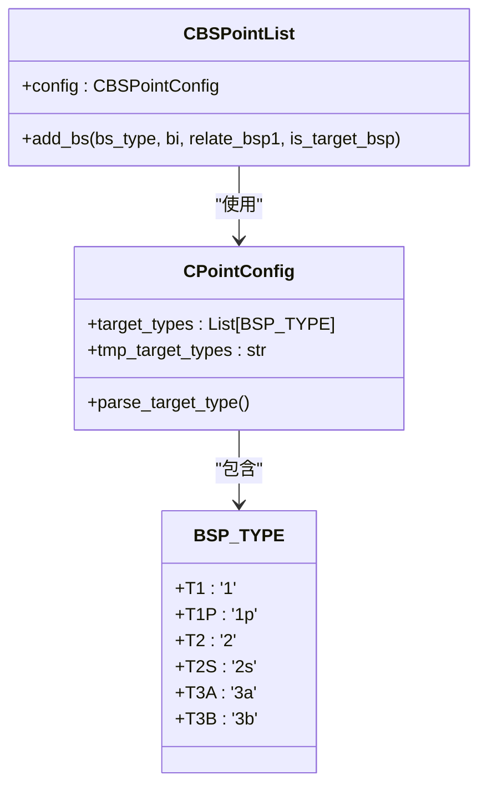
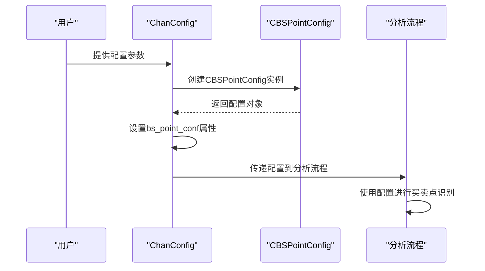

# 买卖点配置参数

<cite>
**本文档引用的文件**
- [BSPointConfig.py](file://chan.py/BuySellPoint/BSPointConfig.py)
- [ChanConfig.py](file://chan.py/ChanConfig.py)
- [BSPointList.py](file://chan.py/BuySellPoint/BSPointList.py)
- [ZS.py](file://chan.py/ZS/ZS.py)
- [CEnum.py](file://chan.py/Common/CEnum.py)
</cite>

## 目录
1. [引言](#引言)
2. [核心参数详解](#核心参数详解)
3. [配置注入机制](#配置注入机制)
4. [典型配置策略](#典型配置策略)
5. [动态加载与实时分析](#动态加载与实时分析)
6. [结论](#结论)

## 引言
本文档全面解析买卖点识别系统的配置体系，重点阐述BSPointConfig类中关键参数的作用机制。通过分析divergence_rate、min_zs_cnt、max_bs2_rate和bs_type等核心参数，揭示其在技术分析中的具体应用。同时，说明这些参数如何通过ChanConfig全局配置对象注入到分析流程中，并提供不同交易策略下的典型配置组合示例。

## 核心参数详解

### divergence_rate：背驰判定阈值
`divergence_rate` 参数控制背驰信号的判定严格程度。该参数用于比较中枢内外的MACD指标变化率，当外部笔的MACD指标值小于等于内部笔的MACD指标值乘以`divergence_rate`时，判定为背驰。数值越小表示要求越严格，过滤掉更多弱信号；数值大于100时表示"保送"模式，直接认定为背驰。

**参数作用流程：**
1. 计算进入中枢笔的MACD指标值（in_metric）
2. 计算离开中枢笔的MACD指标值（out_metric）
3. 判断 `out_metric ≤ divergence_rate × in_metric`

**Section sources**
- [BSPointConfig.py](file://chan.py/BuySellPoint/BSPointConfig.py#L35)
- [ZS.py](file://chan.py/ZS/ZS.py#L157-L193)

### min_zs_cnt：最小中枢数量
`min_zs_cnt` 参数设定有效买卖点所需的最小中枢数量。只有当线段中包含的中枢数量达到或超过此阈值时，才会将该位置识别为有效的买卖点。设置为0表示不限制中枢数量，设置为较高值可过滤掉短期波动产生的假信号，提高信号的可靠性。

**应用场景：**
- 保守策略：设置较高的`min_zs_cnt`（如3-5），确保信号出现在长期趋势中
- 激进策略：设置较低的`min_zs_cnt`（如1-2），捕捉早期趋势信号

**Section sources**
- [BSPointConfig.py](file://chan.py/BuySellPoint/BSPointConfig.py#L36)
- [BSPointList.py](file://chan.py/BuySellPoint/BSPointList.py#L130-L153)

### max_bs2_rate：二类买卖点回调幅度限制
`max_bs2_rate` 参数限制二类买卖点的回调幅度，用于过滤假突破信号。该参数要求第二类买卖点的振幅与突破笔振幅的比率不超过设定值。例如，设置为0.6表示回调幅度不能超过突破笔的60%。



**Diagram sources**
- [BSPointConfig.py](file://chan.py/BuySellPoint/BSPointConfig.py#L37)
- [BSPointList.py](file://chan.py/BuySellPoint/BSPointList.py#L232-L261)

### bs_type：买卖点类型配置
`bs_type` 参数配置启用的买卖点类型集合，通过逗号分隔的字符串形式指定。支持的类型包括：
- `1`：一类买卖点
- `2`：二类买卖点  
- `3a`：三类买卖点（中枢后）
- `2s`：类二买卖点
- `1p`：盘整一类买卖点
- `3b`：三类买卖点（中枢前）

系统在初始化时会解析该字符串，转换为BSP_TYPE枚举类型的列表，用于后续的买卖点过滤。



**Diagram sources**
- [BSPointConfig.py](file://chan.py/BuySellPoint/BSPointConfig.py#L41)
- [BSPointList.py](file://chan.py/BuySellPoint/BSPointList.py#L96-L130)
- [CEnum.py](file://chan.py/Common/CEnum.py#L70-L78)

## 配置注入机制

### ChanConfig全局配置对象
买卖点配置参数通过`ChanConfig`全局配置对象注入到分析流程中。`ChanConfig`类在初始化时创建`CBSPointConfig`实例，并将其作为`bs_point_conf`属性存储。



**关键注入步骤：**
1. 在`ChanConfig.__init__`中调用`set_bsp_config`方法
2. 构建包含默认值的参数字典
3. 从用户配置中获取实际值，覆盖默认值
4. 创建`CBSPointConfig`实例并赋值给`bs_point_conf`

**Section sources**
- [ChanConfig.py](file://chan.py/ChanConfig.py#L80-L182)

### 配置传递路径
买卖点配置从`ChanConfig`对象传递到具体分析模块的路径如下：
1. `CChan`类在初始化时接收`ChanConfig`对象
2. 在创建各级K线数据时，将配置传递给`CKLine_List`
3. `CKLine_List`在计算线段和中枢时，将配置传递给`CBSPointList`
4. `CBSPointList`使用配置进行买卖点识别

**Section sources**
- [ChanConfig.py](file://chan.py/ChanConfig.py#L80-L182)
- [Chan.py](file://chan.py/Chan.py#L50-L55)

## 典型配置策略

### 激进策略配置
激进策略旨在捕捉早期趋势信号，适合短线交易者。典型配置组合：
- **divergence_rate**: 0.8（较宽松的背驰判定）
- **min_zs_cnt**: 1（仅需一个中枢）
- **max_bs2_rate**: 0.9（允许较大回调）
- **bs_type**: "1,2,3a"（启用所有主要买卖点类型）

此配置能快速响应市场变化，但可能产生较多假信号。

### 保守策略配置
保守策略注重信号的可靠性，适合长线投资者。典型配置组合：
- **divergence_rate**: 0.5（严格的背驰判定）
- **min_zs_cnt**: 3（需要三个以上中枢）
- **max_bs2_rate**: 0.6（严格限制回调幅度）  
- **bs_type**: "1,2"（仅启用一、二类买卖点）

此配置过滤掉大部分噪音信号，只保留高质量的买卖机会。

**Section sources**
- [ChanConfig.py](file://chan.py/ChanConfig.py#L85-L100)
- [BSPointConfig.py](file://chan.py/BuySellPoint/BSPointConfig.py#L35-L41)

## 动态加载与实时分析

### 参数动态加载机制
系统支持买卖点配置参数的动态加载，允许在运行时修改配置。通过`set`方法可以动态更新单个参数值：

```python
config.bs_point_conf.b_conf.set("divergence_rate", 0.6)
config.bs_point_conf.s_conf.set("max_bs2_rate", 0.7)
```

动态加载特性使得系统能够根据市场状况实时调整策略参数。

### 对实时分析的影响
动态配置机制对实时分析流程产生以下影响：
1. **即时生效**：参数修改后立即影响后续的买卖点识别
2. **历史兼容**：已识别的买卖点不受新参数影响，保持历史一致性
3. **策略切换**：支持在不同市场环境下快速切换预设策略组合

**Section sources**
- [BSPointConfig.py](file://chan.py/BuySellPoint/BSPointConfig.py#L70-L78)
- [ChanConfig.py](file://chan.py/ChanConfig.py#L140-L182)

## 结论
买卖点配置系统通过`divergence_rate`、`min_zs_cnt`、`max_bs2_rate`和`bs_type`等核心参数，提供了灵活而强大的信号过滤机制。这些参数通过`ChanConfig`全局配置对象注入到分析流程中，支持从激进到保守的不同交易策略。动态加载机制使得系统能够适应不断变化的市场环境，为用户提供了一个可定制的、高效的交易决策支持工具。