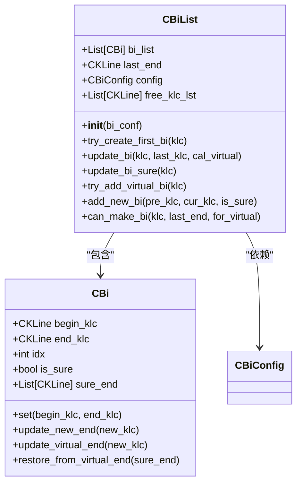
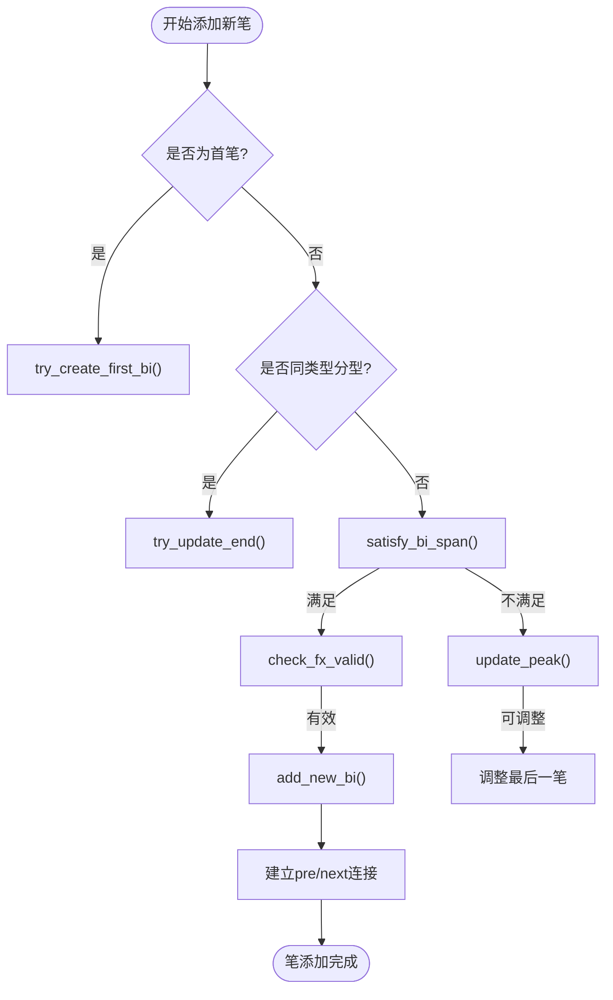
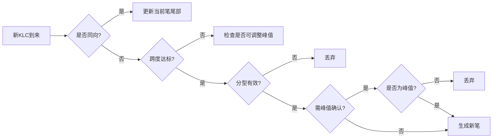
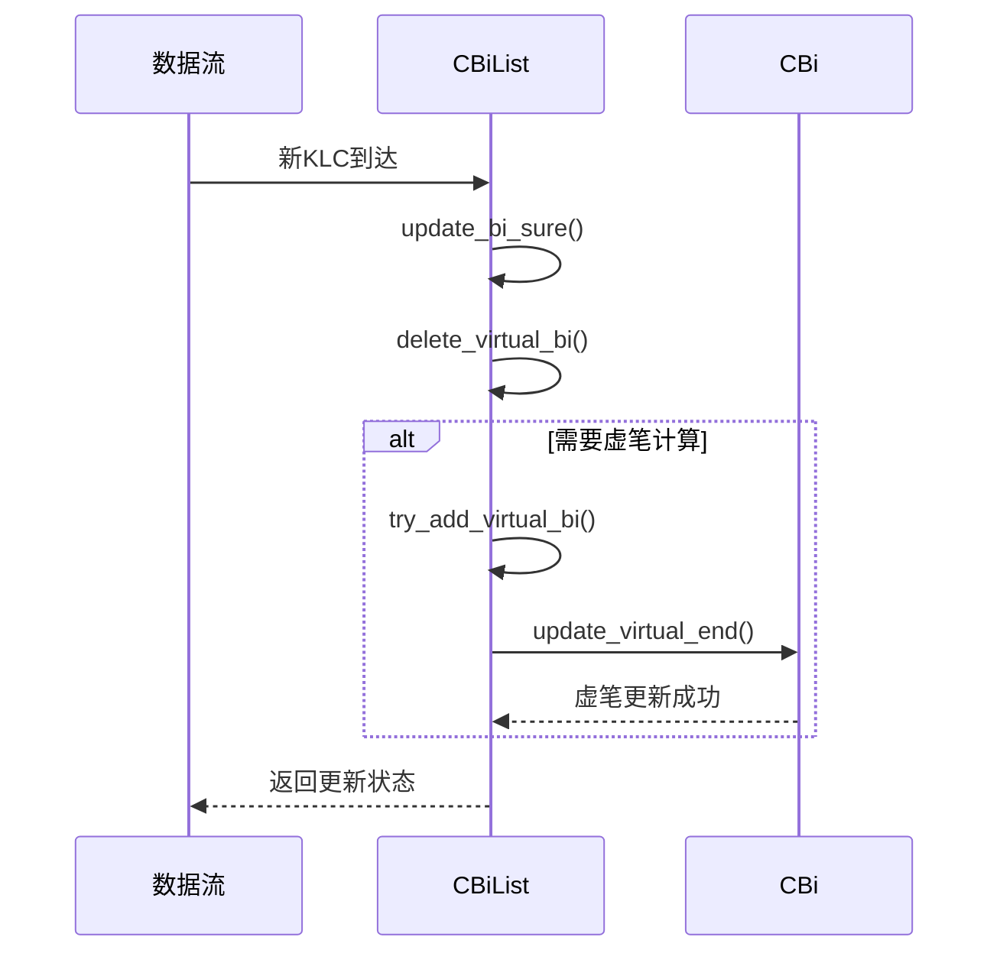
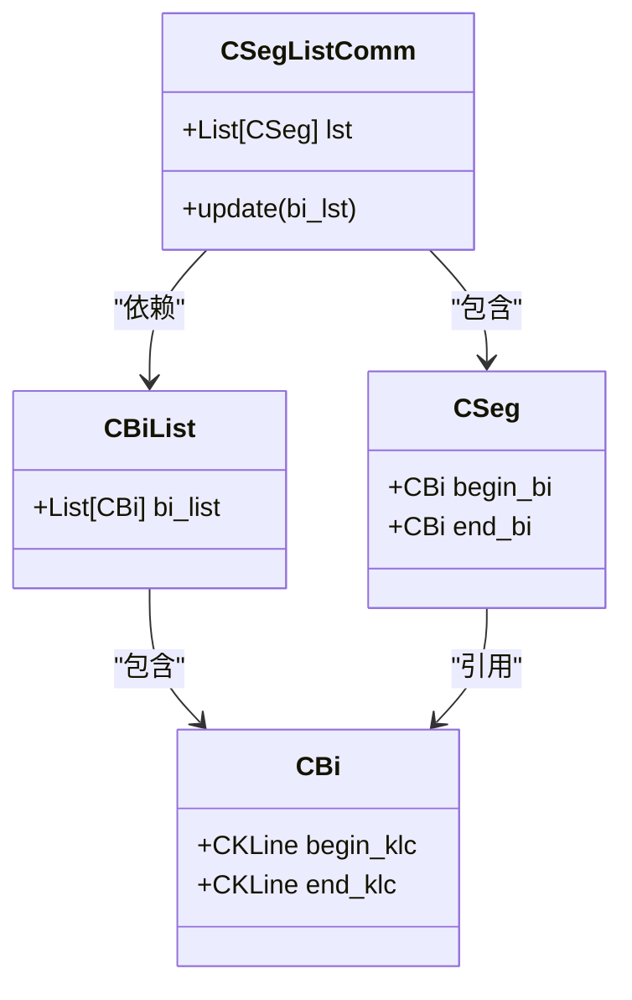

# 笔序列管理

<cite>
**本文档中引用的文件**
- [BiList.py](file://chan.py/Bi/BiList.py)
- [Bi.py](file://chan.py/Bi/Bi.py)
- [BiConfig.py](file://chan.py/Bi/BiConfig.py)
- [CEnum.py](file://chan.py/Common/CEnum.py)
- [KLine.py](file://chan.py/KLine/KLine.py)
- [SegListComm.py](file://chan.py/Seg/SegListComm.py)
</cite>

## 目录
1. [引言](#引言)
2. [CBiList类结构与初始化](#cbilist类结构与初始化)
3. [笔的创建与添加机制](#笔的创建与添加机制)
4. [笔序列的合规性校验规则](#笔序列的合规性校验规则)
5. [方向交替与时间顺序维护](#方向交替与时间顺序维护)
6. [不合规笔的剔除与回溯逻辑](#不合规笔的剔除与回溯逻辑)
7. [虚笔处理与动态更新](#虚笔处理与动态更新)
8. [与Seg模块的数据传递关系](#与seg模块的数据传递关系)
9. [极端市场波动下的鲁棒性处理](#极端市场波动下的鲁棒性处理)
10. [性能优化策略](#性能优化策略)
11. [结论](#结论)

## 引言
CBiList类是缠论分析系统中的核心组件之一，负责管理笔（Bi）序列的生命周期。该类通过严格的数学规则和市场行为逻辑，确保生成的笔序列符合技术分析的基本原理。本文将深入剖析CBiList如何实现笔的添加、校验、合并与回溯等关键操作，并探讨其在复杂市场环境下的稳定性与性能表现。

**Section sources**
- [BiList.py](file://chan.py/Bi/BiList.py#L9-L212)

## CBiList类结构与初始化
CBiList类采用面向对象设计模式，封装了笔序列的核心数据结构与操作方法。其主要成员变量包括：
- `bi_list`：存储已确认笔的有序列表
- `last_end`：指向最后一笔的结束点
- `config`：笔生成配置参数
- `free_klc_lst`：用于首笔生成前的临时缓存

初始化时接受一个CBiConfig对象作为参数，该对象定义了笔生成的各项规则阈值。

**Diagram sources**
- [BiList.py](file://chan.py/Bi/BiList.py#L9-L212)
- [Bi.py](file://chan.py/Bi/Bi.py#L12-L327)

**Section sources**
- [BiList.py](file://chan.py/Bi/BiList.py#L9-L25)

## 笔的创建与添加机制
CBiList通过`try_create_first_bi`和`add_new_bi`方法实现笔的创建与添加。首笔生成采用缓存匹配策略，当新出现的K线组合（KLC）与缓存中相反类型的KLC满足成笔条件时，立即生成第一笔。

后续笔的添加遵循严格的时间顺序和方向交替原则，通过`can_make_bi`方法验证跨度、分型有效性及峰值条件。成功添加后会建立双向链表连接，便于前后笔的遍历查询。

**Diagram sources**
- [BiList.py](file://chan.py/Bi/BiList.py#L30-L212)
- [Bi.py](file://chan.py/Bi/Bi.py#L12-L327)

**Section sources**
- [BiList.py](file://chan.py/Bi/BiList.py#L30-L150)

## 笔序列的合规性校验规则
CBiList实施多层次的合规性校验，确保每笔生成都符合缠论基本原理。核心校验规则包括：

### 跨度验证
通过`satisfy_bi_span`方法验证两分型间的时间跨度：
- 严格模式下要求至少4个KLC间隔
- 非严格模式要求至少3个KLC且包含3个以上基础K线单元

### 分型有效性检查
利用`check_fx_valid`方法根据配置的校验等级（STRICT/LOSS/HALF/TOTALLY）判断分型有效性，考虑相邻KLC的高低点关系。

### 峰值条件判断
`end_is_peak`函数确保分型端点确实是局部极值点，防止虚假信号产生。

**Diagram sources**
- [BiList.py](file://chan.py/Bi/BiList.py#L150-L212)
- [KLine.py](file://chan.py/KLine/KLine.py#L60-L97)

**Section sources**
- [BiList.py](file://chan.py/Bi/BiList.py#L150-L212)

## 方向交替与时间顺序维护
CBiList强制执行笔的方向交替规则，确保相邻两笔方向相反。这一规则通过以下机制实现：

1. **方向判断**：根据起始分型类型（顶/底）确定笔的方向
2. **交替验证**：新笔的分型类型必须与前一笔相反
3. **时间连续性**：所有操作均基于KLC的索引顺序，保证时间序列的完整性

系统通过`is_up()`和`is_down()`方法提供方向查询接口，并在`add_new_bi`时自动维护`pre`和`next`指针，形成双向链表结构。

**Section sources**
- [BiList.py](file://chan.py/Bi/BiList.py#L100-L130)
- [Bi.py](file://chan.py/Bi/Bi.py#L150-L180)

## 不合规笔的剔除与回溯逻辑
当市场出现剧烈波动导致生成不合规笔时，CBiList具备智能回溯与修正能力。核心机制包括：

### 虚笔删除
`delete_virtual_bi`方法负责清理未确认的虚笔，恢复到最后一个确定笔的状态。若存在多个确认尾部，则将其拆分为多笔正式笔。

### 峰值调整
`update_peak`方法允许在特定条件下调整最后一笔的终点，前提是满足：
- 允许次高低点成笔（bi_allow_sub_peak为False）
- 新端点未突破前笔起点
- 满足方向交替规则

此机制提高了系统在震荡行情中的适应性。

**Section sources**
- [BiList.py](file://chan.py/Bi/BiList.py#L80-L100)
- [Bi.py](file://chan.py/Bi/Bi.py#L250-L280)

## 虚笔处理与动态更新
CBiList采用"确定笔+虚笔"的混合模型实现动态更新。`try_add_virtual_bi`方法用于处理实时数据流：

1. **虚笔更新**：当新KLC延续当前笔方向且突破前高/低时，更新虚笔终点
2. **虚笔生成**：在满足成笔条件但未完全确认时，创建非确定性笔
3. **状态转换**：当后续KLC确认趋势反转时，虚笔转为正式笔

这种设计平衡了实时性与准确性，避免频繁修改历史笔序列。

**Diagram sources**
- [BiList.py](file://chan.py/Bi/BiList.py#L60-L80)
- [Bi.py](file://chan.py/Bi/Bi.py#L220-L250)

**Section sources**
- [BiList.py](file://chan.py/Bi/BiList.py#L60-L80)

## 与Seg模块的数据传递关系
CBiList作为Seg（线段）模块的基础输入源，通过标准化接口进行数据交互。关键交互点包括：

1. **数据供给**：SegListComm类接收CBiList实例作为输入参数
2. **状态同步**：线段的起止点关联到具体笔对象的`begin_klc`和`end_klc`
3. **层级构建**：多个连续的CBi构成一个CSeg对象，形成多级分析结构

这种松耦合设计实现了分析层级的分离，便于独立优化各模块性能。

**Diagram sources**
- [BiList.py](file://chan.py/Bi/BiList.py#L9-L212)
- [SegListComm.py](file://chan.py/Seg/SegListComm.py#L12-L170)

**Section sources**
- [SegListComm.py](file://chan.py/Seg/SegListComm.py#L50-L70)

## 极端市场波动下的鲁棒性处理
面对极端市场波动，CBiList通过多重机制保障系统稳定性：

### 异常捕获
在`set()`方法中使用断言检查笔的方向与端点一致性，配合CChanException进行错误传播。

### 缓存保护
`free_klc_lst`缓存机制防止首笔生成阶段的数据丢失，提高初期信号的可靠性。

### 配置灵活性
CBiConfig支持多种算法模式（normal/fx），允许用户根据市场特性调整灵敏度。

### 边界防护
所有索引访问均进行边界检查，避免数组越界等运行时错误。

这些设计确保系统在黑天鹅事件中仍能保持基本功能。

**Section sources**
- [BiList.py](file://chan.py/Bi/BiList.py#L200-L212)
- [Bi.py](file://chan.py/Bi/Bi.py#L50-L70)

## 性能优化策略
CBiList在设计中融入多项性能优化技术：

### 增量更新
采用`update_bi_sure`和`try_add_virtual_bi`分离确定性与非确定性计算，减少重复运算。

### 缓存机制
CBi类使用`@make_cache`装饰器对`get_begin_val`、`get_end_val`等高频访问属性进行结果缓存。

### 早期退出
`satisfy_bi_span`方法在跨度明显不足时快速返回，避免不必要的循环计算。

### 批量处理
`get_klc_span`方法在跨度较大时直接返回近似值，牺牲少量精度换取性能提升。

这些优化使系统能够在高频数据流下保持实时响应能力。

**Section sources**
- [Bi.py](file://chan.py/Bi/Bi.py#L180-L220)
- [BiList.py](file://chan.py/Bi/BiList.py#L130-L150)

## 结论
CBiList类通过严谨的数学建模和工程实现，构建了一个稳定可靠的笔序列管理系统。其核心价值体现在：
1. 完整实现了缠论笔的生成规则
2. 提供了灵活的配置选项适应不同市场环境
3. 采用虚笔机制平衡实时性与准确性
4. 与上层Seg模块形成良好的协作关系
5. 内置多种性能优化策略确保系统效率

该设计为后续的技术分析提供了坚实的基础数据支撑，是整个交易系统的关键组件之一。