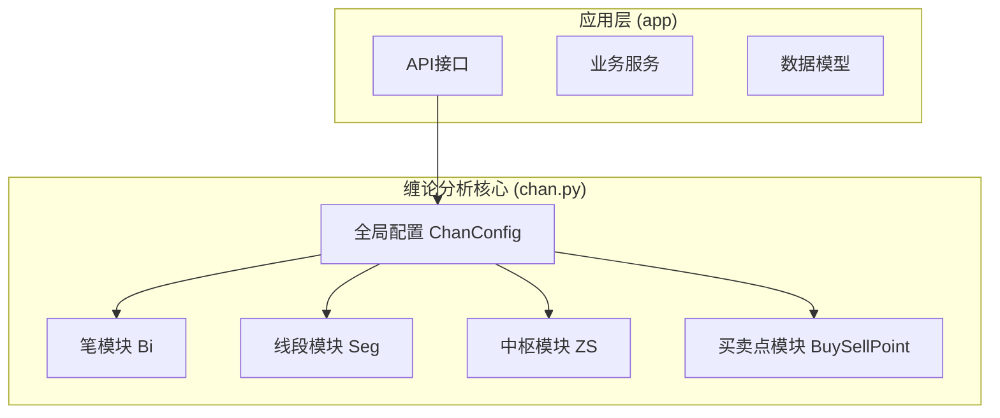
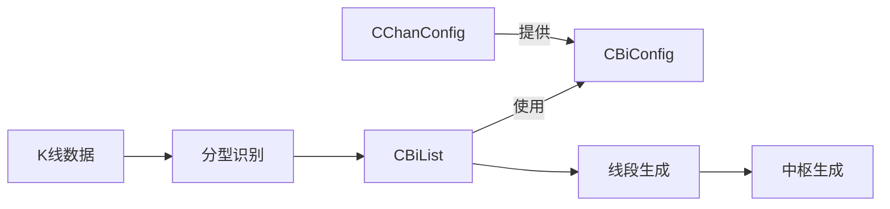
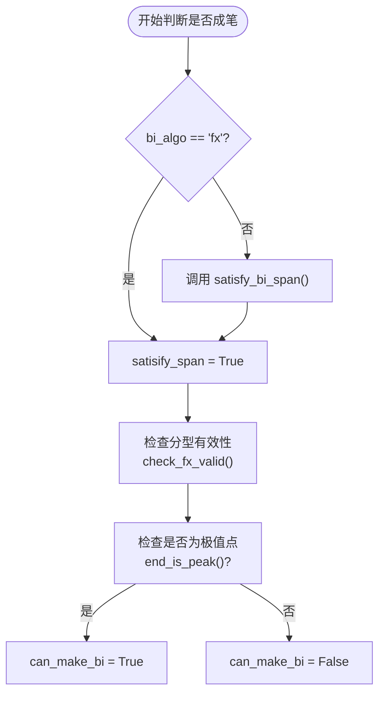
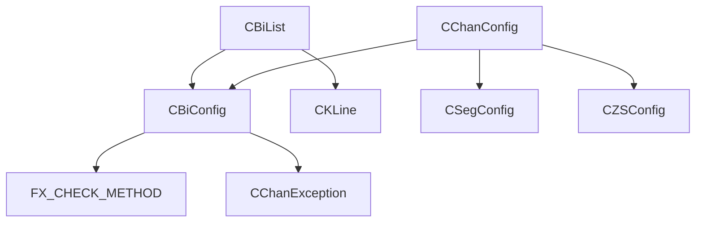

# 笔构建配置

<cite>
**本文档中引用的文件**
- [BiConfig.py](file://chan.py/Bi/BiConfig.py)
- [ChanConfig.py](file://chan.py/ChanConfig.py)
- [BiList.py](file://chan.py/Bi/BiList.py)
- [CEnum.py](file://chan.py/Common/CEnum.py)
</cite>

## 目录
1. [简介](#简介)
2. [项目结构](#项目结构)
3. [核心组件](#核心组件)
4. [架构概述](#架构概述)
5. [详细组件分析](#详细组件分析)
6. [依赖分析](#依赖分析)
7. [性能考虑](#性能考虑)
8. [故障排除指南](#故障排除指南)
9. [结论](#结论)

## 简介
本文档全面介绍缠论分析系统中笔（Bi）构建的核心配置类 `CBiConfig` 及其与全局配置 `CChanConfig` 的联动机制。重点阐述不同算法模式（如 normal, fx）的工作原理、适用场景，以及严格性检查（bi_strict）、分型验证（bi_fx_check）等关键开关的作用机制。通过配置文件示例和代码调用方式，展示如何根据交易策略需求调整参数以优化分析结果，并分析这些配置如何影响整个缠论分析流程的灵敏度与稳定性。

## 项目结构
项目结构遵循模块化设计，将缠论分析的核心逻辑（chan.py）与应用接口（app）分离。`CBiConfig` 类位于 `chan.py/Bi/` 目录下，是笔构建模块的配置中心，与线段（Seg）、中枢（ZS）、买卖点（BuySellPoint）等模块的配置共同由顶层的 `CChanConfig` 统一管理。



**Diagram sources**
- [chan.py/Bi/BiConfig.py](file://chan.py/Bi/BiConfig.py)
- [chan.py/ChanConfig.py](file://chan.py/ChanConfig.py)

**Section sources**
- [chan.py/Bi/BiConfig.py](file://chan.py/Bi/BiConfig.py)
- [chan.py/ChanConfig.py](file://chan.py/ChanConfig.py)

## 核心组件
`CBiConfig` 类是笔构建过程的“控制面板”，其所有参数均通过 `CChanConfig` 在系统初始化时传入，决定了笔的识别逻辑、严格程度和容错能力。`CBiConfig` 的实例作为 `CBiList`（笔列表）的成员变量，直接影响每一笔的生成和更新。

**Section sources**
- [chan.py/Bi/BiConfig.py](file://chan.py/Bi/BiConfig.py#L4-L30)
- [chan.py/Bi/BiList.py](file://chan.py/Bi/BiList.py#L10-L15)

## 架构概述
整个缠论分析流程始于K线数据，经过分型识别，最终由 `CBiList` 根据 `CBiConfig` 的规则生成笔。`CChanConfig` 作为总配置，将 `CBiConfig` 与其他模块的配置整合，确保分析逻辑的一致性。



**Diagram sources**
- [chan.py/Bi/BiList.py](file://chan.py/Bi/BiList.py#L10-L15)
- [chan.py/ChanConfig.py](file://chan.py/ChanConfig.py#L15-L25)

## 详细组件分析

### CBiConfig 参数详解
`CBiConfig` 类通过其构造函数的参数，定义了笔构建的六项核心规则。

#### 配置参数表
| 参数名 | 类型 | 默认值 | 作用说明 |
| :--- | :--- | :--- | :--- |
| `bi_algo` | 字符串 | "normal" | 笔算法模式，决定笔的跨度要求。"normal" 模式要求至少3根K线且3根单位K线，"fx" 模式仅要求分型有效。 |
| `is_strict` | 布尔值 | True | 严格性检查开关。开启时，笔的跨度必须≥4根K线；关闭时，要求≥3根K线且≥3根单位K线。 |
| `bi_fx_check` | 字符串 | "half" | 分型验证方法，控制分型确认的严格程度。可选值："strict", "loss", "half", "totally"。 |
| `gap_as_kl` | 布尔值 | True | 是否将跳空视为一根独立的K线。开启时，跳空会增加K线跨度的计算值。 |
| `bi_end_is_peak` | 布尔值 | True | 笔的结束点是否必须是极值点。开启时，新分型必须突破前一笔的端点价格。 |
| `bi_allow_sub_peak` | 布尔值 | True | 是否允许次高低点成笔。开启时，即使不满足严格极值条件，也可能形成次级别笔。 |

**Section sources**
- [chan.py/Bi/BiConfig.py](file://chan.py/Bi/BiConfig.py#L4-L30)
- [chan.py/Bi/BiList.py](file://chan.py/Bi/BiList.py#L150-L181)

### 算法模式与分型验证机制

#### 算法模式工作原理
`bi_algo` 和 `is_strict` 共同决定了笔的最小跨度。
- **`bi_algo="normal"` 且 `is_strict=True`**：最严格模式。要求新分型与前一笔结束分型之间至少间隔4根K线（`get_klc_span` ≥ 4）。
- **`bi_algo="normal"` 且 `is_strict=False`**：宽松模式。要求K线跨度≥3，且单位K线数量≥3（`satisfy_bi_span` 方法）。
- **`bi_algo="fx"`**：最宽松模式。忽略跨度要求，只要分型验证通过即可成笔。



**Diagram sources**
- [chan.py/Bi/BiList.py](file://chan.py/Bi/BiList.py#L178-L181)
- [chan.py/Bi/BiList.py](file://chan.py/Bi/BiList.py#L150-L166)

#### 分型验证方法
`bi_fx_check` 参数通过映射到 `FX_CHECK_METHOD` 枚举来控制分型验证的逻辑。
- **`strict`**: 最严格，要求分型K线的高低点都必须是前后5根K线内的极值。
- **`loss`**: 最宽松，几乎不进行额外验证。
- **`half`**: 折中方案，只验证分型K线的一个极值点（高点或低点）。
- **`totally`**: 要求分型K线完全被前后K线包含，形成“包含关系”。
该参数直接影响 `CKLine` 类的 `check_fx_valid` 方法的执行结果。

**Section sources**
- [chan.py/Bi/BiConfig.py](file://chan.py/Bi/BiConfig.py#L16-L23)
- [chan.py/Bi/BiList.py](file://chan.py/Bi/BiList.py#L181)
- [chan.py/Common/CEnum.py](file://chan.py/Common/CEnum.py#L40-L44)

### 配置文件与代码调用示例

#### 配置文件示例
```json
{
  "bi_algo": "normal",
  "bi_strict": false,
  "bi_fx_check": "half",
  "gap_as_kl": true,
  "bi_end_is_peak": true,
  "bi_allow_sub_peak": true,
  "seg_algo": "chan",
  "zs_combine": true
}
```

#### 代码调用方式
```python
# 从字典加载配置
config_dict = {
    "bi_algo": "fx",
    "bi_strict": False,
    "bi_fx_check": "loss"
}
chan_config = CChanConfig(config_dict)  # CChanConfig 内部会创建 CBiConfig 实例

# 直接在代码中创建
bi_config = CBiConfig(bi_algo="normal", is_strict=True, bi_fx_check="strict")
bi_list = CBiList(bi_config)
```

**Section sources**
- [chan.py/ChanConfig.py](file://chan.py/ChanConfig.py#L15-L25)
- [chan.py/Bi/BiList.py](file://chan.py/Bi/BiList.py#L10-L15)

## 依赖分析
`CBiConfig` 类与系统内多个模块存在紧密依赖关系。



**Diagram sources**
- [chan.py/Bi/BiConfig.py](file://chan.py/Bi/BiConfig.py#L1-L3)
- [chan.py/ChanConfig.py](file://chan.py/ChanConfig.py#L2-L3)
- [chan.py/Bi/BiList.py](file://chan.py/Bi/BiList.py#L7-L8)

## 性能考虑
`CBiConfig` 的配置对性能有间接影响。例如，`is_strict=False` 和 `bi_algo="fx"` 会生成更多的笔，导致后续的线段和中枢计算量增大。`gap_as_kl=True` 在跳空频繁的市场中，会使 `get_klc_span` 方法的计算量增加。因此，在追求高灵敏度的同时，需权衡计算资源的消耗。

## 故障排除指南
当笔的生成不符合预期时，应首先检查 `CBiConfig` 的配置。
- **问题：笔生成过少或过慢**：检查 `bi_strict` 是否为 `True`，`bi_algo` 是否为 `"normal"`。尝试将 `bi_strict` 设为 `False` 或 `bi_algo` 设为 `"fx"`。
- **问题：笔生成过多或杂乱**：检查 `bi_fx_check` 是否为 `"loss"`。尝试将其改为 `"half"` 或 `"strict"`。
- **问题：笔的端点不符合预期**：检查 `bi_end_is_peak` 是否为 `True`。若为 `False`，则笔的结束点可能不是极值点。
- **问题：配置项不生效**：确保配置是通过 `CChanConfig` 传入的，而不是直接修改了 `CBiConfig` 的实例，因为 `CChanConfig` 在初始化后会锁定未识别的参数。

**Section sources**
- [chan.py/ChanConfig.py](file://chan.py/ChanConfig.py#L15-L25)
- [chan.py/ChanConfig.py](file://chan.py/ChanConfig.py#L179-L182)

## 结论
`CBiConfig` 是缠论分析系统中笔构建逻辑的核心配置类，通过 `bi_algo`、`is_strict`、`bi_fx_check` 等参数，提供了从严格到宽松的多种分析模式。它与 `CChanConfig` 紧密联动，确保了整个分析流程配置的一致性和可管理性。理解这些参数的作用机制，对于根据不同的交易品种和策略需求，调整分析的灵敏度与稳定性至关重要。合理的配置能够帮助用户在捕捉市场细微波动和过滤噪音之间找到最佳平衡点。