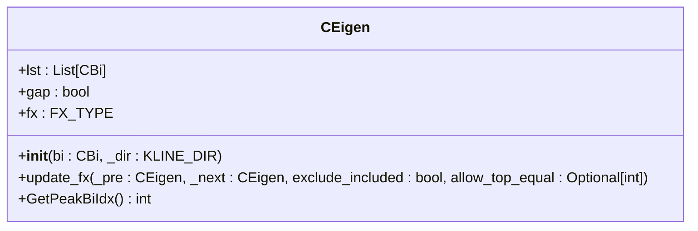
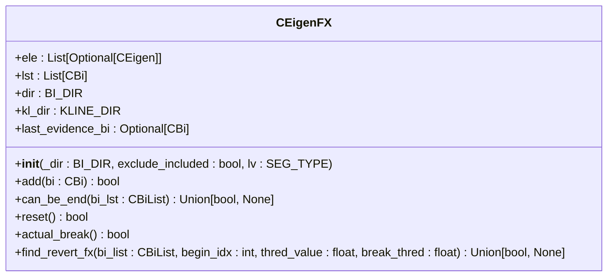
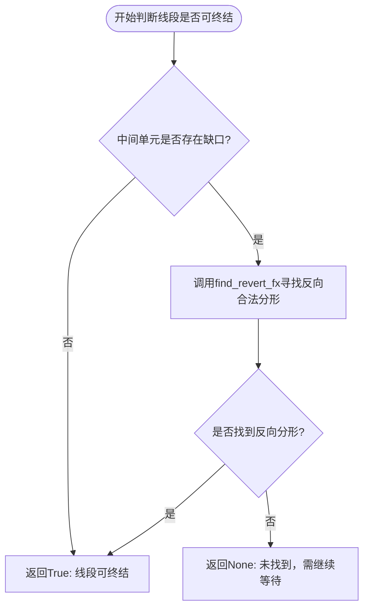

# 特征序列分析

<cite>
**本文档中引用的文件**  
- [Eigen.py](file://chan.py/Seg/Eigen.py)
- [EigenFX.py](file://chan.py/Seg/EigenFX.py)
- [Seg.py](file://chan.py/Seg/Seg.py)
- [SegListChan.py](file://chan.py/Seg/SegListChan.py)
- [quick_guide.md](file://chan.py/quick_guide.md)
</cite>

## 目录
1. [引言](#引言)
2. [特征序列生成机制](#特征序列生成机制)
3. [特征序列分形识别逻辑](#特征序列分形识别逻辑)
4. [核心类与方法分析](#核心类与方法分析)
5. [线段终结判断流程](#线段终结判断流程)
6. [实际计算流程示例](#实际计算流程示例)
7. [结论](#结论)

## 引言
在缠论技术分析体系中，线段的延伸与终结判断是识别趋势结构的关键环节。特征序列（Eigen）作为判断线段是否被破坏的核心工具，通过将反向笔的端点构造为辅助K线序列，为线段的延续性提供量化依据。特征序列分形（EigenFX）则在此基础上进一步识别顶分型与底分型，以确认线段的终结。本文将深入解析特征序列的生成规则、分形识别逻辑及其在代码中的实现方式，帮助理解其在线段分析中的关键技术作用。

## 特征序列生成机制

特征序列由线段中反向笔的端点构成，用于判断线段是否被有效破坏。其生成过程基于`CEigen`类实现，该类继承自`CKLine_Combiner`，用于组合多个笔形成一个特征单元。

特征序列的构造遵循以下规则：
- 每个特征序列单元（`CEigen`）由一组方向一致的笔组成。
- 当新笔与当前特征序列方向相反时，尝试将其合并到当前单元；若不能合并，则开启新的特征序列单元。
- 在`update_fx`方法中，会检测是否存在“缺口”（gap），即当前分形是否跨越了前一单元的价格区间。若存在缺口，则标记`gap=True`，表示该分形具有更强的反转信号。

**Section sources**
- [Eigen.py](file://chan.py/Seg/Eigen.py#L0-L28)

## 特征序列分形识别逻辑

特征序列分形（`CEigenFX`）用于识别由三个连续特征序列单元构成的顶分型或底分型，从而判断线段是否终结。

### 分形识别流程
1. **第一元素处理**：初始化第一个特征序列单元。
2. **第二元素处理**：检查是否可与第一单元合并；若不可合并，则创建第二单元，并验证前两单元是否可能构成分形基础。
3. **第三元素处理**：尝试将第三笔加入第二单元，若形成实际突破（`actual_break`），则更新中间单元的分形类型（`fx`），并判断是否构成有效分形。

### 顶分型/底分型判定条件
- **上升线段**（下降趋势）：需识别**顶分型**，即中间单元为高点，且其高点高于前后单元。
- **下降线段**（上升趋势）：需识别**底分型**，即中间单元为低点，且其低点低于前后单元。
- 若中间单元存在**缺口**（gap），则必须在后续走势中找到反向且合法的分形才能确认线段终结；否则，分形出现即视为线段终结。

**Section sources**
- [EigenFX.py](file://chan.py/Seg/EigenFX.py#L0-L150)

## 核心类与方法分析

### CEigen 类
`CEigen` 类表示一个特征序列单元，其核心功能包括：
- `__init__`：初始化特征序列，记录方向与初始笔。
- `update_fx`：更新分形类型，并检测是否存在缺口。
- `GetPeakBiIdx`：获取该单元内峰值笔的索引，用于后续背驰判断。

**Diagram sources**
- [Eigen.py](file://chan.py/Seg/Eigen.py#L0-L28)

### CEigenFX 类
`CEigenFX` 类负责管理三个特征序列单元，并判断是否形成有效分形。

**Diagram sources**
- [EigenFX.py](file://chan.py/Seg/EigenFX.py#L0-L150)

## 线段终结判断流程

线段的终结判断由`CEigenFX.can_be_end`方法实现，其逻辑如下：

当存在缺口时，系统会启动`find_revert_fx`方法，在后续笔序列中搜索反向的合法分形。只有当反向分形也满足确认条件时，原线段才被视为正式终结。

**Section sources**
- [EigenFX.py](file://chan.py/Seg/EigenFX.py#L0-L150)
- [quick_guide.md](file://chan.py/quick_guide.md#L415-L434)

## 实际计算流程示例

假设当前为一个上升线段（方向为`BI_DIR.UP`），其后的下降笔构成特征序列：

1. 第一笔形成第一个特征序列单元 `E1`。
2. 第二笔若不能与 `E1` 合并，则形成 `E2`。
3. 第三笔尝试加入 `E2`，若导致实际价格突破，则形成 `E3`。
4. 调用 `E2.update_fx(E1, E3)` 判断是否为顶分型。
5. 若 `E2` 存在缺口，则需在后续上升走势中寻找底分型来确认线段终结。
6. 若无缺口，则顶分型成立，线段终结，`is_sure=True`。

此过程在`SegListChan`类中被集成，通过维护两个`CEigenFX`实例（分别对应上升和下降线段）来动态跟踪线段状态。

**Section sources**
- [SegListChan.py](file://chan.py/Seg/SegListChan.py#L36-L37)
- [Seg.py](file://chan.py/Seg/Seg.py#L25)

## 结论

特征序列及其分形识别机制是缠论线段划分的核心算法。通过将反向笔构造为特征序列，并基于分形结构判断线段终结，系统能够有效识别趋势的延续与反转。代码实现中，`CEigen`与`CEigenFX`类协同工作，确保了线段判断的准确性与鲁棒性。理解这一机制对于开发基于缠论的量化策略具有重要意义。