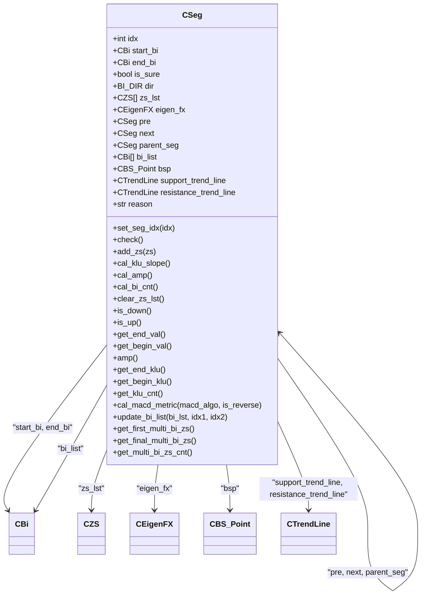
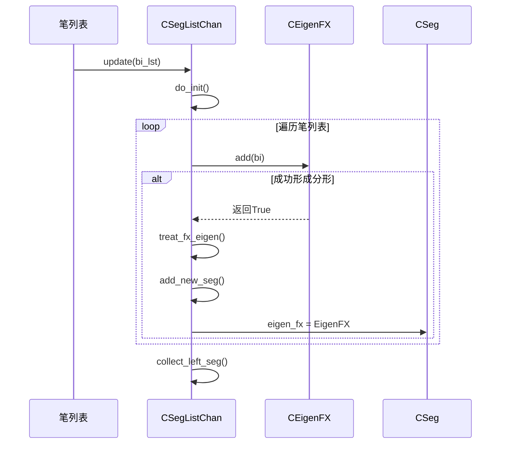
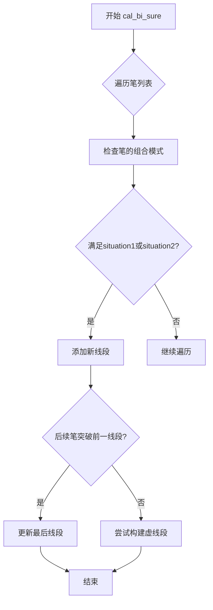
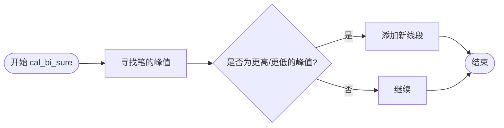

# 线段分析

<cite>
**本文档中引用的文件**  
- [Seg.py](file://chan.py/Seg/Seg.py)
- [SegListComm.py](file://chan.py/Seg/SegListComm.py)
- [SegListChan.py](file://chan.py/Seg/SegListChan.py)
- [SegListDYH.py](file://chan.py/Seg/SegListDYH.py)
- [SegListDef.py](file://chan.py/Seg/SegListDef.py)
- [SegConfig.py](file://chan.py/Seg/SegConfig.py)
- [Eigen.py](file://chan.py/Seg/Eigen.py)
- [EigenFX.py](file://chan.py/Seg/EigenFX.py)
</cite>

## 目录
1. [引言](#引言)
2. [线段（Segment）基础概念](#线段segment基础概念)
3. [CSeg类详解](#cseg类详解)
4. [线段列表基类与实现](#线段列表基类与实现)
5. [特征序列与特征序列分形](#特征序列与特征序列分形)
6. [线段算法配置（seg_algo）](#线段算法配置seg_algo)
7. [总结](#总结)

## 引言
线段分析是缠论技术分析体系中的核心组成部分，用于识别价格走势中的基本结构单元。线段由一系列连续的笔构成，能够有效过滤市场噪音，揭示趋势的内在结构。本文档深入解析线段分析模块的实现机制，涵盖核心数据结构、算法逻辑及配置选项，为用户理解和应用该模块提供全面指导。

## 线段（Segment）基础概念
在线段分析中，**线段**（Segment）是比“笔”更高一级的分析单位。一个线段由至少三笔构成，代表了价格在某一方向上的持续运动。线段的起始点和结束点必须是同向的笔的端点，且结束点的价格必须突破起始点所在笔的高低点，以确认趋势的延续或反转。线段的方向由其内部笔的整体方向决定，分为上升线段和下降线段。线段的确定性（is_sure）状态是判断其是否有效的重要指标，不确定的线段可能随着新数据的加入而被修正或删除。

## CSeg类详解
`CSeg` 类是线段分析模块的核心数据结构，用于表示单个线段。

**Section sources**
- [Seg.py](file://chan.py/Seg/Seg.py#L13-L152)

### 核心属性
- **idx**: 线段的唯一索引。
- **start_bi**: 指向构成该线段的起始笔（`CBi` 对象）。
- **end_bi**: 指向构成该线段的结束笔（`CBi` 对象）。
- **is_sure**: 布尔值，表示该线段是否为“确定的”。不确定的线段（虚线段）可能在后续计算中被调整。
- **dir**: 线段的方向，由 `BI_DIR.UP`（上升）或 `BI_DIR.DOWN`（下降）表示。
- **zs_lst**: 存储该线段内部包含的所有中枢（`CZS` 对象）的列表，按反序排列。
- **eigen_fx**: 指向一个 `CEigenFX` 对象，该对象记录了构成此线段的特征序列分形，是“缠论”算法的核心。
- **pre** 和 **next**: 分别指向前一个和后一个线段，形成线段链表。
- **parent_seg**: 指向包含此线段的更高级别线段（例如，线段的线段）。
- **bi_list**: 存储该线段所包含的所有笔的列表。

### 关键方法
- **check()**: 验证线段的有效性，确保上升线段的起始点低于结束点，下降线段的起始点高于结束点，且线段长度（包含的笔数）不小于2。
- **update_bi_list()**: 更新 `bi_list`，并将这些笔的 `parent_seg` 属性设置为当前线段。
- **cal_klu_slope()** 和 **cal_amp()**: 计算线段的斜率和幅度，用于量化趋势强度。
- **get_begin_val()** 和 **get_end_val()**: 获取线段的起始值和结束值。
- **get_begin_klu()** 和 **get_end_klu()**: 获取线段起始笔和结束笔的K线单元。

**Diagram sources**
- [Seg.py](file://chan.py/Seg/Seg.py#L13-L152)

## 线段列表基类与实现
线段列表负责管理和计算一系列线段。`CSegListComm` 是所有线段列表的基类，而 `CSegListChan`、`CSegListDYH` 和 `CSegListDef` 是其具体实现，分别对应不同的线段划分算法。

### CSegListComm 基类
`CSegListComm` 定义了线段列表的通用接口和基础功能。
- **lst**: 存储 `CSeg` 对象的列表。
- **config**: `CSegConfig` 对象，包含算法配置。
- **lv**: 线段级别（如笔的线段、线段的线段）。
- **do_init()**: 初始化方法，可被子类重写以实现特定的初始化逻辑。
- **update(bi_lst)**: 抽象方法，由子类实现具体的线段更新算法。
- **add_new_seg()**: 安全地向列表中添加新线段，并处理异常。
- **collect_left_seg()**: 处理左侧（未完成）线段的逻辑。

**Section sources**
- [SegListComm.py](file://chan.py/Seg/SegListComm.py#L0-L169)

### 具体实现类

#### CSegListChan
该类实现了基于“缠论”原始思想的线段划分算法，核心是利用**特征序列分形**（`CEigenFX`）来确认线段的结束。

**Diagram sources**
- [SegListChan.py](file://chan.py/Seg/SegListChan.py#L0-L76)
- [Seg.py](file://chan.py/Seg/Seg.py#L13-L152)

#### CSegListDYH
该类实现了基于“都业华1+1法则”的线段划分算法。其核心逻辑是通过识别特定的笔组合模式（situation1 和 situation2）来确定线段。

**Diagram sources**
- [SegListDYH.py](file://chan.py/Seg/SegListDYH.py#L0-L96)

#### CSegListDef
该类实现了一种基于“笔的高低点”比较的线段划分算法，相对较为直接。

**Diagram sources**
- [SegListDef.py](file://chan.py/Seg/SegListDef.py#L0-L60)

## 特征序列与特征序列分形
特征序列（`CEigen`）和特征序列分形（`CEigenFX`）是“缠论”算法中用于处理线段内部包含关系的核心概念。

### CEigen (特征序列)
`CEigen` 类代表一个特征序列元素，它由一笔或几笔合并而成，用于描述线段内部的反向波动。
- **lst**: 包含构成此特征序列的笔的列表。
- **dir**: 特征序列的方向。
- **gap**: 布尔值，表示该特征序列是否包含缺口。
- **fx**: 分形类型（顶分型或底分型）。

**Section sources**
- [Eigen.py](file://chan.py/Seg/Eigen.py#L0-L28)

### CEigenFX (特征序列分形)
`CEigenFX` 类负责从一系列反向笔中识别出有效的分形（顶分型或底分型），从而确认线段的结束。
- **ele[3]**: 存储构成分形的三个特征序列元素。
- **add(bi)**: 向分形中添加一笔，尝试构建分形。
- **actual_break()**: 检查分形是否被实际突破，防止因笔的包含关系导致误判。
- **can_be_end()**: 判断当前分形是否可以作为线段的结束点。

**Section sources**
- [EigenFX.py](file://chan.py/Seg/EigenFX.py#L0-L150)

## 线段算法配置（seg_algo）
用户可以通过 `seg_config` 中的 `seg_algo` 参数选择不同的线段计算方法。

### 配置选项
- **"chan"**: 使用 `CSegListChan` 算法，基于特征序列分形。这是最符合缠论原意的算法，推荐使用。
- **"1+1"**: 使用 `CSegListDYH` 算法，基于都业华的1+1法则。该算法已被标记为**已弃用**（deprecated），不建议使用。
- **"break"**: 使用 `CSegListDef` 算法，基于笔的突破。该算法同样已被标记为**已弃用**，不建议使用。

### 使用场景
- **推荐使用 "chan"**: 适用于所有希望遵循缠论核心思想进行深度分析的场景。
- **避免使用 "1+1" 和 "break"**: 这些算法是早期实现，维护性差，结果可能不稳定。

**Section sources**
- [SegConfig.py](file://chan.py/Seg/SegConfig.py#L5-L6)
- [KLine_List.py](file://chan.py/KLine/KLine_List.py#L19-L31)

## 总结
线段分析模块通过 `CSeg` 类和一系列 `CSegList` 实现，构建了一个灵活且强大的分析框架。理解 `CSeg` 的属性和方法是掌握线段分析的基础。`CSegListComm` 基类提供了统一的接口，而 `CSegListChan`、`CSegListDYH` 和 `CSegListDef` 则实现了不同的划分逻辑。其中，`CSegListChan` 结合 `CEigen` 和 `CEigenFX`，实现了缠论中复杂的特征序列处理，是推荐的核心算法。用户应通过 `seg_algo="chan"` 配置来启用此算法，以获得最准确和可靠的分析结果。