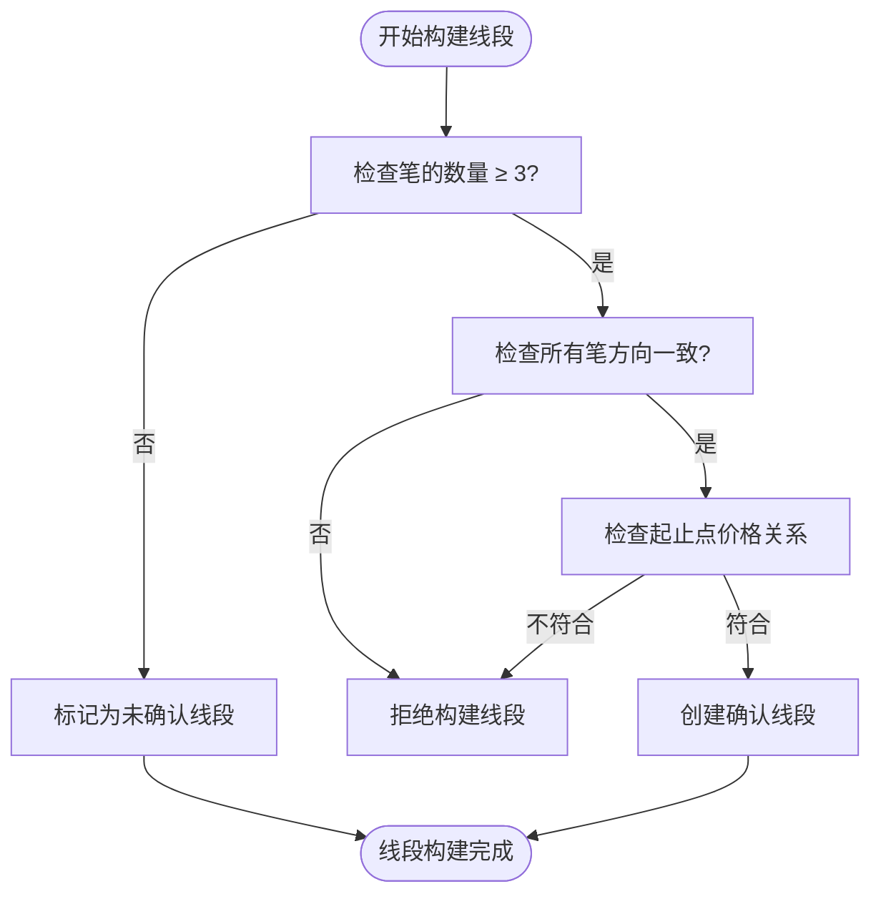
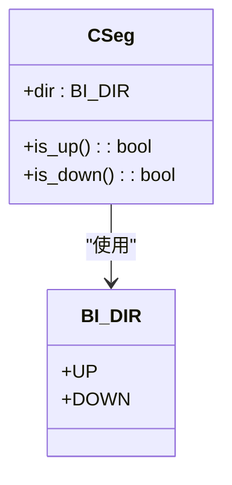
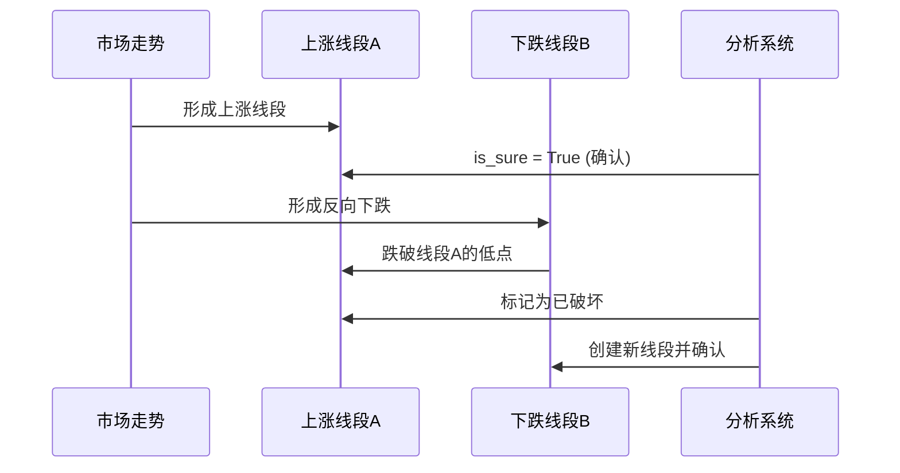
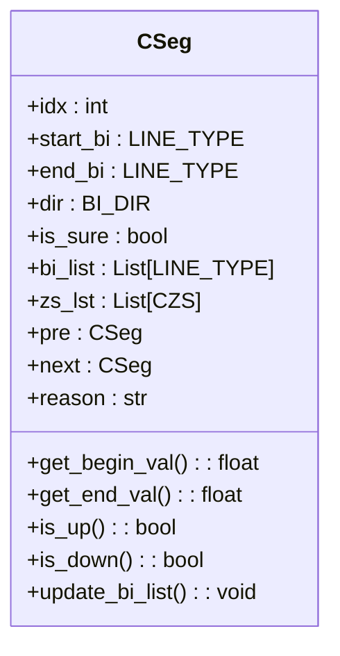

# 线段基本概念

<cite>
**本文档引用文件**  
- [Seg.py](file://chan.py/Seg/Seg.py)
- [Bi.py](file://chan.py/Bi/Bi.py)
- [ZS.py](file://chan.py/ZS/ZS.py)
- [CEnum.py](file://chan.py/Common/CEnum.py)
- [SegListComm.py](file://chan.py/Seg/SegListComm.py)
- [SegConfig.py](file://chan.py/Seg/SegConfig.py)
</cite>

## 目录
1. [引言](#引言)
2. [线段的定义与构成](#线段的定义与构成)
3. [线段的方向性](#线段的方向性)
4. [线段在趋势识别中的作用](#线段在趋势识别中的作用)
5. [线段与笔、中枢的逻辑关系](#线段与笔中枢的逻辑关系)
6. [线段的确认与破坏机制](#线段的确认与破坏机制)
7. [CSeg类的关键属性解析](#cseg类的关键属性解析)
8. [线段生命周期示例](#线段生命周期示例)
9. [总结](#总结)

## 引言
线段是缠论技术分析体系中的核心结构之一，位于“笔”之上、“中枢”与“走势”之下，是连接微观与宏观分析的重要桥梁。线段由至少三笔构成，能够有效过滤市场短期噪音，揭示价格运动的阶段性方向。本文档旨在系统阐述线段的基本概念，结合代码实现，为初学者提供清晰的理解路径，并为开发者阐明其在交易系统中的建模方式。

**Section sources**
- [Seg.py](file://chan.py/Seg/Seg.py#L13-L152)

## 线段的定义与构成
在缠论中，线段（Segment）是由一系列连续的、方向相同的“笔”（Bi）组成的最小趋势单元。根据缠论的严格定义，一个有效的线段必须满足以下基本条件：

1.  **数量要求**：线段必须由至少三笔构成。这是区分线段与普通笔序列的关键。
2.  **方向一致性**：构成线段的所有笔，其方向必须保持一致。即，一个上升线段中的所有笔都应是向上的，而一个下降线段中的所有笔都应是向下的。
3.  **起止点关系**：线段的起始点和结束点必须满足趋势要求。对于上升线段，其结束点的价格必须高于起始点；对于下降线段，其结束点的价格必须低于起始点。

在代码实现中，`CSeg`类的`__init__`方法和`check`方法共同确保了这些构成条件。`check`方法会显式地验证线段的起止点价格关系和长度（笔的数量），若不满足则抛出异常。



**Diagram sources**
- [Seg.py](file://chan.py/Seg/Seg.py#L13-L152)

**Section sources**
- [Seg.py](file://chan.py/Seg/Seg.py#L13-L152)

## 线段的方向性
线段的方向性是其最核心的特征，直接决定了其在趋势分析中的角色。线段的方向分为三种：

-   **上涨线段**：由一系列方向向上的笔构成，整体呈现价格逐步抬高的趋势。
-   **下跌线段**：由一系列方向向下的笔构成，整体呈现价格逐步降低的趋势。
-   **盘整线段**：在更高级别的分析中，当上涨与下跌线段交替出现且未形成明确主趋势时，可视为盘整。

在代码中，线段的方向由`BI_DIR`枚举定义，并通过`CSeg`类的`dir`属性存储。`is_up()`和`is_down()`方法提供了便捷的布尔判断，其内部逻辑是将`dir`属性与`BI_DIR.UP`或`BI_DIR.DOWN`进行比较。



**Diagram sources**
- [CEnum.py](file://chan.py/Common/CEnum.py#L38-L41)
- [Seg.py](file://chan.py/Seg/Seg.py#L13-L152)

**Section sources**
- [CEnum.py](file://chan.py/Common/CEnum.py#L38-L41)
- [Seg.py](file://chan.py/Seg/Seg.py#L13-L152)

## 线段在趋势识别中的作用
线段是识别和确认市场趋势的基础。单个线段代表了市场在一段时间内的主导力量。

-   **趋势确认**：连续的同向线段（例如，一个上涨线段后接另一个上涨线段）构成了更高级别的上涨趋势。反之亦然。
-   **趋势转折**：当一个上涨线段被一个方向相反的下跌线段所破坏时，预示着原有上涨趋势可能结束，市场进入调整或反转阶段。
-   **级别划分**：通过将线段作为基本单元，可以构建更高级别的线段（例如，将三个低级别线段组合成一个高级别线段），从而实现多级别分析。

线段通过其方向和延续性，为交易者提供了比“笔”更可靠的入场和出场信号。

**Section sources**
- [Seg.py](file://chan.py/Seg/Seg.py#L13-L152)

## 线段与笔、中枢的逻辑关系
线段、笔和中枢是缠论分析的三大基石，它们之间存在清晰的层级和逻辑关系。

-   **笔构成线段**：线段是笔的集合。多个方向一致的笔首尾相连，形成一个线段。`CSeg`类通过`start_bi`和`end_bi`属性记录线段的起始和结束笔，并通过`bi_list`列表存储其包含的所有笔。
-   **线段构成中枢**：中枢是由至少三个连续的、有重叠价格区间的线段（或笔）构成的价格震荡区域。`CSeg`类通过`zs_lst`列表存储其内部包含的所有中枢（`CZS`对象）。
-   **相互依存**：笔是线段的基础，线段是中枢的基础。同时，中枢的存在又为线段的确认和破坏提供了关键依据。例如，一个线段的破坏往往需要观察其是否被后续的反向线段突破了前一个中枢的边界。

```mermaid
graph TD
A[K线] --> B[笔 (Bi)]
B --> C[线段 (Seg)]
C --> D[中枢 (ZS)]
D --> E[走势类型]
C --> F[高级别笔]
F --> G[高级别线段]
```

**Diagram sources**
- [Seg.py](file://chan.py/Seg/Seg.py#L13-L152)
- [ZS.py](file://chan.py/ZS/ZS.py#L13-L234)
- [Bi.py](file://chan.py/Bi/Bi.py#L13-L326)

**Section sources**
- [Seg.py](file://chan.py/Seg/Seg.py#L13-L152)
- [ZS.py](file://chan.py/ZS/ZS.py#L13-L234)
- [Bi.py](file://chan.py/Bi/Bi.py#L13-L326)

## 线段的确认与破坏机制
线段的动态变化是市场分析的重点。

-   **确认机制**：一个线段最初可能只是基于几笔的初步判断（未确认线段）。当后续走势明确地延续了该方向，并且满足了构成条件（如长度、价格关系）后，该线段即被“确认”。在代码中，`is_sure`布尔属性用于标记线段的确认状态。
-   **破坏机制**：一个确认的线段被破坏，意味着其趋势方向被逆转。破坏通常由一个反向的、力度足够的线段（或笔）完成。具体来说，如果一个上涨线段的最后一个高点被后续的下跌走势所跌破，则该上涨线段被破坏。`SegListComm`类中的`left_bi_break`方法就实现了对最后一个线段是否被破坏的检查。



**Diagram sources**
- [Seg.py](file://chan.py/Seg/Seg.py#L13-L152)
- [SegListComm.py](file://chan.py/Seg/SegListComm.py#L13-L169)

**Section sources**
- [Seg.py](file://chan.py/Seg/Seg.py#L13-L152)
- [SegListComm.py](file://chan.py/Seg/SegListComm.py#L13-L169)

## CSeg类的关键属性解析
`CSeg`类是线段在代码中的具体实现，其关键属性定义了线段的静态和动态特征。

-   **`start_bi` 和 `end_bi`**：分别指向构成线段的第一笔和最后一笔，是线段的边界。
-   **`dir`**：存储线段的方向，值为`BI_DIR.UP`或`BI_DIR.DOWN`。
-   **`is_sure`**：布尔值，表示该线段是否已被确认。
-   **`bi_list`**：列表，存储线段内包含的所有笔对象。
-   **`zs_lst`**：列表，存储线段内包含的所有中枢对象。
-   **`pre` 和 `next`**：分别指向前一个和后一个线段，用于构建线段序列。
-   **`reason`**：字符串，记录创建该线段的原因，便于调试和逻辑追溯。

这些属性共同构成了一个完整的线段模型，使其能够参与复杂的缠论分析。



**Diagram sources**
- [Seg.py](file://chan.py/Seg/Seg.py#L13-L152)

**Section sources**
- [Seg.py](file://chan.py/Seg/Seg.py#L13-L152)

## 线段生命周期示例
一个线段的生命周期通常如下：
1.  **初始化**：当系统检测到三笔同向的笔时，创建一个`CSeg`实例，`is_sure`可能为`False`。
2.  **更新**：随着新笔的产生，系统检查是否延续当前线段或构成新线段。`update_bi_list`方法会更新`bi_list`。
3.  **确认**：当线段的起止点关系和长度得到验证后，`is_sure`被设为`True`。
4.  **破坏**：当出现反向走势并破坏当前线段时，该线段的生命周期结束，系统开始寻找或构建新的线段。

**Section sources**
- [Seg.py](file://chan.py/Seg/Seg.py#L13-L152)
- [SegListComm.py](file://chan.py/Seg/SegListComm.py#L13-L169)

## 总结
线段作为缠论分析的核心构件，通过其严格的构成条件和明确的方向性，为市场趋势的识别提供了坚实的框架。理解线段的定义、方向、与笔和中枢的关系，以及其确认与破坏的机制，是掌握缠论的关键。本文档结合`CSeg`类的代码实现，展示了理论概念如何被精确地建模为可计算的程序对象，为理论学习和系统开发提供了双重参考。