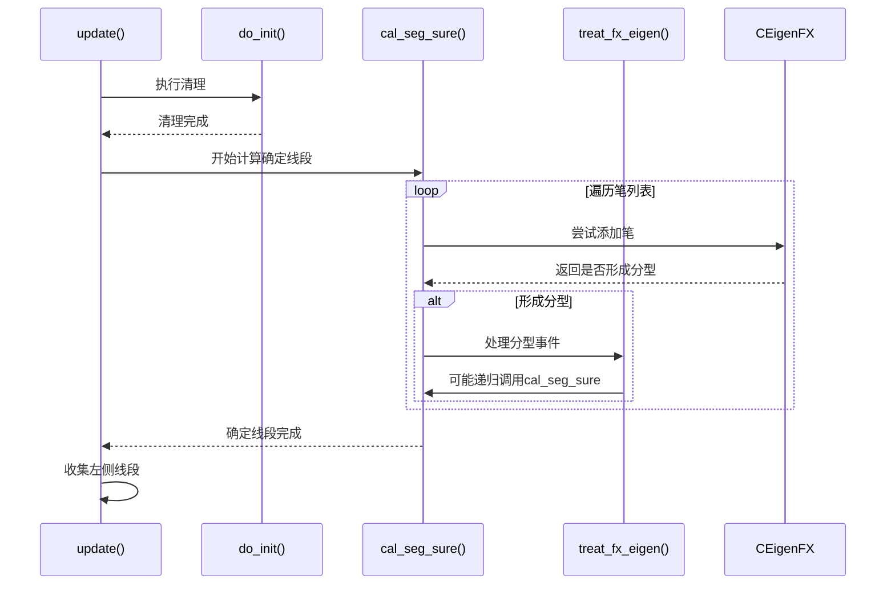
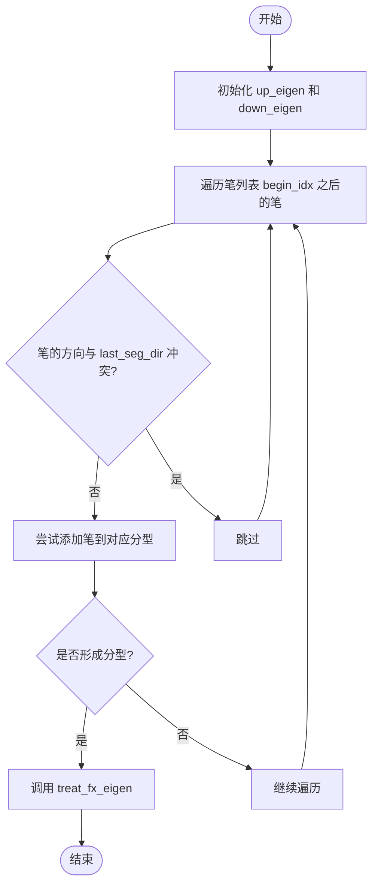
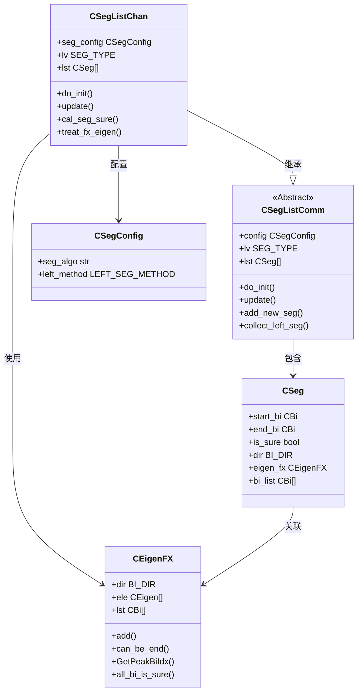

# 标准缠论线段算法

<cite>
**本文档引用文件**  
- [SegListChan.py](file://chan.py/Seg/SegListChan.py)
- [SegListComm.py](file://chan.py/Seg/SegListComm.py)
- [EigenFX.py](file://chan.py/Seg/EigenFX.py)
- [Seg.py](file://chan.py/Seg/Seg.py)
- [SegConfig.py](file://chan.py/Seg/SegConfig.py)
- [CEnum.py](file://chan.py/Common/CEnum.py)
</cite>

## 目录
1. [引言](#引言)
2. [项目结构](#项目结构)
3. [核心组件](#核心组件)
4. [架构概述](#架构概述)
5. [详细组件分析](#详细组件分析)
6. [依赖分析](#依赖分析)
7. [性能考量](#性能考量)
8. [故障排除指南](#故障排除指南)
9. [结论](#结论)

## 引言
本文档深入解析 `CSegListChan` 类实现的标准缠论线段构建算法。该算法基于缠中说禅理论，通过识别笔（Bi）序列中的分型特征点（EigenFX）来确定线段的起止点，从而构建出具有高置信度的趋势结构。重点阐述其继承机制、初始化流程、分型识别逻辑及线段更新策略，适用于趋势识别与交易信号生成场景。

## 项目结构
`CSegListChan` 类位于 `chan.py/Seg/` 目录下，是缠论分析模块中线段识别的核心实现之一。其设计遵循模块化原则，依赖于笔列表（BiList）、分型特征（EigenFX）、线段基类（SegListComm）等组件，共同构成完整的线段识别体系。

```mermaid
graph TD
subgraph "线段识别模块"
SegListChan[CSegListChan]
SegListComm[CSegListComm]
EigenFX[CEigenFX]
Seg[CSeg]
SegConfig[CSegConfig]
end
SegListChan --> SegListComm : "继承"
SegListChan --> EigenFX : "使用"
SegListComm --> Seg : "包含"
SegListComm --> SegConfig : "配置"
```

**图示来源**  
- [SegListChan.py](file://chan.py/Seg/SegListChan.py#L8-L75)
- [SegListComm.py](file://chan.py/Seg/SegListComm.py#L1-L169)
- [EigenFX.py](file://chan.py/Seg/EigenFX.py#L1-L150)

**本节来源**  
- [SegListChan.py](file://chan.py/Seg/SegListChan.py#L1-L76)
- [SegListComm.py](file://chan.py/Seg/SegListComm.py#L1-L169)

## 核心组件
`CSegListChan` 类继承自 `CSegListComm`，实现了标准缠论线段的构建逻辑。其核心功能包括：清理未确认线段、基于分型特征计算确定线段、处理分型确认事件等。通过与 `CEigenFX` 协作，精确识别笔序列中的顶/底分型，进而划分出符合缠论定义的线段。

**本节来源**  
- [SegListChan.py](file://chan.py/Seg/SegListChan.py#L8-L75)
- [SegListComm.py](file://chan.py/Seg/SegListComm.py#L1-L169)

## 架构概述
`CSegListChan` 的工作流程可分为三个阶段：初始化清理、确定线段计算和左侧线段收集。其核心是 `cal_seg_sure` 方法，通过并行维护上升和下降分型特征对象（`up_eigen`, `down_eigen`），遍历笔列表以识别有效的分型结构，从而确定新线段的终点。



**图示来源**  
- [SegListChan.py](file://chan.py/Seg/SegListChan.py#L30-L75)
- [EigenFX.py](file://chan.py/Seg/EigenFX.py#L1-L150)

## 详细组件分析

### CSegListChan 初始化与清理机制
`CSegListChan` 的初始化流程通过继承 `CSegListComm` 并重写 `do_init` 方法实现。其核心任务是清理末尾的不确定线段，确保后续计算基于一个干净的、确定的线段状态。

```python
def do_init(self):
    # 删除末尾不确定的线段
    while len(self) and not self.lst[-1].is_sure:
        _seg = self[-1]
        for bi in _seg.bi_list:
            bi.parent_seg = None
        if _seg.pre:
            _seg.pre.next = None
        self.lst.pop()
    if len(self):
        assert self.lst[-1].eigen_fx and self.lst[-1].eigen_fx.ele[-1]
        if not self.lst[-1].eigen_fx.ele[-1].lst[-1].is_sure:
            # 如果确定线段的分形的第三元素包含不确定笔，也需要重新算
            self.lst.pop()
```

该方法首先移除所有末尾的 `is_sure=False` 的线段，并解除这些线段中笔的 `parent_seg` 关联。更重要的是，它会检查最后一个确定线段所关联的分型（`eigen_fx`）的第三元素是否包含不确定的笔。如果包含，则连同该确定线段一并删除，以防止因后续数据变动导致的高低点计算错误。

**本节来源**  
- [SegListChan.py](file://chan.py/Seg/SegListChan.py#L10-L24)
- [SegListComm.py](file://chan.py/Seg/SegListComm.py#L10-L13)

### cal_seg_sure 核心算法分析
`cal_seg_sure` 方法是线段构建的核心，负责从指定索引开始，寻找下一个可以确定的线段终点。



**图示来源**  
- [SegListChan.py](file://chan.py/Seg/SegListChan.py#L32-L65)

**本节来源**  
- [SegListChan.py](file://chan.py/Seg/SegListChan.py#L30-L65)

#### 算法逻辑详解
1.  **初始化**：创建两个 `CEigenFX` 对象，`up_eigen` 用于识别下降线段（需要上升笔），`down_eigen` 用于识别上升线段（需要下降笔）。
2.  **方向跟踪**：`last_seg_dir` 记录上一个线段的方向，用于确保新线段方向与前一线段相反（`last_seg_dir != BI_DIR.UP/DOWN`）。
3.  **分型识别**：遍历笔列表，将符合条件的笔（方向相反）添加到对应的 `CEigenFX` 对象中。`CEigenFX.add()` 方法会判断是否形成了有效的顶/底分型。
4.  **首段方向确定**：对于第一个线段，算法通过检查 `up_eigen` 和 `down_eigen` 的第二元素是否已形成，来动态确定首段方向，避免因谁先形成分型而产生错误（如反例 US.EVRG）。
5.  **触发处理**：一旦某个 `CEigenFX` 报告形成分型（`fx_eigen` 不为 `None`），立即跳出循环，调用 `treat_fx_eigen` 方法进行后续处理。

### treat_fx_eigen 方法逻辑分支
`treat_fx_eigen` 方法是处理分型确认事件的关键，其逻辑分支决定了线段的最终确认和算法的后续行为。

```python
def treat_fx_eigen(self, fx_eigen, bi_lst: CBiList):
    _test = fx_eigen.can_be_end(bi_lst)
    end_bi_idx = fx_eigen.GetPeakBiIdx()
    if _test in [True, None]:  # 正常结束或反向分型未找到尾部
        is_true = _test is not None
        if not self.add_new_seg(bi_lst, end_bi_idx, is_sure=is_true and fx_eigen.all_bi_is_sure()):
            self.cal_seg_sure(bi_lst, end_bi_idx+1)
            return
        self.lst[-1].eigen_fx = fx_eigen
        if is_true:
            self.cal_seg_sure(bi_lst, end_bi_idx + 1)
    else:
        self.cal_seg_sure(bi_lst, fx_eigen.lst[1].idx)
```

**本节来源**  
- [SegListChan.py](file://chan.py/Seg/SegListChan.py#L67-L75)

#### 逻辑分支解析
1.  **验证分型有效性**：调用 `fx_eigen.can_be_end(bi_lst)` 检查形成的分型是否满足结束条件。返回值 `True` 表示正常结束，`None` 表示在后续笔中未能找到反向分型的尾部（即趋势延续），`False` 表示分型被破坏。
2.  **正常结束与反向分型未找到尾部**（`_test in [True, None]`）：
    *   **创建线段**：调用 `add_new_seg` 创建新线段。线段的 `is_sure` 属性取决于 `_test` 是否为 `True` 以及分型中所有笔是否都已确认（`all_bi_is_sure()`）。
    *   **关联分型**：将 `fx_eigen` 对象赋值给新创建线段的 `eigen_fx` 属性，建立关联。
    *   **递归计算**：如果 `_test` 为 `True`（完全确认），则从新线段的结束笔之后继续调用 `cal_seg_sure`，以寻找下一个线段。如果为 `None`（趋势延续），则不进行递归，等待后续数据。
3.  **分型被破坏**（`_test == False`）：
    *   **回退并重试**：算法认为当前分型无效，需要从分型的第二元素（`fx_eigen.lst[1]`）开始重新计算，这体现了算法对笔连接规则的严格性。

## 依赖分析
`CSegListChan` 类的实现依赖于多个核心组件，形成了清晰的依赖关系。



**图示来源**  
- [SegListChan.py](file://chan.py/Seg/SegListChan.py#L8-L75)
- [SegListComm.py](file://chan.py/Seg/SegListComm.py#L1-L169)
- [EigenFX.py](file://chan.py/Seg/EigenFX.py#L1-L150)
- [Seg.py](file://chan.py/Seg/Seg.py#L1-L153)
- [SegConfig.py](file://chan.py/Seg/SegConfig.py#L1-L13)

**本节来源**  
- [SegListChan.py](file://chan.py/Seg/SegListChan.py#L1-L76)
- [SegListComm.py](file://chan.py/Seg/SegListComm.py#L1-L169)
- [Seg.py](file://chan.py/Seg/Seg.py#L1-L153)

## 性能考量
该算法的时间复杂度主要取决于笔列表的长度和线段的数量。`cal_seg_sure` 方法在最坏情况下可能需要多次遍历笔列表（例如分型被破坏后回退重试）。`CEigenFX` 的 `can_be_end` 方法在存在缺口时会进行额外的反向分型搜索，增加了计算开销。然而，由于其基于增量更新（`update` 方法），在处理实时数据流时表现良好，避免了全量重算。

## 故障排除指南
*   **线段无法生成**：检查 `do_init` 是否清除了所有不确定线段，确认 `cal_seg_sure` 的起始索引是否正确。检查 `CEigenFX` 的分型识别逻辑是否因数据包含问题而失败。
*   **线段方向错误**：重点检查首段方向确定逻辑，确保 `up_eigen.ele[1]` 和 `down_eigen.ele[1]` 的状态判断正确。验证 `last_seg_dir` 的更新是否及时。
*   **分型被过早确认**：检查 `CEigenFX.actual_break` 和 `can_be_end` 方法的实现，确保对缺口和反向分型的验证足够严格。
*   **异常抛出**：常见异常来自 `CSeg` 的 `check` 方法，如 `SEG_END_VALUE_ERR`（线段首尾值不符合方向）或 `SEG_LEN_ERR`（线段长度不足），需检查输入的笔数据是否有效。

**本节来源**  
- [SegListChan.py](file://chan.py/Seg/SegListChan.py#L10-L75)
- [Seg.py](file://chan.py/Seg/Seg.py#L25-L45)
- [EigenFX.py](file://chan.py/Seg/EigenFX.py#L100-L120)

## 结论
`CSegListChan` 类实现了一套严格且完整的标准缠论线段构建算法。它通过继承 `CSegListComm` 复用基础功能，并通过 `do_init`、`cal_seg_sure` 和 `treat_fx_eigen` 等方法，精确地实现了线段的清理、计算和更新。算法利用 `CEigenFX` 识别分型特征点，结合对趋势延续和笔连接规则的严格判断，能够生成高置信度的趋势线段，特别适用于需要稳定趋势信号的交易策略。相较于在震荡市中可能产生过多噪音的其他算法，此实现通过严格的分型验证和回退机制，有效过滤了虚假信号，但在极端震荡行情下可能反应稍慢。