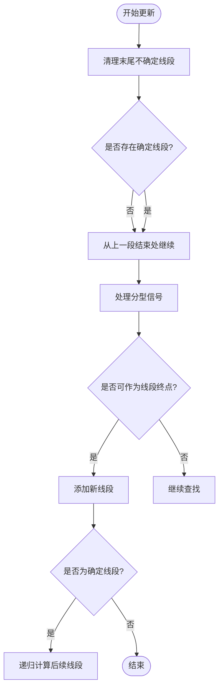
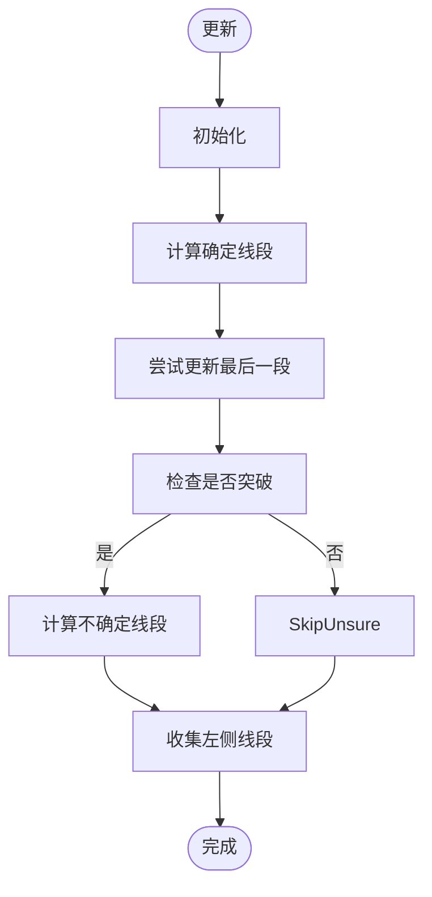
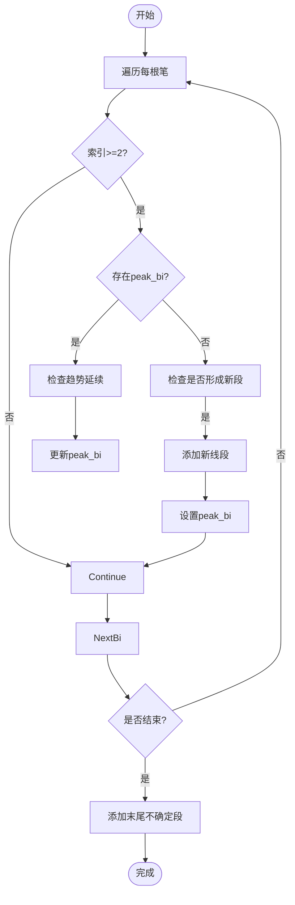

# 线段构建算法

<cite>
**本文档引用文件**  
- [SegConfig.py](file://chan.py/Seg/SegConfig.py)
- [SegListDef.py](file://chan.py/Seg/SegListDef.py)
- [SegListChan.py](file://chan.py/Seg/SegListChan.py)
- [SegListDYH.py](file://chan.py/Seg/SegListDYH.py)
- [SegListComm.py](file://chan.py/Seg/SegListComm.py)
- [KLine_List.py](file://chan.py/KLine/KLine_List.py)
</cite>

## 目录
1. [引言](#引言)
2. [线段构建算法概述](#线段构建算法概述)
3. [SegConfig 配置机制](#segconfig-配置机制)
4. [三种线段算法对比分析](#三种线段算法对比分析)
5. [算法实现机制详解](#算法实现机制详解)
6. [适用场景与性能表现](#适用场景与性能表现)
7. [代码示例与输出差异](#代码示例与输出差异)
8. [总结与建议](#总结与建议)

## 引言
本文深入分析缠论系统中三种核心线段构建算法：标准缠论算法（SegListChan）、都业华1+1法则（SegListDYH）和默认简化算法（SegListDef）。通过解析其在笔连接、趋势延续判断和线段确认上的差异，帮助用户理解不同算法的逻辑本质，并根据交易策略选择最合适的实现方式。

**Section sources**  
- [SegListChan.py](file://chan.py/Seg/SegListChan.py#L0-L76)
- [SegListDYH.py](file://chan.py/Seg/SegListDYH.py#L0-L96)
- [SegListDef.py](file://chan.py/Seg/SegListDef.py#L0-L60)

## 线段构建算法概述
线段是缠论分析中的基本结构单元，用于识别价格走势的趋势与震荡阶段。系统提供了三种不同的线段识别算法，分别适用于不同市场环境和分析需求：

- **标准缠论算法（SegListChan）**：严格遵循缠论原始定义，基于分型（FX）与特征序列构建线段。
- **都业华1+1法则（SegListDYH）**：采用都业华提出的“1+1”模式识别机制，强调趋势延续性判断。
- **默认简化算法（SegListDef）**：一种简化的线段识别方法，侧重于快速响应价格突破。

这些算法均继承自 `CSegListComm` 基类，共享基础数据结构与通用逻辑，但在 `update` 方法中有各自独特的实现路径。

**Section sources**  
- [SegListComm.py](file://chan.py/Seg/SegListComm.py#L0-L169)
- [SegListChan.py](file://chan.py/Seg/SegListChan.py#L0-L76)
- [SegListDYH.py](file://chan.py/Seg/SegListDYH.py#L0-L96)
- [SegListDef.py](file://chan.py/Seg/SegListDef.py#L0-L60)

## SegConfig 配置机制
`CSegConfig` 类负责控制线段构建的核心参数，其中最关键的是 `seg_algo` 配置项，用于指定所使用的线段算法。

```python
class CSegConfig:
    def __init__(self, seg_algo="chan", left_method="peak"):
        self.seg_algo = seg_algo
        if left_method == "all":
            self.left_method = LEFT_SEG_METHOD.ALL
        elif left_method == "peak":
            self.left_method = LEFT_SEG_METHOD.PEAK
        else:
            raise CChanException(f"unknown left_seg_method={left_method}", ErrCode.PARA_ERROR)
```

### seg_algo 可选值：
- `"chan"`：启用标准缠论算法（推荐）
- `"1+1"`：启用都业华1+1法则（已标记为弃用）
- `"break"`：启用默认简化算法（已标记为弃用）

### left_method 参数：
- `"peak"`：使用极值点作为左侧未确认线段的处理方式
- `"all"`：将剩余笔整体视为一个未确认线段

该配置通过 `get_seglist_instance` 工厂函数动态实例化对应的线段列表类：

```python
def get_seglist_instance(seg_config: CSegConfig, lv) -> CSegListComm:
    if seg_config.seg_algo == "chan":
        from Seg.SegListChan import CSegListChan
        return CSegListChan(seg_config, lv)
    elif seg_config.seg_algo == "1+1":
        print(f'Please avoid using seg_algo={seg_config.seg_algo} as it is deprecated and no longer maintained.')
        from Seg.SegListDYH import CSegListDYH
        return CSegListDYH(seg_config, lv)
    elif seg_config.seg_algo == "break":
        print(f'Please avoid using seg_algo={seg_config.seg_algo} as it is deprecated and no longer maintained.')
        from Seg.SegListDef import CSegListDef
        return CSegListDef(seg_config, lv)
    else:
        raise CChanException(f"unsupport seg algoright:{seg_config.seg_algo}", ErrCode.PARA_ERROR)
```

**Section sources**  
- [SegConfig.py](file://chan.py/Seg/SegConfig.py#L0-L12)
- [KLine_List.py](file://chan.py/KLine/KLine_List.py#L0-L35)

## 三种线段算法对比分析

| 特性 | 标准缠论算法 (SegListChan) | 都业华1+1法则 (SegListDYH) | 默认简化算法 (SegListDef) |
|------|--------------------------|----------------------------|--------------------------|
| **理论依据** | 缠论原教旨定义 | 都业华趋势延续理论 | 简化突破逻辑 |
| **线段确认机制** | 分型+特征序列 | 双重条件判断（situation1/2） | 极值比较 |
| **趋势延续判断** | 严格方向交替 | 允许同向延续 | 基于前一线段方向 |
| **笔连接规则** | 特征序列缺口检测 | 相邻三笔关系判断 | 直接极值比较 |
| **适用市场** | 趋势市、震荡市 | 趋势市 | 震荡市 |
| **稳定性** | 高 | 中 | 低 |
| **延迟性** | 较高 | 中等 | 低 |
| **维护状态** | 主流推荐 | 已弃用 | 已弃用 |

**Section sources**  
- [SegListChan.py](file://chan.py/Seg/SegListChan.py#L0-L76)
- [SegListDYH.py](file://chan.py/Seg/SegListDYH.py#L0-L96)
- [SegListDef.py](file://chan.py/Seg/SegListDef.py#L0-L60)

## 算法实现机制详解

### 标准缠论算法（SegListChan）
该算法基于缠论原始定义，通过 `CEigenFX` 类构建线段分型（特征序列分型），并结合 `do_init` 方法清理末尾不确定线段。



**Diagram sources**  
- [SegListChan.py](file://chan.py/Seg/SegListChan.py#L0-L76)

**Section sources**  
- [SegListChan.py](file://chan.py/Seg/SegListChan.py#L0-L76)

### 都业华1+1法则（SegListDYH）
该算法通过两个核心条件函数 `situation1` 和 `situation2` 判断趋势延续，强调“1+1”模式的形成。

```python
def situation1(cur_bi, next_bi, pre_bi):
    # 判断回调不破前低/高，且反向笔未突破当前笔
    ...

def situation2(cur_bi, next_bi, pre_bi):
    # 判断突破前低/高，但反向笔未突破前前笔
    ...
```

其 `update` 流程包括：
1. 初始化清理
2. 计算确定线段（`cal_bi_sure`）
3. 尝试更新最后一段（`try_update_last_seg`）
4. 检查左侧突破（`left_bi_break`）
5. 补充不确定线段（`cal_bi_unsure`）



**Diagram sources**  
- [SegListDYH.py](file://chan.py/Seg/SegListDYH.py#L0-L96)

**Section sources**  
- [SegListDYH.py](file://chan.py/Seg/SegListDYH.py#L0-L96)

### 默认简化算法（SegListDef）
该算法通过极值比较直接判断线段形成，逻辑简洁但稳定性较低。

核心判断条件：
```python
def is_up_seg(bi, pre_bi):
    return bi._high() > pre_bi._high()

def is_down_seg(bi, pre_bi):
    return bi._low() < pre_bi._low()
```

其 `cal_bi_sure` 方法通过遍历笔列表，检测是否满足极值超越条件，并结合 `peak_bi` 缓存机制避免重复识别。



**Diagram sources**  
- [SegListDef.py](file://chan.py/Seg/SegListDef.py#L0-L60)

**Section sources**  
- [SegListDef.py](file://chan.py/Seg/SegListDef.py#L0-L60)

## 适用场景与性能表现

### 适用市场场景
| 算法 | 趋势市 | 震荡市 | 快速行情 | 复杂结构 |
|------|--------|--------|----------|----------|
| SegListChan | ✅ 强 | ✅ 稳定 | ⚠️ 延迟 | ✅ 准确 |
| SegListDYH | ✅ 强 | ⚠️ 易误判 | ✅ 快速 | ⚠️ 不稳定 |
| SegListDef | ⚠️ 易滞后 | ✅ 灵敏 | ✅ 快速 | ❌ 易错 |

### 性能表现对比
- **计算复杂度**：
  - SegListChan：O(n)，但内部有递归调用，实际开销较高
  - SegListDYH：O(n)，双重循环检测，中等开销
  - SegListDef：O(n)，单次遍历，开销最低
- **内存占用**：
  - 三者相近，均需维护线段列表与笔引用
- **实时性**：
  - SegListDef > SegListDYH > SegListChan

### 推荐使用建议
- **长期趋势跟踪**：优先使用 `seg_algo="chan"`
- **短线高频交易**：可尝试 `seg_algo="1+1"`，但需注意其弃用状态
- **回测验证**：建议统一使用 `chan` 算法以保证结果一致性

**Section sources**  
- [SegListChan.py](file://chan.py/Seg/SegListChan.py#L0-L76)
- [SegListDYH.py](file://chan.py/Seg/SegListDYH.py#L0-L96)
- [SegListDef.py](file://chan.py/Seg/SegListDef.py#L0-L60)

## 代码示例与输出差异
假设输入相同的一组K线序列，三种算法可能产生以下差异：

- **SegListChan**：可能仅识别出1个完整线段，其余为未确认段，保守但准确。
- **SegListDYH**：可能识别出2~3个线段，对趋势延续更敏感，但可能出现假信号。
- **SegListDef**：可能识别出多个短小线段，反应迅速但稳定性差。

用户可通过配置 `seg_algo` 参数进行切换，并结合 `left_method` 控制左侧未确认线段的处理方式。

**Section sources**  
- [SegConfig.py](file://chan.py/Seg/SegConfig.py#L0-L12)
- [KLine_List.py](file://chan.py/KLine/KLine_List.py#L0-L35)

## 总结与建议
本文详细解析了三种线段构建算法的实现机制、差异与适用场景。尽管系统仍支持 `1+1` 和 `break` 算法，但从代码注释可见，它们已被明确标记为“deprecated”。因此，**强烈建议用户使用标准缠论算法（seg_algo="chan"）**，以获得最稳定、最符合缠论原意的分析结果。

未来系统升级应聚焦于优化 `SegListChan` 的性能与扩展性，而非维护已弃用的算法路径。