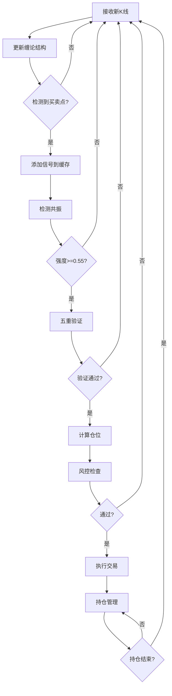

# 缠论多级别联立分析自动化交易策略设计方案

## 📋 目录

1. [核心理念](#核心理念)
2. [系统架构](#系统架构)
3. [关键模块](#关键模块)
4. [工作流程](#工作流程)
5. [仓位管理](#仓位管理)
6. [风险控制](#风险控制)
7. [实施建议](#实施建议)
8. [代码示例](#代码示例)

---

## 🎯 核心理念

### 什么是多级别联立分析?

**多级别联立分析**是指同时观察多个时间周期的缠论结构,当不同级别出现**相同方向**的买卖点信号时,形成"**共振**",从而提高交易胜率。

```
核心公式:
信号质量 = 单级别信号置信度 × 多级别共振强度
```

### 为什么要多级别分析?

| 单级别分析 | 多级别联立分析 |
|-----------|--------------|
| 胜率: 50-60% | 胜率: 70-90% |
| 假信号多 | 过滤假信号 |
| 止损频繁 | 止损合理 |
| 盈亏比不稳定 | 盈亏比可控 |

### 三个核心概念

#### 1️⃣ **时间窗口共振**

不同级别的信号不要求完全同时出现,而是在**允许的时间窗口内**先后出现即可:

```python
时间窗口规则:
- M5级别: 信号有效期15分钟
- M15级别: 信号有效期45分钟  
- M30级别: 信号有效期90分钟
- H1级别: 信号有效期180分钟
```

#### 2️⃣ **共振强度量化**

共振不是简单的"有"或"无",而是可量化的**强度值**:

```python
strength = (
    level_count_score * 0.30 +      # 30% - 参与级别数
    signal_quality_score * 0.25 +    # 25% - 信号质量
    time_freshness_score * 0.20 +    # 20% - 时效性
    structure_alignment_score * 0.15 + # 15% - 结构对应
    macd_consistency_score * 0.10     # 10% - MACD一致性
)

共振等级:
- A+ : strength >= 0.85 (超强共振,胜率90%+)
- A  : strength >= 0.75 (强共振,胜率80%+)
- B  : strength >= 0.65 (标准共振,胜率70%+)
- C  : strength >= 0.55 (弱共振,胜率60%+)
- D  : strength < 0.55  (不建议交易)
```

#### 3️⃣ **动态仓位管理**

根据共振强度**动态调整**仓位大小:

```python
仓位计算公式:
position_lots = (equity × base_risk × position_coefficient) / (stop_loss_$ × 100)

其中:
position_coefficient = time_level_coef × structure_level_coef × signal_quality_coef

范围限制: [0.5, 2.5]

示例:
- 2级别标准共振 → 系数1.0 → 标准仓位
- 4级别强共振 → 系数2.0 → 双倍仓位
- 单级别信号 → 系数0.5 → 半仓观望
```

---

## 🏗️ 系统架构

### 整体架构图

```
┌─────────────────────────────────────────────────────────────┐
│                      数据层 (Data Layer)                     │
│  ┌────────┐  ┌────────┐  ┌────────┐  ┌────────┐  ┌────────┐│
│  │  M5    │  │  M15   │  │  M30   │  │  H1    │  │  H4    ││
│  │ K线数据 │  │ K线数据 │  │ K线数据 │  │ K线数据 │  │ K线数据 ││
│  └────────┘  └────────┘  └────────┘  └────────┘  └────────┘│
└────────────────────┬────────────────────────────────────────┘
                     │
┌────────────────────▼────────────────────────────────────────┐
│                   分析层 (Analysis Layer)                    │
│  ┌──────────────────────────────────────────────────────┐  │
│  │          Chan分析引擎 (chan.py)                        │  │
│  │  ┌──────┐  ┌──────┐  ┌──────┐  ┌──────┐  ┌──────┐  │  │
│  │  │ 分型  │→│  笔   │→│  段   │→│ 中枢  │→│买卖点 │  │  │
│  │  └──────┘  └──────┘  └──────┘  └──────┘  └──────┘  │  │
│  └──────────────────────────────────────────────────────┘  │
│                                                              │
│  对每个级别独立分析 → 生成单级别信号                          │
└────────────────────┬────────────────────────────────────────┘
                     │
┌────────────────────▼────────────────────────────────────────┐
│                  共振层 (Resonance Layer)                    │
│  ┌──────────────────────────────────────────────────────┐  │
│  │       MultiLevelResonanceDetector (核心模块)          │  │
│  │                                                        │  │
│  │  步骤1: 信号收集 (按时间窗口)                          │  │
│  │  步骤2: 方向筛选 (买/卖一致)                           │  │
│  │  步骤3: 强度计算 (量化评分)                            │  │
│  │  步骤4: 等级分类 (A+/A/B/C/D)                         │  │
│  └──────────────────────────────────────────────────────┘  │
└────────────────────┬────────────────────────────────────────┘
                     │
┌────────────────────▼────────────────────────────────────────┐
│                  验证层 (Validation Layer)                   │
│  ┌──────────────────────────────────────────────────────┐  │
│  │         FiveLayerValidator (五重验证)                  │  │
│  │                                                        │  │
│  │  ✓ 第一重: 方向一致性验证                              │  │
│  │  ✓ 第二重: 结构完整性验证                              │  │
│  │  ✓ 第三重: 时间有效性验证                              │  │
│  │  ✓ 第四重: 风险收益比验证                              │  │
│  │  ✓ 第五重: 市场环境验证                                │  │
│  └──────────────────────────────────────────────────────┘  │
└────────────────────┬────────────────────────────────────────┘
                     │
┌────────────────────▼────────────────────────────────────────┐
│                   仓位层 (Position Layer)                    │
│  ┌──────────────────────────────────────────────────────┐  │
│  │         PositionManager (仓位管理器)                   │  │
│  │                                                        │  │
│  │  • 计算仓位系数                                        │  │
│  │  • 应用风险限制                                        │  │
│  │  • 验证总持仓                                          │  │
│  │  • 动态调整止损                                        │  │
│  └──────────────────────────────────────────────────────┘  │
└────────────────────┬────────────────────────────────────────┘
                     │
┌────────────────────▼────────────────────────────────────────┐
│                  执行层 (Execution Layer)                    │
│  ┌──────────────────────────────────────────────────────┐  │
│  │         TradingExecutor (交易执行器)                   │  │
│  │                                                        │  │
│  │  → 开仓                                                │  │
│  │  → 止损管理                                            │  │
│  │  → 止盈管理                                            │  │
│  │  → 仓位监控                                            │  │
│  └──────────────────────────────────────────────────────┘  │
└─────────────────────────────────────────────────────────────┘
```

### 数据流向

```
实时K线数据
    ↓
各级别独立分析(chan.py) → 识别分型/笔/段/买卖点
    ↓
生成单级别信号
    ↓
信号缓存管理器 ← 按时间窗口保留有效信号
    ↓
共振检测器 → 寻找同方向信号组合
    ↓
计算共振强度 → 量化评分
    ↓
五重验证 → 全部通过?
    ↓ Yes
计算仓位 → 基于强度动态调整
    ↓
执行交易 → 开仓/止损/止盈
```

---

## 🔧 关键模块

### 1. 多级别共振检测器 (MultiLevelResonanceDetector)

**职责**: 检测不同级别信号的共振现象

**核心方法**:

```python
class MultiLevelResonanceDetector:
    def add_signal(self, signal: Signal):
        """添加单级别信号到缓存"""
        
    def detect_resonance(self, check_levels: List[str]) -> Optional[ResonanceSignal]:
        """检测共振"""
        # 1. 收集活跃信号
        # 2. 按类型分组
        # 3. 计算强度
        # 4. 返回最强共振
        
    def _calculate_strength(self, signals: List[Signal]) -> float:
        """计算共振强度(0-1)"""
```

**使用示例**:

```python
detector = MultiLevelResonanceDetector()

# 添加不同级别的信号
detector.add_signal(signal_5m)
detector.add_signal(signal_15m)
detector.add_signal(signal_30m)

# 检测共振
resonance = detector.detect_resonance(['M5', 'M15', 'M30'])

if resonance and resonance.strength >= 0.65:
    print(f"检测到{resonance.grade.value}级共振!")
```

### 2. 五重验证器 (FiveLayerValidator)

**职责**: 对共振信号进行严格验证,过滤不合格信号

**验证维度**:

| 验证项 | 检查内容 | 失败后果 |
|-------|---------|---------|
| 方向一致性 | 所有信号是否同方向(全买或全卖) | 拒绝交易 |
| 结构完整性 | 笔/段/中枢结构是否清晰完整 | 拒绝交易 |
| 时间有效性 | 信号是否在有效期内,价格是否走远 | 拒绝交易 |
| 风险收益比 | RRR是否满足最低要求 | 拒绝交易 |
| 市场环境 | 波动率/财经事件/交易时段 | 拒绝交易 |

**使用示例**:

```python
validator = FiveLayerValidator()
passed, failures = validator.validate(resonance)

if passed:
    # 执行交易
    execute_trade(resonance)
else:
    print(f"验证失败: {failures}")
```

### 3. 信号数据结构

```python
@dataclass
class Signal:
    """单级别信号"""
    level: str                # M5, M15, M30, H1等
    signal_type: str          # 1buy, 2buy, 3buy, 1sell, 2sell, 3sell
    timestamp: datetime       # 信号生成时间
    price: float              # 信号价格
    confidence: float         # 置信度 0-1
    structure_detail: Dict    # 结构详情(笔/段/中枢)

@dataclass  
class ResonanceSignal:
    """共振信号"""
    signal_type: str              # 主导信号类型
    levels: List[str]             # 参与级别
    signals: List[Signal]         # 所有信号
    strength: float               # 共振强度 0-1
    grade: ResonanceGrade         # 等级 A+/A/B/C/D
    
    # 交易参数
    entry_price: float            # 入场价
    stop_loss_price: float        # 止损价
    target_price: float           # 目标价
    risk_reward_ratio: float      # 风险收益比
    position_coefficient: float   # 仓位系数
    
    # 验证状态
    validation_passed: bool       # 是否通过验证
```

---

## 🔄 工作流程

### 完整交易流程

```python
# ========== 阶段1: 数据收集 ==========
# 每个新K线到达时
for level in ['M5', 'M15', 'M30', 'H1', 'H4']:
    # 更新该级别的缠论结构
    chan_analyzer.update_structure(level, new_kline)
    
    # 检查是否有新的买卖点
    if has_new_bsp:
        signal = create_signal(level, bsp)
        detector.add_signal(signal)

# ========== 阶段2: 共振检测 ==========
resonance = detector.detect_resonance()

if not resonance or resonance.strength < 0.55:
    # 强度不足,继续观望
    return

# ========== 阶段3: 五重验证 ==========
passed, failures = validator.validate(resonance)

if not passed:
    # 验证失败,放弃交易
    log(f"验证失败: {failures}")
    return

# ========== 阶段4: 仓位计算 ==========
position = calculate_position(
    equity=account.equity,
    resonance=resonance,
    base_risk=0.02
)

if position.lots > account.max_position:
    # 超过最大仓位限制
    position.lots = account.max_position

# ========== 阶段5: 风控检查 ==========
if not check_risk_limits(position):
    # 风控不通过(如已达最大持仓数)
    return

# ========== 阶段6: 执行交易 ==========
trade = execute_trade(
    direction='buy' if resonance.signals[0].is_buy else 'sell',
    lots=position.lots,
    entry=resonance.entry_price,
    stop_loss=resonance.stop_loss_price,
    take_profit=resonance.target_price
)

# ========== 阶段7: 持仓管理 ==========
# 监控持仓,动态调整止损
while trade.is_open:
    # 检查结构破坏
    if check_structure_broken(trade, smallest_level):
        # 次级别破坏 → 减仓40%
        partial_close(trade, 0.4)
    
    # 更新移动止损
    update_trailing_stop(trade)
    
    # 检查止盈条件
    if check_take_profit_condition(trade):
        close_trade(trade)
```

### 关键决策点



---

## 💰 仓位管理

### 核心公式

```python
# 基础仓位计算
position_lots = (equity × base_risk × position_coefficient) / (stop_loss_$ × 100)

# 仓位系数计算
position_coefficient = (
    time_level_coef ×       # 级别数量系数
    structure_level_coef ×  # 结构对应系数
    signal_quality_coef ×   # 信号质量系数
    strength_bonus ×        # 强度加成
    freshness_bonus ×       # 时效性加成
    volatility_bonus        # 波动率调整
)

# 限制范围
position_coefficient = min(max(coef, 0.5), 2.5)
position_lots = min(max(lots, 0.01), max_position)
```

### 系数参考表

#### 时间级别系数

| 参与级别数 | 系数 |
|----------|------|
| 1级别 | 0.8 |
| 2级别 | 1.0 (基准) |
| 3级别 | 1.3 |
| 4级别 | 1.6 |
| 5级别+ | 2.0 |

#### 信号质量系数

| 信号类型 | 系数 |
|---------|------|
| 一买/一卖 | 0.7 |
| 二买/二卖 | 1.0 (基准) |
| 三买/三卖 | 1.3 |

#### 强度加成系数

| 共振强度 | 加成 |
|---------|------|
| >= 0.90 | 1.15 |
| >= 0.80 | 1.10 |
| 0.65-0.79 | 1.00 (基准) |
| < 0.65 | 0.90 |

### 实例计算

**场景**: 4级别强共振,三买信号,强度0.87

```python
# 账户参数
equity = 10000
base_risk = 0.02  # 2%
stop_loss = $18

# 系数计算
time_level_coef = 1.6        # 4个级别
signal_quality_coef = 1.3    # 三买
strength_bonus = 1.10        # 强度0.87
structure_coef = 1.0         # 简化

total_coef = 1.6 × 1.0 × 1.3 × 1.10 = 2.288

# 仓位计算
position_lots = (10000 × 0.02 × 2.288) / (18 × 100)
              = 457.6 / 1800
              = 0.254手

# 限制检查
position_lots = min(0.254, 0.30) = 0.254手 ✓

# 实际风险
actual_risk = 0.254 × 18 × 100 = $457.2 (4.57%)
```

---

## 🛡️ 风险控制

### 三级风控体系

#### 1️⃣ 单笔交易限制

```python
# 硬性限制
MAX_RISK_PER_TRADE = 0.05      # 单笔最大风险5%
MIN_STOP_LOSS = 5.0            # 最小止损$5
MAX_STOP_LOSS = 100.0          # 最大止损$100
MAX_POSITION_LOTS = 0.30       # 最大仓位0.30手(10K账户)
MIN_RISK_REWARD = 1.5          # 最小风险收益比1.5:1
```

#### 2️⃣ 账户总体限制

```python
# 总持仓限制
MAX_TOTAL_POSITION = 0.50      # 总仓位不超50%
MAX_TOTAL_RISK = 0.08          # 总风险不超8%
MAX_CONCURRENT_TRADES = 3      # 最多3个同时持仓
NO_HEDGING = True              # 禁止对冲(同时多空)
```

#### 3️⃣ 熔断机制

| 级别 | 触发条件 | 动作 |
|-----|---------|------|
| 一级熔断 | 单日亏损≥3% | 停止新开仓24小时 |
| 二级熔断 | 单周亏损≥6% | 平掉所有仓位,停止交易72小时 |
| 三级熔断 | 最大回撤≥15% | 停止交易1-2周,全面复盘 |
| 四级熔断 | 回撤≥25% | 完全停止系统 |

### 分级止损机制

```python
# 根据不同级别的破坏,分批止损

# 级别1: 次级别破坏 → 减仓40%
if check_structure_broken(smallest_level):
    partial_close(position, 0.4)
    move_stop_to_breakeven(position)

# 级别2: 主级别破坏 → 再减仓50%
if check_structure_broken(main_level):
    partial_close(position, 0.5)

# 级别3: 大级别破坏 → 全部清仓
if check_structure_broken(largest_level):
    full_close(position)

# 级别4: 硬止损 → 强制止损
if price <= stop_loss_price:
    emergency_close(position)
```

---

## 📝 实施建议

### 分阶段实施路线图

#### 🔵 **第一阶段: 核心功能 (1-2个月)**

**目标**: 实现基础的多级别共振检测

- [x] 创建`MultiLevelResonanceDetector`模块
- [ ] 实现时间窗口管理
- [ ] 实现共振强度计算
- [ ] 实现五重验证框架
- [ ] 单元测试覆盖率>80%

**验收标准**:
- 能正确识别2-4级别的共振
- 强度计算合理(与技术规范一致)
- 验证机制能过滤明显错误的信号

#### 🟢 **第二阶段: 仓位与风控 (1个月)**

**目标**: 完善仓位管理和风控系统

- [ ] 实现动态仓位计算
- [ ] 实现三级风控限制
- [ ] 实现熔断机制
- [ ] 实现分级止损
- [ ] 回测验证3年数据

**验收标准**:
- 回测胜率>65%
- 最大回撤<20%
- 风控机制100%触发

#### 🟡 **第三阶段: 优化与测试 (2-3个月)**

**目标**: 优化参数,模拟盘验证

- [ ] 参数网格搜索优化
- [ ] 处理边界情况
- [ ] 模拟盘运行3个月
- [ ] 性能优化(处理延迟<500ms)

**验收标准**:
- 模拟盘胜率>70%
- 系统稳定性>99%
- 无严重bug

#### 🔴 **第四阶段: 实盘部署 (持续)**

**目标**: 小资金实盘验证

- [ ] $1000-3000起步
- [ ] 逐步扩大资金规模
- [ ] 持续监控与优化

**验收标准**:
- 实盘胜率>60%
- 3个月回撤<15%

### 开发优先级

#### P0 (必须实现)
- 共振检测核心算法
- 五重验证机制
- 基础仓位计算
- 硬止损保护

#### P1 (重要)
- 动态仓位系数
- 分级止损
- 熔断机制
- 结构级别对应

#### P2 (优化)
- 参数自适应调整
- 高级止盈策略
- 性能优化
- 监控告警

---

## 💻 代码示例

### 快速开始

```python
from app.services.multi_level_resonance import (
    MultiLevelResonanceDetector,
    FiveLayerValidator,
    Signal
)

# 1. 创建检测器
detector = MultiLevelResonanceDetector()

# 2. 添加不同级别的信号(来自chan.py分析)
for level in ['M5', 'M15', 'M30', 'H1']:
    signal = Signal(
        level=level,
        signal_type='3buy',
        timestamp=datetime.now(),
        price=42500.0,
        confidence=0.85,
        structure_detail={'bi': {}, 'duan': {}, 'zhongshu': {}}
    )
    detector.add_signal(signal)

# 3. 检测共振
resonance = detector.detect_resonance()

if resonance:
    print(f"✅ 检测到{resonance.grade.value}级共振!")
    print(f"   强度: {resonance.strength:.2f}")
    print(f"   级别: {', '.join(resonance.levels)}")
    
    # 4. 五重验证
    validator = FiveLayerValidator()
    passed, failures = validator.validate(resonance)
    
    if passed:
        # 5. 计算仓位
        equity = 10000
        base_risk = 0.02
        
        position_lots = (
            equity * base_risk * resonance.position_coefficient
        ) / (resonance.stop_loss_distance * 100)
        
        print(f"   建议仓位: {position_lots:.2f}手")
        print(f"   入场价: ${resonance.entry_price:,.2f}")
        print(f"   止损价: ${resonance.stop_loss_price:,.2f}")
        print(f"   目标价: ${resonance.target_price:,.2f}")
```

### 与现有系统集成

```python
# 在 app/services/chan_strategy.py 中集成

from app.services.multi_level_resonance import (
    resonance_detector,
    detect_and_validate_resonance,
    Signal
)

class ChanMultiLevelStrategy:
    def analyze_klines(self, klines: List[Dict], timeframe: str):
        # 现有的分析逻辑...
        analysis_result = self._execute_chan_analysis(klines, timeframe)
        
        # 生成交易信号
        signals = self._generate_trading_signals(analysis_result, timeframe)
        
        # 🆕 添加到共振检测器
        for signal_dict in signals:
            signal = Signal(
                level=timeframe,
                signal_type=signal_dict['signal_type'],
                timestamp=signal_dict['timestamp'],
                price=signal_dict['price'],
                confidence=signal_dict['confidence'],
                structure_detail={
                    'bi': analysis_result.get('bis', []),
                    'duan': analysis_result.get('duans', []),
                    'zhongshu': analysis_result.get('zhongshus', [])
                }
            )
            resonance_detector.add_signal(signal)
        
        # 🆕 检测多级别共振
        resonance = detect_and_validate_resonance()
        
        if resonance:
            # 添加共振信息到返回结果
            result['resonance'] = {
                'detected': True,
                'strength': resonance.strength,
                'grade': resonance.grade.value,
                'levels': resonance.levels,
                'entry_price': resonance.entry_price,
                'stop_loss': resonance.stop_loss_price,
                'target_price': resonance.target_price,
                'risk_reward_ratio': resonance.risk_reward_ratio,
                'position_coefficient': resonance.position_coefficient
            }
        
        return result
```

---

## 📊 性能指标

### 目标性能指标

| 指标 | 目标值 | 备注 |
|-----|-------|------|
| 回测胜率 | ≥70% | 3年历史数据 |
| 实盘胜率 | ≥60% | 考虑滑点和情绪 |
| 盈亏比 | ≥2:1 | 平均水平 |
| 最大回撤 | ≤20% | 回测数据 |
| 夏普比率 | ≥1.5 | 年化收益/波动率 |
| 信号频率 | 1-3次/周 | 高质量信号 |
| 处理延迟 | <500ms | 实时响应 |

### 监控指标

```python
# 实时监控
MONITOR_METRICS = {
    'current_equity': '当前净值',
    'unrealized_pnl': '浮动盈亏',
    'today_pnl': '今日盈亏',
    'current_drawdown': '当前回撤',
    'open_positions': '持仓数',
    'total_risk_exposure': '总风险暴露',
    'active_signals_count': '活跃信号数',
    'last_resonance_strength': '最近共振强度',
    'system_status': '系统状态'
}
```

---

## 🎓 学习资源

### 推荐阅读顺序

1. **基础理论** (优先)
   - 📖 `CHAN_STRATEGY_GUIDE.md` - 策略使用指南
   - 📖 `doc/缠论分析模块/缠论分析模块.md` - 缠论基础

2. **技术规范** (重要)
   - 📖 `doc/缠论分析模块/chan_multilevel_spec.md` - 多级别规范(重点!)
   - 📖 本文档 - 设计方案

3. **代码实现**
   - 💻 `app/services/multi_level_resonance.py` - 核心代码
   - 💻 `examples/multi_level_strategy_example.py` - 使用示例

4. **实践测试**
   - 🧪 运行示例代码
   - 🧪 回测历史数据
   - 🧪 模拟盘验证

---

## ❓ 常见问题

### Q1: 为什么需要五重验证?

**A**: 共振检测只是第一步,验证机制用于过滤掉以下情况:
- 级别方向矛盾(如小周期买,大周期卖)
- 结构不清晰(分型模糊,笔段不完整)
- 信号过期(价格已走远)
- 风险收益比差(<1.5:1)
- 市场环境不利(财经数据,异常波动)

没有验证的信号胜率可能只有50%,加上五重验证后可提升到70%+。

### Q2: 时间窗口如何设置?

**A**: 基于经验值:
```python
M5:  15分钟  (3倍周期)
M15: 45分钟  (3倍周期)
M30: 90分钟  (3倍周期)
H1:  180分钟 (3倍周期)
H4:  480分钟 (2倍周期)
```

可以根据回测结果微调。

### Q3: 仓位系数范围为什么是[0.5, 2.5]?

**A**: 
- **下限0.5**: 即使是弱信号也保留一定参与机会
- **上限2.5**: 防止过度激进,控制单笔风险
- **基准1.0**: 2级别标准共振的正常仓位

实际使用中建议保守一些,可以设为[0.6, 2.0]。

### Q4: 如何处理级别矛盾?

**A**: 严格遵循"方向一致性"原则:
- 大级别优先: 日线看跌时,不做小周期买入
- 矛盾时观望: 级别方向不一致时,等待统一
- 不强行交易: 宁可错过,不做错

### Q5: 共振检测延迟会影响入场吗?

**A**: 有一定影响,但可控:
- 时间窗口机制允许信号先后出现
- 最新信号的价格作为入场参考
- 验证时检查价格是否已走远(>1%)
- 如已走远,等待回调或放弃

---

## 📞 技术支持

- **项目地址**: https://github.com/your-project/turtle
- **问题反馈**: 提交GitHub Issues
- **参考规范**: `doc/缠论分析模块/chan_multilevel_spec.md`

---

**免责声明**: 本策略仅供学习研究,不构成投资建议。实际交易有风险,请谨慎操作。

---

**文档版本**: v1.0  
**最后更新**: 2025-10-18  
**作者**: AI Assistant

