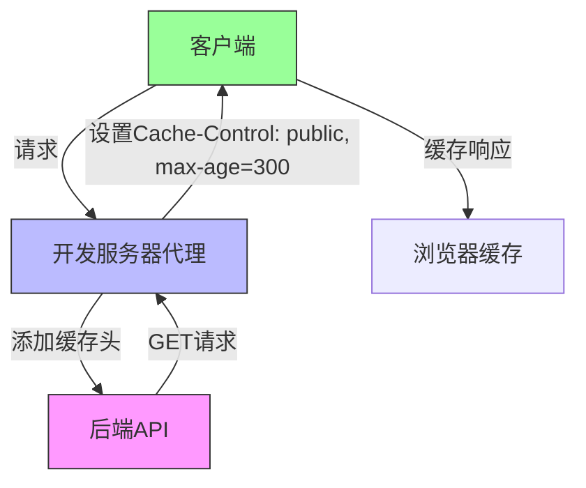
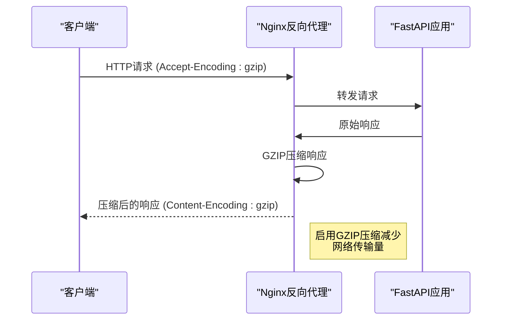
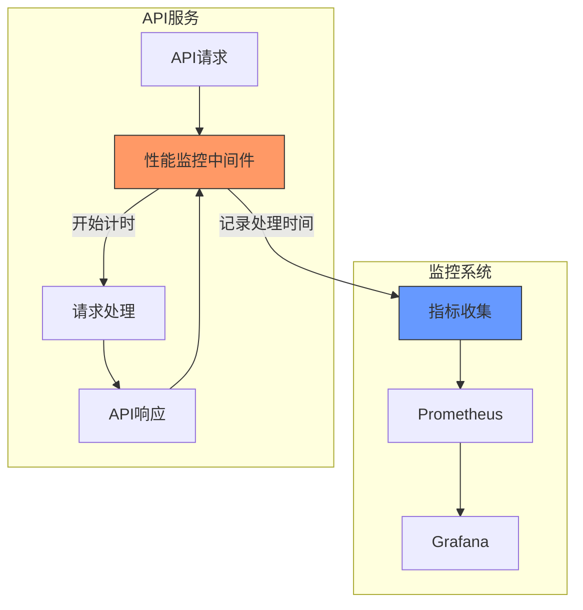
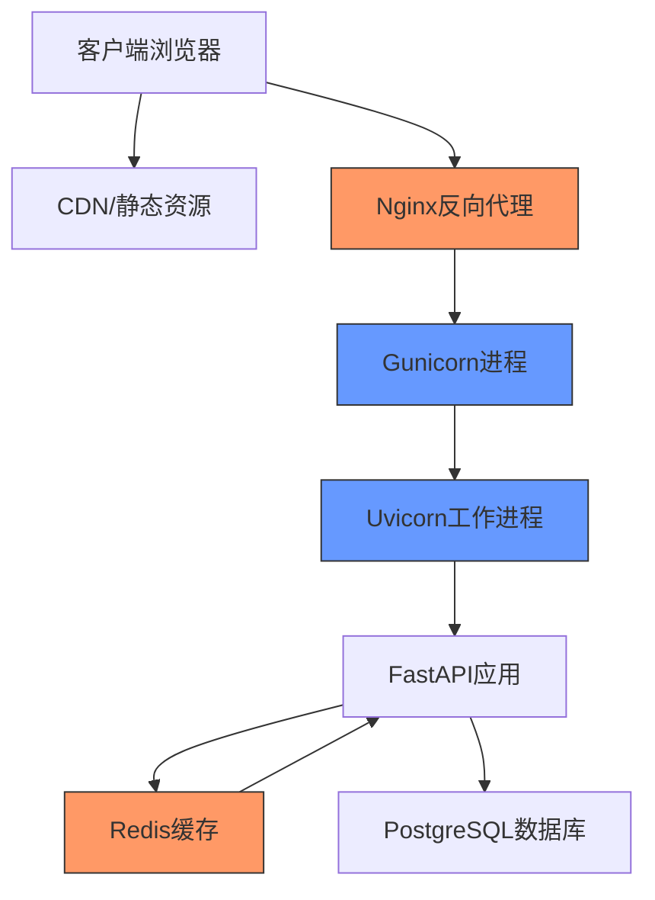

# API性能优化

<cite>
**本文档引用的文件**
- [kline.py](file://app/api/v1/endpoints/kline.py)
- [chan_analysis.py](file://app/api/v1/endpoints/chan_analysis.py)
- [main.py](file://app/main.py)
- [config.py](file://app/core/config.py)
- [performance_recommendations.md](file://performance_recommendations.md)
- [api.js](file://frontend/src/lib/api.js)
- [vite.config.js](file://frontend/vite.config.js)
</cite>

## 目录
1. [API限流与请求速率控制](#api限流与请求速率控制)
2. [异步处理与后台任务](#异步处理与后台任务)
3. [响应数据结构优化](#响应数据结构优化)
4. [缓存策略与GZIP压缩](#缓存策略与gzip压缩)
5. [性能监控中间件](#性能监控中间件)
6. [综合性能优化建议](#综合性能优化建议)

## API限流与请求速率控制

为防止API被滥用，系统需要实施有效的限流策略。根据性能优化建议文档，推荐使用`slowapi`等限流中间件来实现请求速率限制。

通过配置合理的请求速率限制（如每分钟100次），可以有效保护后端服务免受过度请求的影响，确保系统稳定性和可用性。限流机制能够防止恶意用户或自动化脚本对API进行高频调用，避免资源耗尽和性能下降。

在FastAPI应用中，可以通过添加限流中间件来实现这一功能，对不同端点或用户实施不同的速率限制策略，从而实现精细化的流量控制。

**Section sources**
- [performance_recommendations.md](file://performance_recommendations.md#L50-L55)

## 异步处理与后台任务

为避免耗时操作阻塞主线程，系统应使用FastAPI的`BackgroundTasks`实现异步处理。对于数据获取和分析等耗时操作，可以将其移至后台执行，从而提高API响应速度和系统吞吐量。

在缠论分析系统中，K线数据获取和复杂的技术分析计算可能需要较长时间。通过将这些操作作为后台任务处理，主线程可以立即返回响应，提升用户体验。后台任务可以处理数据抓取、数据库操作、复杂计算等耗时工作，而不会影响API的响应性能。

这种异步处理模式特别适用于需要从外部API（如币安）获取数据的场景，因为网络请求通常具有较高的延迟。

**Section sources**
- [performance_recommendations.md](file://performance_recommendations.md#L45-L50)
- [chan_analysis.py](file://app/api/v1/endpoints/chan_analysis.py#L20-L25)

## 响应数据结构优化

优化API响应数据结构是提升性能的关键措施之一。系统应只返回客户端所需的必要字段，减少网络传输量和数据解析开销。

在K线数据和缠论分析结果的返回中，应避免包含冗余信息。通过精简响应数据，不仅可以减少带宽消耗，还能降低客户端的数据处理负担，提高整体系统性能。

对于不同的使用场景，可以提供不同粒度的数据接口。例如，提供一个精简版的摘要接口和一个包含完整信息的详细接口，让客户端根据实际需求选择合适的接口。

**Section sources**
- [kline.py](file://app/api/v1/endpoints/kline.py#L100-L150)
- [chan_analysis.py](file://app/api/v1/endpoints/chan_analysis.py#L50-L100)

## 缓存策略与GZIP压缩

结合`kline.py`和`chan_analysis.py`中的端点，系统应实施有效的缓存策略并启用GZIP压缩，以进一步提升性能。

### 缓存头配置

前端开发服务器配置显示，系统已在代理层添加了缓存头：



**Diagram sources**
- [vite.config.js](file://frontend/vite.config.js#L35-L45)

### 前端缓存机制

前端实现了分层缓存机制，根据不同数据类型设置不同的缓存时长：

```mermaid
classDiagram
class CacheConfig {
+STATIC_CACHE_DURATION : 30分钟
+CACHE_DURATION : 5分钟
+REALTIME_CACHE_DURATION : 30秒
}
class CacheManager {
-cache : Map
+getCacheKey(endpoint, params)
+getCached(endpoint, params, duration)
+clearCache(pattern)
}
class ApiClient {
+getTimeframes()
+getKlines()
+getLatestKlines()
+analyzeChan()
}
CacheConfig --> CacheManager : "配置"
CacheManager --> ApiClient : "提供"
ApiClient --> CacheManager : "使用"
note right of CacheConfig
静态数据如时间周期：30分钟缓存<br/>
一般数据如历史K线：5分钟缓存<br/>
实时数据如最新K线：30秒缓存
end note
```

**Diagram sources**
- [api.js](file://frontend/src/lib/api.js#L220-L260)

### GZIP压缩

虽然当前代码中未直接显示GZIP压缩配置，但在生产部署建议中，使用Nginx反向代理时可以启用GZIP压缩：



**Diagram sources**
- [performance_recommendations.md](file://performance_recommendations.md#L95-L100)

## 性能监控中间件

为便于性能分析和瓶颈定位，系统需要实现性能监控中间件，记录每个API请求的处理时间。

### 监控指标收集

根据性能优化建议，系统应添加Prometheus指标收集和性能监控中间件：



**Diagram sources**
- [performance_recommendations.md](file://performance_recommendations.md#L75-L80)

### 健康检查端点

系统已实现多个健康检查端点，用于监控系统状态：

```mermaid
classDiagram
class HealthCheck {
+/health : 系统健康检查
+/simple/health : K线API健康检查
+/chan/health : 缠论分析健康检查
}
class HealthResponse {
+status : string
+message : string
+components : object
+timestamp : string
}
HealthCheck --> HealthResponse : "返回"
note right of HealthCheck
提供多层次的健康检查<br/>
便于快速定位问题组件
end note
```

**Diagram sources**
- [main.py](file://app/main.py#L90-L100)
- [chan_analysis.py](file://app/api/v1/endpoints/chan_analysis.py#L380-L420)

## 综合性能优化建议

结合系统现状，提出以下综合性能优化建议：

### 部署架构优化



**Diagram sources**
- [performance_recommendations.md](file://performance_recommendations.md#L90-L95)

### 性能优化实施路线图

| 优化措施 | 优先级 | 实施难度 | 预期收益 |
|---------|-------|---------|---------|
| 添加API限流 | 高 | 中 | 防止滥用，保护系统 |
| 实现Redis缓存 | 高 | 中 | 显著提升响应速度 |
| 启用GZIP压缩 | 中 | 低 | 减少网络传输量 |
| 数据库分区 | 高 | 高 | 提升查询性能 |
| 性能监控中间件 | 高 | 中 | 便于问题诊断 |

**Section sources**
- [performance_recommendations.md](file://performance_recommendations.md#L0-L107)