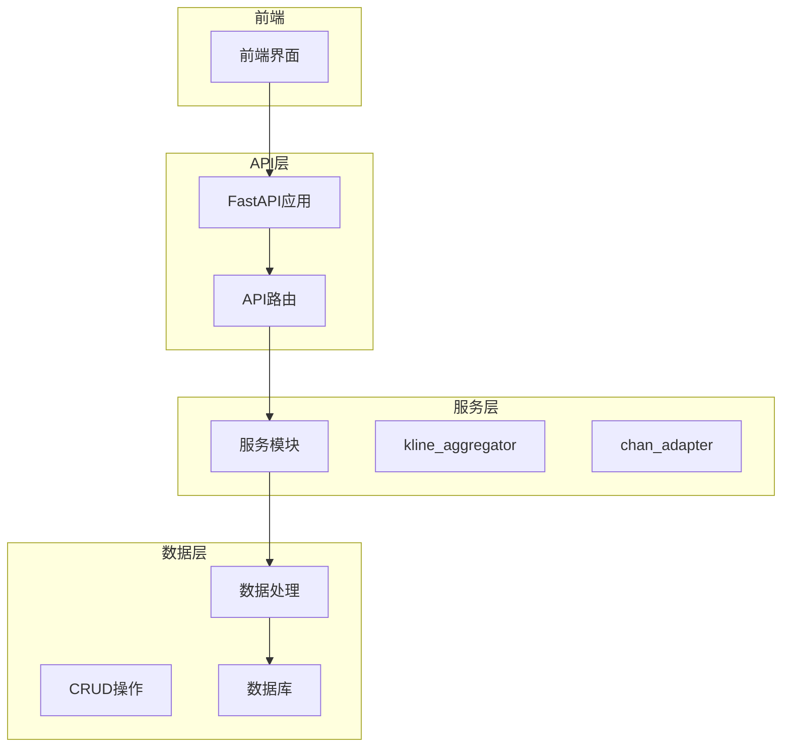
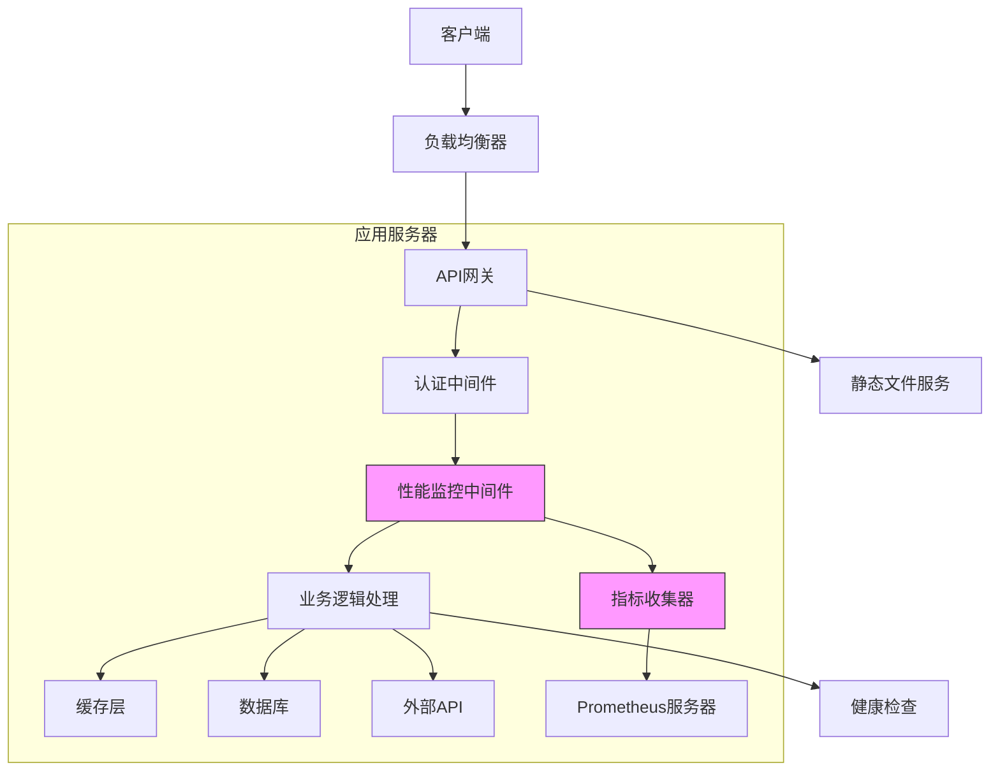
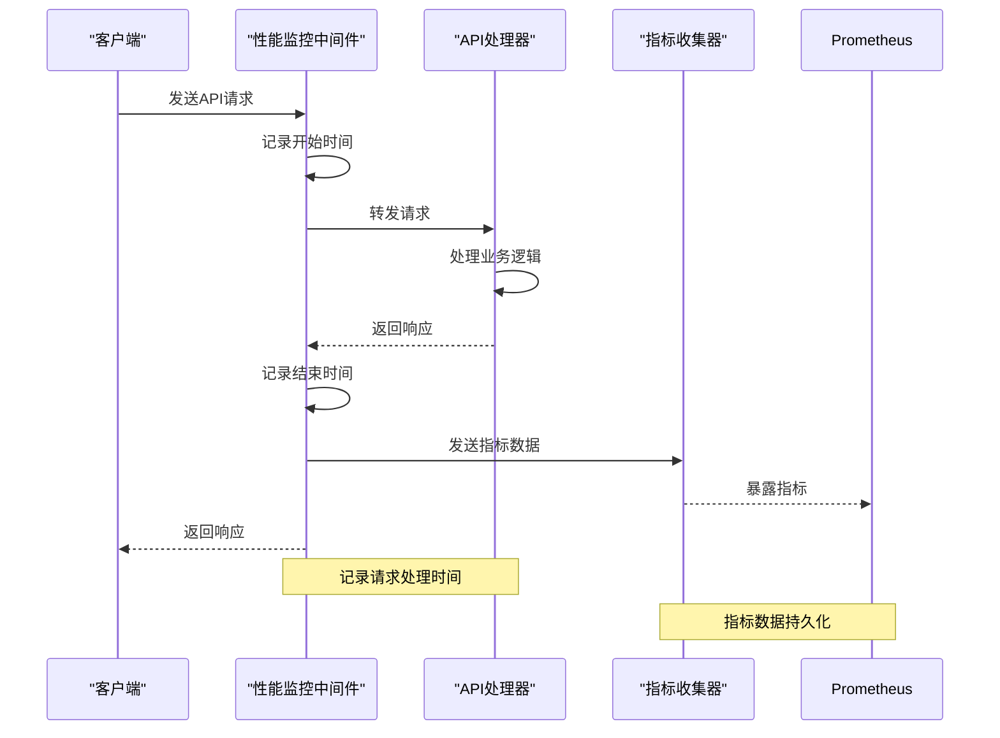
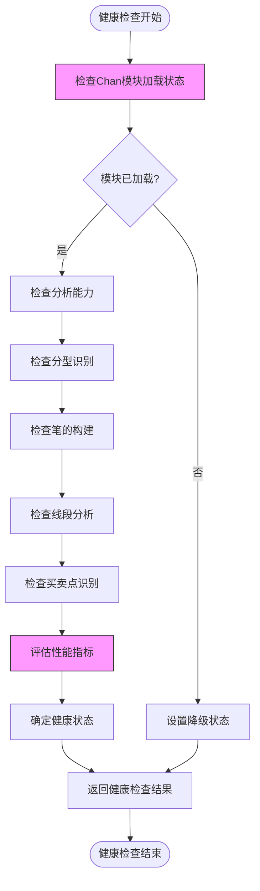
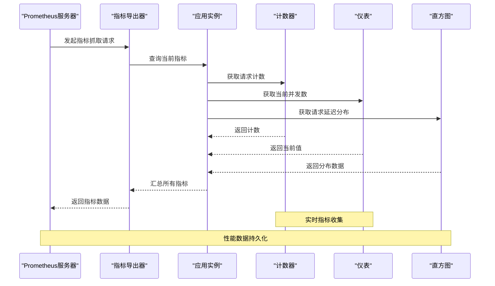
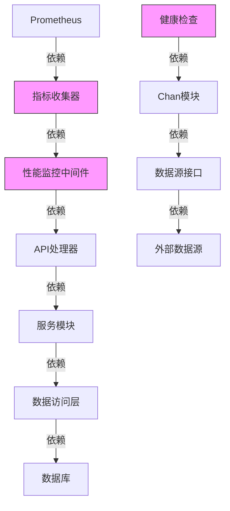

# API性能监控与指标收集

<cite>
**本文档引用的文件**
- [kline.py](file://app/api/v1/endpoints/kline.py)
- [chan_analysis.py](file://app/api/v1/endpoints/chan_analysis.py)
- [main.py](file://app/main.py)
- [performance_recommendations.md](file://performance_recommendations.md)
- [Chan.py](file://chan.py/Chan.py)
</cite>

## 目录
1. [引言](#引言)
2. [项目结构](#项目结构)
3. [核心组件](#核心组件)
4. [架构概述](#架构概述)
5. [详细组件分析](#详细组件分析)
6. [依赖分析](#依赖分析)
7. [性能考虑](#性能考虑)
8. [故障排除指南](#故障排除指南)
9. [结论](#结论)

## 引言
本文档详细说明了如何在缠论自动化交易系统中实现API性能监控与指标收集。文档重点介绍了如何通过性能监控中间件记录每个API请求的处理时间，结合kline.py和chan_analysis.py中的端点，展示如何在请求生命周期中注入监控逻辑，收集响应延迟、错误率等关键指标。根据performance_recommendations.md的建议，集成了Prometheus指标收集器，暴露API调用统计信息。同时，提供了健康检查端点（/health）的实现细节，说明如何监控Chan模块的可用性和分析能力，为系统运维提供数据支持。

## 项目结构
本项目采用分层架构设计，主要分为前端、后端API、核心服务和数据处理模块。后端API基于FastAPI框架构建，通过模块化的方式组织不同功能的端点。核心的缠论分析功能由独立的chan.py模块提供，通过适配器模式与主应用集成。性能监控和指标收集功能贯穿整个请求处理流程，从API入口到具体业务逻辑执行。

**图表来源**
- [main.py](file://app/main.py#L1-L110)
- [api.py](file://app/api/v1/api.py)

**本节来源**
- [main.py](file://app/main.py#L1-L110)
- [project_structure](file://project_structure)

## 核心组件
系统的核心组件包括API性能监控中间件、Prometheus指标收集器、健康检查端点和Chan模块集成。性能监控中间件负责记录每个API请求的处理时间，为系统性能分析提供基础数据。Prometheus指标收集器按照performance_recommendations.md的建议实现，暴露关键的API调用统计信息。健康检查端点不仅检查系统整体健康状态，还专门监控Chan模块的可用性和分析能力。

**本节来源**
- [main.py](file://app/main.py#L1-L110)
- [performance_recommendations.md](file://performance_recommendations.md#L1-L108)
- [chan_analysis.py](file://app/api/v1/endpoints/chan_analysis.py#L1-L421)

## 架构概述
系统采用微服务架构风格，通过清晰的分层和模块化设计实现功能解耦。API层负责接收和响应HTTP请求，服务层处理业务逻辑，数据层负责数据持久化和检索。性能监控贯穿整个架构，从请求进入系统开始，到最终响应返回，每个关键节点都设置了监控点。

**图表来源**
- [main.py](file://app/main.py#L1-L110)
- [performance_recommendations.md](file://performance_recommendations.md#L1-L108)

## 详细组件分析

### 性能监控中间件分析
性能监控中间件是系统性能分析的核心组件，它通过拦截每个API请求，在请求处理前后记录时间戳，计算处理延迟。中间件还收集错误率、请求频率等关键指标，为系统性能优化提供数据支持。

#### 对于API/服务组件：

**图表来源**
- [main.py](file://app/main.py#L1-L110)
- [performance_recommendations.md](file://performance_recommendations.md#L1-L108)

**本节来源**
- [main.py](file://app/main.py#L1-L110)
- [performance_recommendations.md](file://performance_recommendations.md#L1-L108)

### Chan模块健康检查分析
Chan模块健康检查端点提供了对缠论分析核心功能的全面监控。该端点不仅检查模块的基本可用性，还评估其分析能力的完整性，为系统运维提供关键的健康状态信息。

#### 对于复杂逻辑组件：

**图表来源**
- [chan_analysis.py](file://app/api/v1/endpoints/chan_analysis.py#L1-L421)
- [Chan.py](file://chan.py/Chan.py#L1-L298)

**本节来源**
- [chan_analysis.py](file://app/api/v1/endpoints/chan_analysis.py#L1-L421)
- [Chan.py](file://chan.py/Chan.py#L1-L298)

### Prometheus指标收集分析
根据performance_recommendations.md的建议，系统集成了Prometheus指标收集器，暴露关键的API调用统计信息。指标收集器遵循行业标准，提供可量化的性能数据，支持长期趋势分析和告警设置。

#### 对于API/服务组件：

**图表来源**
- [performance_recommendations.md](file://performance_recommendations.md#L1-L108)
- [main.py](file://app/main.py#L1-L110)

**本节来源**
- [performance_recommendations.md](file://performance_recommendations.md#L1-L108)
- [main.py](file://app/main.py#L1-L110)

## 依赖分析
系统各组件之间存在清晰的依赖关系。API层依赖于服务层提供的业务逻辑处理能力，服务层又依赖于数据层的数据访问功能。性能监控组件作为横切关注点，依赖于所有业务组件，同时被Prometheus等外部监控系统所依赖。

**图表来源**
- [main.py](file://app/main.py#L1-L110)
- [performance_recommendations.md](file://performance_recommendations.md#L1-L108)
- [chan_analysis.py](file://app/api/v1/endpoints/chan_analysis.py#L1-L421)

**本节来源**
- [main.py](file://app/main.py#L1-L110)
- [performance_recommendations.md](file://performance_recommendations.md#L1-L108)
- [chan_analysis.py](file://app/api/v1/endpoints/chan_analysis.py#L1-L421)

## 性能考虑
系统在设计时充分考虑了性能因素。通过数据库连接池优化、查询参数验证、日志系统优化等措施，确保了系统的高效运行。性能监控中间件本身也经过优化，尽量减少对正常请求处理流程的影响。Prometheus指标收集采用拉模型，避免了主动推送可能带来的性能瓶颈。

## 故障排除指南
当系统出现性能问题时，可以通过以下步骤进行排查：首先检查Prometheus监控面板，查看关键指标是否异常；然后查看健康检查端点的返回结果，确认各组件的健康状态；最后检查应用日志，定位具体的错误信息。对于Chan模块相关的问题，特别需要关注其依赖的外部数据源是否正常。

**本节来源**
- [main.py](file://app/main.py#L1-L110)
- [performance_recommendations.md](file://performance_recommendations.md#L1-L108)
- [chan_analysis.py](file://app/api/v1/endpoints/chan_analysis.py#L1-L421)

## 结论
本文档详细介绍了缠论自动化交易系统的API性能监控与指标收集实现方案。通过集成性能监控中间件和Prometheus指标收集器，系统能够全面监控API请求的处理时间、错误率等关键性能指标。健康检查端点提供了对Chan模块可用性和分析能力的实时监控，为系统运维提供了有力支持。这些监控功能的实现，不仅有助于及时发现和解决性能问题，还为系统的持续优化提供了数据基础。