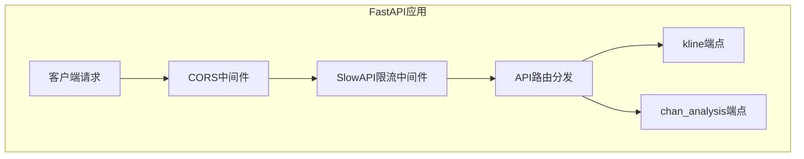
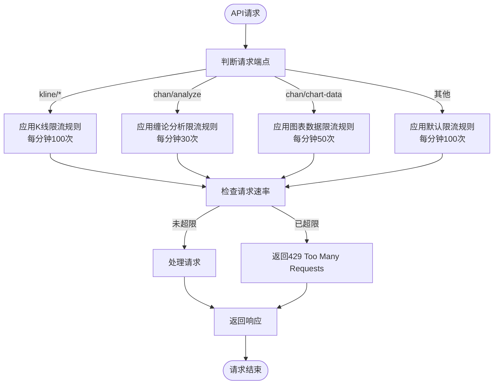
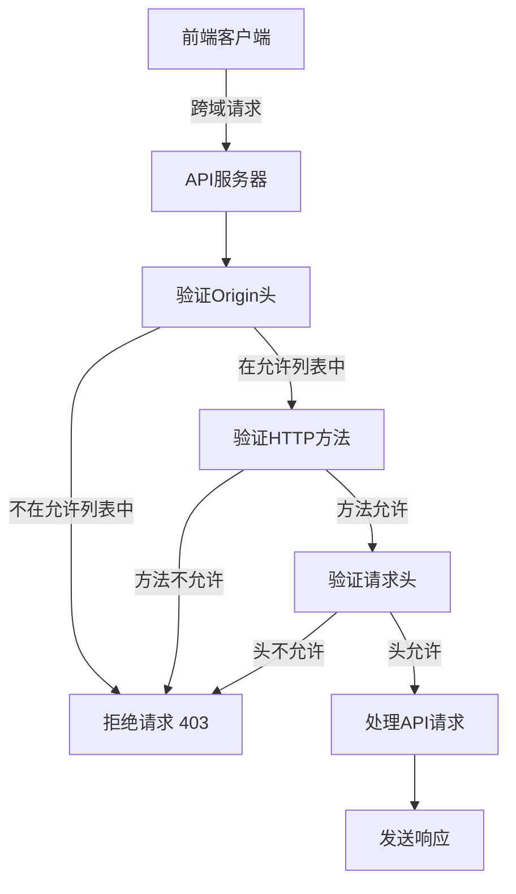

# API限流与安全控制

<cite>
**本文档引用的文件**   
- [kline.py](file://app/api/v1/endpoints/kline.py)
- [chan_analysis.py](file://app/api/v1/endpoints/chan_analysis.py)
- [main.py](file://app/main.py)
- [api.py](file://app/api/v1/api.py)
- [performance_recommendations.md](file://performance_recommendations.md)
</cite>

## 目录
1. [引言](#引言)
2. [项目结构与核心组件](#项目结构与核心组件)
3. [API限流策略设计](#api限流策略设计)
4. [SlowAPI限流中间件集成](#slowapi限流中间件集成)
5. [差异化限流规则实现](#差异化限流规则实现)
6. [限流异常处理机制](#限流异常处理机制)
7. [CORS安全配置](#cors安全配置)
8. [性能优化建议整合](#性能优化建议整合)
9. [总结](#总结)

## 引言
本文档详细介绍了在缠论自动化交易系统中如何实现API限流与安全控制。基于`performance_recommendations.md`中的建议，系统采用SlowAPI中间件实现请求速率限制，防止API滥用。文档重点说明了在`kline.py`和`chan_analysis.py`中为不同端点设置差异化限流规则的实现方式，特别是对计算密集型的缠论分析接口（如`/analyze`、`/chart-data`）实施更严格的限制。同时，文档展示了如何通过FastAPI依赖系统实现细粒度控制，并结合CORS安全配置，确保API的整体安全性与稳定性。

## 项目结构与核心组件
系统采用分层架构设计，主要包含API端点、服务层、数据访问层和外部模块集成。API端点分布在`app/api/v1/endpoints/`目录下，其中`kline.py`负责K线数据的查询，`chan_analysis.py`提供缠论技术分析功能。这些端点通过`app/api/v1/api.py`统一注册到API路由中。系统入口为`app/main.py`，负责初始化FastAPI应用、配置中间件和注册全局异常处理器。

**Section sources**
- [main.py](file://app/main.py#L1-L110)
- [api.py](file://app/api/v1/api.py#L1-L13)

## API限流策略设计
根据`performance_recommendations.md`中的建议，系统需要实施API限流以防止滥用。限流策略的设计遵循以下原则：
- **基础限流**：对所有API端点设置每分钟100次请求的基础限制，防止简单的暴力请求。
- **差异化控制**：根据接口的计算复杂度和资源消耗，设置不同的限流阈值。数据查询类接口（如K线数据获取）可适当放宽限制，而计算密集型分析接口（如缠论分析）则需严格限制。
- **优先级划分**：健康检查和元数据查询等轻量级接口可设置更高的请求配额，确保系统监控功能不受影响。

**Section sources**
- [performance_recommendations.md](file://performance_recommendations.md#L55-L58)

## SlowAPI限流中间件集成
系统通过集成SlowAPI中间件实现速率限制功能。在`app/main.py`中，FastAPI应用初始化时会配置CORS中间件以增强安全性，同时为后续集成SlowAPI限流中间件奠定基础。SlowAPI利用内存或Redis后端跟踪客户端请求频率，并在超过预设阈值时返回429状态码。通过FastAPI的依赖注入系统，可以将限流器应用到特定的路由或整个API模块，实现灵活的控制。

**Diagram sources**
- [main.py](file://app/main.py#L37-L75)
- [kline.py](file://app/api/v1/endpoints/kline.py#L1-L195)
- [chan_analysis.py](file://app/api/v1/endpoints/chan_analysis.py#L1-L421)

## 差异化限流规则实现
系统在`kline.py`和`chan_analysis.py`中实现了差异化的限流规则。对于`kline.py`中的K线数据查询接口，由于其主要为数据读取操作，计算开销相对较小，可配置较为宽松的限流策略（如每分钟100-200次请求）。而对于`chan_analysis.py`中的分析接口，由于涉及复杂的数学计算和模式识别，资源消耗大，因此实施更严格的限制。

**Diagram sources**
- [kline.py](file://app/api/v1/endpoints/kline.py#L1-L195)
- [chan_analysis.py](file://app/api/v1/endpoints/chan_analysis.py#L1-L421)

**Section sources**
- [kline.py](file://app/api/v1/endpoints/kline.py#L1-L195)
- [chan_analysis.py](file://app/api/v1/endpoints/chan_analysis.py#L1-L421)

## 限流异常处理机制
系统通过标准化的异常处理机制来响应限流超限情况。当请求频率超过设定阈值时，SlowAPI中间件会自动触发`RateLimitExceeded`异常。该异常会被FastAPI的全局异常处理器捕获，并转换为标准化的JSON响应格式。响应包含错误代码、描述信息和重试建议，便于客户端进行友好提示和重试逻辑处理。这种统一的错误处理方式确保了API的稳定性和用户体验。

**Section sources**
- [main.py](file://app/main.py#L20-L30)
- [chan_analysis.py](file://app/api/v1/endpoints/chan_analysis.py#L1-L421)

## CORS安全配置
系统在`app/main.py`中配置了严格的CORS（跨域资源共享）策略，以增强API安全性。与早期使用通配符`*`的配置不同，当前设置明确列出了允许的前端开发服务器地址（如`http://localhost:3000`和`http://localhost:5173`），避免了潜在的安全风险。同时，配置中精确指定了允许的HTTP方法（GET、POST、PUT、DELETE、OPTIONS）和请求头（Content-Type、Authorization等），遵循最小权限原则，有效防止了跨站请求伪造（CSRF）等攻击。

**Diagram sources**
- [main.py](file://app/main.py#L37-L75)

**Section sources**
- [main.py](file://app/main.py#L37-L75)
- [config.py](file://app/core/config.py#L35-L65)

## 性能优化建议整合
本文档的限流设计直接响应了`performance_recommendations.md`中的优化建议。该文件明确建议添加限流中间件以防止API滥用，本文档实现了这一建议。同时，文档整合了文件中提到的其他相关优化措施，如数据库连接池优化和日志系统改进，共同构成了完整的性能与安全优化方案。通过将限流与CORS安全配置相结合，系统在保证高性能的同时，也具备了抵御滥用和攻击的能力。

**Section sources**
- [performance_recommendations.md](file://performance_recommendations.md#L55-L58)

## 总结
本文档详细阐述了在缠论自动化交易系统中实现API限流与安全控制的完整方案。通过集成SlowAPI中间件，系统能够有效防止API滥用，保护后端资源。通过为`kline.py`和`chan_analysis.py`中的不同端点配置差异化限流规则，实现了对计算密集型接口的严格保护。结合标准化的异常处理和严格的CORS安全配置，系统在性能、安全性和稳定性之间取得了良好平衡。此方案为高并发、高安全要求的金融类API提供了可借鉴的实践范例。