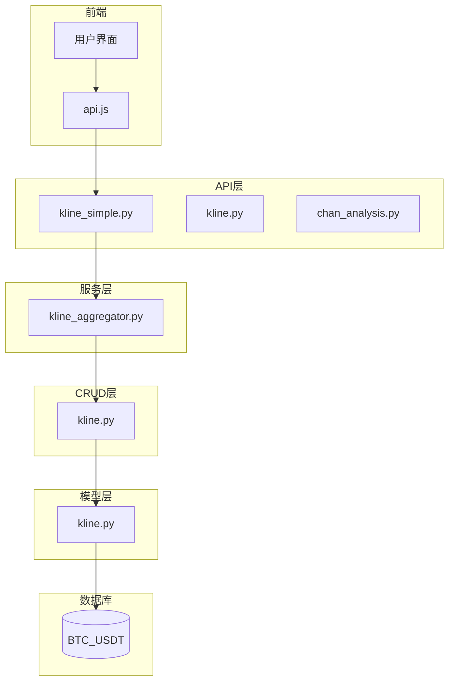
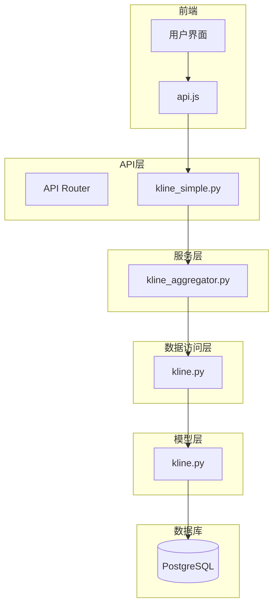
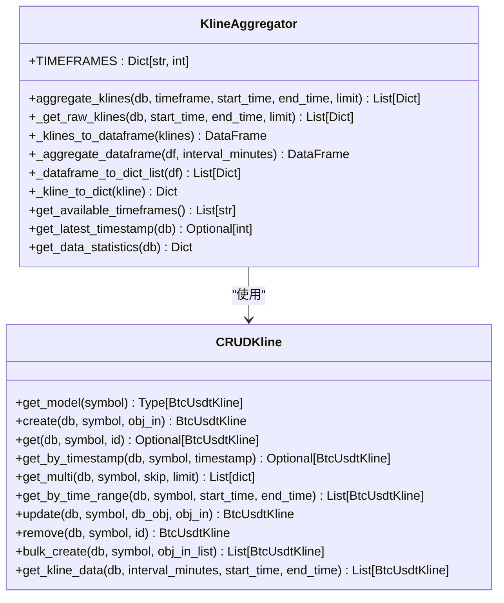
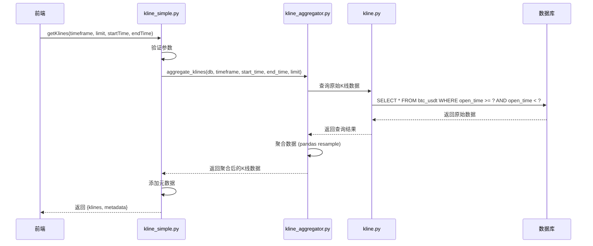
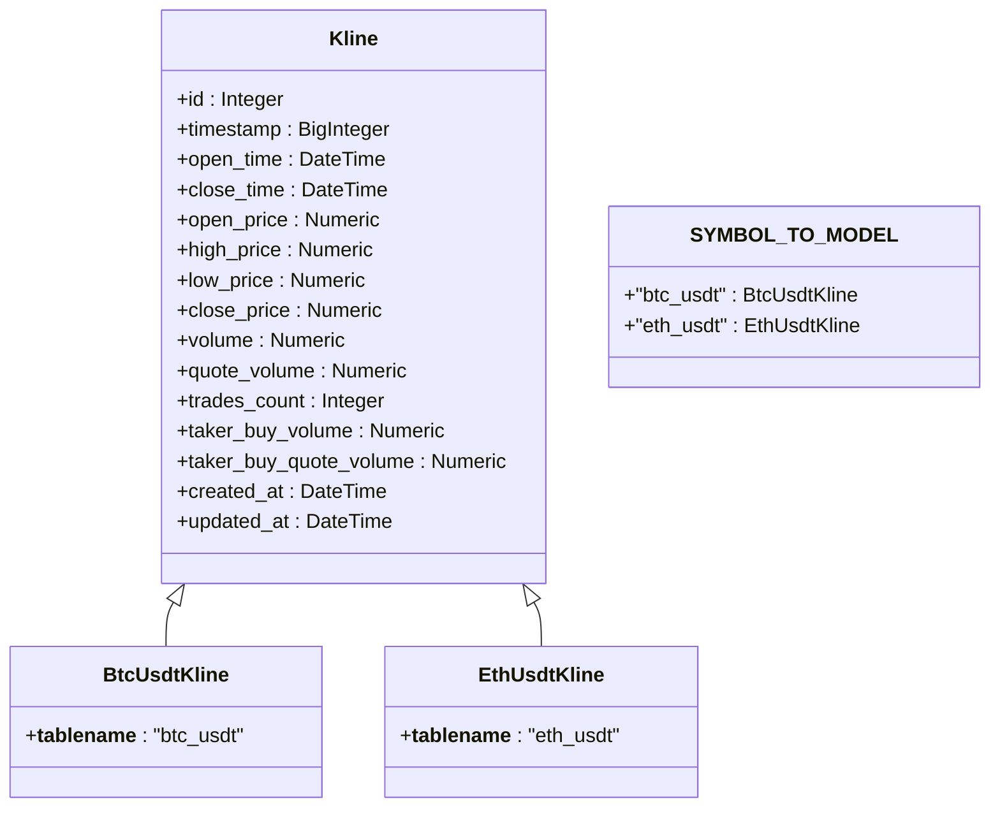
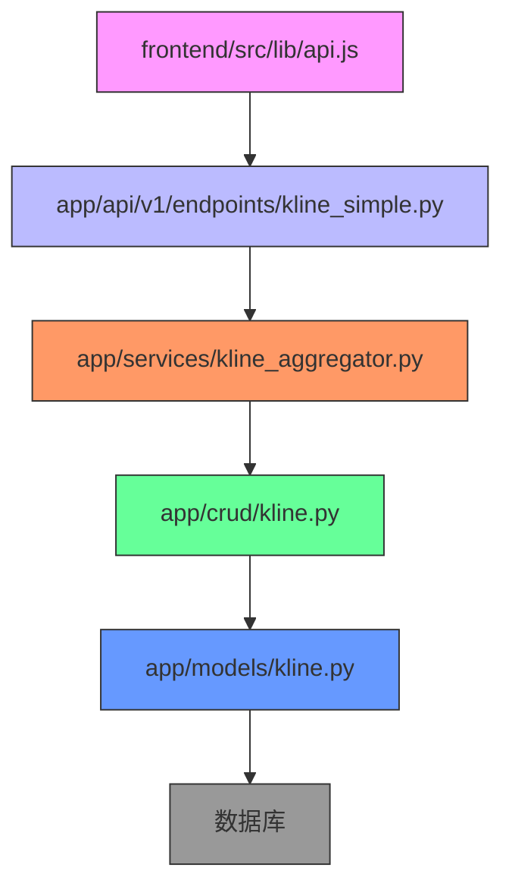

# 归档数据查询接口

<cite>
**本文档引用文件**   
- [kline.py](file://app/crud/kline.py)
- [kline_simple.py](file://app/api/v1/endpoints/kline_simple.py)
- [kline_aggregator.py](file://app/services/kline_aggregator.py)
- [kline.py](file://app/models/kline.py)
- [config.py](file://app/core/config.py)
</cite>

## 目录
1. [简介](#简介)
2. [项目结构](#项目结构)
3. [核心组件](#核心组件)
4. [架构概述](#架构概述)
5. [详细组件分析](#详细组件分析)
6. [依赖分析](#依赖分析)
7. [性能考虑](#性能考虑)
8. [故障排除指南](#故障排除指南)
9. [结论](#结论)

## 简介
本文档旨在设计归档数据的统一查询接口，扩展K线API端点以支持跨主表和归档表的联合查询。通过实现智能路由逻辑，根据查询时间范围自动选择数据源（近期数据从主表查询，历史数据从归档表查询），并在CRUD层封装透明的查询代理，确保上层服务无需感知数据物理位置。对于大范围历史查询，提供分页和流式响应支持，并添加缓存机制以提高常用长期趋势分析查询的响应性能。

## 项目结构
项目采用分层架构设计，主要分为API接口层、服务层、CRUD数据访问层、模型层和数据库层。前端通过API调用获取K线数据并进行可视化展示。系统支持多时间周期K线聚合，并具备健康检查和数据统计功能。

**图示来源**
- [kline_simple.py](file://app/api/v1/endpoints/kline_simple.py)
- [kline_aggregator.py](file://app/services/kline_aggregator.py)
- [kline.py](file://app/crud/kline.py)
- [kline.py](file://app/models/kline.py)

**本节来源**
- [kline_simple.py](file://app/api/v1/endpoints/kline_simple.py)
- [kline_aggregator.py](file://app/services/kline_aggregator.py)

## 核心组件
系统核心组件包括K线数据聚合器、CRUD数据访问层和简化API端点。K线聚合器负责将1分钟原始数据聚合为不同时间周期的K线数据，CRUD层提供统一的数据访问接口，简化API端点则为前端提供简洁的数据获取接口。

**本节来源**
- [kline_aggregator.py](file://app/services/kline_aggregator.py)
- [kline.py](file://app/crud/kline.py)
- [kline_simple.py](file://app/api/v1/endpoints/kline_simple.py)

## 架构概述
系统采用典型的分层架构，从前端到数据库分为多个层次。API层接收外部请求，服务层处理业务逻辑，CRUD层负责数据持久化操作，模型层定义数据结构，数据库层存储实际数据。

**图示来源**
- [kline_simple.py](file://app/api/v1/endpoints/kline_simple.py)
- [kline_aggregator.py](file://app/services/kline_aggregator.py)
- [kline.py](file://app/crud/kline.py)
- [kline.py](file://app/models/kline.py)

## 详细组件分析

### K线聚合器分析
K线聚合器是系统的核心服务组件，负责将1分钟原始K线数据聚合为不同时间周期的数据。

**图示来源**
- [kline_aggregator.py](file://app/services/kline_aggregator.py)
- [kline.py](file://app/crud/kline.py)

**本节来源**
- [kline_aggregator.py](file://app/services/kline_aggregator.py)
- [kline.py](file://app/crud/kline.py)

### 简化API端点分析
简化API端点为前端提供简洁的K线数据访问接口，支持时间范围查询和数据聚合。

**图示来源**
- [kline_simple.py](file://app/api/v1/endpoints/kline_simple.py)
- [kline_aggregator.py](file://app/services/kline_aggregator.py)
- [kline.py](file://app/crud/kline.py)

**本节来源**
- [kline_simple.py](file://app/api/v1/endpoints/kline_simple.py)
- [kline_aggregator.py](file://app/services/kline_aggregator.py)

### 数据模型分析
数据模型定义了K线数据的结构和关系，采用继承方式实现多交易品种支持。

**图示来源**
- [kline.py](file://app/models/kline.py)

**本节来源**
- [kline.py](file://app/models/kline.py)

## 依赖分析
系统各组件之间存在明确的依赖关系，遵循单向依赖原则，确保架构的清晰性和可维护性。

**图示来源**
- [api.js](file://frontend/src/lib/api.js)
- [kline_simple.py](file://app/api/v1/endpoints/kline_simple.py)
- [kline_aggregator.py](file://app/services/kline_aggregator.py)
- [kline.py](file://app/crud/kline.py)
- [kline.py](file://app/models/kline.py)

**本节来源**
- [api.js](file://frontend/src/lib/api.js)
- [kline_simple.py](file://app/api/v1/endpoints/kline_simple.py)
- [kline_aggregator.py](file://app/services/kline_aggregator.py)
- [kline.py](file://app/crud/kline.py)
- [kline.py](file://app/models/kline.py)

## 性能考虑
系统在设计时充分考虑了性能因素，通过多种机制确保高效的数据查询和处理。

### 缓存策略
前端实现多级缓存机制，根据数据类型和更新频率设置不同的缓存时长：
- 静态数据：30分钟缓存
- 历史数据：5分钟缓存
- 实时数据：30秒缓存

### 数据聚合
服务层使用pandas进行高效的数据聚合操作，支持多种时间周期的K线数据生成：
- 支持1m、5m、15m、30m、1h、4h、1d等时间周期
- 使用resample方法进行数据聚合
- 开盘价取第一个，收盘价取最后一个，最高价取最大值，最低价取最小值，成交量求和

### 数据库优化
CRUD层使用原生SQL查询进行聚合操作，利用PostgreSQL的time_bucket函数提高查询效率：
- 针对大数据量的历史查询提供分页支持
- 使用索引优化时间范围查询性能
- 批量操作减少数据库交互次数

**本节来源**
- [api.js](file://frontend/src/lib/api.js)
- [kline_aggregator.py](file://app/services/kline_aggregator.py)
- [kline.py](file://app/crud/kline.py)

## 故障排除指南
### 常见问题及解决方案

| 问题现象 | 可能原因 | 解决方案 |
|--------|--------|--------|
| 无法获取K线数据 | 数据库连接失败 | 检查DATABASE_URL配置 |
| 返回空数据 | 查询时间范围内无数据 | 调用fetch-data接口获取新数据 |
| 聚合数据不准确 | 原始数据缺失 | 检查数据采集服务运行状态 |
| 接口响应慢 | 大范围历史查询 | 使用分页或缩小时间范围 |

### 健康检查
系统提供健康检查接口，可用于诊断系统状态：
- `/simple/health`：检查K线API和数据库状态
- `/simple/stats`：获取数据统计信息
- `/chan/info`：获取Chan模块信息

**本节来源**
- [kline_simple.py](file://app/api/v1/endpoints/kline_simple.py)
- [kline_aggregator.py](file://app/services/kline_aggregator.py)

## 结论
本文档详细分析了交易系统中K线数据查询接口的设计与实现。系统通过分层架构实现了清晰的职责分离，API层提供简洁的接口，服务层处理复杂的业务逻辑，CRUD层封装数据访问细节。K线聚合器作为核心组件，能够高效地将1分钟原始数据聚合为多种时间周期的K线数据。前端通过缓存机制优化用户体验，减少重复请求。整体设计考虑了性能、可维护性和扩展性，为后续实现归档数据查询接口提供了良好的基础。

未来可在此基础上扩展归档数据查询功能，实现主表与归档表的智能路由，进一步提升系统处理历史数据的能力。