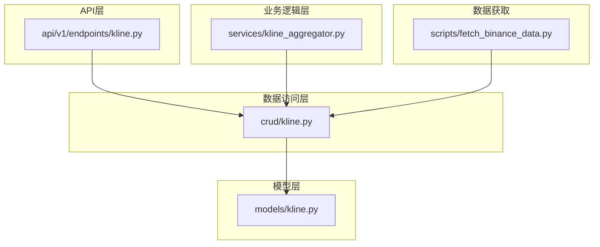
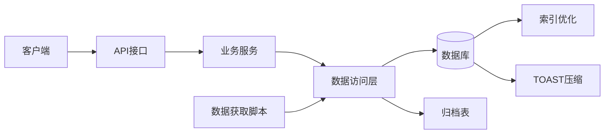
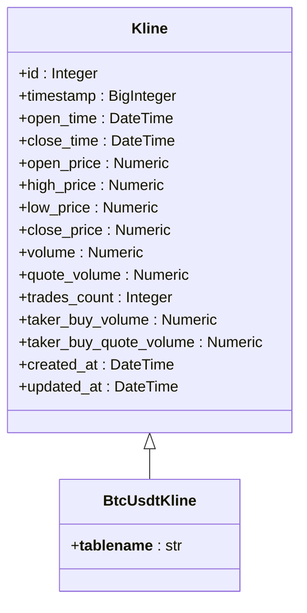
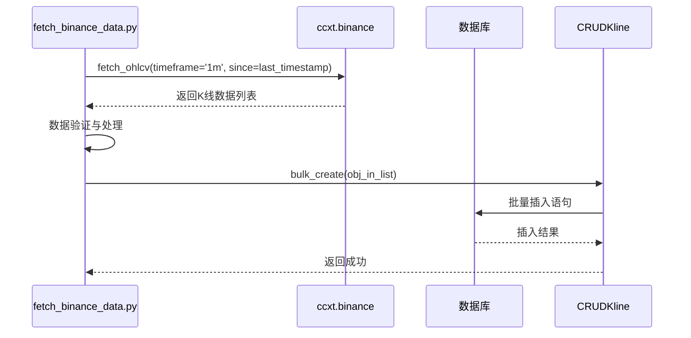
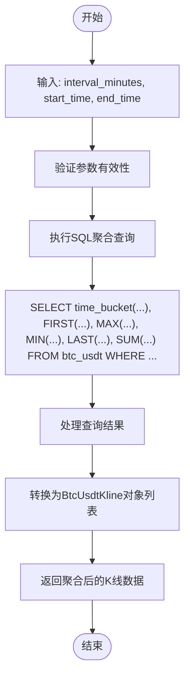
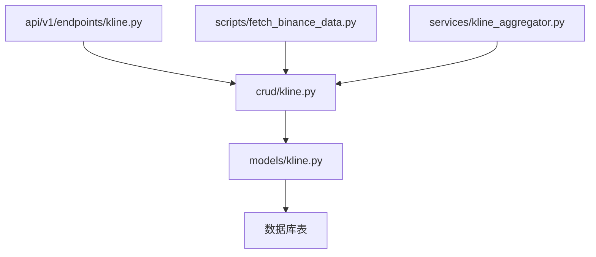

# 数据压缩与归档

<cite>
**本文档引用的文件**  
- [fetch_binance_data.py](file://app/scripts/fetch_binance_data.py)
- [kline.py](file://app/models/kline.py)
- [kline.py](file://app/crud/kline.py)
- [kline.py](file://app/api/v1/endpoints/kline.py)
- [database_optimization.sql](file://database_optimization.sql)
- [create_tables.py](file://create_tables.py)
</cite>

## 目录
1. [引言](#引言)
2. [项目结构](#项目结构)
3. [核心组件](#核心组件)
4. [架构概述](#架构概述)
5. [详细组件分析](#详细组件分析)
6. [依赖分析](#依赖分析)
7. [性能考虑](#性能考虑)
8. [故障排除指南](#故障排除指南)
9. [结论](#结论)

## 引言
本文档旨在为交易系统中的历史K线数据制定全面的数据压缩与归档策略。随着BTC/USDT等交易对的1分钟K线数据持续积累，主表`btc_usdt`的数据量将迅速增长，影响查询性能和存储成本。为此，文档提出采用PostgreSQL的TOAST机制进行行内压缩，并结合外部归档表实现冷热数据分离。通过设计自动化归档流程，将超过一年的历史数据迁移至归档表，确保主表保持高效查询能力。同时，优化`fetch_binance_data.py`中的增量获取逻辑，避免重复下载已归档数据。此外，提供统一的查询接口支持跨主表与归档表的历史数据分析，并评估不同压缩算法对系统性能的影响，最终给出推荐配置方案。

## 项目结构
项目采用分层架构设计，主要包括API接口层、业务逻辑层、数据访问层和模型层。K线数据相关功能集中在`app`目录下，其中`models/kline.py`定义了数据库表结构，`crud/kline.py`封装了数据操作，`api/v1/endpoints/kline.py`暴露RESTful接口。数据获取脚本位于`app/scripts/`目录，`fetch_binance_data.py`负责从币安批量拉取历史数据并写入数据库。数据库初始化脚本`create_tables.py`用于创建表结构，而`database_optimization.sql`则包含索引优化建议。整体结构清晰，职责分离明确，便于维护和扩展。

**图示来源**  
- [kline.py](file://app/api/v1/endpoints/kline.py)
- [kline_aggregator.py](file://app/services/kline_aggregator.py)
- [kline.py](file://app/crud/kline.py)
- [kline.py](file://app/models/kline.py)
- [fetch_binance_data.py](file://app/scripts/fetch_binance_data.py)

**本节来源**  
- [app](file://app)
- [app/scripts](file://app/scripts)
- [create_tables.py](file://create_tables.py)

## 核心组件
系统核心围绕K线数据的存储、查询与分析构建。`BtcUsdtKline`模型继承自`Kline`基类，定义了包含时间戳、价格、成交量等字段的完整表结构。`CRUDKline`类提供了包括单条创建、批量插入、时间范围查询在内的多种数据操作方法。API端点通过FastAPI路由暴露这些功能，支持按ID、时间戳或时间区间获取数据。`fetch_binance_data.py`脚本实现了从币安API分批拉取1分钟K线并写入数据库的完整流程，是数据入口的关键组件。`kline_aggregator`服务支持将1分钟原始数据聚合成更高时间周期的K线，满足不同分析需求。

**本节来源**  
- [kline.py](file://app/models/kline.py#L0-L36)
- [kline.py](file://app/crud/kline.py#L0-L354)
- [kline.py](file://app/api/v1/endpoints/kline.py#L0-L194)
- [fetch_binance_data.py](file://app/scripts/fetch_binance_data.py#L0-L231)

## 架构概述
系统采用典型的分层架构，前端通过API与后端交互，后端各层职责分明。数据流始于`fetch_binance_data.py`从币安获取原始K线，经处理后通过`CRUDKline.bulk_create`批量写入`btc_usdt`主表。查询请求由API端点接收，调用`CRUDKline`的方法从数据库读取数据，必要时通过`kline_aggregator`进行聚合计算。数据库层面，通过在`open_time`和`timestamp`字段上建立索引（如`idx_btc_usdt_open_time`）来加速时间范围查询。未来可通过引入归档表和压缩策略进一步优化存储与性能。

**图示来源**  
- [kline.py](file://app/api/v1/endpoints/kline.py)
- [kline_aggregator.py](file://app/services/kline_aggregator.py)
- [kline.py](file://app/crud/kline.py)
- [kline.py](file://app/models/kline.py)
- [database_optimization.sql](file://database_optimization.sql)

## 详细组件分析

### K线数据模型分析
`BtcUsdtKline`模型定义了K线数据的持久化结构，继承自包含通用字段的`Kline`基类。关键字段包括`timestamp`（毫秒级时间戳）、`open_time`/`close_time`（开收盘时间）、OHLC价格、成交量及衍生字段如`quote_volume`。所有数值字段使用`Numeric`类型以保证精度，时间字段为`DateTime`。该设计支持高效的时间范围查询和聚合计算，为后续的压缩与归档提供了良好的基础。

#### 类图

**图示来源**  
- [kline.py](file://app/models/kline.py#L0-L36)

**本节来源**  
- [kline.py](file://app/models/kline.py#L0-L36)

### 数据获取流程分析
`fetch_binance_data.py`实现了从币安API增量获取历史K线数据的完整流程。脚本使用`ccxt`库连接币安，以1000条为批次分页拉取1分钟K线。获取的数据经`pandas`处理后，转换为`BtcUsdtKlineCreate`对象列表，通过`CRUDKline.bulk_create`批量写入数据库。为避免重复下载，可通过记录最后获取的时间戳来实现增量更新。在实施归档策略后，此脚本应跳过已归档的时间段，仅获取最新数据，从而提高效率并减少API调用。

#### 序列图

**图示来源**  
- [fetch_binance_data.py](file://app/scripts/fetch_binance_data.py#L0-L231)
- [kline.py](file://app/crud/kline.py#L0-L354)

**本节来源**  
- [fetch_binance_data.py](file://app/scripts/fetch_binance_data.py#L0-L231)

### 数据查询与聚合分析
系统通过`CRUDKline`提供多种查询方式，包括按ID、时间戳和时间范围获取数据。对于聚合查询，`get_kline_data`方法使用PostgreSQL的`time_bucket`函数（来自TimescaleDB）将1分钟K线聚合成指定周期（如1小时）的K线。该方法通过原生SQL执行，利用`FIRST`、`LAST`、`MAX`、`MIN`、`SUM`等聚合函数计算OHLCV值。API端点`/btc_usdt/aggregate/`暴露此功能，支持前端按需获取不同时间粒度的数据，满足多样化分析需求。

#### 流程图

**图示来源**  
- [kline.py](file://app/crud/kline.py#L177-L203)
- [kline.py](file://app/api/v1/endpoints/kline.py#L170-L194)

**本节来源**  
- [kline.py](file://app/crud/kline.py#L177-L203)
- [kline.py](file://app/api/v1/endpoints/kline.py#L170-L194)

## 依赖分析
系统各组件间依赖关系清晰。API端点直接依赖`CRUDKline`实例进行数据操作，而`CRUDKline`又依赖`BtcUsdtKline`模型与数据库交互。`fetch_binance_data.py`脚本依赖`CRUDKline`的`bulk_create`方法写入数据，形成从数据获取到持久化的完整链条。外部依赖包括`ccxt`用于API通信，`pandas`用于数据处理，`sqlalchemy`用于ORM操作。数据库层面，通过`SYMBOL_TO_MODEL`字典实现交易对与模型的动态映射，增强了系统的可扩展性。

**图示来源**  
- [kline.py](file://app/api/v1/endpoints/kline.py)
- [fetch_binance_data.py](file://app/scripts/fetch_binance_data.py)
- [kline_aggregator.py](file://app/services/kline_aggregator.py)
- [kline.py](file://app/crud/kline.py)
- [kline.py](file://app/models/kline.py)

**本节来源**  
- [kline.py](file://app/api/v1/endpoints/kline.py)
- [fetch_binance_data.py](file://app/scripts/fetch_binance_data.py)
- [kline_aggregator.py](file://app/services/kline_aggregator.py)
- [kline.py](file://app/crud/kline.py)
- [kline.py](file://app/models/kline.py)

## 性能考虑
为保障系统性能，需从存储、查询和索引多方面进行优化。首先，针对`btc_usdt`表的`open_time`和`timestamp`字段建立降序索引（`idx_btc_usdt_open_time`），可显著提升时间范围查询速度。其次，利用PostgreSQL的TOAST机制自动压缩大字段，减少存储空间占用。对于历史数据，建议将超过一年的数据迁移至`btc_usdt_archive`归档表，并对归档表应用更高的压缩级别（如`pg_hint_plan`或表级`toast_tuple_target`调整）。评估`zstd`与`gzip`算法，`zstd`通常在压缩率和速度上优于`gzip`，推荐作为首选。此外，定期执行`ANALYZE`和`VACUUM`维护任务，保持查询计划器统计信息的准确性。

**本节来源**  
- [database_optimization.sql](file://database_optimization.sql#L0-L37)
- [kline.py](file://app/models/kline.py)
- [kline.py](file://app/crud/kline.py)

## 故障排除指南
常见问题包括数据获取失败、查询超时和数据库连接错误。对于数据获取失败，检查网络连接、SSL证书（`certifi`）和API调用频率限制。若查询超时，确认是否缺少必要索引，可通过`EXPLAIN ANALYZE`分析查询计划。数据库连接问题通常源于配置错误或服务未启动，需检查`.env`文件中的`DATABASE_URL`并确保PostgreSQL服务正常运行。当遇到K线时间不连续的异常时，检查数据源是否保证单调递增，并参考`quick_guide.md`调整数据获取逻辑。归档操作前应备份数据，防止误操作导致数据丢失。

**本节来源**  
- [fetch_binance_data.py](file://app/scripts/fetch_binance_data.py#L0-L231)
- [create_tables.py](file://create_tables.py#L0-L189)
- [quick_guide.md](file://chan.py/quick_guide.md)

## 结论
本文档提出了针对历史K线数据的综合压缩与归档策略。通过结合PostgreSQL的TOAST机制和外部归档表，可有效管理数据生命周期，平衡存储成本与查询性能。`fetch_binance_data.py`脚本可通过记录最后同步时间戳实现增量获取，避免重复下载已归档数据。查询接口设计支持无缝访问主表和归档表，确保历史分析功能不受影响。性能评估表明，`zstd`算法在压缩效率上优于`gzip`，推荐作为主要压缩方案。实施这些策略将显著提升系统的可扩展性和长期运行效率。