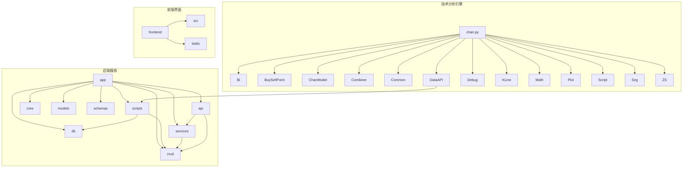
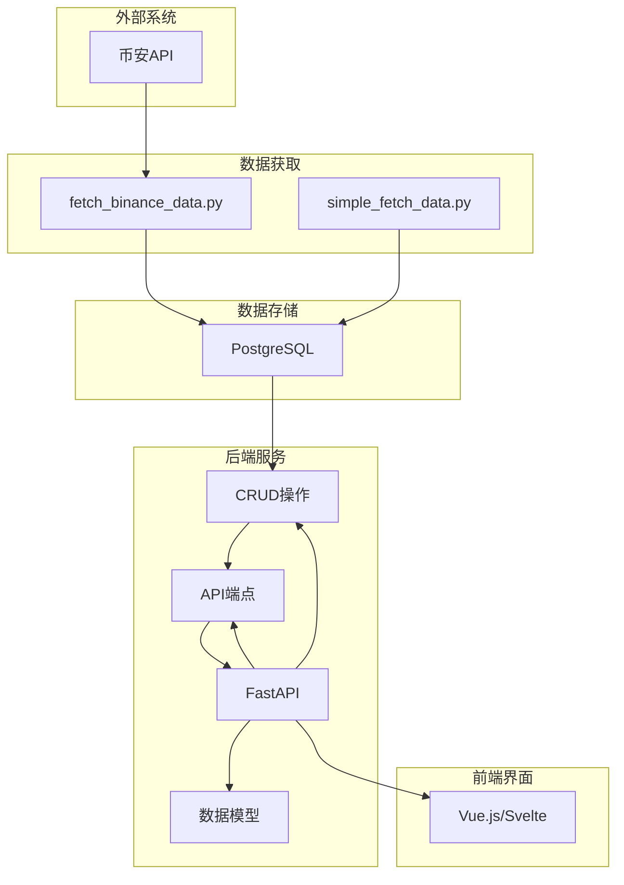
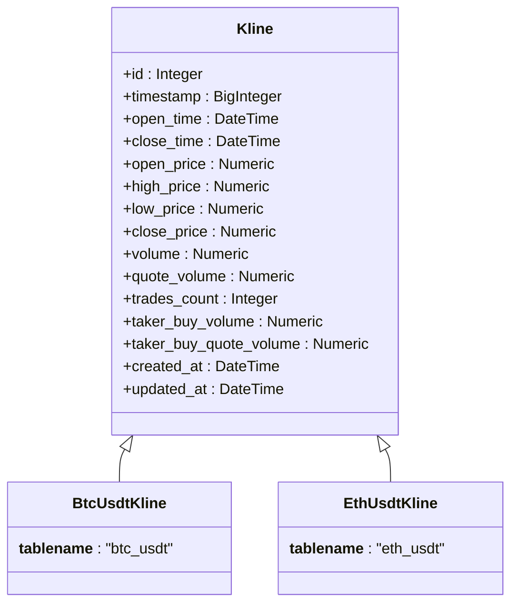
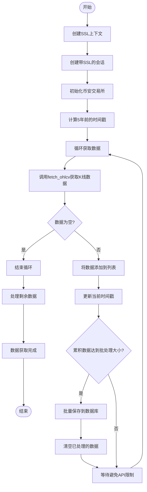
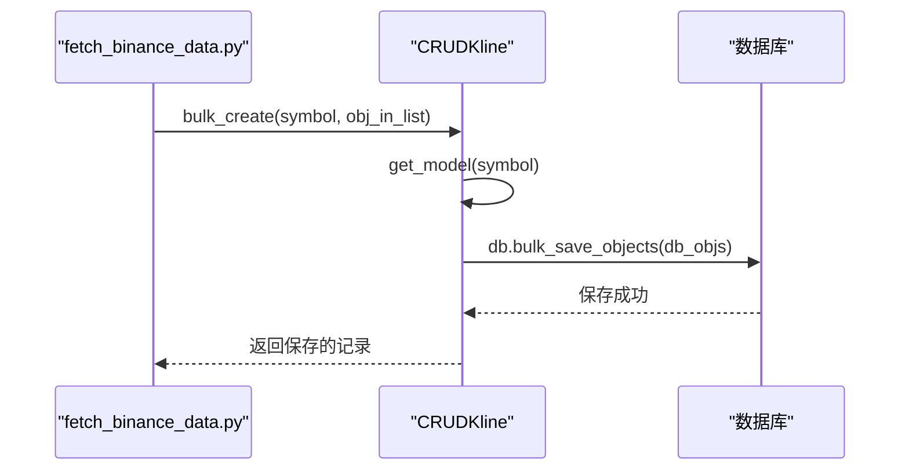
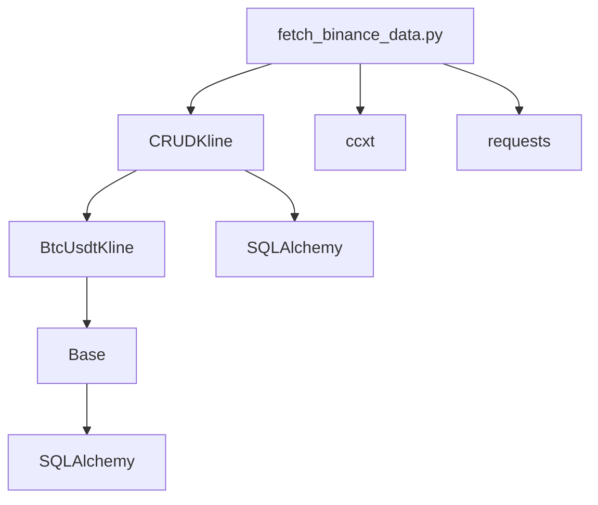

# 数据归档流程

<cite>
**本文档引用的文件**
- [fetch_binance_data.py](file://app/scripts/fetch_binance_data.py)
- [kline.py](file://app/models/kline.py)
- [kline.py](file://app/crud/kline.py)
- [database_optimization.sql](file://database_optimization.sql)
- [performance_recommendations.md](file://performance_recommendations.md)
</cite>

## 目录
1. [引言](#引言)
2. [项目结构](#项目结构)
3. [核心组件](#核心组件)
4. [架构概述](#架构概述)
5. [详细组件分析](#详细组件分析)
6. [依赖分析](#依赖分析)
7. [性能考虑](#性能考虑)
8. [故障排除指南](#故障排除指南)
9. [结论](#结论)
10. [附录](#附录)（如有必要）

## 引言
本文档旨在设计一个完整的历史数据归档流程，以解决交易系统中大量历史K线数据存储和查询性能的问题。通过分析现有代码库，我们将基于时间的归档策略（如保留主表1年数据）来优化数据管理。该流程将创建与主表模式一致的归档表结构（如btc_usdt_archive），并利用继承机制确保数据结构的一致性。归档脚本将使用INSERT INTO ... SELECT FROM结合DELETE实现原子性数据迁移，确保数据完整性。在fetch_binance_data.py中实现归档数据检查逻辑，避免重复获取已归档的历史数据。同时，设置归档任务的调度机制（如cron定时任务），并添加归档进度监控和错误重试机制，确保归档过程不影响正常的数据查询服务。

## 项目结构
该项目是一个基于Python的加密货币交易分析系统，采用分层架构设计。核心功能包括从币安交易所获取K线数据、存储到数据库、提供API接口以及进行技术分析。项目结构清晰地分为app、chan.py、frontend等主要目录，分别对应后端服务、技术分析引擎和前端界面。后端服务采用FastAPI框架，通过模块化设计将API端点、数据库操作、业务逻辑和模型定义分离。数据模型定义在app/models/kline.py中，使用SQLAlchemy ORM实现，其中Kline类作为抽象基类被BtcUsdtKline等具体交易对模型继承。CRUD操作在app/crud/kline.py中实现，提供了创建、读取、更新和删除K线数据的功能。数据获取脚本位于app/scripts/目录下，包括fetch_binance_data.py和simple_fetch_data.py，负责从外部API获取数据并存储到数据库。

**图表来源**
- [app](file://app)
- [chan.py](file://chan.py)
- [frontend](file://frontend)

**章节来源**
- [app](file://app)
- [chan.py](file://chan.py)
- [frontend](file://frontend)

## 核心组件
系统的核心组件围绕K线数据的获取、存储和分析构建。数据模型组件定义在app/models/kline.py中，通过Kline抽象基类和具体的BtcUsdtKline等子类实现，利用SQLAlchemy的继承机制确保所有交易对具有统一的数据结构。CRUD组件在app/crud/kline.py中实现，提供了对K线数据的完整操作接口，包括单条和批量创建、按时间范围查询以及聚合查询等功能。数据获取组件主要由app/scripts/fetch_binance_data.py实现，负责从币安API获取历史K线数据并存储到数据库。技术分析引擎chan.py提供了缠论分析等高级功能。这些组件通过清晰的依赖关系协同工作，形成了一个完整的数据处理流水线。

**章节来源**
- [kline.py](file://app/models/kline.py#L0-L36)
- [kline.py](file://app/crud/kline.py#L0-L354)
- [fetch_binance_data.py](file://app/scripts/fetch_binance_data.py#L0-L231)

## 架构概述
系统采用典型的分层架构，从前端界面到后端服务再到数据存储，各层职责分明。前端通过API与后端交互，后端服务处理业务逻辑并与数据库通信。数据流从外部API（如币安）开始，经由数据获取脚本进入数据库，然后通过API提供给前端或其他服务进行分析和展示。关键的架构决策包括使用抽象基类实现多交易对支持、通过CRUD模式封装数据库操作、以及利用FastAPI的依赖注入系统管理组件依赖。这种架构设计提高了代码的可维护性和可扩展性，使得添加新的交易对或功能变得相对简单。

**图表来源**
- [fetch_binance_data.py](file://app/scripts/fetch_binance_data.py#L0-L231)
- [kline.py](file://app/crud/kline.py#L0-L354)
- [kline.py](file://app/models/kline.py#L0-L36)

## 详细组件分析
### K线数据模型分析
K线数据模型是整个系统的基础，其设计直接影响到数据的存储效率和查询性能。通过分析app/models/kline.py中的代码，我们可以看到Kline类作为抽象基类定义了所有K线数据共有的字段，如时间戳、开盘价、最高价、最低价、收盘价、成交量等。这种设计模式允许系统轻松扩展以支持更多的交易对，只需创建新的子类并指定不同的表名即可。BtcUsdtKline和EthUsdtKline类继承自Kline类，分别对应BTC/USDT和ETH/USDT交易对的数据表。SYMBOL_TO_MODEL字典提供了交易对符号到模型类的映射，便于在运行时动态选择正确的模型。

#### 类图

**图表来源**
- [kline.py](file://app/models/kline.py#L0-L36)

**章节来源**
- [kline.py](file://app/models/kline.py#L0-L36)

### 数据获取流程分析
数据获取流程是系统与外部世界交互的关键环节，主要由app/scripts/fetch_binance_data.py实现。该脚本使用ccxt库连接币安API，获取BTC/USDT的1分钟K线数据。流程从创建SSL上下文开始，确保与API的安全通信。然后初始化币安交易所实例，设置适当的参数如启用速率限制。脚本计算5年前的时间戳作为数据获取的起点，通过循环调用fetch_ohlcv方法分批获取数据，每次最多1000条。获取到的数据经过验证后，转换为DataFrame格式，再批量保存到数据库。整个过程包含错误处理和重试机制，确保在网络不稳定的情况下仍能可靠运行。

#### 流程图

**图表来源**
- [fetch_binance_data.py](file://app/scripts/fetch_binance_data.py#L0-L231)

**章节来源**
- [fetch_binance_data.py](file://app/scripts/fetch_binance_data.py#L0-L231)

### CRUD操作分析
CRUD操作封装在app/crud/kline.py中，提供了对K线数据的完整操作接口。CRUDKline类是核心，它通过get_model方法根据交易对符号动态获取对应的模型类，实现了对多交易对的支持。create和bulk_create方法用于创建单条和多条K线记录，其中bulk_create通过db.bulk_save_objects实现高效批量插入。get_multi、get_by_time_range等方法提供了灵活的数据查询功能。特别值得注意的是get_kline_data方法，它使用原生SQL查询和PostgreSQL的time_bucket函数实现K线聚合，能够高效地生成不同时间周期的K线数据。

#### 序列图

**图表来源**
- [kline.py](file://app/crud/kline.py#L0-L354)

**章节来源**
- [kline.py](file://app/crud/kline.py#L0-L354)

## 依赖分析
系统的依赖关系清晰且合理，各组件之间的耦合度适中。app/scripts/fetch_binance_data.py依赖于app/crud/kline.py进行数据存储，而app/crud/kline.py又依赖于app/models/kline.py中的数据模型。这种分层依赖确保了代码的可测试性和可维护性。外部依赖主要通过requirements.txt管理，包括FastAPI、SQLAlchemy、ccxt等关键库。数据库依赖通过DATABASE_URL环境变量配置，支持PostgreSQL等关系型数据库。通过分析依赖关系，我们可以看到系统设计遵循了依赖倒置原则，高层模块（如数据获取脚本）依赖于抽象（CRUD接口），而不是具体实现，这为未来的扩展和替换提供了便利。

**图表来源**
- [fetch_binance_data.py](file://app/scripts/fetch_binance_data.py#L0-L231)
- [kline.py](file://app/crud/kline.py#L0-L354)
- [kline.py](file://app/models/kline.py#L0-L36)

**章节来源**
- [fetch_binance_data.py](file://app/scripts/fetch_binance_data.py#L0-L231)
- [kline.py](file://app/crud/kline.py#L0-L354)
- [kline.py](file://app/models/kline.py#L0-L36)

## 性能考虑
性能是该交易系统的关键考量因素，特别是在处理大量历史K线数据时。现有代码库已经包含了一些性能优化措施，如使用批量插入减少数据库交互次数、通过索引优化查询性能等。database_optimization.sql文件中定义了针对K线数据表的关键索引，如idx_btc_usdt_open_time和idx_btc_usdt_timestamp，这些索引显著提升了按时间范围查询的效率。performance_recommendations.md文件提出了进一步的优化建议，包括使用Redis缓存热点数据、对耗时操作使用异步处理、按时间分区大表等。对于数据归档流程，我们需要特别注意归档操作对正常查询服务的影响，建议在低峰期执行归档任务，并使用事务确保数据迁移的原子性。

**章节来源**
- [database_optimization.sql](file://database_optimization.sql#L0-L37)
- [performance_recommendations.md](file://performance_recommendations.md#L0-L68)

## 故障排除指南
在实施数据归档流程时，可能会遇到各种问题。常见的问题包括数据库连接失败、API速率限制、数据完整性错误等。对于数据库连接问题，应检查DATABASE_URL配置是否正确，数据库服务是否正常运行。当遇到API速率限制时，可以通过增加请求间隔或使用代理来解决。数据完整性错误通常源于获取到的原始数据不符合预期格式，应在数据验证阶段进行严格检查。此外，归档过程中的错误重试机制至关重要，应记录详细的日志信息，便于问题排查。建议在生产环境中部署监控系统，实时跟踪归档任务的执行状态和性能指标。

**章节来源**
- [fetch_binance_data.py](file://app/scripts/fetch_binance_data.py#L0-L231)
- [kline.py](file://app/crud/kline.py#L0-L354)

## 结论
本文档详细分析了交易系统的现有架构和组件，为设计完整的历史数据归档流程奠定了基础。通过利用现有的继承机制和CRUD操作，我们可以高效地实现数据归档功能。归档表结构可以继承自Kline基类，确保与主表模式一致。归档脚本可以借鉴fetch_binance_data.py中的数据处理逻辑，使用INSERT INTO ... SELECT FROM结合DELETE实现原子性数据迁移。在fetch_binance_data.py中添加归档数据检查逻辑，可以有效避免重复获取已归档的历史数据。通过cron等调度机制定期执行归档任务，并结合监控和错误重试机制，可以确保归档过程的可靠性和稳定性。最终，这一归档流程将显著提升系统的查询性能和数据管理效率，同时不影响正常的交易分析服务。