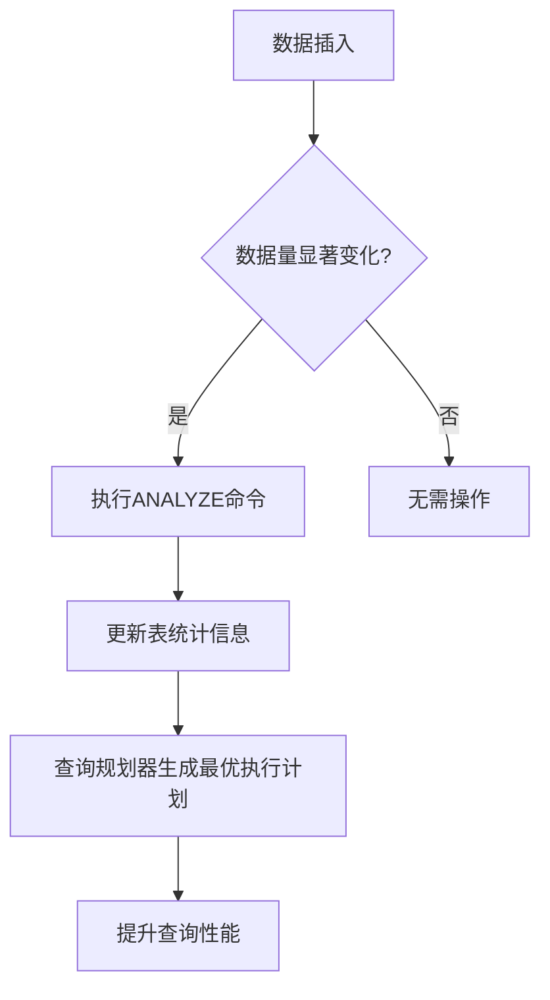
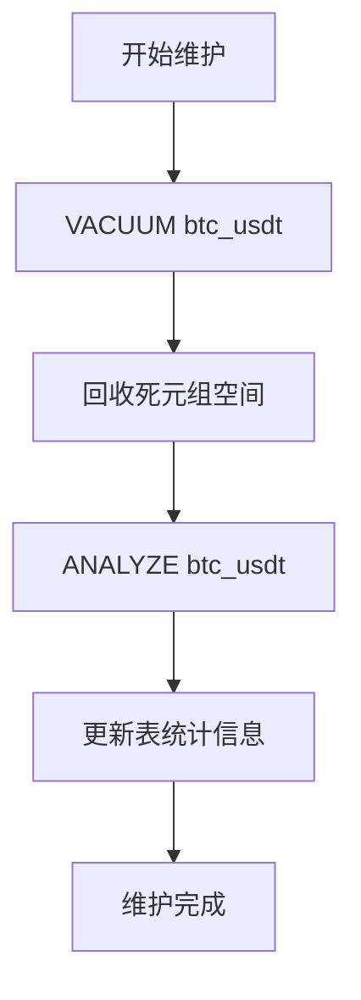

# 维护命令与统计信息

<cite>
**Referenced Files in This Document**   
- [database_optimization.sql](file://database_optimization.sql)
- [performance_recommendations.md](file://performance_recommendations.md)
- [create_tables.py](file://create_tables.py)
- [app/models/kline.py](file://app/models/kline.py)
</cite>

## 目录
1. [ANALYZE命令详解](#analyze命令详解)
2. [VACUUM命令详解](#vacuum命令详解)
3. [维护命令组合使用](#维护命令组合使用)
4. [自动化维护脚本](#自动化维护脚本)
5. [表膨胀监控与REINDEX](#表膨胀监控与reindex)

## ANALYZE命令详解

`ANALYZE` 命令用于更新数据库表的统计信息，这些统计信息被查询规划器用来生成最优的执行计划。当数据库中的数据发生显著变化（如大量插入、更新或删除）时，表的统计信息可能变得过时，导致查询规划器选择次优的执行计划，从而影响查询性能。

在本系统中，`btc_usdt` 表存储了BTC/USDT交易对的K线数据，随着每日K线数据的持续插入，表的统计信息需要定期更新以确保查询效率。`database_optimization.sql` 文件中明确建议在大量数据插入后执行 `ANALYZE btc_usdt` 命令。



**Diagram sources**
- [database_optimization.sql](file://database_optimization.sql#L14-L15)

**Section sources**
- [database_optimization.sql](file://database_optimization.sql#L14-L15)
- [app/models/kline.py](file://app/models/kline.py#L20-L36)

## VACUUM命令详解

`VACUUM` 命令用于回收数据库中因更新或删除操作而产生的“死元组”所占用的空间。在PostgreSQL中，当行被更新或删除时，旧版本的行（即死元组）不会立即被物理删除，而是标记为可回收。`VACUUM` 命令会扫描表并回收这些死元组占用的空间，使其可以被新数据重用。

`VACUUM` 命令有两种主要形式：
- **VACUUM**: 快速回收空间，但回收的空间仅能被同一表重用，不会将空间返还给操作系统。
- **VACUUM FULL**: 更彻底的清理，会重写整个表并释放空间给操作系统，但执行期间会锁定表，影响数据库可用性。

对于本系统中的 `btc_usdt` 表，由于数据主要是追加写入，更新和删除操作较少，因此推荐使用标准的 `VACUUM` 命令进行定期维护，避免使用 `VACUUM FULL` 造成不必要的服务中断。


**Diagram sources**
- [database_optimization.sql](file://database_optimization.sql#L36)

**Section sources**
- [database_optimization.sql](file://database_optimization.sql#L36)

## 维护命令组合使用

为了达到最佳的数据库维护效果，建议将 `VACUUM` 和 `ANALYZE` 命令组合使用。`VACUUM ANALYZE` 命令会先执行 `VACUUM` 回收空间，然后立即执行 `ANALYZE` 更新统计信息。这种组合操作可以一次性完成空间回收和统计信息更新，确保数据库在清理后立即拥有最新的优化信息。

`database_optimization.sql` 文件中的注释 `-- VACUUM ANALYZE btc_usdt;` 明确指出了这一推荐做法。通过定期执行此组合命令，可以有效防止表膨胀并保持查询性能的稳定。



**Diagram sources**
- [database_optimization.sql](file://database_optimization.sql#L36)

**Section sources**
- [database_optimization.sql](file://database_optimization.sql#L36)

## 自动化维护脚本

为了确保数据库维护的及时性和一致性，建议通过自动化脚本定期执行维护任务。最常用的方法是使用 `cron` 定时任务。

以下是一个示例脚本，用于每周执行一次深度清理：

```bash
#!/bin/bash
# weekly_db_maintenance.sh

# 数据库连接信息
DB_NAME="turtle"
DB_USER="postgres"

# 执行VACUUM ANALYZE
echo "开始执行VACUUM ANALYZE..."
psql -U $DB_USER -d $DB_NAME -c "VACUUM ANALYZE btc_usdt;"
psql -U $DB_USER -d $DB_NAME -c "VACUUM ANALYZE eth_usdt;"
echo "VACUUM ANALYZE 执行完成。"

# 可选：执行REINDEX以重建索引
# echo "开始执行REINDEX..."
# psql -U $DB_USER -d $DB_NAME -c "REINDEX INDEX idx_btc_usdt_open_time;"
# psql -U $DB_USER -d $DB_NAME -c "REINDEX INDEX idx_btc_usdt_timestamp;"
# echo "REINDEX 执行完成。"

echo "数据库维护任务完成。"
```

将此脚本添加到 `cron` 任务中，例如每周日凌晨2点执行：
```bash
0 2 * * 0 /path/to/weekly_db_maintenance.sh >> /var/log/db_maintenance.log 2>&1
```

**Section sources**
- [create_tables.py](file://create_tables.py#L123-L189)

## 表膨胀监控与REINDEX

除了定期维护，还应监控表的膨胀情况以决定是否需要更激进的维护操作，如 `REINDEX`。表膨胀是指由于死元组积累导致表和索引占用的空间远大于实际数据所需的空间。

`performance_recommendations.md` 文件中提到了监控和指标的重要性，虽然没有直接提供表膨胀率的计算方法，但可以结合系统建议的监控策略来实现。当监控发现查询性能下降或表空间异常增长时，应考虑执行 `REINDEX` 命令来重建索引，消除索引膨胀。

`database_optimization.sql` 文件中的注释 `-- REINDEX INDEX idx_btc_usdt_open_time;` 表明了系统对索引重建的支持。`REINDEX` 操作会重建一个或多个索引，消除索引中的碎片，从而提高索引扫描的效率。

**Section sources**
- [database_optimization.sql](file://database_optimization.sql#L37)
- [performance_recommendations.md](file://performance_recommendations.md#L4-L107)