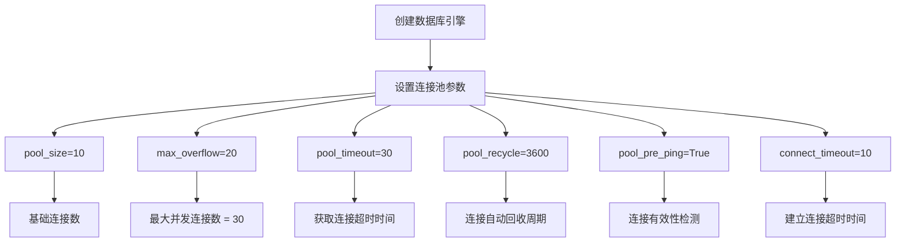
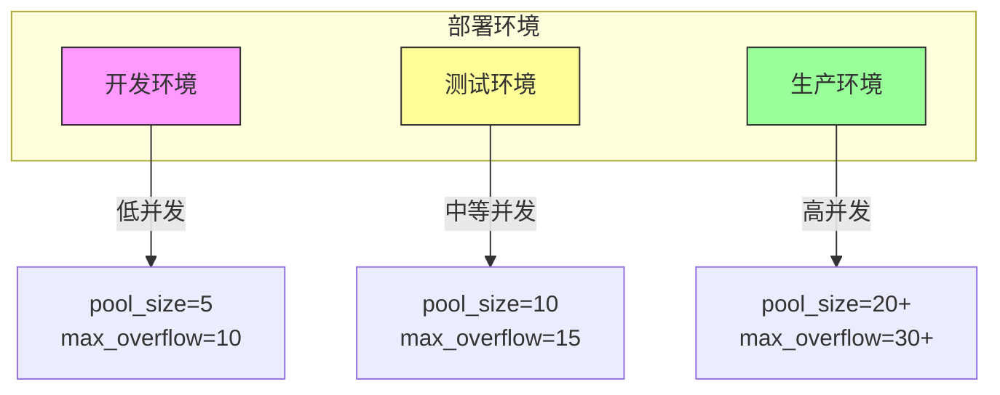
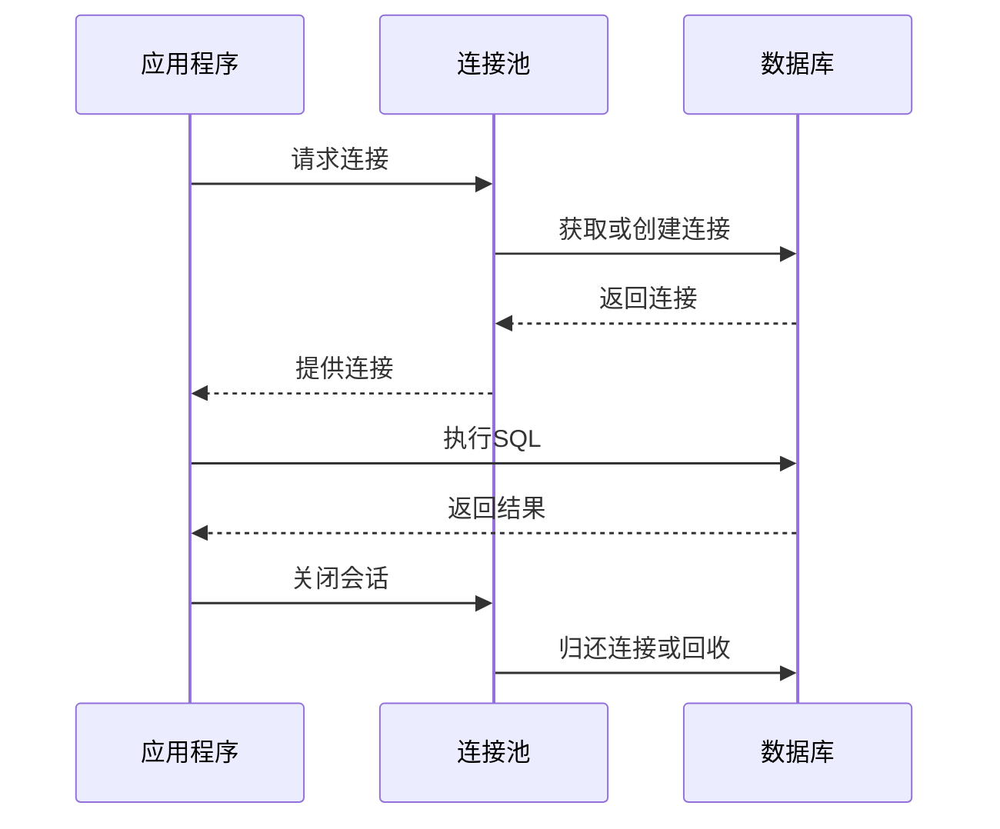

<cite>
**本文档中引用的文件**  
- [session.py](file://app/db/session.py)
- [config.py](file://app/core/config.py)
- [logger.py](file://app/core/logger.py)
- [database_optimization.sql](file://database_optimization.sql)
</cite>

## 目录
1. [连接池配置](#连接池配置)
2. [核心参数详解](#核心参数详解)
3. [连接池配置分析](#连接池配置分析)
4. [不同环境下的调优建议](#不同环境下的调优建议)
5. [连接泄漏排查与监控](#连接泄漏排查与监控)
6. [结论](#结论)

## 连接池配置

本文档详细说明在 `app/db/session.py` 文件中实现的 SQLAlchemy 连接池配置。该配置通过合理设置连接池参数，确保系统在高并发场景下能够高效、稳定地访问数据库。连接池机制避免了频繁创建和销毁数据库连接所带来的性能开销，同时通过参数调优防止资源耗尽或连接超时等问题。

**Section sources**
- [session.py](file://app/db/session.py#L0-L43)
- [config.py](file://app/core/config.py#L0-L65)

## 核心参数详解

SQLAlchemy 连接池的关键参数包括 `pool_size`、`max_overflow`、`pool_timeout`、`pool_recycle` 和 `pool_pre_ping`，这些参数共同决定了连接池的行为和性能表现。

- **pool_size**: 连接池中保持的空闲连接数量。默认值为10，表示池中始终保留10个可用连接。
- **max_overflow**: 允许超出 `pool_size` 的最大连接数。当所有池内连接都被占用时，可以临时创建最多 `max_overflow` 个新连接。
- **pool_timeout**: 从连接池获取连接的最长等待时间（秒）。若超时仍未获得连接，则抛出异常。
- **pool_recycle**: 连接的最大生命周期（秒）。超过此时间的连接将被自动回收并重建，防止长时间运行的连接因数据库重启或网络中断而失效。
- **pool_pre_ping**: 每次从连接池获取连接前，自动执行一次轻量级查询（如 `SELECT 1`）以检测连接是否仍然有效。若连接已断开，则自动重建。

**Section sources**
- [session.py](file://app/db/session.py#L10-L16)

## 连接池配置分析

以下为 `app/db/session.py` 中的连接池配置代码片段：



**Diagram sources**
- [session.py](file://app/db/session.py#L10-L20)

该配置的具体含义如下：

- **pool_size=10**: 系统初始化时创建10个数据库连接并保留在池中，供后续请求复用。
- **max_overflow=20**: 当并发请求超过10个时，允许额外创建最多20个连接，因此系统最多可支持30个并发数据库连接。
- **pool_timeout=30**: 如果所有连接都被占用，新的请求最多等待30秒以获取连接；若超时则报错。
- **pool_recycle=3600**: 所有连接在使用1小时后会被强制回收并重新建立，防止因数据库服务重启或防火墙超时导致的“死连接”。
- **pool_pre_ping=True**: 每次使用连接前都会发送一个 `SELECT 1` 查询来验证连接状态，确保不会使用已失效的连接，从而避免 `OperationalError`。
- **connect_args 中的 connect_timeout=10**: 建立新数据库连接的最长时间为10秒，防止因网络问题导致长时间阻塞。

**Section sources**
- [session.py](file://app/db/session.py#L10-L25)

## 不同环境下的调优建议

根据部署环境的不同，应调整连接池参数以适应实际负载需求。

### 开发环境
- **pool_size**: 5
- **max_overflow**: 10
- **pool_recycle**: 1800（30分钟）
- **说明**: 开发环境并发量低，无需过多连接资源，较小的池大小有助于快速发现问题。

### 测试环境
- **pool_size**: 10
- **max_overflow**: 15
- **pool_recycle**: 3600（1小时）
- **说明**: 模拟生产负载进行压力测试，连接池配置接近生产环境。

### 生产环境
- **pool_size**: 根据应用服务器实例数 × 每实例预期并发请求数合理设置，建议初始值为20
- **max_overflow**: 30~50，视峰值流量而定
- **pool_recycle**: 1800~2700（30~45分钟），略小于数据库或中间件的连接超时时间
- **pool_pre_ping**: 必须启用，保障连接可靠性
- **监控建议**: 结合 `database_optimization.sql` 中的建议，定期执行 `VACUUM ANALYZE` 和索引优化。



**Diagram sources**
- [session.py](file://app/db/session.py#L10-L16)
- [database_optimization.sql](file://database_optimization.sql#L20-L30)

**Section sources**
- [session.py](file://app/db/session.py#L10-L16)
- [database_optimization.sql](file://database_optimization.sql#L20-L30)

## 连接泄漏排查与监控

### 连接泄漏常见原因
- 未正确关闭数据库会话（缺少 `db.close()`）
- 异常处理不当导致 `finally` 块未执行
- 长时间运行的事务未提交或回滚

### 排查方法
1. **日志监控**: 启用 `db_logger` 记录会话的创建与关闭，如 `Creating new database session` 和 `Closing database session`。
2. **数据库端监控**: 查询数据库当前连接数：
   ```sql
   SELECT count(*) FROM pg_stat_activity WHERE datname = 'btc_usdt';
   ```
3. **设置告警阈值**: 当连接数持续接近 `max_connections` 时触发告警。

### 日志策略
- 所有会话操作均通过 `app.core.logger.db_logger` 记录
- 生产环境建议将 `LOG_LEVEL` 设为 `INFO` 或 `WARNING`，避免日志过多
- 定期归档日志文件，防止磁盘占满



**Diagram sources**
- [session.py](file://app/db/session.py#L35-L43)
- [logger.py](file://app/core/logger.py#L20-L30)

**Section sources**
- [session.py](file://app/db/session.py#L35-L43)
- [logger.py](file://app/core/logger.py#L20-L30)

## 结论

本文档详细解析了 `app/db/session.py` 中的 SQLAlchemy 连接池配置，强调了 `pool_pre_ping=True` 在保障连接有效性方面的重要作用，并提供了针对不同部署环境的调优建议。通过合理的连接池参数设置和日志监控策略，可有效提升系统稳定性与性能，避免连接泄漏和超时问题。建议生产环境根据实际负载动态调整 `pool_size` 和 `max_overflow`，并定期执行数据库维护任务以保持最佳性能。