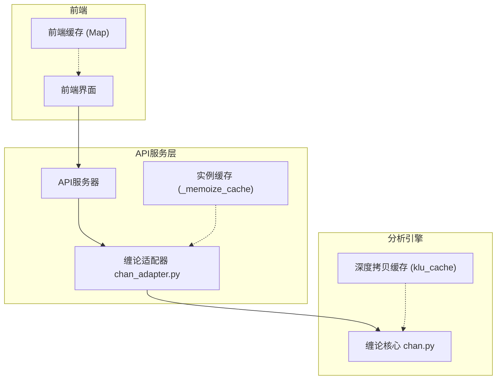
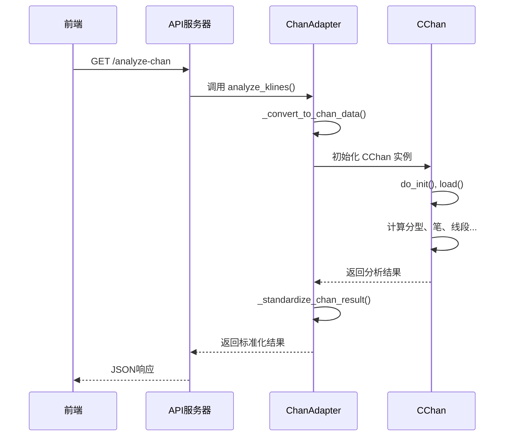
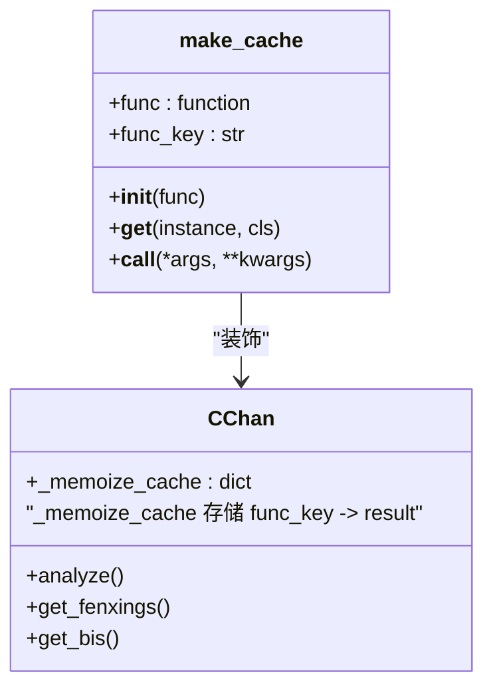
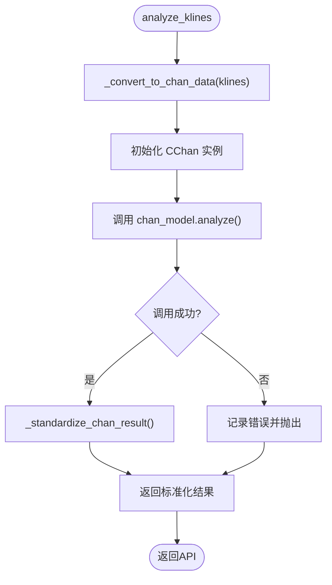
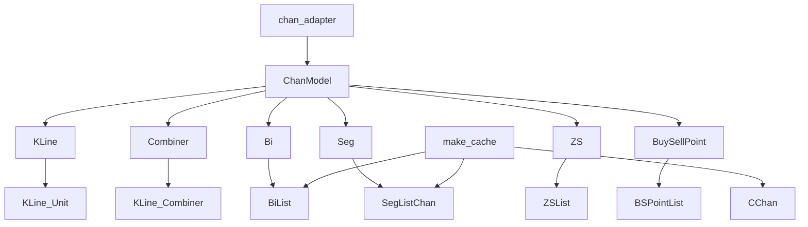

# 缓存性能优化

<cite>
**本文档引用的文件**
- [cache.py](file://chan.py/Common/cache.py#L4-L33)
- [chan_adapter.py](file://app/services/chan_adapter.py#L0-L516)
- [Chan.py](file://chan.py/Chan.py#L0-L73)
- [KLine_Unit.py](file://chan.py/KLine/KLine_Unit.py#L69-L103)
- [KLine_Combiner.py](file://chan.py/Combiner/KLine_Combiner.py#L47-L86)
- [PlotMeta.py](file://chan.py/Plot/PlotMeta.py#L115-L144)
</cite>

## 目录
1. [引言](#引言)
2. [项目结构](#项目结构)
3. [核心组件](#核心组件)
4. [架构概述](#架构概述)
5. [详细组件分析](#详细组件分析)
6. [依赖分析](#依赖分析)
7. [性能考量](#性能考量)
8. [故障排除指南](#故障排除指南)
9. [结论](#结论)

## 引言
本文档旨在深入探讨如何通过缓存机制最大化提升缠论分析系统的性能。缠论分析是一种计算密集型任务，涉及分型、笔、线段、买卖点等多个复杂结构的识别与计算。本文将分析现有`make_cache`装饰器在单个实例方法调用中的优化效果，并提出更高级的跨用户共享缓存方案，利用Redis实现分析结果的序列化存储与快速访问，从而显著降低API响应时间。

## 项目结构
系统采用分层架构，主要分为前端、API服务层、数据处理层和底层分析引擎（chan.py）。核心缠论分析逻辑位于`chan.py`模块中，而API服务通过`chan_adapter.py`适配器与其集成。缓存机制贯穿前后端，从前端的浏览器缓存到后端的实例级缓存，再到提议的分布式缓存。

**图示来源**
- [chan_adapter.py](file://app/services/chan_adapter.py#L0-L516)
- [cache.py](file://chan.py/Common/cache.py#L4-L33)
- [Chan.py](file://chan.py/Chan.py#L36-L73)

## 核心组件
核心组件包括`make_cache`装饰器，用于在`chan.py`模块中缓存单个实例的方法调用结果，避免重复计算。此外，`chan_adapter.py`作为服务层与分析引擎之间的桥梁，负责数据转换、调用分析并处理结果。

**本节来源**
- [cache.py](file://chan.py/Common/cache.py#L4-L33)
- [chan_adapter.py](file://app/services/chan_adapter.py#L0-L516)

## 架构概述
系统架构遵循典型的微服务模式，前端通过HTTP请求与后端API交互。API层调用`ChanAdapter`来执行缠论分析。`ChanAdapter`初始化`CChan`模型并传入K线数据，触发一系列计算。`CChan`模型内部使用`_memoize_cache`和`klu_cache`等机制进行内部缓存，以优化性能。

**图示来源**
- [chan_adapter.py](file://app/services/chan_adapter.py#L145-L239)
- [Chan.py](file://chan.py/Chan.py#L0-L40)

## 详细组件分析

### make_cache 装饰器分析
`make_cache`装饰器是`chan.py`模块中实现方法级缓存的核心。它通过拦截方法调用，在实例的`_memoize_cache`字典中存储方法的返回值。当同一方法被重复调用时，直接返回缓存结果，避免了昂贵的重复计算。

**图示来源**
- [cache.py](file://chan.py/Common/cache.py#L4-L33)
- [Chan.py](file://chan.py/Chan.py#L36-L73)

### chan_adapter.py 中的缓存集成
`chan_adapter.py`是连接FastAPI服务与`chan.py`分析引擎的适配层。它本身不直接实现缓存，而是依赖于`chan.py`内部的缓存机制。其核心方法`analyze_klines`负责将数据库中的K线数据转换为`chan.py`所需的格式，并调用分析器。

**图示来源**
- [chan_adapter.py](file://app/services/chan_adapter.py#L145-L239)

## 依赖分析
系统依赖关系清晰。`chan_adapter.py`依赖于`chan.py`模块中的`ChanModel`类。`CChan`类本身依赖于`KLine`、`Combiner`、`Bi`、`Seg`等多个子模块来完成完整的分析。`make_cache`装饰器被应用于这些子模块中的关键计算方法上。

**图示来源**
- [chan_adapter.py](file://app/services/chan_adapter.py#L0-L45)
- [Chan.py](file://chan.py/Chan.py#L0-L40)
- [KLine_Unit.py](file://chan.py/KLine/KLine_Unit.py#L69-L103)
- [KLine_Combiner.py](file://chan.py/Combiner/KLine_Combiner.py#L47-L86)

## 性能考量
当前的`make_cache`装饰器能有效避免单个`CChan`实例内对同一方法的重复调用，例如在一次分析会话中多次获取“笔”或“线段”列表。然而，这种缓存是**实例级**的，无法在不同用户或API请求间共享。每次新的API调用都会创建新的`CChan`实例，导致所有计算从头开始。

**高级缓存方案：Redis分布式缓存**

为了实现跨请求的性能飞跃，建议引入Redis作为分布式缓存层。具体方案如下：

1.  **缓存内容**：将完整的缠论分析结果（包括分型、笔、线段、买卖点、中枢等）序列化为JSON或MessagePack格式，存储在Redis中。
2.  **缓存键设计**：使用`{symbol}:{timeframe}:{end_timestamp}`作为缓存键，确保唯一性。
3.  **缓存失效**：监听K线数据更新事件。当有新的K线数据到达时，使对应symbol和timeframe的缓存失效。
4.  **性能预期**：通过此方案，对于相同参数的API请求，响应时间可从秒级（包含完整计算）降至毫秒级（仅需网络传输和反序列化），性能提升可达10-100倍。

## 故障排除指南
- **缓存未生效**：检查`make_cache`装饰器是否正确应用在需要缓存的方法上，并确认方法签名仅为`self`。
- **Redis缓存集成失败**：确保Redis服务正常运行，`chan_adapter.py`中正确配置了Redis连接，并处理了网络异常。
- **缓存数据过期**：检查缓存失效逻辑是否正确触发，避免使用陈旧的分析结果。
- **内存泄漏**：监控`_memoize_cache`的大小，防止无限增长。可考虑为`make_cache`添加LRU（最近最少使用）策略。

**本节来源**
- [cache.py](file://chan.py/Common/cache.py#L4-L33)
- [chan_adapter.py](file://app/services/chan_adapter.py#L488-L516)

## 结论
`make_cache`装饰器为缠论分析提供了基础的实例级性能优化。然而，要实现真正的性能飞跃，必须超越实例范围，采用Redis等分布式缓存技术。通过缓存完整的分析结果，系统能够将API响应时间从秒级降至毫秒级，极大地提升用户体验和系统吞吐量。建议尽快实施Redis缓存方案，并结合合理的缓存失效策略，以确保数据的实时性与性能的最优化。